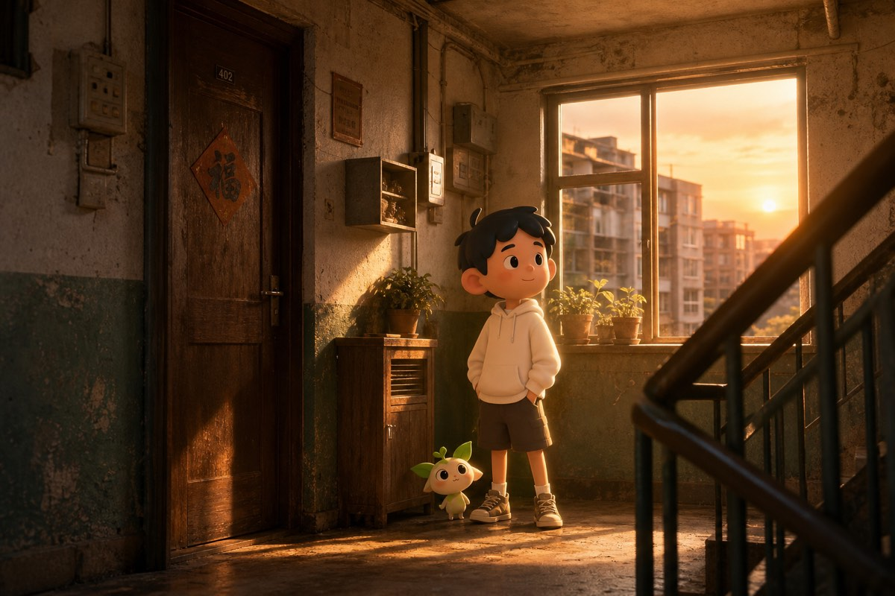
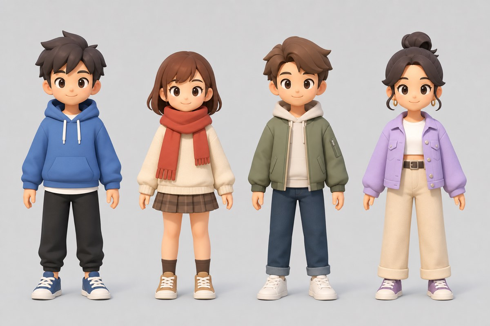

# 回响 (Echo) · 美术风格与定势预设

> 配套：[`PRD.md` §1.4 美术风格基调](./PRD.md)。本文沉淀**美术基调的视觉参考**与**定势组合预设清单**（"预设"），作为客户端（Unity）场景拼装与策划配置表（`presetSetId`）的输入。

---

## 1. 风格基调（锁定）
**「写实空间 + 卡通角色/宠物」混合风格。**
- **空间/环境 = 写实**：拟真材质、光影、年代感场景，营造"沉浸 + 可回忆 + 熟悉"。
- **自身形象 = 偏卡通**：圆润亲和、风格化比例、低多边形柔和着色，降恐怖谷、好换装。
- **宠物 = 卡通且克制**：可爱有辨识度、不夸张，便于规模化生成与突变变体。
- **核心张力**：写实环境 + 卡通角色的对比 → 角色/宠物在视野中聚焦、情感更暖。

---

## 2. 已产出概念图（首批）

### 2.1 风格定调融合图（最关键参考）
写实怀旧楼道 + 卡通少年 + 克制卡通宠物，验证融合观感与"记忆里熟悉"的氛围。

### 2.2 角色换装设定表
4 个卡通虚拟形象，体现亲和比例与可换装方向（发型/服装/配色差异）。

> 待补概念图（图像服务限流，稍后补出）：**宠物设定表**、**更多写实空间预设**（书房/街角/教室/车站等）。

---

## 3. 多维定势体系（年代 × 地区 × 场景 × 氛围）
> 设计原则：美术风格按**年代、地区、所处场景**有"大不同"。因此"意识空间"的定势**不是一维清单，而是四个维度的组合**，并与个人向量对接（向量倾向 → 各轴权重 → 选/混定势）。这既做出千人千面的"大不同"，又通过"基底 + 染色/换道具"控制成本与算力（呼应 PRD D5：定势为主 + 少量实时）。

### 3.1 四个定势维度（轴）
| 轴 | 代码与取值 |
|---|---|
| **年代 Era** | E1=80s / E2=90s / E3=2000s / E4=2010s / E5=现代（决定材质做旧、色调、器物世代） |
| **地区/文化 Region** | R1=南方城镇 / R2=北方城市 / R3=江南水乡 / R4=海边 / R5=日式 / R6=欧陆 / R7=乡村田园 |
| **场景类型 Scene** | S1=居所(书房/卧室) / S2=街道街角 / S3=校园 / S4=车站旅途 / S5=庭院自然 / S6=公共室内(咖啡馆/录像厅/网吧) |
| **氛围时段 Mood** | M1=黄昏 / M2=雨后 / M3=夜晚 / M4=清晨·午后 / M5=四季变体 |

> 一个定势 = （Era × Region × Scene × Mood）。组合空间巨大（5×7×6×5≈1050），**不全画**：美术维护一批**精选定势（基底场景）**，引擎按向量在轴上"取最近 + 染色/换道具"微调。

### 3.2 "基底 + 染色/换道具"机制（低成本做出大不同）
- 每个 **Scene 场景类型**做一套**基底布局/网格**（如 S1 居所的房间骨架）。
- 同一基底通过**可替换的材质/道具/色板**表达不同 **Era/Region/Mood**：
  - Era → 做旧程度、器物世代（磁带机 vs 智能音箱）、色调滤镜。
  - Region → 建筑/陈设/植被/文字招牌的地域风物。
  - Mood → 光照、天气、时段、粒子（灰尘光束/雨丝/月光）。
- 结果：少量基底 × 多套皮肤 = 组合级"大不同"，且资产可复用、运行时按参数本地拼装（服务端只下发参数）。

### 3.3 精选定势库（curated set，逐步扩充）
| presetSetId | 名称 | Era | Region | Scene | Mood | 关键风物(写实) |
|---|---|---|---|---|---|---|
| 1001 | 黄昏老楼道 | E2 | R1 | S2 | M1 | 木门、信箱、楼梯扶手、窗外楼群 |
| 1002 | 午后旧书房 | E1 | R1 | S1 | M4 | 木书桌、台灯、旧书磁带、泛黄海报 |
| 1003 | 雨后街角 | E3 | R2 | S2 | M2 | 湿润路面、招牌、报刊亭、自行车 |
| 1004 | 旧教室 | E2 | R1 | S3 | M4 | 木课桌、黑板、吊扇、窗帘 |
| 1005 | 老车站月台 | E1 | R2 | S4 | M1 | 站台长椅、时刻牌、铁轨、行李 |
| 1006 | 夏夜庭院 | E2 | R7 | S5 | M3 | 藤椅、蒲扇、纳凉桌、葡萄架 |
| 1007 | 江南水乡清晨 | E3 | R3 | S5 | M4 | 石桥、乌篷船、白墙黛瓦、薄雾 |
| 1008 | 海边夏日午后 | E4 | R4 | S5 | M5 | 沙滩、栈道、遮阳伞、海平线 |
| 1009 | 日式榻榻米房 | E4 | R5 | S1 | M1 | 障子门、矮几、坐垫、庭院借景 |
| 1010 | 录像厅·网吧夜 | E2 | R2 | S6 | M3 | CRT 显示器、海报、霓虹、烟雾感 |
| 1011 | 欧陆咖啡馆雨天 | E5 | R6 | S6 | M2 | 砖墙、吧台、雨窗、暖灯 |
| 1012 | 北方雪夜街道 | E3 | R2 | S2 | M3 | 积雪、路灯、暖光店招、呵气感 |

> 涵盖了不同年代/地区/场景/氛围的"大不同"。**P1 起步先做 1001/1002**（与已出概念图一致），跑通"向量→选定势→拼装→进入"，再按数据扩充。

### 3.4 与个人向量对接（Self Vector ↔ 定势/共鸣）
- **向量结构（建议）**：`[年代权重×5] + [地区权重×7] + [场景权重×6] + [氛围权重×5] + [语义嵌入×剩余]`，补满 768 维（与 BE 的 pgvector 维度一致）。
- **生成链路**（对接 BE-5 §4.1）：用户自拟偏好 → `ILlmClient.enrich` 补全 → 映射到四轴权重 + 生成语义嵌入 → 落 `SelfVector`。
- **定势选择**（低算力，符合 D5）：用**结构化轴权重**对精选定势库算加权距离 → 取最近基底 + 按权重做染色/换道具微调；不做实时全量生成。
- **共鸣匹配**（对接 BE-4/§4.3）：用**完整向量**做余弦 topN（`IVectorStore.topN`）。即"选我的世界"用结构化轴、"找共鸣的人"用整体语义——两者职责分离。
- **动态层**：少量实时元素（天气/光影/粒子）由 Mood 轴 + 运行时参数驱动，预算上限受控。

### 3.5 配置表落地（template）
精选定势在 `template` Excel 配置：字段建议 `presetSetId / 名称 / eraCode / regionCode / sceneBaseId(基底) / moodCode / 材质皮肤集 / 道具集 / 色板 / 动态预算 / 轴权重锚点`。客户端按 `presetSetId + 动态参数` 本地拼装。

---

## 4. 角色（Avatar）换装规划（P1 轻量）
- **可换部位**：发型、脸型/肤色、体型（轻量）。
- **时装位（≥3 槽）**：上装、下装、鞋；预留 配饰/外套。
- **风格约束**：统一卡通基调，部件可拆分组合；首批提供数套基础外观。

---

## 5. 宠物外观体系（P2 预研，先立框架）
- **元素族（element families）**：草木 / 火光 / 水珠 / 星光 / 风 …（克制差异，统一卡通）。
- **突变方向（外观）**：起步用**预制部件/配色组合**驱动（角、纹样、光效、体型微调），不走 AIGC（O5 已定 P2 再评估）。
- **设计红线**：不夸张、不怪诞，保持可爱与辨识度，便于"万级别大池"吞噬增值时的视觉一致性。

---

## 5.5 初版 UI Mockup（首版界面定调）
- `assets/echo-ui-mockup-space.jpg`：**意识空间**界面——写实黄昏老楼道(presetSet 1001) + 卡通角色/小宠；UI：左上资料卡 chip、右侧"共鸣者"列表(共鸣度% + 回声短句)、底部动作条(表情/留痕/摊位/视角)、顶部空间标题。验证"写实场景 + 卡通角色 + 克制暖调 UI"的混搭基调。
- `assets/echo-ui-mockup-onboarding.jpg`：**意识引导·偏好录入**界面——四轴(年代/地区/场景/氛围)标签胶囊 + 自由文本 + "生成我的世界"。对应 §3 四轴定势体系与 BE-5 偏好→向量链路的前端入口。
- 用途：作为前端 FE-2/3 初版界面的视觉锚点；真实 3D 写实空间为后续，首版用占位可视化体现"进入意识空间"。

## 6. 交付与协作
- 概念图归档于 `Echo/docs/assets/`。
- 定势预设最终以 `template` 配置表落地，字段（光照/道具/动态预算/向量标签权重）由策划 + 美术细化。
- 客户端按 `presetSetId + 动态参数` 本地拼装，服务端不传大资源。
