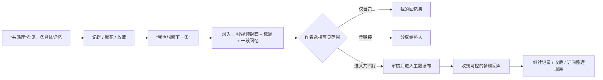

# Echo 参照抖音 / 小红书 / Soul 的社区上线方案（运营牵头 v1）

| 目的 | 不是复制大平台，而是借它们已经被用户教育过的交互与治理方式，做成更轻、更有边界的“公开回忆社区”。 |
|---|---|
| Echo 的一句话 | **把想留下的回忆，放进一处愿意被人温柔看见的瀑布流。** |
| 首发目标 | 让新用户 3 分钟内完成“看见一条—被触动—录入一条—选择公开—收到第一份回声”。 |
| 运营原则 | 不消费悲伤，不拿私密记忆换流量；公开由作者决定，推荐对温暖、具体、有共鸣的内容负责。 |

> **纪念场景的定位**：故去亲友或宠物的上传、纪念与缅怀，是 Echo 重要且自然的能力延展；它和青春、旧物、城市、家人等回忆并列，而非产品唯一入口。对外不使用“网络墓园”定位，避免将大多数用户带入消极、沉没的单一情绪预期。

---

## 1. 同行真正值得借的，不是页面，而是运行逻辑

| 同行 | 已验证的机制 | Echo 的转译 | 不照搬的部分 |
|---|---|---|---|
| **抖音** | 强分发让陌生内容快速被看见；账号/内容的分层隐私；黑名单、评论控制和一键防网暴等自保工具 | **公开回忆进入瀑布，私密回忆不进入。** 提供“一键安静”：关闭陌生人回声、隐藏作者卡、停止被推荐、仅凭链接可见 | 不做无限下滑、热榜、连播、打赏、情绪越强越推荐 |
| **小红书** | “真实分享、友好互动”先成为社区共识，再以主题、搜索、收藏组织内容；用户能管理互动、位置和推荐 | 用**主题共鸣厅**代替泛娱乐广场：宠物、青春、旧物、城市、家人、师友、重新开始。以“收藏到我的回忆夹”代替单纯点赞 | 不做种草交易、炫耀式精致生活、营销笔记伪装普通用户分享 |
| **Soul** | 低门槛表达、广场可见开关、氛围化互动；发布前提示、违规后解释、反骚扰治理 | “回声”成为比评论更有情绪分寸的互动；用户发布时主动选“进入共鸣厅”；对 AI 内容给用户声明入口 | 不做陌生人匹配、灵魂测试、语音派对、暧昧社交，避免产品被理解为交友软件 |

这些做法并非猜测：抖音提供私密账号、推荐给熟人开关、黑名单等隐私控制；Soul 的“瞬间”允许用户选择广场可见并对 AIGC 提供用户声明；小红书持续以社区公约和侵权投诉平台约束“真实、友好、可追溯”的分享。详见文末来源。

---

## 2. Echo 应有的首页：不是展示墙，是会让人留下来的瀑布

### 2.1 首页三层结构

```text
首页「共鸣厅」
├─ 顶部：今天想看看什么？ [宠物] [青春] [旧物] [城市] [家人] [重新开始]
├─ 主体：双列瀑布卡（图 / 视频封面 + 一句具体记忆 + 作者可选署名）
└─ 底部：记得 / 献花 / 回声 / 收藏到我的回忆夹
```

卡片不要只做“故去宠物”或“沉重叙事”。首屏内容配比由运营控制：

| 内容类型 | 首发推荐占比 | 为什么 |
|---|---:|---|
| 青春、旧物、城市、食物、校园、重新开始 | 45% | 让观光用户也能进入，不会一打开就有心理负担 |
| 宠物与陪伴 | 25% | 情感强、画面好、易产生“我也有过”的回声 |
| 家人、师友、人生阶段 | 20% | 建立产品厚度，但不以苦难作吸引力 |
| 安静纪念与离别 | 10% | 有仪式感的核心场景，必须有，但不能压住整个社区 |

**排序原则**：运营精选 > 用户选择的主题 > 新鲜度 > 同主题轻度互动信号。禁用“停留越久、哭得越多、争议越大越靠前”的单目标排序。公开测试期先不用纯个性化“为你推荐”。

### 2.2 每张卡应带的四个信息

1. 一张有温度的封面：人可为侧后、背影或生活场景；不强迫露脸，不把身份证照式头像当内容。
2. 一句具体而非煽情的标题：如“最后一趟 302 路”“它总在门口等我”“那盘没吃完的炒面”。
3. 清楚的可见性：公开内容才显示在共鸣厅；AI 编辑图显示 AI 标识。
4. 低压互动：记得、献花、回声、收进回忆夹。没有“踩”、没有公开的热度排名。

---

## 3. “回声”要比评论区多一层：给人可选的表达，而不是逼人写话

用户已经明确要求多维度。建议将“回声”拆成 **7 种可组合动作**，但一次只呈现最适合该条回忆的 3–4 个，避免变成表情包墙。

| 回声维度 | 用户看到的文案 | 适用场景 | 产品/运营作用 |
|---|---|---|---|
| 记得 | “我也记得这样的时刻” | 通用 | 最轻的共鸣信号，形成主题召回 |
| 献花 | “留一束花” | 离别、纪念 | 可附一条很短的心意；未来可做订阅后的仪式化样式，但基础动作免费 |
| 同频 | “我们有同一段青春” | 学校、城市、旧物、年代 | 将单条内容连接到可探索的主题，而非拉人私聊 |
| 想听 | “想听后来的故事” | 有叙事延展性 | 给作者一个继续记录的温柔提示；作者可一键关闭 |
| 安静陪伴 | “不说什么，也在这里” | 沉重、哀伤 | 避免用户被迫写安慰话，降低冒犯 |
| 轻轻一笑 | “这一幕我懂” | 宠物、童年、日常 | 把产品从单一悲伤里拉出来 |
| 收藏 | “收进我的回忆夹” | 对浏览者有私人意义 | 私人收藏，不向作者公开具体收藏者，减少社交压力 |

**回声的规则**：

- 作者发布时选择：允许全部回声 / 仅允许无文字回声 / 只允许记得与献花 / 不允许互动。
- 默认不开放陌生人私信。回声是公开但轻量的，不把纪念内容导向搭讪。
- 文字回声限字数、先过攻击/导流/隐私泄露拦截；被作者隐藏的回声不再计入推荐。
- 单条内容出现异常涌入、争议、恶意揣测时，运营可先“降温”：暂停新回声、降推荐、联系作者，而不是等冲突扩大。

---

## 4. 参考同行后的用户流程（Echo 首发版）



### 关键落点

- **录入即进入“回忆集”心智**：用户一进入录入页，就不是在发朋友圈，而是在为一件值得保存的事建档。
- **公开是一次明确选择**：按钮不用“发布”，用“带它去共鸣厅”；旁边永远保留“只留给自己”。
- **公开后仍可退回**：作者能停止推荐、改为链接可见、关闭互动、移除。参考抖音/小红书的隐私控制，但用更直白、少配置项的语言。
- **订阅后置**：先让用户完成一条真实回忆和一次共鸣；再在“整理成册、长期保存、更多展示样式、协作守护”出现需求时提供订阅。

---

## 5. Echo 的“轻量安全体系”：同行标准，首发成本

| 能力 | 首发必须有 | 参照的同行思路 |
|---|---|---|
| 发布前 | 权利确认、公开范围、AI 声明、风险词提示、敏感内容二次确认 | Soul 的 AIGC 用户声明；小红书的“有权发布”原则 |
| 发布中 | 文本/图片审核、人工复核、IP 属地等法定展示按实际规则落地 | 抖音/Soul 的技术识别与人工审核组合 |
| 作者自保 | 一键安静、关闭回声、拉黑、停止推荐、仅链接可见 | 抖音隐私设置与一键防护；Soul 的陌生互动治理 |
| 权利人救济 | 侵权投诉、紧急下架、处理进度、申诉 | 小红书独立侵权投诉入口 |
| 社区教育 | “为什么被拦截”的清楚解释，而非只提示违规 | Soul 对违规贴的提示和规则解释 |
| 未成年人 | 首发 18+ 发布；发现疑似未成年人或高危内容转人工；不做陌生人私信 | Soul 的年龄限制、正能量内容池等分层做法 |

### 首发运营 SLA（写进后台）

| 事件 | 目标响应 | 默认动作 |
|---|---:|---|
| 自伤他伤、未成年人性风险、死亡事故真实性争议 | 15 分钟 | 隐藏、保存证据、人工接手、按预案升级 |
| 肖像/隐私/名誉投诉 | 2 小时 | 先限制扩散，向发布人核验，优先保护被投诉人 |
| 恶意回声、导流、诈骗 | 30 分钟 | 删除/限流/封禁；作者侧一键安静 |
| 一般审核争议 | 24 小时 | 给具体原因和可修改建议 |

---

## 6. 运营不该做什么：从同行教训里避开“看着有增长、实际伤产品”的动作

- 不从抖音、小红书搬运高赞照片、视频或文案来铺内容。那是版权、肖像和真实性风险，不是冷启动。种子内容只用自制、授权征集、可商用素材或明确标 AI 的生成内容。
- 不把“逝者、疾病、分手、事故”包装成挑战或热点。运营编辑选题时，主题价值高于互动数据。
- 不给普通用户做“热度榜”“谁最受共鸣”排行榜；它会把回忆变成表演。
- 不先开私信、群聊、直播再补治理。Soul 的陌生社交治理是长期系统，Echo P0 没有必要背这笔成本。
- 不用“永远保存”“AI 让 TA 回来”等词卖订阅。可卖的是长期存储、导出、回忆夹、版式、共同守护与更丰富的展示。

---

## 7. 接下来需要产品确认的 5 条需求

1. 首页确定为“共鸣厅双列瀑布”，而非信息流/相册列表；首发先做主题、精选、时间排序。
2. 发布页新增三档可见范围与“带它去共鸣厅”的明确动作；公开默认关闭。
3. 回声按 7 个维度建设，但 P0 先上：记得、献花、同频、安静陪伴、文字回声、收藏；作者可以逐条开关。
4. 建设“安静模式”：关闭陌生回声、停止推荐、仅链接可见、拉黑、举报，形成一页可操作的自保工具。
5. 建设运营后台：审核队列、主题精选、风险降温、投诉工单、回声权限、种子内容授权与 AI 标识台账。

---

## 8. 参考来源

- [抖音隐私政策](https://www.douyin.com/agreements/?id=6773901168964798477)：私密账号、推荐控制、黑名单等用户可控的隐私机制。
- [抖音安全与信任中心](https://trust.douyin.com/)；[抖音社区自律公约更新报道](https://wxb.xzdw.gov.cn/wlaq/zljg/202209/t20220921_278621.html)：社区规则、正向引导和网暴治理方向。
- [小红书蒲公英帮助中心](https://pgy.xiaohongshu.com/help/home)：社区公约、内容审核、广告及行业资质等规则体系；[小红书侵权投诉平台](https://ipp.xiaohongshu.com/)：权利人投诉与进度追踪。
- [Soul 个人信息保护政策](https://themis.soulapp.cn/m/OyraGhrcJdj-RVlMC5d06A.html)：瞬间内容的广场可见选择与 IP 信息展示；[Soul 用户服务协议](https://themis.soulapp.cn/m/GFYf-6-DTTWO0x7OoErgbg.html)：AIGC 内容声明和标识要求。
- [Soul 2025 生态安全报告](https://www.soulapp.cn/media/news/article-10)：技术识别、人工审核、举报和社区教育组合治理。

> 本文中的同行做法用于产品与运营设计参考；Echo 上线仍以 `COMPLIANCE-CHINA-LAUNCH-CHECKLIST.md` 的法定门槛为准。
