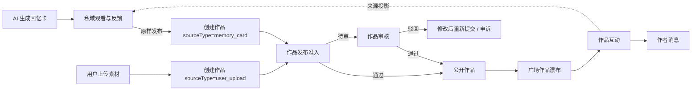
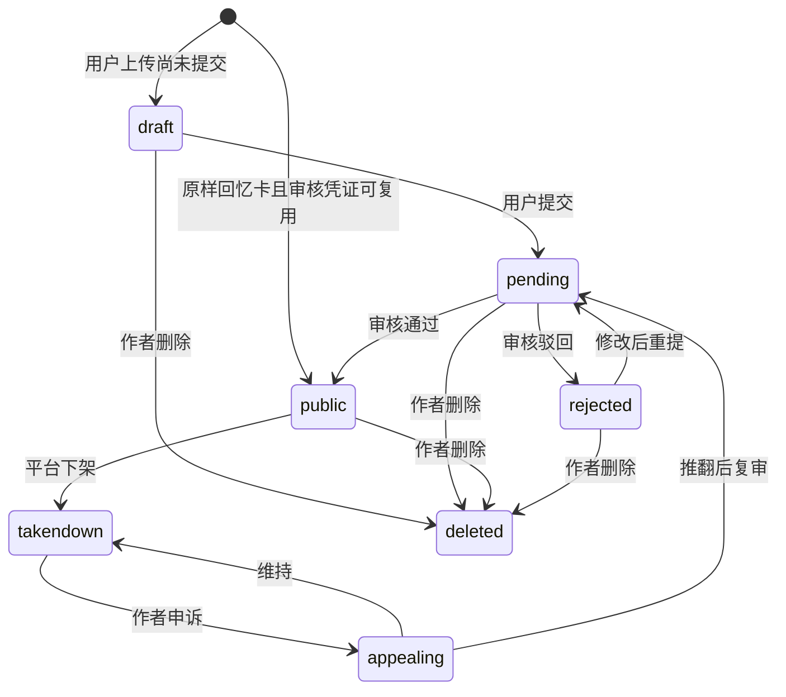

# 作品公开闭环 · 产品裁定与工程基线

> 状态：制作人裁定 · 2026-08-31
> 作用：夯实“回忆卡作为私域来源、作品作为唯一公开实体”的产品模型，供前端、后端、QA 查漏补缺。
> 上位登记：`DECISIONS.md G-27`。详细接口以 `API-CONTRACT.md` 为准，实现验收以本文 §9 为准。

## 0. 一句话结论

**回忆卡是私域内容，作品是唯一公开实体。** 用户可以上传素材发布作品，也可以把一张回忆卡原样发布为作品；后者以 `sourceCardId` 关联来源。广场只分发作品，所有公开审核、互动、归因、举报、下架和消息均以 `workId` 为唯一目标。

历史旧公开卡不迁移、不转换为 Work，也不保留旧公开浏览和互动兼容链。原卡及媒体只作为所属用户的私域内容与素材保留；需要再次公开时，必须由用户重新执行明确发布动作并创建新的 Work。

## 1. 为什么不是“把回忆卡发布出去”

回忆卡与作品不是同一个对象的两个状态：

| | 回忆卡 | 作品 |
|---|---|---|
| 为什么存在 | 平台按陪伴节奏生成，用户不主动发布也会存在 | 用户明确执行发布动作才存在 |
| 默认范围 | 私域，仅用户本人 | 公开对象，但公开前必须满足发布准入 |
| 主要目标 | 陪伴、观看、回应、推动下一次生成 | 公开表达、分发、互动、消息回流 |
| 生命周期 | 生成 → 私域送达 → 阅读/反馈 | 草稿/创建 → 提交 → 公开/驳回/下架/申诉/删除 |
| 主键 | `cardId` | `workId` |

“发布回忆卡”的准确含义是：**创建一条来源为该回忆卡的作品**。回忆卡继续留在私域；作品独立承担公开生命周期。

## 2. 两条发布入口，一个作品模型



### 2.1 用户上传

- `sourceType = user_upload`
- `sourceCardId = null`
- 用户提交后进入作品审核。
- 上传媒体、标题、正文共同组成被审核内容。

### 2.2 原样发布回忆卡

- `sourceType = memory_card`
- `sourceCardId = cardId`
- 作者与回忆卡归属必须一致。
- 一张未删除回忆卡最多对应一个未删除作品。
- 不允许在“原样发布”路径修改标题、正文、媒体或裁切结果；只要改动，就转入普通作品审核。

## 3. 内容引用与冻结规则

产品允许作品通过外键引用回忆卡，不强制复制整份媒体；但必须冻结“用户发布时看见并确认的版本”。最低要求：

- 作品保存 `sourceCardId`。
- 保存发布内容的稳定版本标识：`sourceContentHash` 或等价不可变版本号。
- 作品公开展示必须与审核凭证中的内容哈希一致。
- 回忆卡后续重新生成、修改或删除，不得静默改变已经公开的作品内容。
- 若存储层无法保证源内容不可变，则作品必须保存发布快照。

这条规则不改变对象归属：快照只是作品的公开证据，不意味着回忆卡本身变成公开对象。

## 4. 审核复用

### 4.1 生成时形成两级结论

回忆卡生成安全闸必须分开输出：

1. `privateDeliverable`：是否适合发给主人独自体验。
2. `publicPublishable`：如果用户不做任何修改，是否允许公开传播。

私域可送达不自动等于允许公开。

公开级审核凭证至少包含：

```text
PublicReviewEvidence
  reviewEvidenceId    凭证唯一 ID
  sourceCardId        来源回忆卡
  sourceContentVersion 来源内容版本
  result              passed | restricted | failed
  contentHash         被审核内容的稳定摘要
  ownerAccountId      审核时所有者
  policyVersion       审核规则版本
  policyEpoch         强制失效策略纪元
  reviewedAt          审核发生时间
  expiresAt           默认 reviewedAt + 90 天
  aigcLabelReady      显式标识是否完备
  consentSnapshotId   发布所需授权快照
  consentSnapshotHash 授权快照摘要
  resourceManifestHash 资源清单摘要
  riskFlags           可解释的风险标签
  invalidatedAt       失效时间
  invalidationReason  失效原因
  consumedByWorkId    已绑定作品，防止重放
```

### 4.2 原样发布可以免完整复审

以下条件同时满足时，创建作品后可以直接公开，不重复调用完整内容审核：

- `PublicReviewEvidence.result = passed`。
- 当前内容哈希与审核凭证一致。
- 用户未增加或修改标题、正文、媒体、裁切和声音。
- 素材授权未撤回，源回忆卡未删除或下架。
- AI 显式标识仍可完整展示。
- 审核凭证使用的策略版本仍在有效复用窗口内。
- 自 `reviewedAt` 起未超过 90 天，且 `policyEpoch` 未被平台强制失效。
- 凭证未被其他作品或其他内容版本消费。

这不是“作品不审核”，而是**作品复用生成阶段已经完成的公开级审核结果**。

### 4.3 发布时仍需轻量准入闸

即使复用审核，也必须同步校验：归属、内容哈希、凭证有效性、授权状态、删除/下架状态、AI 标识和一卡一作品约束。任一失败均不得直接公开。

### 4.4 必须重新审核的情况

- 用户修改任何会改变表意或媒体呈现的内容。
- 审核凭证不存在、失败、过期或策略版本失效。
- 授权范围变化，或素材包含第三人等需重新确认的条件。
- 作品重新编辑后申请恢复公开。
- 所有权变化、授权撤回、资源删除/下架、安全元数据变化、源卡删除/下架、AIGC 标识缺失或重大审核策略纪元升级。

凭证复用有效期固定为 90 天；当 `now >= expiresAt` 时即为过期。90 天只是最长时间窗，上述任一失效条件都必须即时阻止复用。

复用失败分两类：凭证过期、策略纪元变化、内容哈希不符或凭证不存在，但内容仍具备提交资格时，作品进入完整审核并返回 `reviewMode=full`；所有权不符、授权撤回、资源/源卡删除下架、AIGC 标识不完整或凭证已被其他作品消费时硬失败，不创建公开作品。稳定原因码分别为 `evidence_expired/evidence_policy_invalid/evidence_content_mismatch/evidence_missing` 与 `owner_mismatch/consent_revoked/resource_unavailable/source_unavailable/aigc_label_missing/evidence_consumed`。

## 5. 作品状态机



- `publishedAt`：用户明确提交或确认发布的时刻。
- `reviewedAt`：首次取得公开资格的时刻。复用审核直接公开时，写作品公开准入完成的时刻，并另存来源审核凭证时间。
- `reviewedAt` 首次写入后不可刷新；下架恢复、编辑复审均不得给作品续统计窗口。
- 每次状态迁移与审核、申诉、删除流水同事务记录。

## 6. 广场与公开视图

- 广场瀑布唯一元素为作品，ID 语义为 `workId`。
- `plaza` 是公共发现瀑布流；`works` 是用户视角下的作品墙。两者展示同一种作品对象，
  但查询范围、排序目的和可见状态不同。
- 本人作品墙可见自己的待审、驳回、公开等状态；他人作品墙只展示公开作品。
- 不再提供独立的公开回忆卡流；回忆卡只能作为作品来源。
- “来自回忆卡的作品”和“用户上传作品”可以作为筛选或推荐成分，但共享一个瀑布契约。
- 作品详情、作者作品页、搜索结果、分享落地页均复用作品可见性与状态判定。
- 非作者只可能读取 `public` 且未删除、未被拉黑关系拦截的作品。

## 7. 互动、归因与消息

### 7.1 唯一事实源

所有公开互动只写作品互动事实：

```text
WorkInteraction
  interactionId
  workId
  actorId
  type
  createdAt
  deletedAt?
  idempotencyKey
```

- 互动目标只使用 `workId`，不允许客户端同时提交 `cardId` 或 `windowId` 作为第二目标。
- `sourceCardId`、`windowId`、`ownerId` 由服务端从作品来源关系解析。
- 分发归因、北极星、审核处置和消息回流均从同一条作品互动事实派生。

### 7.2 多个视角是投影，不是多套事实

| 视角 | 读取内容 |
|---|---|
| 作品 | 该作品收到的合规互动 |
| 作者 | 自己哪些作品被接住 |
| 私域窗口 | 来源于本窗口回忆卡的作品收到一次温和回流 |
| 消息中心 | 按 `workId` 聚合的到达通知 |
| 分发系统 | 作品级互动归因 |

不得为每个视角分别创建互不关联的互动记录。需要性能投影时，必须保存来源事件 ID，并可重建、可对账。

### 7.3 私域反馈与陌生人互动隔离

- 用户本人对回忆卡的明确反馈可以进入下一轮生成上下文。
- 跳过、减少某题材等弱反馈只允许减频，不自动加频。
- 陌生人的作品互动只用于公开归因和作者消息，默认不得进入回忆卡生成提示词。

### 7.4 驳回后的修改重提

- 驳回作品可修改并重新提交，不要求新建作品。
- 编辑时保留 `workId`，新建递增 `contentVersion`、内容哈希和审核工单。
- 任意标题、正文、媒体或裁切变化都会令旧审核凭证失效；提交后进入 `pending`。
- 新版本满足当前审核条件并通过后才可公开；旧驳回版本只保留作审核与审计证据。
- 本规则只覆盖 `rejected`；已公开后被下架的作品仍走既定申诉链，不得借编辑绕过处置。
- 未来若允许陌生人内容影响生成，必须由窗主明确“收下”，并经过内容安全闸。

## 8. 删除、撤回与来源失效

- 删除作品：作品退出广场、搜索、详情和分享；私域回忆卡不随之删除。
- 删除回忆卡：不得静默删除作品；作品是否继续展示取决于发布时冻结策略与授权状态。
- 撤回素材授权：按授权范围停止作品继续公开或停止后续使用，不得仅断开外键。
- 删除和撤回不作为推荐质量负反馈。
- 审核、授权和删除流水只追加，保留合规证明。

## 9. 前后端查漏与验收矩阵

| 编号 | 场景 | 前端应看到/做到 | 后端必须保证 |
|---|---|---|---|
| W-01 | 上传作品 | 编辑后显示“已提交” | 创建 `workId`，状态 `pending` |
| W-02 | 原样发布已获公开凭证的回忆卡 | 一次确认后进入作品页 | 校验凭证和哈希，创建作品并直接 `public` |
| W-03 | 发布时修改回忆卡内容 | 明确提示需要重新审核 | 不复用旧凭证，状态 `pending` |
| W-04 | 凭证过期/授权撤回 | 不显示“直接公开”承诺 | 拒绝直发或进入待审，不得 fail-open |
| W-05 | 重复发布同一卡 | 显示已有作品入口 | 并发下也只产生一个未删除作品 |
| W-06 | 广场加载 | 卡片 ID 全部是 `workId` | 只返回公开作品，不混入私域卡 |
| W-07 | 作品互动 | 互动后作品状态即时反馈 | 只写一条作品互动事实，保证幂等 |
| W-08 | 消息回流 | 按作品聚合，不按窗口刷屏 | 消息引用 `workId`，来源关系由服务端解析 |
| W-09 | 私域查看 | 原回忆卡仍在，显示公开作品入口 | 发布不改变回忆卡私域可见性 |
| W-10 | 删除作品 | 广场与详情立即不可见 | 软删并从所有公开读面排除 |
| W-11 | 删除/更新源卡 | 不出现作品内容静默变化 | 校验冻结版本或使用作品快照 |
| W-12 | AI 标识 | 广场、详情、分享均显著展示 | `aiGenerated` 独立保存，不依赖外键 join |
| W-13 | 审核/下架/申诉 | 作者能看到温和理由与状态 | 状态迁移合法，流水同事务且 `reviewedAt` 不刷新 |
| W-14 | 陌生人互动 | 不改变用户私域生成偏好 | 公开互动默认不进入生成上下文 |

## 10. 技术盘点边界

本裁定不预判现有前后端已经完成哪些项。技术查漏时按以下顺序：

1. 先核数据模型与状态机是否支持本文，而不是先改页面。
2. 再核作品审核后台、公开列表、详情、搜索和分享是否使用同一可见性判定。
3. 再核互动事实、归因、消息和私域投影是否共用 `workId`。
4. 最后核审核凭证复用、内容哈希、授权失效和并发幂等。

任何“目前代码里已经有”的结论都必须分别给出写入方、读取方和调用方；只有表或枚举存在，不算链路完成。
