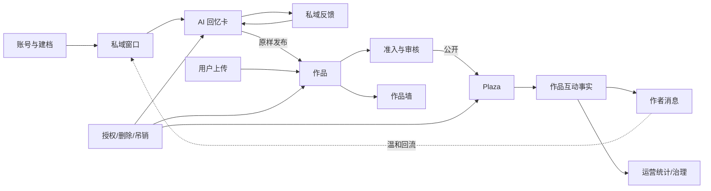

# 回声 Echo · 产品讨论基线（每次讨论先读）

> 状态：活文档 v1.1 · 2026-09-02
> 用途：产品讨论、裁定与开发计划的默认入口。先用本文恢复上下文；只有修改触及对应模块、出现冲突或需要举证时，才回读源文档与代码。
> 维护：每次裁定确认后同步更新本文；未确认的建议不得写成事实。

## 0. 固定工作方法

每次讨论必须同时基于两层事实：

1. **事实 A｜产品架构基线**：已确认的产品主线、分支系统、对象边界和系统关系。
2. **事实 B｜技术与变更基线**：当前代码已经实现到哪里，以及从项目建立至今影响本议题的已确认修改。

讨论顺序固定为：定位主线步骤与分支 → 陈述两层事实 → 判断变更等级 → 评估影响与隐患 →
提出建议 → 用户确认 → 回写基线与专项规格 → 只对“目标态－已实现”差额出开发计划。

事实优先级：`DECISIONS.md` → 专项裁定/SPEC → 本文 → `PRODUCT-MAINLINE.md` → 其他导览。
实现事实必须以代码核实为准；仅有文档、表、枚举或 mock，不算完整实现。

## 1. 事实 A｜当前产品架构基线

### 1.1 产品主线

```text
安顿：进入广场感知产品 → 建档/识别/定妆 → 建立私域窗口
相处：AI 定期生成回忆卡 → 私域送达/观看 → 用户反馈 → 推动下一轮生成
公开：用户上传，或把回忆卡原样发布为作品 → 作品准入/审核
被看见：Plaza 公共瀑布流分发作品 → 陌生人互动
回流：互动归属于作品 → 作者消息/温和私域投影 → 用户再次回来相处
```

主循环：**私域相处产生内容 → 用户主动形成作品 → 作品被看见和接住 → 作者收到回流 → 回到私域相处。**

### 1.2 核心对象

| 对象 | 产品角色 | 范围与主键 |
|---|---|---|
| 窗口 / Pet | 用户与被牵挂对象的关系空间 | 私域关系主体，`petId/windowId` |
| 回忆卡 / MemoryCard | AI 定期生成内容及用户反馈载体 | 默认私域，`cardId` |
| 作品 / Work | 用户明确发布后产生的公开内容对象 | 独立生命周期，`workId` |
| Plaza | 面向全站的公共发现瀑布流 | 只分发公开作品，不是对象表 |
| Works / 作品墙 | 当前或指定用户的作品集合视角 | 本人可见非公开状态，他人只见公开作品 |
| 作品互动 | 公开回应、归因、举报、消息的事实源 | 统一绑定 `workId` |

定档边界：

- “发布回忆卡”是创建来源为该卡的作品，不是把回忆卡改成公开卡。
- 作品来源为 `user_upload` 或 `memory_card`；后者用 `sourceCardId` 关联。
- 回忆卡私域反馈继续服务生成；陌生人作品互动默认不进入生成提示词。
- Plaza 与作品墙展示同一种 `Work`，但查询范围、排序目的和可见状态不同。

### 1.3 产品分支系统

| 分支 | 职责 | 主线位置 |
|---|---|---|
| 身份与账号 | 游客、绑定、权限升级 | 安顿前置 |
| 建档与主体识别 | 素材、识别、确认、定妆 | 安顿 |
| 私域窗口 | 关系空间、生命之书、近况、记录、温度 | 安顿/相处 |
| AI 生成 | 定期生成回忆卡、安全、下一轮主题 | 相处 |
| 作品发布 | 上传、回忆卡生成作品、版本冻结 | 公开入口 |
| 审核治理 | 准入、复审、驳回、下架、申诉、审计 | 公开前后 |
| Plaza 分发 | 推荐、排序、曝光、详情进入 | 被看见 |
| 作品墙 | 本人管理、他人公开作品展示 | 公开视图 |
| 作品互动 | 合规互动、幂等、撤回、举报 | 被看见 |
| 消息回流 | 将作品互动投影给作者 | 回流 |
| 合规与数据权利 | 授权、撤回、导出、删除、媒体吊销 | 横切全链路 |
| 运营后台 | 审核、治理、配置、指标、审计 | 支撑全链路 |

### 1.4 系统交互



## 2. 事实 B｜当前技术与变更基线

### 2.1 最近一次已知技术事实

> 本表是定位用快照。代码变更后必须重核，不能永久当真。

| 领域 | 当前已知实现 | 目标差额 |
|---|---|---|
| 建档/窗口/近况 | 正向主干基本可运行 | 用户原话留存、删除、导出、撤回等历史反向缺口 |
| 回忆卡 | 有审核、可见性、窗口互动和消息等存量能力 | 旧公开链废弃且不迁移；原内容只作为所属用户的私域素材保留，新公开必须由用户重新发布为 Work |
| 作品 | 有 `t_work`、创建、详情、列表、个人作品页、软删、基础状态 | 审核复用、完整审核迁移、互动、举报、消息、统计待核 |
| Plaza | 当前服务端仍按旧契约返回回忆卡 | 改为公共作品瀑布流，元素统一使用 `workId` |
| Works | 当前 `GET /works` 承担全站列表，另有用户作品页 | 定位为作品墙；迁移全站列表并区分本人/他人状态 |
| 审核治理 | 回忆卡审核链较完整；作品有状态字段 | 需核作品审核写入、读取、后台调用和流水，不能凭字段判完成 |
| 互动/消息 | 回忆卡/窗口有存量链路 | 作品级唯一事实和 `workId` 消息回流尚未证实完成 |

### 2.2 已确认变更梗概

| 日期 | 变更 | 影响 |
|---|---|---|
| 2026-08-30 | 新增独立作品模型与发布入口 | 补公开内容入口，但一度与旧公开卡流并存 |
| 2026-08-31 | G-27：卡为私域来源，作品为唯一公开实体 | **根基级**：公开审核、分发、互动、归因、消息迁至 `workId` |
| 2026-09-01 | 明确 Plaza 与 Works 定位 | Plaza=公共瀑布流；Works=用户作品墙 |
| 2026-09-01 | 明确审核复用 | 原样且公开级凭证有效可复用；内容变化或凭证失效必须审核 |
| 2026-09-01 | G-28：匿名访问与手机号绑定 | 首次进入即创建匿名账号；Plaza 每两小时约 30 条；公开详情可读、互动需绑定；私域生成前绑定 |
| 2026-09-03 | G-31：评论、二级回复与收藏 | 评论视觉最多两层但保留实际回复对象；用户自删、作者治理、平台处置分权；收藏完全私有且不通知作者 |
| 2026-09-03 | G-32：手机号归属解析 | 新手机号升级当前匿名账号；已有手机号经二次确认切回原账号，匿名资料不迁移 |
| 2026-09-03 | G-34：旧链与软清除收口 | 旧公开卡不迁移且只留作私域素材；根评论删除时整树级联软删；适配档案清除只撤销在线使用、历史技术数据保留 |
| 2026-09-03 | G-33：驳回作品修改重提 | 保持同一 workId，新建内容版本与审核工单；修改后旧凭证失效并重新审核 |
| 2026-09-04 | G-35：设备凭据与评论治理补充 | 设备凭据只登录未绑手机的匿名账号；绑定后凭据失效且再次使用创建新匿名账号；作者可隐藏/删除/举报但不可编辑他人评论；游客评论预览固定在 Plaza 作品详情 |
| 2026-09-04 | G-36：作品提交用户级单通道 | 每个用户同一时间只能有一个作品处于处理/审核链；不新增审核进度中心，统一从“我的作品墙”查看状态和执行动作 |
| 2026-09-01 | G-29：单宠沉浸式建档问卷 | 一窗一宠；上传识别后以“第一次见到它”为起点完成 4 题问卷，形成可追溯生成锚点，确认形象后才建窗 |
| 2026-09-02 | G-30：行为证据与适配底座 | 观察事实、明确反馈、弱假设、适配决策分存；三域隔离；隐式推荐信号先影子验证 |

### 2.3 匿名访问当前定档

- 后端只有“匿名未绑定 / 已绑定手机”状态；前端把匿名态表达为“未登录”。
- 设备凭据只可恢复尚未绑定手机号的匿名账号；账号绑定手机号后，该设备凭据不得再登录此账号，再次使用设备标识由服务端按新匿名账号处理。
- 前端可以保存设备信息，但绑定状态、设备凭据失效、会话签发和新匿名账号创建均以服务端为权威。
- 匿名 token 丢失导致资料无法找回可以接受；绑定后才承诺跨设备找回。
- Plaza 每两小时给固定约 30 条作品；详情可完整查看，互动和连续深度消费要求绑定。
- 游客可看作者公开资料、关注数、粉丝数、获赞数和作品图片预览；作者页作品点击要求绑定。
- 私域游客可提交生成前资料，暂定 2 张肖像、2 份视频；正式生成前进入独立手机号登录流程。
- 未绑定资料不设短期过期，两年以上不活跃才进入清理候选。
- 匿名访问详细规则见 `PRODUCT-DECISION-ANONYMOUS-ACCESS.md`；评论专项已由后发 `G-31` 补齐。
- 评论专项已由 `G-31` 定案：一级评论支持热门/最新，回复区固定二级平铺；收藏不向作者形成任何信息面。
- 游客前三条评论位于 Plaza 作品详情页：返回热门一级前三条及服务端受控的回复预览，不提供完整分页入口。
- 评论治理按角色分权：普通用户只能删除自己写的内容；作品作者可隐藏、删除、举报本作品下评论，但不能编辑他人评论；平台拥有全局治理权限。
- 手机号绑定由 `G-32` 细化：只有新手机号升级匿名账号；已有手机号切回原账号且不迁移匿名资料。
- 作品提交采用用户级单通道；服务端返回是否可提交和占用中的作品，前端只在“我的作品墙”呈现，不创建独立审核进度窗口。

### 2.4 私域单宠建档当前定档

- P0 一窗一宠；多宠素材只能选择并裁切一只，辨识度或同宠一致性不足不得生成。
- 首次一张合格照片即可开始，第二张照片和最多两份视频按具体缺口邀请补充。
- 宠物确认后输入称呼，以“第一次见到它”为叙事入口完成 4 道点选题：初见地点、初见印象、后来习惯、首次生成画面。
- 不主动询问或推测死亡；“记不清初见”转为“从最熟悉的它开始”。
- 问卷完成后绑定手机并生成；用户确认“就是它”后才正式创建窗口。
- 用户明确答案、模型识别、模型派生摘要分开存储；详细数据架构见 `SPEC-private-pet-onboarding-questionnaire.md`。

### 2.5 用户理解“里层”当前定档

- 两套根结构并行：内容理解为`人物/主体—场景—事实`；行为适配为`行为事实—弱信号—可撤销假设—适配决策`。
- 行为事实、用户明确反馈、系统假设和实际适配动作必须分存，任何结果都能追溯到证据、规则版本、用途与有效期。
- 有效操作时长排除后台、网络、上传转码和验证码等待；单次点击、短停留或未操作不能直接解释为喜好或不喜欢。
- 只允许形成操作偏好、当前内容方向和公共题材等弱假设；不推断年龄、智力、心理状态、悲伤阶段、依赖程度或对象生死。
- `ui_adaptation`、`public_recommendation`、`private_generation` 三域默认隔离。Plaza 行为不自动进入私域生成，陌生人互动仍只做公开归因与消息。
- 旧 `RK-I/X8` 更新为分阶段门控：允许采集并影子验证，当前线上排序仍不读取点击、停留、完播、复播和刷屏深度；通过联合提升门槛后才可逐项接入。
- 详细对象、接口、失败策略、开发阶段和验收见 `SPEC-behavior-evidence-and-adaptation.md`。

## 3. 根基级变更判断

改变核心对象/主键/生命周期、私域公开边界、主循环、事实来源、审核责任、授权删除后果，
或改变 Plaza/作品墙/消息等跨系统定位，均按根基级变更评估。

评估必须覆盖：主线步骤、对象、前端场景、后端域、数据迁移、兼容性、审核合规、指标、历史数据和回滚。
未经用户确认，只能提出方案，不能写成新基线。

## 4. 单次讨论模板

```text
议题 / 主线位置 / 涉及分支 / 系统关系：
事实 A｜现有产品基线：
事实 B｜当前实现与历史变更：
变更等级：局部 / 跨系统 / 根基级
目标态 / 隐患 / 兼容迁移建议：
确认状态：待确认 / 已确认
差额开发计划：前端 / 后端 / 数据迁移 / QA / 文档
```

## 5. 维护与专业同步

- 三仓统一分支与版本标记执行 `BRANCHING-WORKFLOW.md`：`develop` 是唯一持续开发与定案线，`release` 只承接候选，`master` 冻结不再维护。
- 产品、设计、前端、后端、QA 与运营共同执行 `docs/skills/development-readiness/SKILL.md`；该仓库版本是权威副本，个人 skill 目录只作安装缓存。
- 每项产品定案推送远端后，必须按 `docs/skills/development-readiness/references/cascade-delivery.md` 建立唯一交付账本，同时派发前端、后端、QA 评估；三方 ACK 和联合契约冻结完成前不得拆 agent 开发。
- 主干、核心对象、生命周期、权限、私域/公开边界、破坏性接口或主要用户流程发生新差异时，相关开发立即停止；技术先反馈影响与备选，产品重新定调，QA 更新验收，再升版重发。
- 日常先读本文相关章节；触及某分支再读对应 SPEC，触及根基必须回读裁定和架构源文档。
- 新裁定同步更新本文 §1/§2、`DECISIONS.md` 和对应 SPEC；涉及接口再更新 `API-CONTRACT.md`。
- 开发计划只写新增差额，并说明旧能力是复用、迁移、废弃还是不动。
- 给前端、后端、QA、运营的摘要固定回答：**改了什么、为什么、影响哪些系统、哪些不改、需核什么。**
