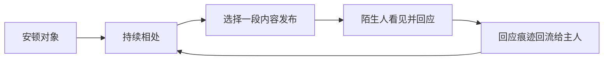
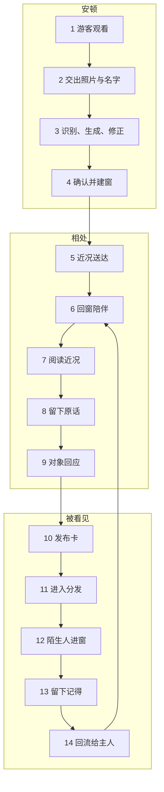
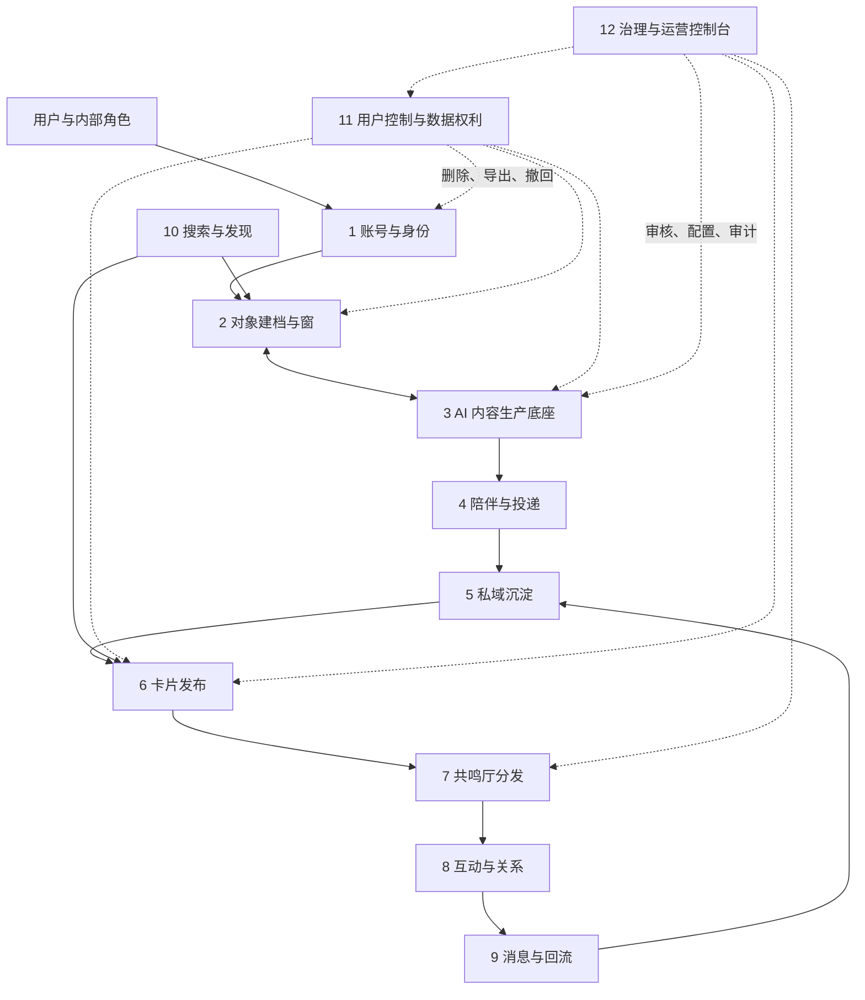
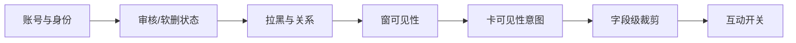

# 回声 Echo · 产品实现脉络摸底

> 状态：工作稿 v0.2 · 2026-08-30  
> 范围：仅依据当前产品文档核实产品设计；实现状态引用 `PRODUCT-SKELETON.md` / `PRODUCT-MINDMAP.md` 已完成的代码核实结论，不在本文重新推断。  
> **例外**：§0 是 2026-08-30 直接读 `echo` 仓源码得出的，不引用任何文档的状态描述。  
> 事实优先级：`DECISIONS.md` → 专项 SPEC / PRD → `PRODUCT-MAINLINE.md` → 导览、研究与运营建议。被推翻的原文只作历史记录，不算当前方案。

## 0″. 2026-09-01 产品收口：公开层统一到作品

本轮产品决策已经关闭 §0b 中“广场展示窗、回忆卡还是作品”的未决项：

- **回忆卡是私域内容源**，承载 AI 定期生成、用户观看与生成反馈；
- **作品是唯一公开对象**，来源可以是用户上传，也可以是未修改的回忆卡内容；
- 将回忆卡发布出去的动作是**新建一条作品并关联 `sourceCardId`**，不是把卡改成公开卡；
- 广场、公开详情、互动、举报、通知和统计均以 `workId` 为主归属；
- 回忆卡已有公开级审核凭证且内容版本未变时可复用审核，否则进入作品审核。

因此，本文后续凡把“公开卡”当长期目标模型的描述，均只代表当时的实现核实或历史方案，
不再作为目标产品契约。当前目标真源为 `DECISIONS G-27`、
`PRODUCT-DECISION-WORK-PUBLICATION.md` 和 `SPEC-works §0/§5—§7`。

🔴 **实现差距仍然存在**：当前 `/plaza` 发回忆卡、`GET /works` 承担全站作品列表；目标态应由
`/plaza` 承担公共作品瀑布流，作品墙只查当前/指定用户。作品审核迁移、审核凭证复用、
作品互动及消息回流尚须前后端按 W-01—W-14 逐项核查。这里仅更新产品结论，不把目标态标成已实现。

## 0′. 2026-08-30 晚：§0 的断点已修，但修的不是「卡」

🔴 **读 §0 之前先读这一节，否则会照着一份已经过期的状态描述做判断。**

§0 说的「服务端零发布入口」**在同日已经补上**，但走的是另一条路：
不是给回忆卡加 `POST /cards`，而是**新建了一个「作品」模型**（`t_work` + `WorksApi`），
与回忆卡分开建模、各有各的发布页，两者由 `t_work.sourceCardId` 外键连接。

| 项 | 状态 |
|---|---|
| 服务端发布入口 | ✅ `POST /works`（落 `pending`，非 `public`） |
| 作品瀑布 / 个人作品页 | ✅ `GET /works`、`GET /users/:id/works` |
| 前端发布页 | ✅ `PublishScreen` 三态，已出 390 视口实拍 |
| 回忆卡自己的 `POST /cards` | ❌ **仍然没有**，且现在也不打算加——回忆卡是私域产物，走「发成作品」这条路出去 |

规格见 `SPEC-works.md`。**§0 以下内容保留为当时的核实记录，不代表当前状态。**

## 0. 2026-08-30 代码核实：承重点「发布卡」在服务端没有入口

§1 判定"发布卡是全局承重点"。这一节回代码验它的实现状态，**结论是这个动作不存在**。

### 结论

**服务端没有任何一条能创建卡的路径。** 全部 65 条 HTTP 路由里，回忆卡相关的有 11 条
（另有 3 条 `postcard` 是明信片，不是卡）：

```
GET    /pet/me/cards              作者看自己的
GET    /users/:id/cards           看别人的
PATCH  /cards/:id/visibility      改可见性
PUT    /cards/:id/pin             置顶
DELETE /cards/:id/pin             取消置顶
GET    /cards/:id/moderation      审核状态
POST   /cards/:id/appeal          申诉
GET    /cards/:id/interaction     互动开关
PATCH  /cards/:id/interaction     改互动开关
POST   /cards/:cardId/messages    留言
GET    /cards/:cardId/messages/pending
```

读的、改的、审的、申诉的、留言的都齐了，**唯独没有一条是"造一张卡出来"**。
前端同样没有任何发布调用。

卡进入系统的唯一入口是 `ModerationStore.putCard()`，而它在接口里被归在
「**造数（开发环境）**」一节，注释写明是「**发布路径的最小替身**」。
它的全部 4 个调用点都在 `src/test/`，生产代码零调用。

### 这意味着什么

下游全部建好了，上游没有。审核状态机、双流水事务、申诉一生一次的并发保护、
可见性取交集、置顶上限的事务内校验、广场分发——这些都实现得相当细，
其中好几处的注释在讨论并发竞态该怎么防。**但它们处理的卡，目前只能由测试代码塞进去。**

所以现状不是"发布做了一半"，而是**十四步主线在第 10 步断开**：
1—9 步（安顿、相处、生成内容）与 11 步之后（审核、分发、互动、回流）各自成立，
中间那个把私域内容变成公开卡的动作是空的。

### 核实方式（可复核）

| 查什么 | 怎么查 | 结果 |
|---|---|---|
| 有无创建卡的路由 | 列 `EchoApi`/`ModerationApi`/`GovernanceApi`/`LeaveWordsApi` 全部 `r.add` | 65 条，无 `POST /cards` |
| 有无创建卡的写入 | 全仓搜 `insertCard\|createCard\|saveCard\|INSERT INTO card\|publishCard` | 0 命中 |
| `putCard` 谁在调 | 全仓搜调用点 | 4 处，全在 `src/test/` |
| 前端有无发布调用 | 搜 `echo-h5-proto/src` 的 cards 请求 | 0 |

🔴 **本节只陈述"代码里有没有"，不判断该不该做、该怎么做。** 后者要对着
`SPEC-publish-and-ops.md` 与 `DECISIONS.md OM3`（生成/发布/过审三个时刻不得合并）走一遍。

⚠️ 上表第一行的「65 条」是**按 `r.add` 枚举**的结果，漏掉了 `HttpGateway` 直接注册的
三个出入口（`POST /upload`、`GET /files/{key}`、`GET /healthz`），同口径应为 68。
**对本节结论无影响**——那三个里没有创建卡的口。

🔴 **2026-08-30 再次修正：68 也不是全部，全量是 83 条注册入口 / 生产可达 82 条**
（`SPEC-security §4.13` 逐条对照表）。**别再引用 65 或 68**。三个数字的关系是：

| 数字 | 含义 | 为什么会有这个数 |
|---|---|---|
| 65 | Router 里 `r.add` 的条数 | 本节初盘时的口径 |
| 68 | 65 + `HttpGateway` 具名端点 3 条 | 补了不走 Router 的那三条 |
| 83 | 68 + 作品域 5 条 + 条件挂载的 dev 路由 + `OPTIONS` 预检 + **WebSocket 8 条** | 全量 |

🔴 **差额里最要命的是 WebSocket 那 8 条**：它不是 HTTP，**数路由表数不出来**，
此前所有「列出入口」的口径里都不存在这一类。其中 `1001 登录` 只凭客户端给的
`openId` 字符串就换到会话身份，`1503 留痕迹` 能向任意空间写自由文本且不过安全闸——
后者意味着 `SPEC-security §4.5`「公开层不开放自由文本」这个跨四类风险的核心决定，
**代码里有一条绕过它的路**。

**方法上的教训**（比数字本身值钱）：「列全部出入口」这件事,三次盘点三个数字，
每次都是因为**用某一种注册形式去枚举**（`r.add` → 加上具名端点 → 才想起还有 WS）。
下次要列全，得从**协议面**入手（HTTP / WS / 未来的 gRPC），不是从某个注册函数入手。

## 0b. 2026-08-30 代码核实：广场页前后端契约对不上，且是静默的

§0 说的是「主线第 10 步没有入口」。这一节说的是**第 11 步的下发面本身就是坏的**，
而它比 §0 更隐蔽：不报错、不白屏，只是内容悄悄少一半。

### 结论

**服务端 `GET /plaza` 下发的是回忆卡（`CardView`），前端 `PlazaScreen` 按「窗」（`Window`）解析。**
两边字段只在 `id / petId / title / cover` 四项上重合，**广场卡片真正渲染的那几项一个都没有**：

| 前端渲染用到的字段 | 服务端 `CardView` 有没有 | 渲染后果 |
|---|---|---|
| `recent`（近况文案） | ❌ | 卡片正文空白 |
| `span`（`cover-tall`/`cover-short`） | ❌ | 瀑布流失去高低错落，退化成等高网格 |
| `ownerName` / `ownerAvatar` | ❌ | 没有作者，卡片不知道是谁发的 |
| `ownerAccountType`（`'ops'` → 官方角标） | ❌ | 🔴 官方号与真人号在广场上**无法区分** |

服务端另有 `excerpt`、`hasCover`、`sourceType`、`topicIds`、`publishedAt` 五个字段
**前端完全没接**。

### 为什么至今没暴露

前端默认跑在 mock 模式（`VITE_API_BASE` 留空即启用，见 `echo-h5-proto/src/api/client.ts`），
mock 自己造 `Window` 形状的数据，**两边各自自洽**。契约不一致只在配了真后端那一刻才成立，
而那一刻**不会有任何报错**——JS 读不存在的字段拿到 `undefined`，卡片照常渲染，只是空的。

🔴 **这正是最坏的一类失败：它看起来是"广场没什么内容"，而不是"广场坏了"。**
第一个看到的人多半会去查数据够不够、推荐算法对不对，而不是去查契约。

### 位置

| 侧 | 文件 | 说明 |
|---|---|---|
| 服务端 | `echo/echo-server/.../http/EchoApi.java:876 plaza()` | 返回 `CardView.of(...)` 列表 |
| 服务端 | `echo/echo-server/.../http/card/CardView.java:84-98` | 字段清单 |
| 前端 | `echo-client/echo-h5-proto/src/api/http.ts:190` | `get<Paged<Window>>('/plaza')` |
| 前端 | `echo-client/echo-h5-proto/src/types.ts:94-154` | `Window` 类型 |
| 前端 | `echo-client/echo-h5-proto/src/components/PlazaScreen.tsx:120-144` | 内联 `w-card` |

### 尚未处理

本节只登记，**不在本次改动范围内**。要修得先拍板广场到底是「窗的瀑布」还是「卡/作品的瀑布」——
这是产品决定，不是对齐字段就完事的。🔴 **新增的作品瀑布不要复用这条链路**，
否则等于把同一个错误抄第二遍。

本文使用四种状态：

- **已定**：已有制作人裁定或现行规格真源，可进入产品基线。
- **已定待落地**：产品口径已经确定，但实现状态文档明确记录尚未完成。
- **暂定/冻结**：已有安全默认或阶段性处理，不代表最终产品选择。
- **待定/冲突**：文档仍存在有效分歧，本文只登记，不代产品负责人拍板。

## 1. 执行摘要

Echo 的产品本体不是“生成一段 AI 内容”，而是让用户把一份牵挂安顿成可持续相处的对象关系，并在用户主动公开后获得“它被别人记得”的确认。

完整闭环为：



用户体验上分为纪念侧与共鸣厅侧；产品工程上不能只拆成两个系统。核心对象至少分账号、窗、卡三级，并由身份、AI、投递、发布、分发、互动、消息、治理等能力系统共同完成闭环。

当前产品设计的四个首要问题：

1. 私域主线与公开主线已经成形，但二者的连接动作“发布卡”是全局承重点。
2. 窗级情感痕迹与卡级互动归因必须由一次操作同时产生，不能只写一侧。
3. 身份、窗可见性、卡可见性、审核状态和互动开关共同决定用户能看什么、能做什么。
4. 删除、暂停、导出、撤回授权等反向能力应被视为一个完整系统，而非散落的附属功能。

## 2. 产品主流程：十四步

### 2.1 安顿（1—4）

1. 游客先看见别人的卡或窗，不被要求立即注册。
2. 用户留下可追责身份，上传照片并告诉产品“它是谁”。
3. 系统识别与生成候选形象，用户反复修正。
4. 用户确认“就是它”，建立一扇窗；窗成为以后回来的目的地。

### 2.2 相处（5—9）

5. 系统在克制的节奏下主动生成并送达第一条近况。
6. 用户回到窗前陪伴，私域关系状态发生变化。
7. 用户阅读近况，并能回看历史。
8. 用户写一句话；产品承诺应原样保存。
9. “它”对这句话作出有限回应，不演化成无限即时聊天。

### 2.3 被看见（10—14）

10. 用户选择一段内容形成卡，设置保护与公开范围后发布。
11. 卡通过审核并进入共鸣厅分发，被陌生人看到。
12. 陌生人可从卡进入对应的窗；所见内容按身份和权限裁剪。
13. 陌生人对对象或卡留下“记得”等有语义的回应。
14. 回应按卡聚合后回流给主人；主人因此更愿意回到第 6 步。



## 3. 核心对象与所有权

| 对象 | 产品含义 | 主责系统 | 跨系统关系 |
|---|---|---|---|
| 账号 | 身份、权限、授权和关系的载体 | 账号与身份 | 游客转正式账号后，既有行为继续归属同一人 |
| 窗 | 一个被牵挂对象在 Echo 中的私域空间 | 对象建档与窗 | 共鸣厅只把它作为卡的出处和访客到达目标 |
| 近况 | 系统以对象口吻捎来的内容 | 陪伴与投递 | AI 负责生成，纪念侧负责保存和阅读权限 |
| 用户原话 | 用户写给对象、应被原样保留的内容 | 私域沉淀 | 可作为生成输入，但不能被模型回应覆盖 |
| 卡 | 从窗中选择内容形成的一次发布快照 | 卡片发布 | 纪念侧保有出处，共鸣厅获得审核和分发权 |
| 回响 | 对某张卡的语义化回应 | 互动与关系 | 卡级归因进入分发指标；必要痕迹回流到窗 |
| 温度 | 主人与对象关系的私域状态 | 私域沉淀 | 陌生人的行为不得改变，也不得进入公开排序 |
| 暖光 | 对象被他人记得形成的窗级痕迹 | 互动与关系 | 来源于公开互动，但只按产品规则向主人呈现 |
| 消息 | 来自对象、他人或系统的到达通知 | 消息与回流 | 只承载到达，不成为新的业务事实源 |

## 4. 产品系统全景



### 4.1 系统职责摘要

| 系统 | 主对象 | 核心操作 | 不应承担 |
|---|---|---|---|
| 账号与身份 | 账号、登录态、角色 | 游客分配、绑定、鉴权、归属校验 | 内容可见性的最终判断 |
| 对象建档与窗 | 窗、对象资料、素材 | 上传、主体确认、定妆、建窗、编辑窗 | 公开卡的排序 |
| AI 内容生产 | 生成任务、派生物、模型配置 | 识别、图像/文本生成、安全过滤、降级 | 决定用户是否公开内容 |
| 陪伴与投递 | 近况库存、送达状态 | 生成计划、背压、减频、失败重试、通知 | 用活跃度刺激用户回访 |
| 私域沉淀 | 近况、原话、回应、记录、生命之书、温度 | 阅读、回应、记录、沉淀、回访 | 消费陌生人行为改变温度 |
| 卡片发布 | 草稿、卡、发布许可、审核状态 | 保护面板、提交、撤回、改可见性、置顶 | 直接修改窗内原始内容 |
| 共鸣厅分发 | 候选集、曝光、排序状态 | 召回、过滤、排序、打散、去重、退场 | 读取悲伤度、依赖度作为排序信号 |
| 互动与关系 | 回响、记得、心意、关注、亲友、拉黑 | 回应、取消、关注、举报、关互动 | 将互动量变成公开排行榜 |
| 消息与回流 | 到达、聚合键、已读 | 分类、聚合、送达、跳转、已读 | 保存业务事实的唯一副本 |
| 搜索与发现 | 索引、查询、结果分区 | 搜作者、窗、卡、题材并执行权限过滤 | 绕过审核、拉黑和可见性 |
| 用户控制与数据权利 | 删除请求、导出、授权账本 | 删除、恢复、导出、查询/撤回授权 | 把删除当推荐负反馈 |
| 治理与运营控制台 | 工单、配置、审批、审计 | 看、管、办、证 | 重建业务规则或向 C 端暴露后台指标 |

## 5. 关键场景分支

### 5.1 身份分支

| 身份 | 可看 | 可做 | 关键限制 |
|---|---|---|---|
| 纯游客 | 允许公开访问的共鸣厅内容 | 浏览、进入允许访问的页面 | 写操作原则上先绑定，不得借游客绕过追责 |
| 已绑定用户 | 公开内容及本人有权内容 | 建窗、发布、互动、关注、举报 | 仍受对象归属、审核和拉黑限制 |
| 窗主 | 自己窗的完整私域内容 | 编辑、回应、发布、撤回、删除、导出 | 不能绕过平台安全与合规审核 |
| 亲友 | 窗主授权的窗口内容 | 读取授权范围内内容 | 不等同于关注关系，不自动取得发布权 |
| 陌生人 | 卡及窗裁剪后的公开投影 | 在允许范围内记得、献花或回应 | 看不到温度、主体判定等私域信息 |
| 关注者 | 陌生人权限 + 关注页签的到达关系 | 关注/取关、浏览作者后续发布 | 关注不等于亲友，不计入“被接住率” |
| 被拉黑者 | 不应再获得对方相关候选或互动入口 | 仅能管理自己的黑名单状态 | 历史痕迹是否保留按独立规则处理 |

### 5.2 可见性判定

最终可见性不是一个字段，至少按以下顺序判断：



窗与卡的可见范围取更严格者；通过页面隐藏不能替代服务端不下发。

## 6. 六条跨系统事件链

### 6.1 建窗

`身份确认 → 素材上传 → 主体识别 → 用户指认 → 形象生成/修正 → 用户确认 → 建窗 → 种下生命之书 → 生成第一条近况`

### 6.2 近况生成与送达

`生成计划 → 未读库存背压 → 频率/题材减频 → 生成 → 安全闸 → 保存 → 待送达 → 通知 → 阅读`

生成与送达必须分开；题材偏好只减不加；恢复投递等待下一个闲时窗口，不即时补发。

### 6.3 发布

`选择来源 → 建草稿 → 保护面板 → 作者确认许可 → 提交审核 → 审核通过 → 写入 reviewedAt → 进入候选集`

作者创作时刻、作者发布时刻、审核通过时刻是三个不同时间，不得合并。

### 6.4 公开互动

`检查卡和窗有效性 → 检查身份/拉黑/互动开关 → 执行动作 → 写卡级归因 → 写窗级痕迹 → 生成回流事件`

记得与献花采用“一次动作、两处记录”。两处写入应共享事件标识；数据库可用时应同事务完成，并为重试设计幂等。

### 6.5 消息回流

`卡级回应 → 按 cardId 聚合 → 生成克制到达文案 → 消息中心 → 已读 → 跳回卡或窗`

聚合单位是卡，不是窗；消息不得暴露被禁止的精确人数。

### 6.6 删除与撤回授权

`用户请求 → 软删/授权失效 → 停止公开下发 → 搜索与分发排除 → 停止后续生成/训练消费 → 保留审计与法定证明`

删除不产生质量信号；授权撤回后的约束必须覆盖派生物使用链，而不只是原图入口。

## 7. 当前未收口与冲突

### 7.1 需要产品继续确认

1. 主人回到窗时，陌生人痕迹展示到什么粒度。
2. 献花“匿名”对回应者、主人和其他访客分别承诺什么。
3. 陌生人进入窗后的唯一字段白名单。
4. 同一张卡的陌生人回应与关注者回应如何合并成一条到达。
5. 关注页签中高频作者的单日露出上限。
6. 明信片已解锁位置是否继续对陌生人可见。

### 7.2 已确认的结构性张力

| 张力 | 产品影响 |
|---|---|
| 私域是本体，共鸣厅却拥有唯一北极星 | 资源会持续流向被度量的公开层 |
| 窗是私域空间，也是陌生人的到达终点 | 必须建立统一访客投影，不能逐页面临时裁剪 |
| 关注公开精确粉丝数，但禁止排行榜与马太效应 | 需要把“展示个人数字”和“用于排名/推荐”严格隔离 |
| 共鸣厅零交易护栏与心意可购买并存 | 需明确心意是否为护栏例外，以及是否继续计入互动归因 |
| 长期陪伴依赖有限用户素材 | 素材见底后的重复与幻灭风险尚无完整产品机制 |
| 后台能力全量，C 端强调私密 | 对用户的“仅你可见”必须明确是用户间边界，不得作绝对承诺 |

### 7.3 当前基线与后置蓝图区分

| 层 | 当前基线 | 后置或条件开放 |
|---|---|---|
| 私域核心 | 宠物建档、定妆、窗、近况、回访、有限回应、记录、生命之书、明信片 | 多品类完整闭环、复杂长期仪式、光谱 |
| 公开层 | 卡、保护面板、审核、共鸣厅、基础回响、关注、消息回流 | 全屏单卡层、深互动、双向互链、复杂题材关系 |
| 商业化 | 订阅结构及既有护栏 | 高档位、付费心意扩展、具体价格实验 |
| AI | 真实文本生成与内容安全为 P0 核心 | 视频、复杂画像、自训模型、向前光谱 |
| 治理 | 审核、举报、拉黑、授权、删除/导出、后台审计 | 更高干涉档位和待律师确认后才能开放的能力 |

远期 `PRD.md` 中的 PvP、元宇宙、链上资产等属于战略蓝图，不进入本次当前产品主干和系统排期。

## 8. 工程规划建议顺序

1. 先冻结核心对象、身份与状态词典：账号、窗、卡、近况、回响、可见性、审核状态。
2. 先贯通十四步主线，尤其是发布卡和卡级回响，再扩建枝节。
3. 建立统一的访问判定与字段裁剪层，供窗、卡、搜索、消息和分享复用。
4. 建立互动事件与双记录一致性，明确幂等、事务、撤销和补偿。
5. 建立消息按卡聚合的回流链，使公开互动真正回到私域闭环。
6. 补齐删除、暂停、导出与撤回授权，形成完整用户控制面。
7. 最后再开放深互动、付费心意、复杂关系与远期光谱能力。

## 9. 本文依据

- `DECISIONS.md`
- `PRODUCT-MAINLINE.md`
- `PRODUCT-SKELETON.md`
- `PRODUCT-MINDMAP.md`
- `ARCHITECTURE-system-split.md`
- `PRD-echo-pet.md`
- `PRD-echo-social.md`
- `PRD-RESONANCE-PUBLISHING.md`
- `PRD-RESONANCE-INTERACTION-PALETTE.md`
- `SPEC-publish-and-ops.md`
- `SPEC-feed-surfaces.md`
- `SPEC-recommendation-ranking.md`
- `SPEC-push.md`
- `SPEC-trust-and-compliance.md`
- `SPEC-security.md`
- `SPEC-admin-console.md`
- `AI-CAPABILITIES.md`
- `SPEC-subject-recognition-and-degradation.md`

## 10. 关键结论追溯表

| 本文结论 | 当前真源或核实入口 | 状态 |
|---|---|---|
| 十四步主线及三阶段 | `PRODUCT-MAINLINE.md §0`、第一至第三段 | 已定产品主线；该文不代表实现状态 |
| 52 个动作、四条流程断点 | `PRODUCT-SKELETON.md §0`、`§3`、`§4` | 实现状态核实结论 |
| 窗是容器、卡是公开分发单元 | `DECISIONS.md OM1/OM2`、`ARCHITECTURE-system-split.md §2` | 已定 |
| 生成/发布/过审三个时刻 | `DECISIONS.md OM3`、`SPEC-publish-and-ops.md §1.8.3` | 已定 |
| 审核通过写 `reviewedAt` 且只写一次 | `SPEC-publish-and-ops.md §1.8.3`、`§2.2.2` | 已定 |
| 生成与送达解耦、未读库存背压 | `DECISIONS.md PU1–PU4`、`SPEC-push.md §4` | 已定待落地 |
| 窗与卡可见性取交集 | `ARCHITECTURE-system-split.md §2.3`、`DECISIONS.md` VIS 系列 | 已定；部分访客字段仍待视觉收口 |
| 记得/献花一次动作两处记录 | `ARCHITECTURE-system-split.md §0.4`、`§2.4`、`§7` | 已定待落地 |
| 到达进入消息中心、不报精确数、按卡合并 | `DECISIONS.md D22` | 已定；当前折叠单位冻结且与裁定不符 |
| 拉黑只阻断以后，不回溯删除历史痕迹 | `DECISIONS.md D23` | 已定 |
| 明信片已解锁位对陌生人可见 | `DECISIONS.md VIS1` | 暂定，待视觉定稿 |
| 主人痕迹、匿名语义、访客窗元素表 | `PRODUCT-SKELETON.md §7.2`、`PRODUCT-SPEC-OPEN-QUESTIONS.md §2` | 待定 |
| 后台承担看/管/办/证并以 RBAC 和审计控制 | `SPEC-admin-console.md §1`、`§4`、`§5` | 已定目标规格 |
| 删除、导出与授权撤回 | `SPEC-trust-and-compliance.md CM-G0–G4` | 产品/合规已定；实现状态另见 `PRODUCT-SKELETON.md` |
