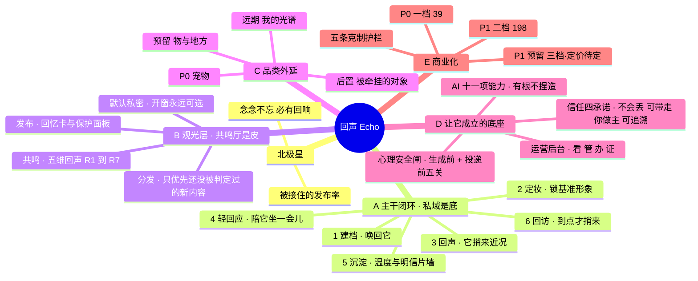

# 回声 Echo · 产品脉络脑图

| 项 | 值 |
|---|---|
| 文档版本 | **v2.1 · 2026-08-28**（🔴 **主干节改按「实现什么样就呈现什么样」重写**，产品负责人当日叫停全部并行工作线，只看整个 app 的脉络）<br>🆕 🔴 **新增 `§1.1` 主线十四步 · 今天走得到哪** —— **状态全部回代码核实**（穷举五处路由注册 + 逐个动作追调用链），**一处都没有照抄文档里的「已实现」**。🔴 **结论:8 步通 · 4 步做了但做的不对 · 1 步靠替身撑着 · 1 步整个不存在。**<br>🔴🔴 **不存在的是第 10 步「把一条回忆发布到共鸣厅」，而它是分水岭** —— 它前面是一个人的相册，⚠️ **它后面四步（分发 · 被刷到 · 被记得 · 他知道）全部建在一个用户到不了的起点上，所以它们不是「等着接上」，是「已经建好了但没有入口」**。🟢 **它并非「还没定」:状态机 / `POST /cards` / 字段表 / 六条验收全都有，只是被自述为「发布路径的最小替身」的造数入口盖住了。**<br>🆕 **`§1.1.1` 两个只有看全貌才看得出来的形状**:① 🔴 **正向全通、反向全断**（删近况 · 删记录 · 删整扇窗 · 暂停来信 · 导出 · 撤回授权，六处全空；⚠️ **动作全集比既有功能清单多出的 13 行没有一行是新功能**，全是这一类）· ② 🔴 **12 个「不报错」的半成品**（端点在、测试过、界面不空白，**没有任何一处会亮红**）。<br>🆕 **`§1.1.2` 动作全集四态分布** 28 / 11 / 8 / 5，并给出四条主干流程各自的断点。<br>🔄 **原主干 mermaid 图降为 `§1.2` 功能树**（内容未改，🔴 **它答的是「有哪些支」，答不了「今天走得到哪」**）。<br>🔄 **`§2.3` 六步闭环加注射程**:🔴 **未被推翻，但它只覆盖纪念侧**（主线第 4–9 步）；⚠️ **六步自己是闭合的，只看那一节会误读成「主干已经通了」——断的是它外面那半个环**。<br>📌 **依据**:`PRODUCT-MAINLINE.md v0.3` · `PRODUCT-SKELETON.md v0.1`（后者的状态列即本轮核实结果）。<br>v2.0 · 2026-08-26（同步 `DECISIONS.md` **v2.3 `§G⁗⁗⁗⁗‴`**，留痕落 **§4.18**）<br>🔴 **本轮最重的一条不是九条新裁定，是一句流通已久的错话被判死**：~~「献花与记得**迁到卡级**」~~ —— **字面就是把互动挂到作品上，那正是点赞，立项时已明确砍掉**。现口径 **`RK-H` 双层**：**窗级仍一人一次**（决定暖意与面孔墙，`D8` 原意完整保留）+ **卡级只加一列入口归因**（仅供归因 · 不参与任何计数 · 🔴 **永不下发**，因为**一旦下发当场退化成点赞**）。<br>🔄 🔴 **另推翻一条旧判断**：~~「话题做成一棵树与既有五维正交模型**不相容**」~~ → **`TX-D1` 每个维度各自是一棵树、树在维度内部、维度之间仍正交**。**推翻原因：原判断基于误读** —— 树是维度<u>内部</u>结构、正交是维度<u>之间</u>关系，不在同一层级；🟢 **原取向对、理由错。**<br>✅ **三条原「未落盘 / 未登记」销账**：卡表范围 → `OM2` · 主体类型取值域 → `SR-D9` · 温度回落订阅侧 → `TM3`。<br>🆕 **另落 `D24`**（共鸣厅三层与手势）· **`OM3`**（发布三时刻）· 🆕 **`VIS1`–`VIS3`**（可见性，🔴 **`VIS3` 注明「`reels` 不动是裁定不是漏改」**）· 🆕 **`TX-D2`/`TX-D3`**（卡挂叶子 · 情感大类只归类不匹配，并立通则 **归类维度 ≠ 亲和信号**）。<br>🔴 **`GTM4` 补名称护栏**：北极星**不叫「被记得率」**，错名会把人推向 `X6` 禁止的「优化记得数」。<br>🔴 **三处冲突并列登记 `XC1`–`XC3`，只登记不调和**；⚠️ **配比数字那条判为假冲突、明确不登记**。<br>v1.9 · 2026-08-25（夜 · 第四批 · 工程线入账）（同步 `WORKLOG.md` 08-25 第四批：**卡表范围 · 温度回落分档 · 主体类型取值 · 三套分发机制线上未生效**，留痕落 **§4.17**）<br>🔄 🔴 **§3.3.1 卡表范围放宽**：**回忆卡表装「所有可发布的回忆」（AI 产出 + 手写 `record` + 生命之书），不只装 AI 产出物** —— 🔴 **范围不写下来，卡级迁移排期时手写记录与生命之书会被当成第二期漏掉**。📋 **未登记 `DECISIONS.md`。**<br>🔄 **§2.3 步骤 5 温度回落分档规则补齐**：**免费回落至地板（地板不为零，60/满 100）· 订阅期保持当前刻度 · 🔴 最高档完全不掉**。🟢 🔴 **核实出它是<u>恢复</u> `PRD §3.11②`/`§7.2` 既有设计、被代码单方面丢掉，不是新加付费墙。**<br>🔄 🔴 **§3.1 主体类型取值域改判但<u>未落盘</u>，按冲突登记**：裁定「**不提供「以后再说」，必须选一个、不想说选「其他」**」与规格 `§7.1` 及前端 `subjectDeclaration.ts` **正面冲突**，且 `DECISIONS.md` 未记 —— ⚠️ **本轮不得据此改动任何一侧。** 🔴 **它是取值域之差不是文案之差**：删掉「以后再说」等于删掉「未作答」状态，**而 `SR-6`「预填是选项不是题」建立在它存在之上。**<br>🔴🔴 **§3.3.2 最重的一条**：**权重衰减 / 制动 / `SURGE` 三套机制线上根本没有生效** —— `GET /plaza` 下发宠物窗口、`ExposureRecorder` 整批拒收（🟢 拒收本身是对的）、`n ≡ 0`、`γⁿ ≡ 1`。🔴 **三者都是「能跑通的纯函数」而不是「生效的机制」，且单测全绿、日志无异常、报表上看起来一切正常。** ✅ 已加**自熄的**启动告警。<br>🔄 **§3.3.2 `B1` 制动整条重做**：**不再动 `γ`，改二维档位表 + 棘轮**；原「≥20% 立即终止」取消（🟢 `B3` 不变）；大步长每档减 0.15，🔴 **最重一格值 30 次投放、卡仍剩 69 次 —— `B1` 判的是「没人喜欢」，那不是过错，判死刑的是 `B3`**。⚠️ 🔴 **当前种子数值下刹车效果仅 5%–7%，接近装饰，已如实入账。**<br>🔄 **§2.3 步骤 5 明信片墙加注**：入口「按上次进入倒序」与**墙内时间线升序**是两件事，🔴 **升序是有意为之的时间线叙事，不是与 `records`/`messages` 不一致的疏漏。**<br>🔴 **另六条推翻先前判断一并入账**（拉黑解关注生产上是空的 · 卡表其实早就存在 · 驻留门槛实现本来就是 1000ms · 「发布」动作代码里不存在 等），全部落 **§4.17**。<br>**v1.8 · 2026-08-25（晚 · 第二批）**（同步 `SR-D3`/`SR-D4` · `DP10` · 新开 `TM1`/`TM2` · GB 45438 国标出入）<br>🆕 🔴 **`SR-D3` 存量素材：入模时即时判定，读取与已交付产出完全不动，🔴 不做任何回溯扫描** —— **全量扫描被否是因为「扫描本身就是对全部存量素材做一次生物识别处理」，`PIPL` 第 28 条的必要性论证过不去**；⚠️ **它听起来是「更严格因而更安全」的选项，实际是为了合规而制造一个新的合规问题**。🟢 **`X-2` 冲突（存量不重扫 vs 入模必审）由此化解，双方原文保留不删。**<br>🆕 🔴 **`SR-D4` 模型判定走第三条路**：**预填一个已选中的选项、用户可改、两个值都留库、生成时偏向用户主动填写的意愿。** 🟢 **规格 §2 不需整体重写**（`SR-6` 由「置信度不足才问」变「预填后确认」，🔴 **预填是选项不是题**，流失顾虑消解）；🔴 **绕过的洞真实存在但形态变了** —— 从「平台判错」变为「用户明知机器判为人、手动改成宠物」的可追溯记录，**责任随之转移**；**`SR-7 ②` 第三人保护不变**（🔴 **他没授权上传者替他做任何选择**）。📋 **四类敏感素材可否同改未裁定**（`Q-2′`）。<br>🆕 🔴 **`DP10` 默认干涉档位 = `IL3` 事实性提醒** —— 采集 + 判断 + 以显著方式陈述事实，🔴 **不评价用户、不劝退、不中断，因此不触碰 `DP1` 的反家长式立场**。⚠️ 🔴 **拍板没解决的那一半**：**默认档位定在 `IL3` 不自动关掉分发侧那两个接口**，只能由 `IL-7`/`IL-8` 关。<br>🆕 🔴 **`TM` 系列（温度域）**：`TM1` **免费地板 `TEMP_FLOOR_FREE` = 60** + **告知只正面写「订阅期温度自动维系」、不写「不订阅会变冷」**；`TM2` **地板区表现按 `CR2` 收敛，判准 = 「表现 vs 归因」** —— 🔴 **冷是宠物的状态，不是用户的过错；把冷归因到用户身上，才是施压。**<br>🔄 🔴 **`§6.3 C6` 与 `§3.4.2` 第二次改判**：依赖干预从「**已裁定不做**」改为「**已有层级模型 `DP7`，默认档位 `IL3` 已定**」——⚠️ **原答案已过期，不改的话下一次评审会拿着它开单**。<br>🔴 **四条推翻先前判断，一并入账**：① **温度→回声频率、`B18` 按互动量升档两个接口<u>代码里根本不存在</u>**（`Temperature.java` 全仓仅两个引用点），🟢 **改文档即可**；② **`subjectType` 是三方同名不是两方**，漏的第三处是 `API-CONTRACT` 的**已实现线上契约字段**；③ **隐式标识不是代码缺口** —— Echo 今天不生成任何图片音视频，**无文件需标**，🔴 **真正的卡点在合规登记侧（27 位编码，fail-closed，上线日会直接卡死）**；④ **数字水印非强制** —— 附录 A.2 明写「不做要求」、§6.2 用「准许」、《标识办法》第五条用「鼓励」，🔴 **此前当 P0 是误判，且它会挤掉真正会 Fail 国标的那一项的排期**。<br>**v1.6 · 2026-08-25**（同步 `DECISIONS.md` **v2.1 + v2.2** —— **到达形态 · 情感依赖措辞 · 干涉分层 · 反依赖调研**）<br>🆕 🔴 **`DP7` 干涉程度做成层级、最低到最高、全部交由后台控制**（留痕落 **§4.14**）。🔴 **它解决的是脉络图上一处结构性对立**：`PRD-echo-pet.md §6`「做情绪监测、必要时自动降档」与 `DP1`「不做依赖识别、不做埋点」在二值框架下**无法同时为真**，现在成了**同一根轴上的高低两个刻度**。<br>🔄 🔴 **`DP1` 就地收窄留痕（原文一字未删）**：字面「不做依赖识别、不做埋点」由「永久禁令」变为「**最低档的形态**」；🔴 **但立场与 `②` 那批禁止动作（弹窗劝退、冷静期、强制中断）在任何档位下都不自动解禁** —— `DP7` 松动的是**能力的有无**，不是**家长式干预的正当性**。<br>🆕 **`DP8`/`DP9` 反依赖调研两条结论**（留痕落 **§4.15**）：🔴 **第 18/19 条是无条件机制义务，改措辞救不了**（官方把第 10 条 2 款 / 第 8 条 / 第 19 条分在**事前 / 事中 / 事后**三格，🔴 **三格不能互相替代，措辞只动了事前那一格**）· 🔴 **「服务目标」=「产品设计目标」已是官方口径**，`DP6` 由「稳妥」升为「必要」。🟢 **同时记住机制本体是可辩护的** —— 60% 地板、禁愧疚催促、`AD2` 时长不进 KPI，🔴 **「一味的甜是假的」正是对官方点名的「虚拟完美关系」风险画像的主动放弃，那半节是抗辩材料不是风险源**。<br>🔄 **§6.2a 两条销账**：✅ **`B20` 一半关闭**（到达形态 = `D22` 复用「回声到达」那一套；🔴 **另一半「作者选不收算不算被接住」随 `C1` 开关一并后移，后移原因已写明，不是漏判**）· ✅ **`B22` 销账**（`DP6` 从根上解决，且该判断现有法条与官方口径支撑）。<br>🆕 **§3.1 品类表加注**：🔴 **该表全部按「用户<u>声明</u>的品类」组织，看不出素材侧还有一道判据** —— `objectKind=pet` 的窗口素材主体仍可能是人（`SPEC-subject-recognition-and-degradation.md`，📋 未进排期，只留指针）。<br>v1.5 · 2026-08-25（同步 `DECISIONS.md` **v2.0** —— **用户协议专项**：一处改写 + 八条新裁定）<br>🔄 **改写**：🔴 **`CR-M②` 由两分改三分**（`§G⁗ CR-M②′`）。原表述「绝不设悲伤付费墙」字面被读成「免费与付费拿到的一样多」，且两分法（用户素材 vs 平台产出）**在协议层面自相矛盾**。现口径三层：① **用户素材**（`PIPL 45` 法律硬要求，完全不受档位影响）② **已交付的服务产出**（🔴 **护栏②的真正落点**，不因降档停付而减少失效）③ **未来的生成额度**（✅ 档位差异只在这里）。一句话：**已有的一样多，能新增的不一样多**。<br>🔴 **§6.2 那条「`CR-M②` 无法验收」由此关闭**（原登记保留划除）—— 🔴 **裁定采纳的正是它列出的第一个选项**（产出量差异不算锁内容 + 明写边界），🔴 **但制作人另行否掉了「另写一条产出量差异说明条」**。新判据二值可判：**降档账号能否打开、导出全部已有内容**。改写留痕落 **§4.12**；§3.5.2 护栏②摘要同步。<br>⚠️ **`C7` 数值事实（`capFree = c`、白嫖稳态温度 ~70–80%）一个字未被否定** —— 它现在归第③层，是**被明确允许的档位差异**，不再是护栏冲突。<br>🆕 **八条新裁定登记（`§G⁗⁗⁗⁗`，留痕落 §4.13）**：`CM-D18` 不继承账号、提供近亲属导出通道 · `MOD4` `changedRole` 只用 `moderator` · 🔴 **`OM1` 窗口/卡层级模型（共鸣厅流的是卡；⚠️ 只登记模型不改接口，附 7 条不一致点）** · `CM-D19` 🔴 **永不采用「长期未登录即删除」** · `CM-D20` 停服按高强度写 · `CM-D21` 🔴 **免责只针对事由不针对义务** · `CM-D22` 账号归属改第二代写法 · `CM-D23` 许可收紧到可撤销并排除三类用途。<br>🆕 **另登记六条待律师项**（落 `SPEC-trust-and-compliance §CM-G8.3`），🔴 **其中 `LW-1`「扩展到人的合法性路径」是唯一一条可能推翻现有产品设想的**）<br>v1.4 · 2026-08-25（同步 `DECISIONS.md` **v1.9 §G⁗⁗⁗‴** 两条制作人裁定，🔴 **其中一条推翻了本文 v1.3 自己的判断**：<br>① 🔴 **`A7`：「在世对象的产品形态」不是阻塞项，已移出 §5.1** —— 定位放宽的性质是**兼容更多情形**，不承诺为每类对象各交付一套闭环；🔴 **`memory_only` 无定义不是缺口，是因为不需要它**；P0 仍只做宠物。**工程答案 = `person + living/unknown` 下生成类入口隐藏、🔴 不得报错**。原登记与降级留痕落 **§4.10**；§3.1「主干闭环可用性」列改读法（**事实陈述保留，但读作「当前品类范围之外，P0 不涉及」，不是缺口待补**）；§3.4.3 那条指向阻塞级的注记同步校准。<br>② **`S13`：「留一句话」照做 + 服务端开关、P0 默认关闭**，`S5` **就地收窄留痕**（不是推翻，安全论证未被否定）。§3.2.2 拆为「`C1` 现口径行」+「原口径保留备查行」；`B19` 改记已裁定；收窄留痕落 **§4.11**。🔴 开关只允许在文本安全闸 + `S3` 五项就绪后打开，纳入 `SPEC-admin-console §4.7 ②` 二次审批；🔴 关闭期间深共鸣率显示「无数据」、不得显示 0。<br>⚠️ 🔴 **`B20` 经复核保持开放**（与开关无关，不顺手关掉）。**§5.1 阻塞级由 9 条减为 7 条**，其中 v1.3 新登记的 4 项现剩 2 项）<br>v1.3 · 2026-08-25（① **付费档位全部改用编号**，同步 `DECISIONS.md` **v1.6 §G⁗⁗⁗ NM1/NM2** 与唯一定义表 **`C5-T`**：主干图 E 支 · §3.5.1 定价表（补 `tier` 列、三档改「定价待定」、🔴 **年付 ¥1,998 由「已定」改判为「待测」**）· 表下补 `C5-T` 指针；§6.2a `B18` 改记为「`OPS3` 已被 `NM1` 同日推翻」，原结论按第三层惯例保留备查，`H14`/`H15` 标已关闭。② **§3.4.2 两处改判**：原「真正仍空白的：强制冷静期」→ **已裁定不做**（`DP1 ②`）；🔴 **弃用「不制造依赖」一词**，改用 `DP1 + AD2` 合并表述。③ **§3.1 品类表新增「主干闭环可用性」列** + 与 §3.4.3 第五关 `S10` 互相指针。④ **§5.1 新增 4 项阻塞级待裁定**（在世对象产品形态 · 「留一句话」开不开 · 「被接住」的到达形态 · 付费与情感内容的可验收判据），§5.1 付费数据源行补范围收窄与 `H10`，§5.2 新增「给自己」记录授权一项。⑤ **§6 新增 12 条登记**：`B19`–`B24` · `C8` · 🆕 **§6.4 D 类 · 结构性缺失** `GAP1`–`GAP5`。🔴 **除 `B22`（措辞，无裁定依据）外一条未自行拍板**。⑥ 同步 `DECISIONS.md` **v1.8 §G⁗⁗⁗″**：§3.4.3 补 `MOD3`（词表双向同步）与 `S12`（五关拦截统计不合并）；§3.4.4 修 `API-CONTRACT §14 M-A` → **§17.0** 的编号勘误）<br>v1.2 · 2026-08-25（同步 `DECISIONS.md` **v1.7 §G⁗⁗⁗′** 六条裁定 + 收口 `§G⁗⁗⁗ CS1`/`CS2` 遗留：① **§6.3 `C6` 改写为已裁定**——补 `CS1`/`CS2` 编号与规格落点 `SPEC-trust-and-compliance §CM-G7 G7-1/G7-2/G7-3`，写明依赖干预是**已评估后决定不做、不是缺口**，🔴 `CS1` 与 `DP1` **同向但不同因、不得互相援引**，哀伤支持资源**并入 `CS1` 同一形态、不另立机制**。② **§3.4.2 规格状态注记二次改判**：`§CM-G7` 已成文，原「都还没有条文」不再准确。③ 🆕 **§3.4.3 新增「输出侧安全闸三关 → 五关」**（`S9` 丧失断言 · `S10` 在世不得拟真 · `S11` 第二关硬词口径分界 + 共用约束 + 「人」品类前瞻）。④ 🆕 **§3.4.4 新增「审核动作的落库纪律」**（`MOD1 ①②③` · `MOD2` 申诉一生一次判据 `appealAt IS NOT NULL`、🔴 刻意不设计数列）。⑤ **§4.1.2 补 `RK-G` 表述统一注记**（三处「不触发 `REVIVE` 复活池」→「不触发任何扶持机制」，约束不变，🟢 `SURGE` 不属扶持））<br>v1.1 · 2026-08-25（① **C 支「品类外延」按基调放宽改写**：主干图 `后置 逝去的人` → `后置 被牵挂的对象` + `预留 物与地方`；§3.1 标题与表格重写，「人」按**在世 / 已离世**拆两行并写明两者授权门槛为何不同；末尾 ⚠️ 改判为「已离世仍空白、在世已裁定不做拟真」。② §2.4 边界二同步为**八条基调命脉** + 新增「替用户断言丧失」类禁用词。③ §4 新增 **§4.9 推翻记录**：基调由「故去之人或物」扩展为「阔别、久离、牵挂之人或物」。④ §6.3 `C6` **危机词裁定回填**（兜底提示、不做干预；公开层消极内容归内容审核），并写明其与「悲伤强度禁入排序」是**准入 vs 分发**两件事。⑤ §3.4.2 心理安全「规格空白」注记随之改判）<br>v1.0 · 2026-08-25 |
| 定位 | **产品视角的全局脉络图**：一眼看清主干闭环，再逐支深挖细节，并保留被推翻的旧结论 |
| 读法 | 本文按**产品逻辑**组织（用户是谁 → 要什么 → 怎么被满足 → 怎么留下来），不按代码模块或文档目录组织 |
| 权威关系 | 本文是**导览与脉络图，不是事实源**。定论以 `DECISIONS.md` 为准，细则以各源规格为准；本文只负责把它们串成一条能理解的线，并标出分歧 |
| 主要依据 | `DECISIONS.md`（**v1.9**）· `WORKLOG.md`（2026-08-24/25）· `PRD-echo-pet.md` · `PRD-echo-social.md` · `PRD-RESONANCE-*` · `SPEC-recommendation-ranking.md` · `TECH-DESIGN-feed-recall-and-exposure.md` · `SPEC-trust-and-compliance.md` · `SPEC-security.md` · `SPEC-publish-and-ops.md` · `SPEC-admin-console.md` · `AI-CAPABILITIES.md` · `OPERATION-*` 系列 |

---

## 0. 主干与枝节怎么分

这份文档只用一条标准判断某件事是主干还是枝节：

> **抽掉它，产品还是不是那个产品？**

抽掉「建档 → 回声 → 回访」，Echo 就不存在了 —— 这是**主干**。
抽掉共鸣厅，用户仍能一个人完整地把它唤回、被它的近况安抚 —— 这是**枝节**，而且是文档自己定性为「非核心回路」的枝节（`DECISIONS.md` §G⁗ 两层和谐模型）。

由此得到全文的三层结构，也正对应本文的三个主章节：

| 层 | 是什么 | 判据 |
|---|---|---|
| **第一层 · 核心逻辑**（§2） | 私域一个人就能跑完的闭环 | 抽掉即产品不成立 |
| **第二层 · 外延发散**（§3） | 从核心长出来的品类、功能、分发、底座、商业化 | 抽掉产品仍成立，但长不大或长不稳 |
| **第三层 · 后期调整**（§4） | 曾经定过、后来被推翻或修正的方向 | 后人若不知道，就会走回头路 |

**⚠️ 第三层是本文价值最高的一章。** 项目里绝大多数「看起来奇怪」的设计，都是某一次推翻的结果。只看最终态会得出错误结论。

---

## 1. 主干图

> 🆕🔴 **2026-08-27 新增一条主干：主线设计（`PRODUCT-MAINLINE.md`，编制中）。**
> **由来**：产品负责人当日**叫停全部工程开发** —— 原话「**什么都是半成品，到处在填窟窿，整体骨架梳理完再碰开发**」，追加「**不再讨论分叉实现，等主线设计**」。
> 🔴 **它在本图中的位置是<u>上位</u>，不是并列的第 N 个功能**：**下面 A/B/C 各枝要不要留、留哪一部分，由主线设计判**；⚠️ **在它出稿前，任何枝节的去留讨论都不成立**（亲友动态圈的去留已按此挂起）。
> 🔴 **根因写在这里，因为它决定主线设计要解决什么**：半成品不是赶工造成的，是**建造顺序** —— **先造「一张卡被看见之后会发生的所有事」，把「造出这张卡」留到最后**；⚠️ **倒着建就必须造替身，而<u>替身一到位，缺口就不再有任何症状</u>。** 🟢 **机械判据：只写没读 / 只读没写 = 一张没还的欠条。**
> 📌 **家底数字（产品骨架线）**：**52 个动作 · 8 条契约有实现空 · 12 条做了一半。**

### 1.1 🆕🔴 主线十四步 · 今天走得到哪（2026-08-28）

> 🔴 **本节回答产品负责人的原话:「实现什么样就呈现什么样」。**
> ⚠️ **状态全部回代码核实**（穷举五处路由注册 + 逐个动作追调用链，见 `PRODUCT-SKELETON.md §3`），**一处都没有照抄文档里的「已实现」**。
> 📌 **每一步的产品含义以 `PRODUCT-MAINLINE.md v0.3` 为准，本节只标状态，不重述。**

🔴 **一句话:主线走到第 10 步就没有路了。**

**十四步里 8 步通 · 4 步做了但做的不对 · 1 步靠替身撑着 · 1 步整个不存在。** ⚠️ **不存在的那一步是第 10 步「把一条回忆发布到共鸣厅」** —— 🔴 **而它正是主线的分水岭:它前面是一个人的相册，它后面四步（分发、被刷到、被记得、他知道）全部建在一个用户到不了的起点上。**

🔴 **它并非「还没定」**:发布这件事有状态机、有 `POST /cards`、有字段表、有六条验收用例（`SPEC-publish-and-ops §1.4`–`§1.7`）。⚠️ **它只是被一个自述为「发布路径的最小替身」的造数入口盖住了，于是没人回头看规格。** 📌 **这正是本节上方那条根因的第一个实例。**

| 段 | 步 | 这一步 | 🔴 今天 | 实际是什么样 |
|---|---|---|---|---|
| **一 · 安顿** | 1 | 他来了，先看见的是别人的它 | 🟢 通 | 游客通行证 + 共鸣厅瀑布，两样都在 |
| | 2 | 他决定把它交出来 | 🟢 通 | 转正式账号、传照片都通；`S1′` 已真的在拦人，覆盖 10 个写端点 |
| | 3 | 画里的它一点点对上了 | 🟢 通 | 识别 → 生成 → 反复改，整条通 |
| | 4 | 他说「就是它」，一扇窗建成了 | 🟢 通 | 窗 + 生命之书种下两条 + 第一条近况，一次建成 |
| **二 · 相处** | 5 | 它捎来第一条近况 | 🟢 通 | 节流为一天最多一条 |
| | 6 | 他回来陪它一会儿 | 🟢 通 | ⚠️ **已知代价:温度只朝天花板走，回落尚未实现，所以它是一个可以刻意刷的数** |
| | 7 | 他读到它今天说的话 | 🟢 通 | 近况按时间收在一起，整个列表仅主人可见 |
| | 8 | 他回它一句，这句话被留下来 | 🔴 **做了一半** | 🔴 **他写的那句话一个字都不落库** —— 只作为提示词传给模型一次，用完即弃。**主线在这一步的核心承诺（替他存放思念）今天是假的** |
| | 9 | 它接住了他那句话 | 🟢 通 | 它的回话在。⚠️ **但正是这条回话覆盖掉了他自己写的那句** |
| **三 · 被看见** | 10 | 他决定让别人也看见其中一条 | ⬛🔴🔴 **整个不存在** | **全仓没有任何一条创建或发布卡的路由** |
| | 11 | 陌生人在共鸣厅刷到了它 | 🟡 **靠替身撑着** | 瀑布本身通，但流里只有替身造出来的卡。⚠️ **另外卡的主题字段只有读回、没有写入方，所以每张卡的主题永远是空的** |
| | 12 | 陌生人走进了这扇窗 | 🔴 **做了一半** | 通，但比裁定多露两样:🔴 **暖光无条件下发**（`P2` 已拍板对陌生人不出）· **最新一条近况正文无条件下发**（尚未拍板，⚠️ **代码替它答了「能看」**） |
| | 13 | 陌生人记得它 | 🔴 **做了一半** | 只写了窗级那一半（喂暖光与面孔墙）。🔴 **卡级回响那条写入路径不存在，而北极星的分子读的就是它** —— 那个 0 看起来只是「数字很低」 |
| | 14 | 他知道有人记得它 | 🔴 **做了一半** | 通，但**折叠单位是错的**:今天按窗折叠，同一扇窗不同卡的回应被并成一条（违反 `D22`）。📌 **已冻结，冻结期间持续违反且已知情** |

📌 **第 14 步不是终点，是回到第 6 步**（他知道有人记得它 → 更愿意回来陪它 → 它继续捎来近况 → 他继续有东西可以发出去）。🔴 **这个环今天在第 10 步断开，所以它转不起来。**

#### 1.1.1 🔴 两个只有看全貌才看得出来的形状

**① 正向全通，反向全断。** ⚠️ **用户能收到的每一样都做好了，能拒绝、能收回、能拿走的那一半一个都没有** —— 删一条近况 · 删一笔记录 · 删整扇窗 · 暂停来信 · 导出 · 撤回授权，**六处全空**。📌 **动作全集比既有功能清单多出 13 行，而这 13 行没有一行是新功能**，全部是这一类。

**② 最危险的是 12 个「不报错」的半成品**（`PRODUCT-SKELETON.md §5.3` `C1`–`C12`）。🔴 **端点在、测试过、界面上不空白，没有任何一处会亮红。** ⚠️ **它们只有两种被发现的方式:有人顺手撞见，或者有人拿产品裁定逐条去比对** —— 前一种是运气。

#### 1.1.2 动作全集的状态分布（52 个）

| 状态 | 纪念侧 | 共鸣厅侧 | 合计 | 含义 |
|---|---|---|---|---|
| 🟢 **已实现** | 19 | 9 | **28** | 端点在、逻辑完整、无已知口径冲突 |
| 🟡 **部分实现** | 4 | 7 | **11** | 端点在，但缺了产品明确要求的另一半 |
| 🔴 **契约有 · 实现空** | 8 | 0 | **8** | 🔴 **一整块，全部是合规 P0**（`API-CONTRACT §15` 整节零实现） |
| ⬛ **完全没有** | 2 | 3 | **5** | 契约与代码都没有 |

🔴 **四条主干流程各自的断点**:① 建档→近况→送达→阅读 = **正向全通、反向全断**；② 发布→分发→被看见→回应 = 🔴 **断在第一步**；③ 陌生人进来→看到什么 = **能做的都通，看到的比裁定的多**；④ 主人回来→看到什么 = **通，但下发的数与产品语言相反**（一次给三个精确数）。

### 1.2 功能树



**图的读法**：`A` 是本体，`B`–`E` 全部依附于 `A`。`B` 是 `A` 的对外开窗，`C` 是 `A` 换主体，`D` 是 `A` 的地基，`E` 是 `A` 的变现层。任何一支若开始挤压 `A`，都是走偏 —— 这条规则在 `DECISIONS.md §G⁗` 被写成明文的「两层和谐模型」。

---

## 2. 第一层 · 核心逻辑

这一层刻意极短。凡是能被抽掉的，都放进了 §3。

### 2.1 用户带着什么来

一句话：**带着一份不可再生、又无处安放的重量来。**

- 与宠物别离的情感重量「不亚于至亲」，但市场供给几乎全是**静态商品**（骨灰盒、纪念画），缺一个「能再看见、会捎来近况、静静陪着」的动态载体。（`PRD-echo-pet.md` §1）
- 用户处在心理脆弱期，对「复活」「二次创伤」「被催回访」三件事高度敏感。（`PRD-echo-pet.md` §1.2、§6）
- 存的东西**不可再生**：丢了没有第二份，泄露不只是赔钱，是把唯一念想弄没。这一条把常规安全风险整体抬高一档。（`SPEC-security.md` §0）

目标人群不是只有刚失去的人。运营首发重点是 **S2（离别已久、手里有大量素材）+ S3（宠物仍在身边）**，刻意避开只围绕 S1，否则产品会变成「只在最痛时才能进」的哀伤专区。（`OPERATION-GTM-MEMORIAL-ECOSYSTEM.md` §3；`DECISIONS.md` GTM3）

### 2.2 产品承诺什么

北极星一句话：**念念不忘，必有回响。**（`DECISIONS.md` 文首）

拆成可执行的三句：

1. **再看见它** —— 从你自己的素材里，把它温柔唤回成一个跨次一致的形象。
2. **被它的近况慢慢安抚** —— 它不时捎来消息，基于你留下的真实回忆，框成「温柔想象」而非事实。
3. **它不会再丢一次** —— 不会丢、可带走、你做主、可追溯。（`SPEC-trust-and-compliance.md` 文首）

同时明确**不是什么**：不宣称复活、不做无地板的惩罚、不制造罪疚或恐惧。（`PRD-echo-pet.md` §1.2）

### 2.3 核心闭环 · 六步

> 🆕 **2026-08-28 加注，本节结论未被推翻，只是射程要说清。**
> 🔴 **这六步只覆盖纪念侧**（主线第 4–9 步那一段），⚠️ **它不含「发出去 → 被陌生人看到 → 他知道」那半个环**。📌 **完整的十四步与各步今天的实现状态见 `§1.1`。**
> ⚠️ **为什么要写这一句**:🔴 **六步闭环自己是闭合的**，只看这一节会得出「主干已经通了」的结论 —— **而它确实通了，断的是它外面那半个环**（`§1.1` 第 10 步）。

完整链路（`PRD-echo-pet.md` §2、§3.13）：

```
建档·唤回它 → 定妆·锁形象 → 回声·它捎来近况 → 轻回应·陪它坐一会儿
     ↑                                                        ↓
     └────────── 回访·到点才捎来 ←── 沉淀·温度与明信片墙 ──────┘
```

单圈时长设计为 **30 秒 – 2 分钟的「微仪式」**，且是**自洽单机闭环**：不需要任何他人参与就能完整运转。（`PRD-echo-pet.md` §3.13、§2）

#### 步骤 1 · 建档 · 唤回它

- **四步递进**：上传肖像 → 命名 → 补充 → 一段话（支持语音）。每步显示进度与已有信息，名字页做「梦境」观感。（`DECISIONS.md` B3）
- **AI 自动识别种类**，但**必须用户点「就是 ta」才进下一步**；多主体需先选一个；可「不是 ta」手动纠正。识别回落到 `fallback` 时，前端**不得假装 AI 认出来了**。（`DECISIONS.md` B4；`API-CONTRACT.md` §2 `/detect`）
- 采集重心是**关系与性格**，不是堆照片；性情词**不限数量**、词库尽量丰富，用作回声生成上下文。（`DECISIONS.md` B2、B8）
- 产出物 = **灵魂档案**（结构化字段 + 语义向量）。（`PRD-echo-pet.md` §3.1）

> 为什么存在：这是全链路唯一的真实素材入口。后面所有内容都是它的派生物 —— 这条也正是内容真实性红线的技术前提（见 §3.4.1）。

#### 步骤 2 · 定妆 · 锁基准形象

- **两轮 3 选 1**：第一轮选方向，第二轮二创细化再定稿；锁定后成为**基准形象**，跨次一致。（`DECISIONS.md` B5）
- 呈现方式：**扇形排版、左右滑动切换**，选中播放一小段动态预览，再决定重做或定稿；候选以用户上传的肖像为底。（`DECISIONS.md` B6）
- 「换一批」默认**每轮免费 1 次**，服务端可配。（`DECISIONS.md` B7）
- 美术基调锁定：**写实空间 + 卡通角色/宠物**，低饱和暖调、卡通拟真，明确**规避恐怖谷**。（`DECISIONS.md` A4）

> 为什么存在：文档把这一步定性为「体验成败关键」——「像它」是情感锚点成立的前提，而卡通拟真是避开恐怖谷的手段。这一步失败，后面的回声再温柔也接不上。

#### 步骤 3 · 回声 · 它捎来近况

这是**整个产品的情绪价值主轴**。

- **初见回声**：取「最开心/印象最深」的场景（需**二次确认授权**才用），一图 + 一段温柔「报平安」。定稿后**不立即甩图**，而是温柔过场后以「它捎来第一条消息」**到达式推送**（进消息中心 + 轻通知）。（`DECISIONS.md` B9、B21）
- **首周节奏**：第 0 天初见 → 第 3 天「它安顿下来了」→ 第 5 天「它想起你们的事」（记忆锚定）→ 第 7 天「小情绪 + 轻互动邀请」。四条各承担不同的心理任务。（`DECISIONS.md` B17）
- **稳定期频率** 🔄：🔴 **只降不升**。频率落**固定基线**；**转冷自动放缓**（打开率 / 互动量下降 → 降档）；🔴 **转热<u>不</u>加频**；~~默认傍晚投递~~。（`DECISIONS.md` `B18` 🔄 `DP11` 🔄 `PU1`–`PU6`）
  > 🔄 🔴 **2026-08-25 `DP11`**：原写「输入 = 近 N 天推送打开率 + 互动量 → **高/中/低频档**」。**升档方向删除**，🔴 **因为「能识别投入度、却只用来增加触达」就是那个把柄本身**；放缓方向保留，**它与 `DP2`/`AD2`/`CR2`/`H2` 全部同向，是有利事实**。
  > ⚠️ **与温度回落不是一回事**：**回落是温度值自己往下走（保留）；加频是温度到频率的上行传导（删除）。**

- 🆕 🔴 **推送模型：生成与送达解耦**（2026-08-27 · `DECISIONS §G-25 PU1`–`PU6`）
  - **`PU1` 生成在闲时、从素材做，🔴 不挂在用户点击上。** ⚠️ **现实现正是被否掉的那种** —— 生成就在用户点回访的那一次请求里同步现做；**「一天一条节流」是<u>上限</u>不是<u>节奏</u>，主人不点一条都不会有。**
  - **`PU2` 未读上限 3 条（🔴 统一，不分档）→ 满了停生产 → 读了恢复。** **停的是<u>生产</u>不是<u>送达</u>**；「未读」= **他还没看过的总数**（存货 + 已送达未读）。
  - 🔴🔴 **恢复必须等闲时窗口，不是「读一条生一条」。** **节奏（隔天一次、一周三次不规律）是主控制量，上限只是「没人读时」的存量护栏** —— **闸门打开后回到节奏，不回到点击。**
    > ⚠️ 🔴 **通则（当日由一次错判换来）**：**同一个闸门，恢复的触发条件不同，产品性质就翻转** —— 「读了就生」是**回访激励**，「读了 + 等闲时窗口」是**存量护栏**，⚠️ **而两者在 schema、接口、验收用例上几乎一模一样。** 🟢 **验收问法：不要问「闸门会不会恢复」，要问「<u>恢复是被谁唤醒的</u>」；答案里出现「用户」就是错的。**
  - **`PU4` 题材偏好只减不加**，🔴 **「不喜欢」必须来自显式表达**，不得由「没打开」「停留短」推出（撞 `DP11`/`X8`）。
  - **`PU5` 特殊时间点（忌日、生日）填充** —— 🔴 **是 `CM-D19`「长期不打开、忌日生日才来」那类用户的<u>专门解</u>，不是通用加频**；输入是**日历**不是行为。
  - **`PU6` 高级档<u>生成频率</u>有加成** —— 归 `CR-M②′` 三分法**第三格（未来的生成额度）**；🔴 **不加存量上限、不加素材容量。**

  > 🔄 🔴 **2026-08-27 推翻 `B18` 两条（原文保留在上一行删除线内与 `PRD-echo-pet §3.15B`）**：
  > **① ~~默认傍晚投递~~** —— **推翻原因：写于<u>生成与投递尚未拆分</u>之时，前提已不在。** 当时「投递」就是「生成」，一个固定时刻两用；`PU1` 拆开后生成在闲时、送达另有其时，「傍晚」这个数失去了它当初的依据 —— ⚠️ **不是被否定，是它所依附的那个结构没有了。** 现行为 **`PU3` 投递时刻不规律**。
  > **② ~~后续学用户活跃时段~~** —— 🔴 **推翻原因：方向是反的，且撞红线。** 它的产物是**更规律**的投递（与 `PU3` 正面相反），且**输入是行为序列**（几点在线、几点打开），**撞 `X8` 且撤不掉**。📌 **它在 `DP11` 之后仍留在正文，是因为那轮改的是「频率」，没有人去看「时段」那一行。**
  > 📌 **`DP11` 引用注意**：它说「三档温度下稳定期<u>投递</u>间隔相同」仍成立，⚠️ **但它与 `B18` 同批、写于生成投递未拆之时，当时「投递」兼指生成** —— **`PU6` 加的是<u>生成</u>频率、`PU3` 管的是<u>投递</u>时刻，引用时必须说清指哪一个。**
- **内容构成**：图 + 安静短叙事，基于灵魂档案 + 真实时节/天气；用向量召回真实回忆做锚定；偏观摩、偏陪伴。（`DECISIONS.md` B11）
- **基调引擎**：性格拓扑图采样 + 反馈反向投喂；每次多候选、活泼跳脱、有动物性情，**绝不固定单一口吻**，保留 ε 探索。（`DECISIONS.md` B13）
- **诚实标识（硬约束）**：必须带「基于你记忆的温柔想象」类明确标识；**禁**「它在等你/它仍在…」；CM2 进一步收敛为降低拟真、降低频率，绝不称「它还活着」。（`DECISIONS.md` CR2、CM2；`COPY-GUIDE.md` §2.4）

#### 步骤 4 · 轻回应 · 陪它坐一会儿

- v1 **刻意做轻**：回应一句、点一个安静情绪、陪它坐一会儿。写信—回信等重互动**明确后置**。（`DECISIONS.md` B12）
- 理由写在 PRD 里：重互动会把产品稀释成聊天机器人，并破坏安静基调。（`PRD-echo-pet.md` §3.4）

#### 步骤 5 · 沉淀 · 温度与明信片墙

两个沉淀器，一个管**情感状态**，一个管**记忆容器**。

**羁绊温度**（`DECISIONS.md` C1、C2、B19）
- **60% 地板、永不失去它、可温柔逆转**。长期不来缓慢回落，「没有就不变」（世界停止生长，而不是惩罚）。
- **回落的分档规则** 🔄（2026-08-25 制作人裁定，落 `SPEC-intervention-levels §5.1′`）：🔴 **免费**用户长期不回访，温度缓慢回落至**地板**，🔴 **地板不为零**（`TEMP_FLOOR_FREE = 60`，满 100）；🔴 **订阅**用户在订阅期间温度**保持在当前刻度不回落**，🔴 **最高档完全不掉**。
  > 🟢 🔴 **这不是新加的付费墙，是恢复 PRD 从一开始就写着的既有设计**：`PRD-echo-pet §3.11②`/`§7.2` 本就把「订阅期**自动维系温度**」列为付费点，🔴 **是代码单方面把它丢掉了**（`Temperature.java` 写着「绝不下探」）。⚠️ **这个区分承重**：作为「恢复既有设计」它不需要重新论证正当性，作为「新增付费墙」它需要。
  > ⚠️ 🔴 **与「加频」不是一回事**：**回落是温度值自己往下走（保留）；加频是温度到回声频率的上行传导（已由 `DP11` 删除）** —— 见步骤 3。
  > 📌 **数值与对外告知口径 = `TM1`**（只正面写「订阅期温度自动维系」，不写「不订阅会变冷」）；📌 **实现连带**：温度计算由此从纯静态函数变成**依赖订阅域**的函数，🔴 **订阅状态查询失败必须按「订阅中」兜底（即不回落）** —— 让用户的宠物因为我们的故障而变冷，是把系统故障转成用户的情绪代价。
- 苦甜浓度：**略强思念暗示**可以，**禁**直接罪疚或攻击自我价值。落差指向「它/世界的情绪」，绝不指向用户。
- 呈现是**双模式**：默认只给氛围（它的样子 + 光 + 档位词，不裸露百分比），手势可切「客观视图」看精确值。数值不直接映入眼帘。

**暖意 ❤**（`DECISIONS.md` C3、E5）
- 定性为**类抖音「热度」的活跃指标，不是虚拟货币，永不可直接购买**。点赞/到访/互动免费累积，订阅只提升累积上限（买便利，不按份卖暖意）。
- 这条定性同时服务两个目的：产品上不做「钱包余额」观感，合规上**规避游戏虚拟币信号**（关系到版号风险）。

**明信片墙**（`DECISIONS.md` B14；`PRD-echo-pet.md` §3.6）
- 入口 = 有限的明信片墙，按上次进入倒序，**空位可见可扩展**；每张 = 可进入的 2.5D 轻交互空间。
  > ⚠️ 🆕 **2026-08-25 加注，防一处误读**：上面那句「按上次进入倒序」说的是**入口卡片的排列**；🔴 **墙内的时间线是升序 —— 最早的一张在最上面，这是产品有意为之的时间线叙事**（已在 `EchoApi` / `PgEchoStore` / `InMemoryEchoStore` / `EchoApiTest` 四处写明）。⚠️ 🔴 **必须写下来的理由**：`records` 与 `messages` 都是倒序，🔴 **不加注的话下一个人会把升序当成「与它们不一致的疏漏」顺手改回去**。
- 解锁配比：自然生长 ~70% / 轻主动 ~20% / 付费 ~10%，且**付费只买呈现，绝不把纪念内容本体锁进付费墙**。

**数值现状 🟡**：`floor 60 / c 20 / capFree 20 / kDecay 0.06 / healRate 0.06` 全部是 **v1-tentative 暂定值**，等体验 bot 内循环与自然流量反馈后再定稿。（`DECISIONS.md` C7、H1；`PRD-echo-pet.md` §3.12）

#### 步骤 6 · 回访 · 到点才捎来

这一步回答「为什么会回来」，是留存的命根。机制清单（`PRD-echo-pet.md` §3.9、§3.13）：

| 机制 | 设计意图 |
|---|---|
| 到点才捎来 + 微随机 | 制造「它今天会不会有消息」的惦记 |
| 时光轴越用越厚 | 回声与相册累积成情感资产 |
| 纪念日 / 季节 / 天气钩子 | 相遇日、生日、初雪 —— 制造「今天必须打开」 |
| 它在生长 | 空间随季节与新补的回忆慢慢变化 |
| 轻互动的可变奖励 | 拓扑图采样 → 「今天它会怎样」的不确定性 |
| **连续性引擎 · 被记得感** | 每条回声挂「记得你」钩子（引用用户过往输入）—— PRD 标为 ★★★★★ |
| 周年特辑 | 满月/满年给一个「继续下去」的理由 |

**克制侧同样是设计**：无红点轰炸、消息未读只给不带数字的柔性暖点（看过即散）、无进度条焦虑、**冷淡召回明确不做**（流失即流失，无法正常挽回）。（`DECISIONS.md` B16、B23、H2）

### 2.4 主干的两条不可动摇的边界

这两条是全项目所有争议的最终裁决尺，值得单独立在核心层。

**边界一 · 两层和谐模型**（`DECISIONS.md` §G⁗）

| 层 | 是什么 | 性质 |
|---|---|---|
| **底 · 核心（私域）** | 「我的它」+ 我的记忆 + 接收 AI 关怀抚慰 | 情绪价值本体、留存命根；安全、私密、**默认不外露** |
| **皮 · 观光（社交）** | **共鸣厅**：留给别人轻轻看见、留下善意的地方 | 外向、克制、**非核心回路**；开窗可选 |

和谐规则五条：① 开窗永远可选、私密默认，不开窗私域照样自洽；② 共鸣厅**不是悲伤展演场**（不围观、不竞赛、不显精确热度排名）；③ 供给不只有告别情绪；④ 新访客进共鸣厅观光，已有回忆集的默认进「我的它」；⑤ 价值锚点是**「被接住」而非浏览量**。

**边界二 · 温暖优先的硬规则**（`COPY-GUIDE.md` §1、§2；`SPEC-security.md` §4.3）

调性不是形容词，是可执行的拦截规则：

- **八条基调命脉**（`COPY-GUIDE.md` §1，2026-08-25 由六条扩为八条）：**对象是「被牵挂的 ta」不是「故去的 ta」**（第 0 条，不预设丧失、不替用户下判断）· 它换了个方式在（不强调消失）· 你来了它会很开心（不用「你不来它就难过」施压）· 温柔的真实不是甜腻的假 · 邀请而非命令 · 陪伴不比较 · 含蓄胜过直白 · **我们给的是慰藉，不是仪式**（第 7 条，落点在「你心里好受一点」，不在「办一场追思」）。
- **禁用词表**：死亡/去世/逝世、尸体/遗体/骨灰、「你害死/都怪你」、永别/再也见不到、排名第X/击败/榜首、「你 X 天没来，它很失落」、金币/道具/充值/背包/商城；🆕 **「替用户断言丧失」类红线**（`COPY-GUIDE.md` §2.5 ②）：故去/故人/已故 · 天上的 ta/另一个世界/在天堂 · 遗照/遗物/遗像 · 「纪念 ta/追思 ta/缅怀 ta」作产品动作名 · 走了/不在了作**通用引导语**。这一组的问题**不是太硬，而是替用户下了丧失判断**——对阔别/久离用户是冒犯，对丧失用户是未经准备的提醒。
- **AI 输出安全闸（上线阻断项）**：🔄 **五关**（2026-08-25 由三关补至五关，详见 §3.4.3）—— ① 合规词表 ② 产品红线（禁「活着/复活/转世」、禁愧疚催促、禁硬词）③ 注入逃逸检测 ④ **丧失断言检测**（`S9`）⑤ **在世对象拟真检测**（`S10`）。任一不过 → **不投递**，回落温柔兜底文案。<br>🔴 **第五关的位置与前四关不同**：它在**生成入口**就拒（拟真类任务**不予创建**），不是投递前拦 —— 输出侧才拦意味着任务已建、算力已花，且一份没有合法授权基础的拟真产物已经存在过。
- 生成失败**不投递错误消息** —— 用户在思念时刻不该收到技术失败的刺激。（`SPEC-security.md` §3.3）

---

## 3. 第二层 · 外延发散

### 3.1 品类外延 · 宠物 → 被牵挂的对象 → 光谱

三步走战略（`DECISIONS.md` A1；`PRD.md` §0.5）：① 情感地基（往宠）→ ② 交互层（共识玩法/共鸣互访）→ ③ 精神共同体（群体记忆共鸣），三步共享同一底座。

🔴 **主线第二段不再是「逝去的人」，而是更宽的「被牵挂的对象」——逝者是其中一类，而不是全部。** 2026-08-25 基调放宽后，产品对象扩展为「阔别、久离、牵挂之人或物」，自我定位是**心理慰藉与情感陪伴**；纪念是情感陪伴的**子场景，不是并列品类**（`COPY-GUIDE.md` §1.0、§2.5 ④）。品类表因此按**对象状态**重新拆分，见 §4.9 的推翻记录。

| 品类 | 状态 | 🆕 主干闭环可用性（§2.3 六步） | 门槛与依据 |
|---|---|---|---|
| **宠物** | ✅ **P0 唯一落地品类** | 🟢 **六步全通**。`objectKind=pet` 不受第五关 `S10` 约束（宠物无人格权）<br>⚠️ 🆕 **2026-08-25 加注**：🔴 **本列全部按「用户<u>声明</u>的品类」组织，看不出素材侧还有一道判据。** 一个 `objectKind=pet` 的窗口，**素材主体仍可能是人**（例：只有人的照片、以人为主角的合影）。规格 `SPEC-subject-recognition-and-degradation.md` 拟对这类窗口**分级收缩生成能力**。📋 **该规格未进排期**（待 `Q-1`/`X-1`），🔴 **本表本轮不改判定，只留指针** | 「最安全的试验田」—— 无肖像权与法律包袱（`PRD-echo-pet.md` §0） |
| **被牵挂的人（在世）** | 🔜 **后置** —— 受在世对象边界约束 | ⚪ **P0 不涉及**（品类未立项）。<br>**事实陈述**：`objectKind=person` 且 `objectStatus ∈ {living, unknown}` 时，步骤 **2 定妆 / 3 回声 / 6 回访关闭**（`S10`、`COPY-GUIDE §2.7`），步骤 **4/5 连带失效**。<br>🔴 **这不是待补的产品缺口**（`DECISIONS A7`，见 §4.10）：定位放宽的性质是**兼容更多情形**，不承诺为每类对象各交付一套闭环；🔴 **不为每一类对象各做一套专门流程**。**工程答案** = 该状态下生成类入口**隐藏、不报错** | **只放宽措辞，🔴 不做拟真模拟**：不以 ta 的口吻生成「近况/来信」、不做拟真肖像生成与声音克隆，内容只围绕用户自己的记忆与寄托（`COPY-GUIDE.md` §2.7）。放开的前置条件是「**对象本人可验证同意**」的机制落地，不是「我们觉得可以放开了」 |
| **被牵挂的人（已离世）** | 🔜 **后置，需专门框架** | 🟡 **技术上不被第五关拦**（`deceased` 不在 `S10` 禁区），但**授权框架未落地前不得开**；且建档必须先拿到 `objectStatus=deceased`，🔴 默认 `unknown` 会落回上一行的禁区（见 §3.4.3 前瞻） | 沿用 `A6` 原门槛：「对逝者（人）极慎重，需专门伦理 + 法务框架后再评估」（`DECISIONS.md` A6）—— 近亲属授权、身份核验、内容护栏。运营侧列为 **S5 人群，后置且须单独伦理试点**（`OPERATION-GTM-MEMORIAL-ECOSYSTEM.md` §3） |
| **被牵挂的物 / 地方** | 🔜 **能力预留** | 🟢 **六步可通**。`objectKind ≠ person`，第五关不适用 | 旧居、老物件、走散的猫。**扩展后对象范围里法律包袱最轻的一段**（无人格权主体），可先于「人」探索。能力预留但**暂不混入首发叙事**（`OPERATION-COMPETITIVE-MOAT-GTM.md` 文首） |
| **我的光谱** | 🟡 概念已定，**形态已被推翻过一次** | ⚪ **不走主干六步**（自我回溯，不是「唤回一个对象」） | solo 自我回溯，非公开评价他人；暖光为主、暗面小且柔（第一人称/非指控/不可归因）；心理安全底座优先（`DECISIONS.md` D13）。见 §4.3.4 的推翻记录 |
| **向前的光谱 / 明日侧写** | 🔜 第二步+ | ⚪ **不走主干六步** | 双向引擎（过去 + 未来），「明天的侧写」基于过去、由用户塑造、有外部共鸣，配三条护栏（`DECISIONS.md` D15） |

> 🔗 **与 §3.4.3 的对应关系（两处说的是同一件事的两端，必须一起读）**：本表「在世 / 已离世」这条分界，在**输出侧**的落地就是 §3.4.3 的**第五关 `S10`**（`objectKind=person` 且 `objectStatus ∈ {living, unknown}` 禁拟真）。本表管「**这个品类能不能建**」，§3.4.3 管「**建了之后能不能生成**」；🔴 **「人」品类建档时 `objectStatus` 必须是必填步骤**，否则默认 `unknown` 会把已离世的对象也一起锁进禁区（§3.4.3 前瞻）。
>
> 🔴 **「主干闭环可用性」这一列怎么读（2026-08-25 `A7` 后校准）**：它是**事实陈述**——哪几步在哪个状态下确实关闭，这是客观的、不因裁定而变。🔴 **但不要把它读成「产品缺口待补」**：非 P0 品类那几行的正确读法是「**当前品类范围之外，P0 不涉及**」。`A7` 已明确不为每一类对象各设计一套形态，因此这一列的作用是**让人一眼看出某品类落地时会碰到哪些边界**，不是一张待办清单。

> 🆕 🔄 🔴 **2026-08-25 · 主体类型的取值域改了，但改动<u>还没有落盘</u>（登记冲突，不要照任何一侧实现）**
>
> **制作人裁定**：**主体类型不提供「以后再说」——必须选一个；不想说就选「其他」。**
> 🔄 **原取值（保留备查，尚未推翻生效）**：`SPEC-subject-recognition-and-degradation §7.1` 逐字列着四个选项 `一只小动物 / 一个人 / 一个地方，或一件东西 / 以后再说`，且**不答时默认值倒向 `L1`「人像回避」**；前端 `subjectDeclaration.ts` 同样保留 `defer: '以后再说'`，`null` 记为未作答。
> 🔴 **两侧现在是正面冲突的**，而 `DECISIONS.md` **一个字都没记这条裁定** —— ⚠️ **照 `daily-report.mdc` 纪律定论以 `DECISIONS.md` 为准，因此本轮不得据此改规格或改代码，须先补一次裁定登记。**
> ⚠️ 🔴 **它不是文字口径之差，是取值域之差**：删掉「以后再说」意味着**「未作答」这个状态不再存在**，🔴 **而 `SR-6`「预填是一个选项、不是一道题」正建立在它存在之上** —— **两条裁定之间需要一次对齐，不是改一个文案。**

> 🔴 **为什么把「在世」与「已离世」拆成两行**：原表把两者合成一行「逝去的人 / 重要的人」，但**两者的授权门槛完全不同**。逝者的肖像、名誉等由**近亲属**作为维权主体（《民法典》第 994 条），因此「取得近亲属同意」是一条**可走通**的授权路径；而**在世者的肖像与声音是本人的人格权**（第 1018、1019、1023 条），**授权主体只能是本人**——用户 A 上传用户 B 的照片，A 无权代 B 授权。合成一行会让人以为「拿到家属同意就能做在世的人」，那不是风险偏高，是**没有合法授权基础**。（`COPY-GUIDE.md` §2.7）

**⚠️ 「人」品类的额外门槛：已离世一段仍是规格空白；在世一段已裁定不做拟真。**
- **已离世（仍空白）**：`SPEC-trust-and-compliance.md` 与 `SPEC-security.md` 均**未定义**近亲属授权、死亡证明、肖像权书面同意等条款。现有可复用的只有「授权守护者」模型和光谱级的数据管道隔离。这是扩到「已离世的人」之前必须补的一块。
- **在世（已裁定）**：2026-08-25 已明确**只放宽措辞、不做拟真模拟**，理由是**无合法授权基础**，并给出了放开的前置条件（对象本人可验证同意机制）。此后任何以「基调已经放宽了」为由要求放开在世者拟真的提案，**引用 `COPY-GUIDE §2.7` 关闭**。

### 3.2 功能外延

标注口径：**P0** = 当前 MVP 范围内；**P0.5/P1/P2** = 后续批次；**🟡** = 方向已定但形态未收口；**⛔** = 明确不做或已推翻。

#### 3.2.1 私域侧

| 功能 | 是什么 | 为什么存在 | 状态 |
|---|---|---|---|
| 建档 / 定妆 / 回声 / 轻互动 / 补素材 | 见 §2.3 | 主干 | **P0 已定** |
| 明信片墙 + 2.5D 空间 | 记忆容器与成长刻度 | 入口 + 沉淀 + 节奏期待 | **P0 已定**（v1 首张已填 + 其余可解锁） |
| 消息中心 | 回声/亲友/系统三类统一入口 | 回声本体保珍贵感，通知只做一条 routeTo | **P0 已定**（`DECISIONS.md` B22） |
| 记录页 | 文字 + 图片 + 语音，freeform + 可选温柔提问，**非打卡** | 双向记录：给它 / 给自己 | **P0 已定**；「给自己」的记录**默认纯私密不喂光谱，opt-in 才喂**（合 PIPL）（`DECISIONS.md` D17） |
| 「静一静」 | 设置深处的暂停通知 | 情绪安全阀 | **P0 已定** |
| **唤醒视频** | 用户素材 + AI 动态化的派生影像 | 比静态图更强的「它回来了」冲击 | 🟡 **尚未收口** |
| 语音克隆 / 视频化瞬间 | AI 多媒体增值 | — | P2，先不做 |
| 写信—回信 | 深度互动 | 会稀释安静基调 | 后续 |
| 远期升华仪式（「道别」） | 半年萌芽 / 一年节点 / 三年主里程碑，**可选** | 不是流失出口，是升华 | 极远期；**不设早退出口**（`DECISIONS.md` B15） |

> **🟡 唤醒视频未收口的具体缺口**（`WORKLOG.md` 四·尚未收口）：① 分镜配比（原始素材 / AI 动态化 / 纯合成各占多少）② T2 风险的框定手段 ③ P0 用真视频还是降级形态 ④ 完整形态与降级形态的落差平衡点 ⑤ 休眠用户回访时没有新内容的缺口。**这是当前最大的一块产品空白**，且直接压在主干第 3 步上。

#### 3.2.2 共鸣厅侧（观光层）

| 功能 | 是什么 | 为什么存在 | 状态 |
|---|---|---|---|
| **共鸣厅广场** | 已审核回忆卡的双列瀑布 + 主题 tab | 游客首屏，低门槛 → 共情 → 建档 | **P0 已定**（`DECISIONS.md` D20、CR3） |
| **回忆卡发布器** | 最小发布单位 = 回忆卡（一句话 + 一个主题即可发） | 「不让用户发布就没有回声」 | **P0**；`SPEC-publish-and-ops.md` 已出规格 |
| **保护面板** | 发布前主动选：送进共鸣厅 / 只给持链接的人 / 先留在我的回忆集 | 让人**敢**发布，且确信被合适的人接住 | **P0**；默认昵称开、原图与精确时间关 |
| **可见性三档** | 私密（默认）/ 挚友可见 / 公开，逐项显式勾选、可随时收回 | 私密默认、社交可选 | **P0 已定**（`DECISIONS.md` D1、D9） |
| **一扇窗** | 可分享的窗口页，H5 免登录可看 | 裂变入口 + 回访钩子 | **P0** 方向已定 |
| **记得** | 对「它」一人一次的静默誓约（开关式） | 区别于点赞 | **P0 已定**；对外只给暖光浓度 + 面孔墙，**不显精确数**；**owner 本人可见精确记得数与记得者**（`DECISIONS.md` D4、D8） |
| **留一束心意**（内部字段仍 `flower`） | 对**主人本人**的社交心意 | 人对人的认可，不是对宠物的打分 | **P0 已定**：每日 5 朵免费 · 额度内可全给一人 · 不够可购买 · **不加宠物温度** · **不排名**（`DECISIONS.md` D3、D5） |
| **看过** | 被动脚印 | 仅 owner 内部可见 | **P0** |
| **关注 ta / 关注题材** | 持续关系 | 涨粉是主流互动来源 | **P0**（E1b 提到 P0）—— 这一条是**被推翻后才成立的**，见 §4.3.1 |
| **家人共护（共同守护 2:1）** | 2 人共护 1 宠；共护者可维护/填充过往，**删除与抹除只归原拥有者** | 情感共担，不是社会链条 | **P1 L2**（`DECISIONS.md` D11） |
| **亲友列表 + reel 光环** | 在线优先 + 置顶；「不看」7d/3m/永久三档 | 轻关系层；互动与主系统同一套，不做两套 | **P1 L2**（`DECISIONS.md` D12） |
| **共同锚定「我们之间」** | 双人确认同一段过去 → 关系资产 | 「过去 → 未来桥梁」的落地形态 | 第二步（`DECISIONS.md` D7、H4） |
| **接力/存续四形态** | 新宠接力 / 领养式记得 / **共忆墙**（原「集体纪念墙」，2026-08-25 更名，`COPY-GUIDE.md` R16）/ 相似匹配 | 存续与扩盘 | **挂起**：谁有权接续、授权时限、防滥用均未定（`DECISIONS.md` H3） |
| **共忆流**（原「彼岸流」）/ 跨宠相遇 | 窗口聚合公共流 | — | L3 远期 |
| **`C1` 留一句话**（公开层自由文本） | 最多 60 字 + 起笔提示；作者三选一处理（**收下公开 / 只自己看 / 不留**）；🔴 **无楼中楼、无 @、无公开拒绝通知**（`PALETTE §56`）| 「被接住」里唯一带内容的那一档；深共鸣率的两个数据源之一 | 🔄 **P0 照做，但由服务端开关控制、🔴 P0 默认关闭**（`DECISIONS S13`，2026-08-25）。🔴 **开关只允许在文本安全闸 + `S3` 五项治理能力（拉黑/举报/关互动/审核队列/文本安全闸）全部就绪后打开**，且已纳入 `SPEC-admin-console §4.7 ②` 二次审批清单。🔴 **关闭期间深共鸣率显示「无数据」、不得显示 0**。见 §4.11 |
| ~~公开层自由文本（评论）· 原口径~~ | — | — | 🔄 **`S5` 已于 2026-08-25 收窄，原口径保留备查**：~~⛔ **不开放**：无输入框即无辱骂、无引流诈骗、无 XSS、无外链~~。🔴 **安全论证未被否定**——正因它成立，开关才默认关闭、前置条件才照原样保留；变的只是由「不做这个功能」改为「做，但默认关着」 |

#### 3.2.3 互动语汇 · 「共鸣不是一种动作，是一组距离」

这是共鸣厅最有产品密度的一块设计（`PRD-RESONANCE-INTERACTION-PALETTE.md` §1–§4）。核心不是「有哪些按钮」，而是**把互动按心理距离分成五档，让作者自己决定别人能靠多近**。

| 维度 | 距离 | 动作举例 | 心理安全约束 |
|---|---|---|---|
| **A 静默共感** | 最远 | 记得这个瞬间 · 陪坐一会儿 · 留一枚印记 · 先收进心里 | 开关式；无人数、无排行；不做「谁陪最久」 |
| **B 感官联想** | 远 | 它让我想起一种天气 · 留下一种颜色/光 · 这一句留在我心里 | 不做投票/百分比；不用红黄绿做情绪评判 |
| **C 文字回应** | 中 | 留一句话（≤60 字）· 写一张小纸条 · 用声音回应 | 作者三选一处理；**无楼中楼、无 @**；审核先于展示 |
| **D 回忆再生** | 近 | 我也想起一件事 · 接一束回声 · 共同补一页 · 带回自己的回音册 | 匿名提示；不自动互链；作者可拒绝 |
| **E 持续关系** | 最近 | 关注题材 · **关注 ta** · 约定再回来看看 · 留一束心意 | 心意**不买曝光、不买温度、不买互动权** |

**作者回声范围面板**用五个预设模式承载这套距离，默认推荐「可以轻轻回应」：只想安静留下 / 可以轻轻回应 / 愿意收下几句话 / 愿意听见相似故事 / 只给亲友一起写。

**两条硬规则**：① 卡片只显示作者允许的 1–3 个最近距离动作，其余收进 `···`；② **平台不得为提升互动擅自露出作者关闭的动作。**

**回声编码 R1–R7 与北极星的关系**（`PRD-RESONANCE-PUBLISHING.md` §4.1）：

| 编码 | 动作 | 计入被接住率 |
|---|---|---|
| R1 记得 / R2 留脚印 / R3 留一句话 / R4 我也想起一件事 / R5 留一束心意 | 真实的「被接住」 | ✅ |
| R6 关注题材 / R7 关注 ta | 是关系行为，不是对这张卡的回应 | ❌ |

### 3.3 分发外延 · 让「被接住」真的发生

推荐系统在这个产品里**不是为了把最热的推到最前**，而是「让每一条被认真留下的回忆，都有机会被至少一个人接住」，因为它是北极星唯一可控的分发杠杆。（`SPEC-recommendation-ranking.md` §1.2）

一个反直觉但关键的取向：**要优化的是分母里还是 0 回声的卡**，给已经有 20 人记得的卡加曝光，北极星不动。

#### 3.3.1 主链路

```
召回 ~120 候选 → 粗排 60 → 精排 60 打分 → 编排 20 条（打散 + 保底位）→ 快照
                                                           P95 ≤ 250ms
```

**召回八到九路**（`SPEC-recommendation-ranking.md` §3.1）：`REL` 亲友 · `FOL` 已关注 · `VEC` 向量相似（P0 不做，无数据）· `TAG` 多维标签 · `FRESH` 扶持期 · `SURGE` 热点回捞 · `CURATED` 运营精选 · `FALLBACK` 兜底（热门层:随机层 = 1:1）。

**精排公式**（v0.3 定案）：
```
base = 0.22×关系亲近 + 0.10×关注布尔 + 0.22×共鸣相似 + 0.20×标签匹配
     + 0.15×新鲜度 + 0.07×完整度 + 0.04×作者健康度 + 多路命中加成(≤0.06)
score = base × poolBoost × G1…G7（已看/同会话/举报/敏感/围观异常/撤回/关互动）
```

🆕 🔄 🔴 **流的是什么：卡表的范围已放宽（2026-08-25 制作人裁定）**

- 🔴 **回忆卡表装「所有可发布的回忆」，不只装 AI 产出物** —— **AI 产出 + 手写 `record` + 生命之书**都可以发布成卡。
- 🔄 **原读法（保留备查）**：`OM1`「卡是窗里发出来的一条」被普遍读成「卡 = AI 产出物」，🔴 **于是手写记录与生命之书被默认排除在共鸣厅之外**。
- ⚠️ 🔴 **范围没写下来的后果很具体**：卡级迁移排期时，手写 `record` 与生命之书会被当成「以后再说的第二期」漏掉，**而它们恰恰是「被认真留下的回忆」里最不依赖 AI 的那一部分**。
- ✅ **已登记进 `DECISIONS.md §G⁗⁗⁗⁗‴ OM2`**（2026-08-26，原「📋 尚未登记」销账）—— 见 §4.18。
- ⚠️ 🔴 **上一条里「卡级迁移」四个字要按新口径读**：**不是把献花与记得搬到卡上**（那是点赞），而是**只加一列入口归因**（`RK-H`）。

#### 3.3.2 曝光机制 · 权重衰减

这是 2026-08-24 一次彻底重写的结果（旧机制见 §4.1.1）。

```
W = W0 × 0.97ⁿ × T_eff(a,n) × brakeFactor

W0        用户内容 1.0，官方号 0.30
0.97ⁿ     n = 累计去重曝光，半衰期约 23 次投放
T_eff     分段时间衰减 τ₁=72h / τ₂=36h，叠欠投地板
D_min     clamp(同期队列 P25 曝光, 20, 100)
欠投地板   n < D_min 时 T_eff 不低于 0.15
W_MIN     0.05 × W0，低于此不进首页
```

**设计的精髓在于「四因子相乘」**：这让「只减不增」成为**代数保证，而不是纪律约束** —— 不需要靠人记得别加正权重，结构上就加不上去。（`WORKLOG.md` 二·分发机制；`TECH-DESIGN-feed-recall-and-exposure.md` §8）

**内容生命周期 S1–S5**：S1 扶持期（可占 15% 保底位）→ S2 常规期（被接住**或** n ≥ D_min，撤除扶持）→ S3 退出首页（W < W_MIN）→ S4 自然流掉（>14 天 + 近 14 天独立互动者 = 0，**退出召回池但不退出索引 —— 搜得到，推不到**）→ S5 SURGE 热点窗口。

**互动量是刹车不是油门**：不存在任何加成机制，互动只能加快权重下降或提前终止。且互动量**布尔化**（首次与第 100 次回声等权），防正反馈回路。

**冷启动 15% 保底位**：每 20 条 3 位，锚点在第 3/9/15 位，不参与分数竞争。降级顺序写死，**保底位地板 1，永不为 0**。且保底组必须**全库直查** —— 若用热点在线账号集圈定，实际生效比例会缩到 5%。

🆕 🔴 **2026-08-25 · 三处必须一起读的更新（详见 §4.17）：**

- 🔴 **这套机制线上<u>还没有生效</u>，不是「已上线」。** `ExposureRecorder` 整批拒收 → `t_card_exposure` 无行 → **`n ≡ 0`** → **`γⁿ ≡ 1`**。🔴 **权重衰减不衰减 · 制动最低档要求 `n ≥ 40` 因而永不触发 · `SURGE` 无基线可比。** ⚠️ 🔴 **三者都是「能跑通的纯函数」，不是「生效的机制」** —— 单测全绿、日志无异常、报表上看起来就是「这批内容的权重都很稳」。✅ 已加自熄的启动告警（`RankingReadiness`）。
  - 🔄 🔴 **2026-08-27 订正「为什么拒收」**：~~原文写「`GET /plaza` 下发的是**宠物窗口**而不是回忆卡」，并写「**广场改发卡那天它自己消失**」~~ —— 🔴 **两句都已推翻。推翻原因**：广场**已经改发回忆卡**（`EchoApi.PLAZA_FEED_KIND = KIND_CARD`），而 `n` **仍然恒为 0**、那条告警**仍然在打印**。🔴 **现原因是第二道闸**：记 `n` 要求 `KIND_CARD && SURFACE_IMMERSIVE`，`/plaza` 登记的是 `SURFACE_GRID`，**全屏单卡层至今未实现**（`IMMERSIVE_FEED_IMPLEMENTED = false`），拒收原因从 `NOT_CARD_FEED` 换成 **`GRID_SURFACE`**。⚠️ 🔴 **照旧原因去核对的人会判错**：会以为「广场改发卡了所以 `n` 该动了」，或去修一个已经修好的地方。
- 🔄 🔴 **`B1` 制动整条重做：不再动 `γ`，改为二维档位表 + 棘轮。** `γ` 恒 0.97，制动全部落在 `brakeFactor`；**原「拒绝率 ≥20% 立即终止」取消**，改为继续降档（🟢 **`B3` 违规终止不变**）。档位**大步长**（每升一档减 0.15），🔴 **最重一格 `0.40` 值 30 次投放，卡仍剩 69 次** —— **`B1` 判的是「没人喜欢」，那不是过错，不该判死刑；判死刑的是 `B3`。** ⚠️ 🔴 **当前这组种子数值下刹车效果只有 5%–7% 量级，接近装饰**，已如实写进 `echo-server/docs/BRAKE-CALIBRATION.md` 并配指标 `BrakeMetrics`。🔴 **且先把卡压下去的是时间不是投放次数**：纯时间衰减下一张卡**一次都没被投过，6 天后也会自己跌破退场线**。
- **两条口径已收口**：**曝光驻留门槛统一到 1000ms**（🔴 **`n` 在指数位上且只增不减，宁可少算不可多算**）· **`S4` 里的「独立互动者」= `R1`–`R5`，关注类 `R6`/`R7` 不计入、献花计入**（🔴 **计入关注则一个关注者就能让卡永远流不掉**；🔴 **献花不违反付费护栏，因为这个度量数的是「人」不是「量」** —— 一个人买一百束心意仍然只是 1）。

#### 3.3.3 反焦虑机制（算法侧的克制）

明确**不进排序**的信号（`SPEC-recommendation-ranking.md` §4.3 X1–X13）：情绪强度/悲伤浓度/催泪度 · 逝别时间距离 · 脆弱期标记 · 精确记得/心意/看过数 · 排名或百分位 · 停留/完播/复播 · 作者攀比量 · **粉丝数** · 付费信号 · **AI 成分**。

其中两条值得单独解释：
- **`X13` AI 成分不得进排序，正反向皆禁** —— 防「AI 素材换曝光」。（`WORKLOG.md`）
- **`X12` 粉丝数不进排序** —— 可展示 ≠ 可影响分发，防「关注多 → 曝光多 → 关注更多」的马太回路。

明确**不做**的产品形态：全站热门榜 · 作者榜 · 热词榜 · 停留时长作优化目标 · 情绪模型（连负向护栏也不建）。

对互刷的处理很有意思：**不惩罚用户展示**，只是不给分发和北极星奖励。

### 3.4 底座外延 · 让它成立

#### 3.4.1 AI 能力地图 · 十一项

AI 被刻意拆成**多类专用能力**而非一个大模型（`AI-CAPABILITIES.md` §0–§1）。总策略：**租用先行（API + RAG）→ 自养窄能力（基调/安全/情感嵌入）建护城河**，可插拔接口，换供应商只改配置。（`DECISIONS.md` G1）

| 能力 | 支撑的产品功能 | P0 状态 |
|---|---|---|
| A 肖像种类识别 | 建档第一步「认出它是谁」 | 外采，可占位 |
| B 定妆形象生成 | 两轮 3 选 1 的卡通定妆 | 外采 img2img，P0 尽力接真 |
| C 动态预览/近况动图 | 让形象「活起来」 | 后置 |
| D 素材特征分析 | 性情词辅助（用户也可从 70+ 词手选） | 可选，不阻塞 |
| E 语音识别 STT | 建档「说一段话」、记录页语音 | 浏览器或云 STT |
| **F 回声/近况生成** | **核心情绪价值** | 🔴 **MVP 必须接真** |
| G 叙事基调/性格拓扑 | 口吻一致又每次有变化 | Prompt + embeddings |
| H 我的光谱 | 内在光暗推断 | 后期 |
| I 向前的光谱 | 未来自我陪伴 | 待定 |
| J 共鸣匹配/向量检索 | 广场个性化、相似缘分 | pgvector；**P0 不做**（无数据） |
| **K 内容安全护栏** | 所有对外文案过闸 | 🔴 **MVP 必须接真** |

**最关键的一条红线 —— 有根不捏造**：向前投射必须取材真实，框成「可能/邀请」而非「预言/事实」；回忆卡素材来源必须是用户已建档内容。（`TECH-AI-PLATFORM.md` §0、§8；`SPEC-publish-and-ops.md` §1.2）

配套的镜头语言体系（`SPEC-visual-shot-taxonomy.md`）只管**共鸣厅种子封面**，不管用户素材与定妆：44–50mm 主力焦距、f/4–f/5.6 保背景可读、**禁用特写与微距**（避免产品图观感和恐怖谷）、7:3 活物比空景、空景必须带「缺席锚点」（还在晃的秋千、摆歪的拖鞋）、人脸只用侧脸/低头/遮挡且不可辨识。

#### 3.4.2 信任四承诺

护城河不是模型，是「**不会丢 · 可带走 · 你做主 · 可追溯**」被写进产品，拆成 CM-G1~G6 六块可实现能力。（`SPEC-trust-and-compliance.md` 文首）

| 承诺 | 落成什么 |
|---|---|
| **不会丢** | 一律软删标识位，**禁止物理删除与级联清理**（`CM-D1`）；per-user 独立密钥加密落盘，**派生图同样加密**（`CM-D9`）；后台恢复工具 = 反置软删 + 留痕 + 双人复核（`CM-D13`） |
| **可带走** | 导出 zip（图片原件 + 文本 + manifest）；链接 24h；每账号每日 3 次、并发 1（防拖库）；**不含已移除内容**（`CM-D12`） |
| **你做主** | 授权分三组：使用类（识别/定妆/近况）打包明示一次同意 · **向量检索单列一行、「我」页可单独关** · **训练授权独立 opt-in、默认关、不得与使用类捆绑**（`CM-D7`、`CM-D10`）；撤回自撤回起停止使用（`CM-D6`） |
| **可追溯** | AI 双标识：显式文案 + **隐式 C2PA/XMP/元数据**；四项必含字段（服务提供者/模型/时间/内容 ID）；`t_ai_provenance` 溯源账本；审计日志 ≥3 年 |

**最强的一条工程约束 —— `CM-D17` 授权外键强关联 + 统一门控**：
- 一切派生物表（拆解产物 / embedding 向量行 / 训练样本 / 溯源账本）**必须带 `materialRef` + `consentRef` 两列外键**，缺则 CR 直接打回。
- 训练、向量检索、RAG 引用、**任何把素材或其派生物拿来参考**之前，必须校验四条件同时成立：`granted=true` · `revokedAt IS NULL` · 源素材 `deletedAt IS NULL` · 授权 `capability` 与用途匹配。任一不成立 → **该素材及其全部派生物退出本次操作**（不是「跳过这一条继续」）。
- 五个校验点必须走同一个入口 `IConsentGate.assertUsable()`。理由一句话：**散着写必漏一处，漏的那处就是法律风险点。**
- **后台不是门控的例外**（`AD3`）。

**心理安全侧已明确「不做」的清单**：不制造「它还活着」· 不催促不制造愧疚 · 生成失败不推错误消息 · 限流文案不冷脸不暴露阈值 · **不优化最大化停留与公开互动** · 撤回授权后不清除已有回忆产物（「清除比保留更伤人」）· 软删后不给变相回收站 · 不用钱解锁回忆内容。

> 🔄 **措辞已改（2026-08-25）· 🔴 不要再用「不制造依赖」这个词**。这份清单原本挂在「给予慰藉但**不制造依赖**」这句话下面，那句话与两份在先文档直接相反：`DP1` 明写**不做依赖识别与主动干预**（有依赖就依赖，成年人自负其责），`PRD-echo-pet §1.2`/`§3.11` 更是把「**加深情感依赖**」写成设计目标（苦甜温度系统的动机原话就是「才产生真正的情感依赖」）。<br>**现改用 `DP1 + AD2` 的合并表述**：**平台既不把使用强度当「目标」**（`AD2`：停留与参与度进护栏专区、不进 KPI、不作任何最大化目标），**也不把它当「问题」**（`DP1`：不做依赖识别与主动干预）。上面这份清单是这两条的具体落地。<br>🔴 **为什么必须换词而不是加个注**：「不制造依赖」是一句会被直接拿去对外说的话，而设计文档里写着「加深情感依赖」——**对外宣称与内部设计相反，是一条随时会被外部翻出来的风险**，不是内部措辞洁癖。这条已按「可直接改」处理，见 §6.2 `B22`。

> **⚠️ 规格状态（🔄 2026-08-25 <u>三次</u>更新）**：产品侧裁定与规格条文**均已落地**，**不要再当成待补的缺口**：🔄 🔴 **情感依赖检测与主动干预 = 已有层级模型（`DP7`），规格 `SPEC-intervention-levels.md` v0.2，默认档位已定 = `IL3` 事实性提醒（`DP10`）** —— ⚠️ 🔴 **原写「已评估后决定不做、无条文即为正确状态」已不准确，`DP1` 的字面已被 `DP7` 收窄为「最低档的形态」，而默认值不在最低档**；🟢 **`DP3` 的关闭规则照旧**（不得再以「缺失依赖干预能力」开单）；**危机词 = 只做兜底提示、不做干预**（`CS1`），**公开层消极内容归内容审核**、不是心理判断（`CS2`），**哀伤支持资源并入同一形态、不另立机制** —— 这三条已成文于 **`SPEC-trust-and-compliance.md §CM-G7`（v0.5：`G7-1` / `G7-2` / `G7-3`，验收 `TC-CRI-01`~`06`）**。🔴 **`CS1` 与 `DP1` 同向但不同因，不得互相援引**；🔴 `CS2` 管准入、悲伤强度禁入排序管分发，**不得混同**（见 §6.3 `C6` 与 `§CM-G7 G7-3`）。

> **🔄 原「真正仍空白的：强制冷静期」已改判（2026-08-25）**：**强制冷静期 = 已裁定不做**（`DECISIONS.md §G⁗⁗′ DP1 ②`，与依赖干预同批，同属「**已评估后决定不做**」）。<br>🔴 **为什么这条必须改**：`DP3` 专门堵「再以缺失依赖干预能力为由开单」，而把它写成「仍空白」等于在这条封死的路上**留着一个开单入口**——后人读到「未见任何裁定」就会去补一份冷静期规格，正是 `DP3` 要防的事。<br>~~原表述：真正仍空白的 = 强制冷静期，未见任何裁定，也未见规格条文。~~

#### 3.4.3 安全与权限

- **`S1′` 纯游客只读**：一切写操作需**可验证的**身份绑定（真实短信验证或微信等可信第三方，**仅填写未验证不算**）。受限写操作：建档 / 上传 / 触发 AI / 记得 / 献花 / 发布公开 / 导出。理由：游客是无限身份，写操作对游客开放**即对脚本开放**。
- **不变的是权限收窄，不是实现**：游客在系统内部仍是完整账号，不做特例分支，绑定后**令牌不变、数据不丢**。
- EXIF **一律清除，不提供开关**（宠物照多在家中拍摄，GPS 等于住址）。
- 消息通道：亲友类消息**不携带他人自由文本**；系统消息仅服务端可生成；拉黑后完全断流且对方无感知。

🆕 **AI 输出侧安全闸 · 三关 → 五关**（2026-08-25 · `DECISIONS §G⁗⁗⁗′ S9`/`S10`/`S11`，承接 `S6`；落点 `SPEC-security §4.1`/`§4.3`）。补关的起因是「基调放宽」新增了两条红线，而**规格里已有红线、生成侧没有任何拦截能力**：

| 关 | 定的是什么 | 最容易做坏的地方 |
|---|---|---|
| **第四关 · 丧失断言**（`S9`） | 通用位置**不得替用户断言丧失**；词面分 **A 组无条件禁 / B 组条件放行** | 🔴 判据是「**承接 ≠ 引导**」：`objectStatus=deceased` 下 B 组克制措辞（在那边 / 远行 / 不在身边了）**放行、不算命中、不计入拦截统计**。🔴 **不许实现成「命中后豁免」**——那样功能一样，但拦截率报表会把正常承接算成风险内容，下一轮必然有人据此「收紧」，**这一关就是这样被做坏的**。因此本关**既要有拦截用例、也要有不拦截用例**（`TC-SEC-11` 第 ② 项） |
| **第五关 · 在世对象不得拟真**（`S10`） | `objectKind=person` 且 `objectStatus ∈ {living, unknown}`：不得以 ta 的口吻生成近况/来信，不得做肖像拟真与声音克隆 | 🔴 理由是「**无合法授权基础**」（在世者肖像与声音属本人人格权，授权主体只能是本人，A 无权代 B 授权），**不是「风险偏高」**——风险偏高可以靠水印与免责声明降，无授权可依则加什么都不成立。🔴 **不得当作可用工程手段换取的权衡项**；放开的唯一前置是「对象本人可验证同意」机制落地。🟢 **宠物无人格权、不适用** |
| **第二关口径分界**（`S11`） | `死亡/死了/去世/逝世/亡` = `COPY-GUIDE §2.1` 禁用词 → **第二关无条件禁**；`逝去/离世` = `§2.2` 慎用 + `R12` 限定保留 → **归第四关按 `objectStatus` 判定** | 🔴 **第二关硬词表不含「逝去/离世」**——并在一处会让实现在 `deceased` 场景同时收到「必拦」与「必过」两条矛盾指令，先写的那一关赢，行为不可预测 |

三条共用约束：`objectStatus`（`unknown`/`deceased`/`living`，**默认 `unknown`**，🔴 **不许模型推断**）+ `objectKind`；🔴 **通用位置不得传 `deceased`**，违反者降级按 `unknown` 处理并记**调用方违规**（🔴 是记违规不是静默兜底）；**拟真类判定点前移到生成入口**，🔴 不得只靠输出侧（输出侧才拦意味着任务已建、算力已花、拟真产物已存在过）。

🆕 **两条配套裁定**（2026-08-25 · `DECISIONS §G⁗⁗⁗″`）—— 都不改拦截行为，改的是**执行与记数**：
- **`MOD3` 词表双向同步**：`COPY-GUIDE §2.1`/`§2.2` 的「安全闸归关」列与 `SPEC-security §4.3.2` A/B 组清单**必须双向同步**，🔴 任一侧新增词面须同时标注归关。`S11` 修好了「逝去/离世」这一个词面，🔴 **但没有任何机制阻止下一个词面再撞**——本条补的就是那个机制。
- 🔴 **`S12` 拦截统计口径 · 五关不合并成一个数**：① 第四关 `deceased`+B 组**不进拦截分母**（🔴 不许实现成「进分母但判通过」，那与 `S9` 禁的「命中后豁免」是同一件事）；② 第五关计**被拒绝创建的任务数**，🔴 **不与前四关合并**——前四关拦在**投递前**、第五关拦在**生成入口**，合并会让**入口拦截看起来像输出违规**，那个数字上涨时看的人会去调模型和词表，而真正发生的事是产品入口没管住。

> ⚠️ **前瞻（记录，不是待办）**：`unknown + person` 按最保守分支同样禁拟真，因此「**人**」品类上线时 🔴 **对象状态必须做成建档流程的必填步骤**，否则默认 `unknown` 会锁死该品类核心功能（用户建完档发现什么都生成不了，且报错原因在产品层无法解释）。🟢 宠物为 P0 且不适用第五关，当前无影响。

> 🔗 **与 §3.1 品类表的对应关系（同一件事的两端）**：第五关 `S10` 是**输出侧**的实现，§3.1 品类表是它在**品类侧**的后果——「被牵挂的人（在世）」那一行的「主干闭环可用性」列，写的就是这一关关掉之后主干六步还剩什么（答案：步骤 2/3/6 直接关闭，4/5 连带失效）。🔄 **2026-08-25 `A7` 后校准**：本文 v1.3 曾据此把「在世对象的产品形态」列为 §5.1 阻塞级（理由是替代形态 `memory_only` 全库无定义），🔴 **该判断已被制作人否定** —— `memory_only` 无定义**不是缺口，是因为不需要它**。本关仍是纯粹的安全约束，🔴 **产品侧的答案是「生成类入口隐藏、不报错」，不是「补一套在世对象专属形态」**。见 §4.10。

#### 3.4.4 运营后台 · 看 / 管 / 办 / 证

后台承担四件事：**看**（看板）· **管**（审核与配置）· **办**（客服合规工单）· **证**（审计与合规自证）。明确**不做面向用户的任何东西**。（`DECISIONS.md` AD1）

最能体现产品取向的两条设计：
- **`AD2` 停留时长与参与度一律进「护栏 · 只看不追」专区**：不进 KPI 区、不作考核、不得作为任何推荐或实验的最大化目标。后台**不得存在**用户间排行榜、悲伤强度类指标、「提升训练授权率」式目标位。
- **`AD4` 后台是后台，app 是 app**：原始素材、记录正文、完整手机号默认任何角色都不可见，确需查看走「工单 + 双人审批 + 时限 + 仅水印呈现图 + 禁下载 + 全程审计」；光谱与「给自己」的记录列为 S 级（默认零入口，但保留受控审批通道）。**平台不以「结构上不可能」回避法定审核责任。** 由此 C 端不得再承诺「无人能看到」。

🆕 **审核动作的落库纪律**（2026-08-25 · `DECISIONS §G⁗⁗⁗′ MOD1`/`MOD2`；落点 `SPEC-publish-and-ops §1.8.3` / `API-CONTRACT §17.0 M-A`（⚠️ **2026-08-25 编号勘误**：原写 §14，实际在 **§17.0**；§14 是「契约修复约定 & 架构对齐」。同一处错误在 `DECISIONS §G⁗⁗⁗′` 落盘清单里也有，已一并改）/ `SPEC-admin-console`）。三条都不是实现细节，而是**防「审核台变成改指标的入口」**：

| # | 定死的是什么 | 为什么必须写在产品层 |
|---|---|---|
| `MOD1 ①` | `approve` 必须在**同一事务**内写 `t_memory_card.reviewedAt`，且该字段**只写一次**，重新过审不得覆盖 | 北极星「被接住的发布率」7 天窗口从**首次过审时刻**起算（`RK-D`），**覆盖等于重置窗口** |
| 🔴 `MOD1 ②` | **审核动作一律不得写、不得改 `originType`**；审核台 UI 与权限**不得提供该字段的编辑入口** | 官方号内容不进北极星分母靠的是正向白名单 `originType='user'`（`RK-D`）。审核台若可改此字段，**等于开放静默改分母的入口**：不必改任何统计代码，审核时改一个来源标记指标就变了，而**流水上看起来只是一次正常审核** |
| `MOD1 ③` | 每一次审核状态变更**必落 `t_card_visibility_log` + `t_audit_log` 双流水，且与状态变更同事务** | 分开写就会出现「状态变了、流水没留」的不可追溯窗口 |
| 🔴 `MOD2` | 一张卡**一生只能申诉一次**，判据 = **`t_moderation.appealAt IS NOT NULL`**，🔴 **刻意不设计数列**；后台展示相应改为「**是否已申诉**」而非次数 | 计数列**可被改小从而绕过限制**；时间戳一旦写入即为**不可逆事实**。这是「用什么字段」的裁定，🔴 **不得在实现时改回计数列** |

**⚠️ 排期硬约束**：后台依赖的 `t_event` / `t_ai_consent` / `t_material` / `t_audit_log` / `t_moderation` / 软删字段 / 订单订阅模型 **当前全部不存在**。三项硬事实：**新增**部分可算、**活跃**当前不可算（现有埋点只是日志）、**付费完全无数据源**。管理后台是合规 P0 那批表与商业化项目的**下游**。

### 3.5 商业化与市场外延

#### 3.5.1 定价结构

| 档 | 价格 | `tier` 枚举 | 卖什么 | 上线节奏 |
|---|---|---|---|---|
| 免费档（不编号） | ¥0 | —（无订阅记录） | 完整纪念与共鸣：建档、发布、记得、基础回声、撤回/删除、基础导出 | P0 |
| **一档** | **¥39/月** | `basic` | 更鲜活、更多宠物、更多场景、呈现收藏限定 | **P0 就上** |
| **二档** | **¥198/月**（年付 ¥1,998 🔴 **待测，`C5` 至今未定任何年付档**） | `premium` | 4–6 人家庭空间、原件归档、角色权限、90–180 天恢复、守护人 | **P1 小范围 Beta** |
| **三档（高档位）** | 🔴 **定价待定**（¥998/年 系**参考值、未定档**） | `family` | 年度可持续生长的数字纪念作品（口述史、跨人物关联） | **P1 预留，P0 不产生** |

> 🔴 **档位编号 ↔ 价格 ↔ `tier` 枚举的唯一定义在 `DECISIONS.md C5-T`，本文只引用、不重述。** 全部语义化档位名（~~回声会员~~ / ~~家庭守护~~ / ~~回声守护~~ / ~~家族典藏~~ / ~~回声典藏~~）已由 `§G⁗⁗⁗ NM1` 一律撤下，整体语义包装另行安排；`tier` 技术枚举值不随命名变动。
> ⚠️ **年付一栏是待测、不是已定**：`C5` 只定月度，¥299/年 与 ¥1,998/年 **均属待测**（`C5-T` 约束 1）。本文 v1.2 及以前把 ¥1,998 写成已定档，是错的。

**¥198 到底是什么**（`OPERATION-PRICE-BENCHMARK-198.md`）：不是「多几个主题多放点照片」的价格带，而是对标 **iCloud+ 大陆 ¥198/月 = 6TB** 的**家庭单位私密数字记忆资产库**。文档给了明确闸门：**若首发不能交付家庭协作、原件归档、智能整理与长期恢复，就不能把 ¥198 摆成主销档。**

#### 3.5.2 变现护栏

**白名单**（`DECISIONS.md` E1）：订阅、增值装扮、数字纪念服务、纪念周边电商、用户主动的纪念小店。

**黑名单**（`DECISIONS.md` E2、E3、GTM2）：
- 虚拟货币/道具（强游戏信号 → 版号风险）
- 用记忆或悲伤数据做定向推广（伦理红线 + PIPL）
- 内容内广告、初期打赏
- **卖曝光、卖共鸣、作者分成**
- 措辞去游戏化：不用「金币/道具/充值/背包/商城」，用「心意/增值」
- 品牌边界：不做 AI 复活 / 治愈失去 / 最催泪最多人记得 / 精准投放脆弱人群

**P0 就上订阅的五条护栏**（`DECISIONS.md` CR-M）：① 订阅入口克制非打断，**不在建档/首个回声/告别等情绪高峰弹付费**；② 🔄 **档位差异只体现在「尚未生成」的产出上**（2026-08-25 三分改写，见下）；③ 只卖体验/保存/呈现增值；④ **共鸣厅内零交易**，观光层不出现任何购买动作；⑤ 实体纪念品/家庭页等重服务延到 P1+。

> 🔄 🔴 **护栏② 已由两分改三分（2026-08-25 · `DECISIONS §G⁗ CR-M②′`）**
> **原表述**：~~绝不设「悲伤付费墙」，任一段纪念内容本体永不锁进付费~~ —— 字面会被读成「**免费与付费拿到的一样多**」，而实际不是；且两分法（用户素材 vs 平台产出）**在协议层面自相矛盾**。
> **现口径三层**：① **用户素材**（`PIPL 45` 法律硬要求，🔴 完全不受档位影响）· ② **已交付的服务产出**（商业承诺，🔴 **这里才是护栏②的真正落点**，不因降档或停付而减少失效）· ③ **未来的生成额度**（✅ **档位差异只体现在这里**）。
> **一句话**：🔴 **已有的一样多，能新增的不一样多。**
> 🔴 **产出量差异不另写说明条**（制作人否掉，属正常服务档位差异）。可验收判据见 §6.2。

#### 3.5.3 市场与护城河

**品类对外说法**：数字纪念空间 / 回忆集 / 一扇窗。内部洞察「网络纪念碑」准确但过重，**不作对外主标题**。（`DECISIONS.md` GTM1）

**护城河五条**（`OPERATION-COMPETITIVE-MOAT-GTM.md` §2.3）：信任与所有权承诺 · 高质量回忆语料与主题图谱 · 受保护的共鸣礼仪 · 记忆—共鸣网络 · 纪念服务与可信伙伴网络。总论一句：**AI 是体验加速器，不是护城河；信任写进产品而非广告。**

**获客四管道**（`DECISIONS.md` GTM6）：搜索承接 · 内容共鸣 · 可信转介（摄影/领养/医院，**禁止返佣式临终获客**）· 用户带用户。明确**不在脆弱事件上定向投放**。

**冷启动**：运营以「**回忆采访者**」身份共创 30–50 张回忆卡（四问访谈），**不代写煽情、不擅自公开**。（`DECISIONS.md` GTM5）

**运营北极星 = 被接住的发布率**（发布 7 天内获 ≥1 合规回声且未撤回），**优先于 DAU 与浏览量**。（`DECISIONS.md` GTM4）

---

## 4. 第三层 · 后期调整（被推翻与被修正的）

> 🔴 **这一章是给后人看的。** 每一条都记录「原来定过什么、现在是什么、为什么改」。**被推翻的旧结论一律保留**，因为不知道为什么不能走回头路的人，一定会走回去。

### 4.1 分发机制 · 一次彻底重写（2026-08-24）

#### 4.1.1 曝光配额记账 → 权重衰减 🔴 最大的一次

| | 内容 |
|---|---|
| **原结论** | **曝光配额记账**：P-新池给 300 次保底曝光（72h 或 300 次先到），零回应进 P-复活池 2 轮 ×（7 天或 200 次），累计承诺 **700 次去重曝光**；有 budgetTotal/Used、结转、单卡单日 ≤100 次等一整套计数概念 |
| **现结论** | **权重衰减**：`W = W0 × 0.97ⁿ × T_eff × brakeFactor`；**取消预算总额、剩余额度、结转、日配额等全部计数概念**，只持久化 `n`（投放次数），W 不落库 |
| **为什么改** | ① 制作人原话：「获得一次投放就衰减一下就好了，什么给 700 次，哪有这么直接的」——硬数字承诺别扭且无法兑现。② 更硬的技术理由：「7 天或 200 次先到为准」与「至少 700 次曝光机会」**在供给不足时不可能同时成立**，会把**我们自己的供给不足记成内容的失败**。改权重制后该矛盾自动消失。③ 四因子相乘使「只减不增」成为**代数保证而非纪律约束** |
| **依据** | `WORKLOG.md` 2026-08-24 二·分发机制、三·2；`SPEC-recommendation-ranking.md` §0.0b 裁定 1；`TECH-DESIGN-feed-recall-and-exposure.md` §8.0 |

#### 4.1.2 零回应复活池 `REVIVE` → 取消

| | 内容 |
|---|---|
| **原结论** | 零回声内容进 P-复活池，`poolBoost 1.50`（全局最高）、独占 1/20 保底位、2 轮复活机会 |
| **现结论** | **`REVIVE` 作为普惠机制整体取消。** 投过了没人接即视为吸引力不足，内容**保留可访问，但不再占用主动分发资源**。欠投补发收敛为时间衰减上的一个条件地板 `D_min`，不再单独设池 |
| **为什么改** | 「7 天以上无关注无认同 = 吸引力欠奉，存在就好，不必挽救」。且欠投场景已被一行 clamp（`T_eff = max(T(a), n<D_min ? 0.15 : 0)`）覆盖，独立池是冗余 |
| **配套变化** | ① 15% 保底位比例不变，但构成由「2 新 + 1 复活」改为 **3 位全给新内容**；② 旧内容归宿改为「自然流掉」：两周以上 + 访问低 + 关注度低 → **退出召回池，不退出索引 —— 搜得到，推不到**；③ `TC-RANK-49` 的过标准「仍能拿到复活保底位」必然失败，判据需改为「仍可被搜索与作者主页访问，且够格时可经 `SURGE` 回来」 |
| **依据** | `WORKLOG.md` 二·分发机制；`SPEC-recommendation-ranking.md` §0.0b 裁定 2；`TECH-DESIGN-feed-recall-and-exposure.md` §8.7.3 |

> 🆕 **连带的表述统一（2026-08-25 · `DECISIONS §G⁗⁗⁗′ RK-G`）**：`SPEC-admin-console` 的 **`O-2` / `TC-ADM-48` / `AD30 ③`** 三处原写「官方号零回应**不触发 `REVIVE` 复活池**」，统一改为「**不触发任何扶持机制**」。<br>🔴 **否定性表述本身要保留**——它防的是**把零回应当成扶持信号**；改的只是「引用一个已删除的池」这件事：读者会去找 `REVIVE`、找不到之后**不确定这条还成不成立**，QA 也无从验证一个不存在的机制有没有被触发。<br>🔴 **约束范围不变，既不放宽也不收紧。**<br>🟢 **`SURGE` 不属扶持机制**，官方号仍允许经 `SURGE`：依据是「**外面真有人在找它**」而非「**没人理它**」——扶持是对冷遇的补偿，`SURGE` 是对真实热度的承接，两者方向相反。<br>📋 `TC-RANK-52` · `SPEC-recommendation-ranking §0.0b` · `§17.4f` **保留原样**，本条不涉及。

#### 4.1.3 新增 `SURGE` 热点召回（代替复活的思路，但换了主体）

- 已流掉的内容热度突增可拉回，有效期 1 天。触发条件 `surge ≥ 5` **且** `surge ≥ 3 × base` —— 地板保护小内容、倍数约束大内容，**反马太**。
- 五道防刷，含一条很具体的：「触发窗口内互动账号与作者存在关注关系占比 > 50% 则作废」。终身 2 次 + 冷却 30 天，走独立通道，**不做权重回升**（否则破坏「只减不增」的代数保证），不占保底位。
- **与 `REVIVE` 的本质区别**：内容自己挣回来的，不是平台按「没人看它」发配额。
- 依据：`WORKLOG.md`；`TECH-DESIGN-feed-recall-and-exposure.md` §8.6

#### 4.1.4 被接住之后：曾想加权 / 曾想惩罚 → 都不做，只撤除扶持

| | 内容 |
|---|---|
| **原结论** | 两个方向都被考虑过：`F7`「被接住状态 +0.02 正权重」，以及惩罚系数 `λ_accept`（把已被接住的压后） |
| **现结论** | **撤除扶持，不施加惩罚。** 删除 `F7`，`F3` 标签匹配权重 0.18 → 0.20。只优先「还没被判定过的新内容」，判定完成后**无论成败，扶持一律撤除，归宿相同** |
| **为什么改** | 依据是**消费侧前提**：把已验证有人回应的内容压到未验证内容之后，会导致浏览者流失 → 能接住新内容的人变少 → **北极星反而下降**。这是全项目最反直觉、也最值得记住的一条论证 |
| **依据** | `WORKLOG.md` 二·分发机制；`SPEC-recommendation-ranking.md` §0.0b 裁定 6；`TECH-DESIGN-feed-recall-and-exposure.md` §8.2.1 |

#### 4.1.5 其他分发侧修正

| 原 → 现 | 原因 | 依据 |
|---|---|---|
| `LONGTAIL` 长尾轮播 → **移除**，软退出取代 | 功能重叠 | `WORKLOG.md`；`SPEC` §17.2 |
| 冷启动保底 25%（5/20）→ **15%**（3/20） | Q2 裁定 | `SPEC` §0.0 Q2 |
| 热点在线账号集圈定全部通道 → **保底组必须全库直查** | 否则 15% 保底实际生效会静默缩到 5% | `SPEC` §3.8 |
| 无限下翻不设终点（`D21`）→ 允许**温柔终点**（1000 条/会话） | 文案不评判、不羞耻、无 CTA/付费/建档催促 | `SPEC` §7.5 覆盖 `D21` |
| 「停留信号驱动排序」（`D19`）→ **`CM1`：主目标改被接住率/健康度**，停留降为**弱信号 / 负向护栏** | 守「不消费悲伤」 | `DECISIONS.md` `CM1`、`D19` 修订注 |
| 供给配比当排序目标 → **只做观测与告警**，排序不去凑配比 | 概念纠正 | `SPEC` §5.0、§5.5 |
| `X13` 新增：**AI 成分不得进排序，正反向皆禁** | 防「AI 素材换曝光」 | `WORKLOG.md` |

### 4.2 指标口径 · 一路收紧

| # | 原 → 现 | 为什么改 | 依据 |
|---|---|---|---|
| 1 | 「**捕获率**」→ **废除**，统一为「被接住的发布率」 | 「捕获」语义指向「把人抓住」，与「被接住」的调性正好相反 | `SPEC-recommendation-ranking.md` §0.1；`WORKLOG.md` |
| 2 | 窗口从**发布时刻**起算 → 从**过审时刻 `reviewedAt`** 起算 | 发布到过审之间是平台的审核积压，不该算进内容的失败 | `SPEC-admin-console.md` §2.1.1 ① |
| 3 | 计入 R1–R4 → **R1–R5**；`R6`/`R7` 关注**不计入**；**平台兜底回应不计入** | 关注是关系行为不是对这张卡的回应；兜底是平台自己给的，计入会自欺 | `WORKLOG.md`；`SPEC-admin-console.md` §2.1.1 ② |
| 4 | 官方号内容**只从分子剔除** → **整条不进分母**（正向白名单 `originType='user'`） | 只剔分子会把官方号的卡算成「发了没被接住」，**反而压低北极星** | `WORKLOG.md` 二·指标口径 |
| 5 | 「关注」计入北极星 → **第三轮撤销**，不计入，改设独立指标组（净新增/曝光转化/30 日留存/取关率），仅平台观测，**不衍生 C 端榜单** | 「两件事，不用揉在一起」 | `WORKLOG.md`；`SPEC-admin-console.md` §2.1.1 |
| 6 | 官方号运营指标进用户活跃层 → 归**健康度层** | 避免**运营加班表现为用户变活跃** | `WORKLOG.md` |
| 7 | 分母判「当前 visibility/status」→ 改判 `reviewedAt` + 流水表按时点 | 否则窗口后撤回会**追溯改写历史北极星** | `SPEC-admin-console.md` §2.1.1 ⑥ |

**🔴 一项被发现的实质问题**：`t_memory_card.originType` 字段**根本不存在**（字段表与 `schema.sql` 均无）—— 意味着官方号隔离规则此前**全部落不了地**。已补，并登记为北极星统计开启的前置闸门 `G-1`。（`WORKLOG.md` 三·1）

### 4.3 社交关系与身份 · 三次转向

#### 4.3.1 「不做粉丝数」→ 粉丝数公开且精确 🔴

| | 内容 |
|---|---|
| **原结论** | `E1`「**订阅主题、不订阅人、不形成粉丝数**」。理由是防攀比、防「关注 → 曝光 → 更多关注」的正反馈 |
| **现结论** | **推翻。** 关注 ta 成立；**粉丝数公开且为精确数字，个体页可见**；`E1b` 提到 P0 |
| **为什么改** | 涨粉是主流互动来源，完全不做会砍掉最自然的关系沉淀 |
| **同时保留的克制** | ① **不做全站作者榜单**（个人页是作者自己的信息，榜单是平台制造攀比 —— 这是划线的地方）；② 信息流卡片**不展示**粉丝数；③ 新增 `X12`：**粉丝数不进排序**（可展示 ≠ 可影响分发）；④ 关注通知每日聚合至多一条且**不显示是谁** |
| **依据** | `WORKLOG.md` 二·术语；`SPEC-recommendation-ranking.md` §0.0 Q4、§1.5、§17.3 |

#### 4.3.2 术语「关注 / 订阅」拆歧义

- **原状**：两词混用，「订阅」既指关系又指付费。
- **现结论**：「**关注**」= 免费关系行为（对人、对题材），前缀 `follow_*`；「**订阅**」**专属付费**，前缀 `sub_*`。召回通道 `SUB` → `FOL`，slug `subscribe_author` → `follow_author`。
- **为什么改**：与付费会员撞词。注意这个术语本身**推翻过两次** —— v0.2 曾定「订阅 = 人、关注 = 题材」，再次撞词后才收敛到现状。
- 依据：`WORKLOG.md` 二·术语；`COPY-GUIDE.md` §3 C-2

#### 4.3.3 游客权限 `S1`/`S4` → `S1′` 纯游客只读

| | 内容 |
|---|---|
| **原结论** | `S1`「能看，不能玩」：浏览/搜索开放，**只**拦上传素材与 AI 生成。`S4`：游客**可以**「记得」、不可献花 —— 理由是记得不涉资金，刷了不获利 |
| **现结论** | `S1′`**纯游客只读**，一切写操作都需可验证的身份绑定（建档/上传/触发 AI/**记得**/**献花**/发布公开/导出） |
| **为什么改** | ① `S1` 未覆盖记得/献花等其余写操作。② `S4` 的推翻理由最值得记住：**记得会汇成公开层的暖光与面孔墙**，游客既然是无限身份，暖光就可被无成本 farm —— 这不是「不获利」，而是**污染公开层信号** |
| **意外收益** | 原 `S4` 配套的三层防刷（设备去重 + IP 段限流 + 异常识别）可**降级** —— 写操作需可验证绑定后，办一个号需要一个真实手机号，刷号成本已不为零，这条攻击路径不再成立 |
| **保留不变** | 收窄的是**权限**不是**实现**：游客在系统内部仍是完整账号，绑定后令牌不变、数据不丢 |
| **依据** | `DECISIONS.md` §G⁗‴ `S1′`、`S4`（原文带删除线保留）；`SPEC-security.md` §2.1、§7 |

#### 4.3.4 「我的光谱」众包社会评价版 → solo 自我回溯

- **原结论**：众包式的社会评价 —— 由他人评价你，汇成你的光谱。
- **现结论**：**推翻**，改为 solo 自我回溯（非公开评价他人）；暖光为主，暗面小且柔（第一人称/非指控/不可归因）。
- **为什么改**：三个理由 —— **供给死**（没人愿意花时间评价别人）、**自我营销悖论**（一旦公开就变成经营人设）、**人人网化**；直接对标的反例是 Peeple。
- 依据：`PRD-echo-social.md` §2.11；`DECISIONS.md` D13

### 4.4 内容真实性 · 「平台不凭空自创」的确立过程

#### 4.4.1 AI 生成的定义纠正 🔴

- **原状**：「AI 生成」含义含混，隐含平台可以自创内容（体现在早期的 `seed_ai` 内容来源类别上）。
- **现结论**：**AI 生成指有真实素材来源的派生物**（唤醒视频、回声、图像）—— **平台不做凭空自创的内容**。内容来源类别收敛为 `originType ∈ {user, official}`，`seed_ai` 取消；AI 是**素材成分标记**，不是内容来源类别。
- 依据：`WORKLOG.md` 二·内容与合规；`SPEC-publish-and-ops.md` §1.8.3b

#### 4.4.2 平台不虚构个人纪念内容

- **原状**：96 条演示内容挂在官方号下，读起来像真实用户的个人纪念投稿。
- **现结论**：96 条改挂 **44 个内部测试账号**，官方号只自留 2 条**题材类**内容；种子内容改挂官方运营号「**回声整理室**」，**运营真人接留言**；付费类互动（心意/送花）对种子内容**关闭**，其余全开。
- **测试数据双正交标记**：账号 `isSeed`、内容 `originType='seed_ops'`；总闸 `VITE_SHOW_TEST_DATA=0` 可一次性摘除。**刻意不往 `accountType` 里加值** —— 它回答「谁在说话」，测试标记回答「数据真不真」，混列会改变后端所有 `accountType='user'` 过滤条件的含义。
- 依据：`WORKLOG.md` 二·内容与合规

#### 4.4.3 运营主张「移除 AI 宠物近况出 P0」→ 不采纳，改用诚实标识

| | 内容 |
|---|---|
| **运营主张** | `C-02`/`C-03`：回声应只 = 社交共鸣回响，**把 AI 代宠物近况移出 P0 主链路**，P0 不生成 AI 文本 |
| **裁定** | **不采纳**（`CR-`）。理由：这会推翻原始愿景，**仅凭一次试用风险过大** |
| **改用的方案** | `CR1` **双层并存**：① AI 宠物近况（私域核心，保留 P0）② 共鸣回响（社交层，第二步）—— 二者不是二选一。伦理顾虑改由 `CR2` **诚实标识**化解；`CM2` 进一步**折中收敛**：保留 P0、可用它的口吻，但明确「回忆/温柔想象」框、**降低拟真、降低频率**，绝不称「它还活着/在等你」 |
| **注意** | 运营在 `CM3` 又一次建议延后商业化，同样**维持不改**。这条线上运营提了三次、被驳回三次，但每次都换来一层护栏 —— 这是有价值的历史 |
| **依据** | `DECISIONS.md` §G''' `CR1`/`CR2`/`CR-`、§G⁗′ `CM2`/`CM3` |

#### 4.4.4 AI 标识的合规缺口

- **发现**：所有 AI 生成内容必带 AI 标识 —— 但**角标是客户端渲染的**，分享到站外只有静态图。
- **现结论**：**分享预览图（`og:image`）需把标识叠进图里**。同理，共鸣厅缩略图与水印图等**派生图必须重新写入标识**。
- **隐式标识升级**：从「只有显式文案」升级为显式 + 隐式双标识（图片 C2PA + XMP 兜底、音视频容器元数据、文本接口层 `aiLabel`），四项必含字段缺一即 Fail。硬依据是网信办《标识办法》2025-09-01 已施行。
- 依据：`WORKLOG.md`；`DECISIONS.md` `CM-G2`；`SPEC-trust-and-compliance.md` §CM-G0S S-8

#### 4.4.5 训练语料：原图进链路 → 只消费派生物

- **原结论**：保留原始素材 ref 作训练样本，受单点 `trainConsent` 门控。
- **现结论**：**提交即拆解**（主体/背景/多元特征），**训练链路只消费派生物，原图不进训练**；原图最小留存 + 加密 + 仅本人/授权守护者可取。门控从单点 `trainConsent` 升级为 `CM-D17` 的统一门控。
- **配套的关键澄清 `CM-D5`：拆解 ≠ 免授权。** 派生物只要可关联账号即属**去标识化而非匿名化**，仍是个人信息；未获训练授权的素材，其派生物同样不得入训练语料库。这句必须写进代码注释与 CR 清单。
- 依据：`DECISIONS.md` `G3`（回改留痕）、`CM-D4`、`CM-D5`；`AI-CAPABILITIES.md` §7 v0.2 回改

#### 4.4.6 叙事浓度滑杆 → 取消

- **原结论**：给用户一个「叙事浓度滑杆」自选回声的情绪浓度。
- **现结论**：**取消**，改由基调引擎自动多变（性格拓扑图采样 + 反馈投喂，保留 ε 探索）。
- **为什么改**：把情绪浓度做成用户可调的旋钮，等于要求用户为自己的情绪状态做技术决策；改为引擎自动多变更贴合「绝不固定单一口吻」的目标。
- 依据：`DECISIONS.md` B13、§I-1

### 4.5 隐私与删除 · 一路从「删掉」改成「留底 + 不可见」

| # | 原 → 现 | 为什么改 | 依据 |
|---|---|---|---|
| 1 | 「宽限期 + 到期硬删」→ **一律软删标识位，禁止物理删除与级联清理** | 情感陪伴类产品误删代价极高。CR 红线：业务数据出现 `DELETE FROM` / `ON DELETE CASCADE` 一律打回 | `CM-D1`、`G0-1` |
| 2 | 删除后**自助找回** → **不做自助入口**，需人工客服 + 身份校验 + 后台双人复核恢复 | 用人工环节兜住误删 | `CM-D2`、`CM-D13` |
| 3 | 加密落盘「只做预留、未来改配置即可」→ **本期就做**（含缩略图/水印等派生图） | ⚠️ 勘误的原文很关键：「未来改配置即可」**仅在本期完成加密落盘的前提下成立**；不做则**存量素材永久不可 shred 且不可补救** | `CM-D9` |
| 4 | 软删后 owner 仍可见（回收站语义）→ **本人也不可见** | 不做变相回收站；移除就是移除。必须配套后台恢复能力 | `CM-D11` |
| 5 | 导出可能含已移除内容 → **不含** | 与「移除即停止使用」的体感一致 | `CM-D12` |
| 6 | 向量检索授权并入使用类打包 → **单列一行**，「我」页可单独关闭 | 产生长期 embedding，PIPL 敏感度不同 | `CM-D10` |
| 7 | 术语「**授权期内**」→ 全文改「**撤回前**」 | `t_ai_consent` **无期限字段**，「授权期」在数据结构里不存在，**写了就会被实现成一个过期机制** | `CM-D6`、`CM-D15` |
| 8 | 「不可逆**匿名化**」→ 「不可逆**处理**」 | 「匿名化」在 PIPL 下是**排除适用**的强主张，与 `CM-D5`「派生物属去标识化」易生混淆，不在裁定表里随手使用 | `CM-D3` 术语勘误 |
| 9 | 物理删除例外 =「迁移脚本除外」→ 例外**只认 `S-9` 白名单** | 「业务数据」边界模糊则红线不可执行 | `G0-1` v0.3 勘误 |
| 10 | `DELETE /pet/me` 四表级联物理删 → **下线**，统一 `DELETE /pet/:id` 软删 | 与 `CM-D1` 冲突 | `CM-G1`、`API-CONTRACT.md` §3 |
| 11 | 含唯一键的业务表用普通唯一索引 → 改**部分索引** `WHERE "deletedAt" IS NULL`；读路径软删过滤**在仓储层强制** | 否则软删后无法重建同名档案 | `CM-D16` |
| 12 | `countsToAcceptance` 绝不入表 → **入字典表 + 触发器禁改** | 「v0.3 顾虑对但结论错」：散落在 SQL 里更容易漏改 | `SPEC-publish-and-ops.md` §1.8.2 自我推翻 |

**🔴 一条被明确接受的法律暴露面**：`CM-D3` 彻底删除（PIPL 第 47 条删除权）**本期不实现、不对 C 端暴露**，做成默认关闭的配置开关 + 数据结构预留（crypto-shredding：销毁用户密钥 + 个人信息字段不可逆处理，**仍不删数据行**）。文档写明「**制作人已知悉并接受当前法律暴露面**」，目的是让未来合规是「改配置」而非「改架构」。

**一条法理依据值得单记**：`CM-D6` 撤回授权后「撤回前已产生的产物不清除、已训练进权重的不回滚」，依据是 **PIPL 第 15 条**（撤回同意不影响撤回前已进行的处理活动的效力）。产品侧的补充理由更打动人：**清除比保留更伤人**。

### 4.6 承诺口径 · 「无人能看到」被收回

| | 内容 |
|---|---|
| **原结论** | `AD4` 早期版本：我的光谱与「给自己」的记录列为 **L4 绝对禁区**，后台也看不到；C 端可以承诺「纯私密/绝对私密/无人可见」 |
| **现结论** | 取消绝对承诺。列为 **S 级：默认零入口，但保留受控审批通道**（三人审批 + 逐条授权 + 全程审计 + 事后告知），访问强度不低于 L3。原话：「**后台是后台、app 是 app**」，平台依法承担审核义务，**不以「结构上不可能」回避审核责任** |
| **连带回改** | C 端**不得再承诺「无人能看到」**。禁用「只有你/纯私密/绝对私密/无人可见」，改「**仅你可见**」，并补一句正式表述：「『仅自己可见』指的是其他用户看不到，不代表平台在履行法定审核义务时无法查看」 |
| **依据** | `DECISIONS.md` `AD4`；`SPEC-admin-console.md` §1.4、§10；`COPY-GUIDE.md` §3 C-1 |

### 4.7 产品形态的小转向

| 原 → 现 | 为什么改 | 依据 |
|---|---|---|
| 定妆后**立即展示**初见回声 → **温柔过场 + 到达式推送** | 更有「活的、会找你」的惊喜 | `DECISIONS.md` B21 |
| 「好好道别」作**早退出口** → **不设早退出口**；道别重定位为极远期、可选、升华式（半年萌芽/一年节点/三年主里程碑）；平时只在设置深处留「静一静」 | 留存取向 + 情绪安全 | `DECISIONS.md` B15 |
| **献一朵花** → **留一束心意**（内部字段仍 `flower`） | 对象混乱（给宠物还是给主人）+ 游戏化感 | `DECISIONS.md` `CR4` |
| **印象式非写实空间** → **写实空间 + 卡通角色/宠物** | 规避恐怖谷 | `DECISIONS.md` A4、§I |
| 暖意 = 「**内化货币**」→ 类抖音「**热度**」的活跃指标，永不可购买 | 规避游戏虚拟币信号（版号风险）+ 不做钱包余额观感 | `DECISIONS.md` C3、E5、§I-2 |
| 游客首屏**直进 onboarding** → **直接落共鸣厅瀑布** | 低门槛 → 共情 → 建档；原状态是路由 bug | `DECISIONS.md` `CR3`、D20 |
| 「记得」数**对外可见** → 对外只给暖光 + 面孔墙不显数字；**owner 本人可见精确记得数与记得者** | 既不制造攀比，又让 owner 知道谁与自己共鸣 | `DECISIONS.md` §I-4、D4 |
| 「记得」点击文案改为「你也记住了这个瞬间 / 你的暖光落在这里」；暖光首次给一句短说明（**不出现人数**） | 去计数感 | `DECISIONS.md` `CR6` |
| 85mm 特写 / 24mm 超广作默认焦距 → **废除**，44–50mm 主力，**禁用特写与微距** | 产品图观感 + 无约束广角 | `SPEC-visual-shot-taxonomy.md` §0 |
| `MySQL` → 单库 **PostgreSQL + pgvector** | 需要向量检索 | `DECISIONS.md` A5 |
| 向量存储上 Redis「永远不该」→ 「**现在不需要**」，P0 先 pgvector + HNSW，Redis 作为可执行预案待触发 | 重新论证了成本收益；关键理由是**授权状态已在 Postgres**，Redis 需另做同步且**存在不合规窗口** | `WORKLOG.md` 二·技术选型；`TECH-DESIGN` §2.10.6 |
| 「订阅主题」类术语、「生命之书」→「回忆片段」、搜索「宠物/故事/用户」→「故事/记忆/用户」 | 语义更准、主题可扩展 | `OPERATION-SEED-CONTENT-RESEARCH-AND-MANIFEST.md` |
| **全站**显示 AI 想象提示 → **仅宠物分类**显示 | 人/地点/旧物不应被标为「AI 想象」 | 同上 |

### 4.8 商业化的转向

| 原 → 现 | 为什么改 | 依据 |
|---|---|---|
| GTM §9「**P0 全免费**，只验证纪念价值」→ **`CR-M`：P0 就上订阅** + 五条克制护栏 | 早验证付费意愿。运营两次建议延后（`CM3`）均维持不改 | `DECISIONS.md` `CR-M`、`CM3` |
| ¥198 作**首发主销档** → **P1 小范围 Beta**，P0 只上 ¥39 | 「若首发不能交付家庭协作、原件归档、智能整理与长期恢复，就不能把 ¥198 摆成主销档」—— 交付不足则认知锚点不成立 | `OPERATION-PRICE-BENCHMARK-198.md` §上线顺序 |
| 官方内容可收 `R5` 付费心意 → **关闭 `R5`** | 舆论风险（不是法律风险） | `PRD-RESONANCE-PUBLISHING.md` §4.2 |
| 付费看板**阻塞于**支付渠道接入 → **不阻塞，Stub 先行** | 数据模型 + 事件点是看板前置；渠道接入/对账/退款可后置。但 stub 数据**需来源标记，防污染 ARPU** | `SPEC-admin-console.md` §7.0；`WORKLOG.md` |
| 献花可提现/给主人分成 → **不可提现、不给主人分成**（属常规内容付费）；「主人收花变现」= 打赏范畴，第一版不碰 | 伦理边界 | `DECISIONS.md` `E4` |

### 4.9 产品基调 · 「故去之人或物」→「阔别、久离、牵挂之人或物」🔴（2026-08-25）

| | 内容 |
|---|---|
| **原结论** | 产品基调 = **「故去之人或物」**；自我定位落在对逝去对象的**缅怀与纪念**上。品类外延主线写作「宠物 → **逝去的人** → 光谱」，「人」这一支合成一行 |
| **现结论** | **扩展为「阔别、久离、牵挂之人或物」**——异地、失联、断亲、移民、久病分离、搬离的旧居、走散的猫都算；自我定位改为**心理慰藉与情感陪伴**。🔴 **纪念是情感陪伴的子场景，不是并列品类；主体扩大了。** 品类外延主线改为「宠物 → **被牵挂的对象** → 光谱」，「人」按**在世 / 已离世**拆两行（授权门槛不同，见 §3.1） |
| **为什么改** | ① **「故去」这个词在门口筛人**——很多人不愿承认自己在「悼念」，但都愿意承认自己「想念」；被这个词筛掉的，往往正是最需要的那批人。② **品类待遇不同**——殡葬与逝者相关品类在**境内广告投放与内容审核上有额外限制**；定位为情感陪伴与心理慰藉，买量与内容分发的空间完全不同（与 `DECISIONS.md F2`「靠定位一致性而非话术规避品类风险」同一思路） |
| 🔴 **这是扩展，不是替换** | 逝者与离世宠物的场景**完整保留**；哀伤语境下的克制与温柔**一个字都不放松**。放宽的是「能覆盖多少人」，**不是「可以少小心一点」**——§2.1 禁用词、D 类双重把关、情绪安全审查清单全部原样有效 |
| **连带变化** | ① 基调命脉由**六条扩为八条**（新增第 0 条对象范围、第 7 条「慰藉不是仪式」）；② 禁用词表新增**「替用户断言丧失」**一组红线（故去/故人/已故、天上的 ta、遗照等）；③ 新增**在世对象措辞边界**：只放宽措辞，**不做拟真模拟**（`COPY-GUIDE.md` §2.7）；④ 术语替换 `R1`–`R16`（往者 → 被牵挂的 ta、集体纪念墙/彼岸 → 共忆墙/共忆流等） |
| ⚠️ **随之产生的待裁定** | `DECISIONS.md GTM1` 现行对外品类词「**数字纪念空间**」与本条直接冲突，尚未重定名（`COPY-GUIDE.md` §2.6 `R7`，登记待裁定） |
| **依据** | `COPY-GUIDE.md` §1.0、§1、§2.5、§2.6、§2.7（v0.4 → v0.5，制作人 2026-08-25 裁定） |

### 4.10 🆕 定位放宽的边界 · 「不是每类对象各做一套」（2026-08-25 · `DECISIONS A7`）

> 🔴 **本条推翻的是本文自己 v1.3 的一个判断，不是某条既有裁定。** 记在这里正是第三层的用途：后人若不知道这个判断为什么被否，一定会再提一次。

| | 内容 |
|---|---|
| **原结论**（本文 v1.3，PM 判断，**未经制作人确认**） | 在世对象的产品形态**未定**，应由「后置 · 等授权机制」**改列 §5.1 阻塞级**。理由：主干六步里 2/3/6 对 `person + living/unknown` 全部关闭、4/5 连带失效，而替代形态 `memory_only` **全库无任何定义**；即便拿到授权，也没有一份文档写着那时该做出什么来 |
| **现结论** | 🔴 **不作为阻塞项。** 定位放宽的性质是**把更多情形兼容进来**，🔴 **不是承诺为每一类对象各交付一套完整闭环**。产品原则改为：**界面与信息设计要足够宽泛、易于接受**，让不同情形的用户**自行找到用法**，🔴 **不为每一类对象各做一套专门流程**。P0 交付范围不变——**仍只做宠物**，「人」品类未立项，因此在世对象的边界**当前无实际影响** |
| **为什么改** | 制作人原话：「**完全不影响啊。扩展了不是可以把更多的内容兼容进来，仁者见仁 智者见智啊，把界面和信息设计的更易于接受和宽泛不是更好吗**」<br>🔴 **原判断错在一个隐藏预设**：它默认「放宽了品类 → 就必须为新品类补一套形态」，于是把「`memory_only` 没定义」读成缺口。而本条正是要否定这个预设 —— 🔴 **`memory_only` 无定义不是缺口，是因为不需要它**。一套宽泛的设计能承接的情形，多于若干套窄流程之和 |
| 🔴 **唯一必须有明确答案的工程点** | `objectKind=person` 且 `objectStatus ∈ {living, unknown}` 时，生成类入口**不予呈现（隐藏）**，🔴 **不得报错**。<br>两条理由：① **报错的原因在产品层无法解释**——要解释就得跟用户讲人格权与授权基础；② 冷硬报错**与「宽泛易接受」的原则直接相悖**。<br>🟢 这也正是 §3.4.3 第五关前瞻里那句「报错原因在产品层无法解释」的**正式答案**：答案不是「所以要把状态做成必填」，而是「**所以不报错，直接不呈现**」 |
| **不变的** | `S10` 第五关**继续完全成立**（`person + living/unknown` 禁拟真、理由仍是无合法授权基础、仍不得当作可权衡项）。本条改的是**产品侧怎么呈现**，🔴 **不是安全侧放宽了什么** |
| **依据** | `DECISIONS.md` **`A7`** / `§G⁗⁗⁗‴`（制作人 2026-08-25 裁定，在本文 v1.3 登记之后） |

### 4.11 🆕 「留一句话」· 由「不开放」收窄为「默认关闭的开关」（2026-08-25 · `DECISIONS S13`，`S5` 收窄）

| | 内容 |
|---|---|
| **原结论**（`S5`，至今未被推翻，`SPEC-security §4.5` 称其为「核心设计决定」） | **公开层互动不开放自由文本**。献花、记得都是无文本动作——**没有文本输入框，就没有辱骂、没有引流、没有诈骗话术、没有 XSS**，一个决定同时消掉四类风险。要开评论须先齐备 `S3` 五项治理能力 |
| **现结论** | 🔄 **收窄，不是推翻。** `C1 留一句话` 按 `PALETTE §186` P0 清单**照做不砍**，由**服务端开关**控制、🔴 **P0 默认关闭**；后续开启**不需要重新拍板**。🔴 **开关只允许在文本安全闸与 `S3` 五项治理能力（拉黑 / 举报 / 关互动 / 审核队列 / 文本安全闸）全部就绪后打开** |
| **为什么改** | 制作人原话：「**功能照开。设置后台开关就好了，等以后可以开放直接打开就完活了。我们现有的功能只要涉及研发的确认了先照做**」 |
| 🔴 **为什么说是收窄而不是推翻** | `S5` 的**安全论证一个字都没有被否定**——正因为它成立，开关才 **P0 默认关闭**，前置条件才**照原样保留**。变的只有一点：由「**不做这个功能**」改为「**做，但默认关着**」。<br>🔴 `S5` 原文已在 `DECISIONS` 就地划除保留，**没有被改写掉**——后人若只看到现口径，会以为「不开放自由文本」从来没被论证过，从而在治理能力尚未就绪时把开关打开 |
| 🔴 **配套硬约束（开关本身就是风险面）** | 有输入框而无治理能力，等于**把风险敞口交给一个配置项**——🔴 **打开它不需要改代码、不需要评审，流水上也看不出异常**。这与 `MOD1 ②`（审核台不得改 `originType`）防的是**同一类问题**：一个配置动作就能改变系统的风险面或指标，而流水上看起来一切正常。<br>**执行落点**：纳入 `SPEC-admin-console §4.7 ②` 那份「四类开关不看比例一律二次审批」的清单，🔴 **归「内容可见性」类** |
| 🔴 **指标口径的连带** | **开关关闭期间，深共鸣率必须显示「无数据」，不得显示 0。** `R3`/`R4` 是它唯一的两个数据源（`R4` 我也想起一件事同样是自由文本），源被关掉时显示 0 会被读成「**没人深度互动**」——那是错误结论，而且会驱动错误动作（去催用户写长回应，恰好违背 `D19` 不施压与 §2.1.1 ⑤ 那条「深共鸣率不得单独设为优化目标」的版面红线） |
| ⚠️ **明确未被本条关闭的** | 🔴 **`B20`「被接住」的到达形态仍然开放**——作者怎么知道有人回应了他、作者选「不收」时算不算被接住，这两个问题**与开关无关**，不因本条关闭。见 §6.2 `B20` |
| **依据** | `DECISIONS.md` **`S13`** / `§G⁗⁗⁗‴`，`S5` 就地收窄留痕（制作人 2026-08-25 裁定，在本文 v1.3 登记之后） |

### 4.12 🆕 🔴 `CR-M②` 悲伤付费墙 · 由两分改三分（2026-08-25 · `DECISIONS §G⁗ CR-M②′`）

| | 内容 |
|---|---|
| **原表述**（2026-07-28 定，🔴 已划除保留备查） | ~~**绝不设"悲伤付费墙"**：任一段纪念内容本体永不锁进付费~~ |
| 🔴 **为什么改** | 两条原因，缺一条都还不够改：<br>① **字面会被误读** —— 它读起来像「**免费与付费拿到的一样多**」，而实际不是（`C7` 数值下白嫖稳态温度更低、回声更少更薄）。<br>② 🔴 **两分法（用户素材 vs 平台产出）在协议层面自相矛盾** —— 它把「产出」**整体**变成一个可以按付费与否给或不给的东西，于是「**已经交给你的**」和「**还没生成的**」共用一个名字、一套话术，怎么写都能被读出相反的意思。 |
| 🔴 **现口径 = 三分** | ① **用户素材**（上传的照片/视频/音频）—— 🔴 **完全不受档位影响**，永久可访问可导出。性质是**法律硬要求**（`PIPL` 第 45 条，无条件、须及时提供，🔴 **不得做成付费功能**）。<br>② **已交付的服务产出**（已生成的「回声」等）—— 🔴 **不因降档或停付而减少、失效、不可访问**。性质是**商业承诺**，🔴 **这里才是 `CR-M②` 的真正落点**。<br>③ **未来的生成额度**（还没生成的）—— ✅ **档位差异只体现在这里**（数量 / 规格 / 速度 / 可用功能范围）。 |
| **一句话** | 🔴 **已有的一样多，能新增的不一样多。** 三分之后歧义消失。 |
| 🔴 **两条刻意的「不做」** | ① 🔴 **产出量的差异不另写说明条** —— 制作人明确否掉，它属**正常服务档位差异**，单立一条反而像在辩解。<br>② 🔴 **旧表述保留划除、不改写掉** —— 它是 `SPEC-admin-console` 那条硬护栏（纪念内容访问路径支付事件必须为 0）的出处，也是 §6.2 那条「无法验收」判断的对象。删掉它，后人会以为护栏凭空出现、判断无中生有。 |
| 🔴 **可验收判据换了**（这是本条最实的一处） | **旧**：呈现 vs 内容本体 —— 🔴 **无法验收**，QA 拿它去测只会测到「访问路径无支付事件 = 通过」。<br>**新**：**把一个有内容的账号降到免费档，它能否打开、导出全部已有内容** —— 二值可判。<br>**落点两处，🔴 并列不替换**：`SPEC-admin-console` 变现护栏面板新增一行（与「支付事件必须为 0」同表）· `ACCEPTANCE TC-EXP-09`（🔴 **降档路径上不得存在任何「读取被阻断」的代码路径**，含登录拦截、超额冻结、遮挡内容的付费引导弹窗）。 |
| **反面参照** | 网易云音乐会员协议 4.6 明写会员到期后已下载内容「亦可能无法收听」。🔴 **注意它的正当化理由是「基于版权方的要求」——Echo 没有这个理由可用**：用户的照片没有第三方版权方，不能借用别人的免责结构。 |
| **正面参照** | 阿里云盘服务协议 4.8「**已有的超过调整后容量的存储数据不会被强行删除**」——🔴 **调研中找到的唯一一条写在协议正文里的正向不删除承诺**，句式可直接借鉴；以及百度网盘 / 阿里云盘的「**不删除、只暂停写入**」模型（读取权不受档位影响，写入权受档位影响），与三分法同构。 |
| ⚠️ **执行侧的教训（不是理论）** | 阿里云盘 2025 年 6 月因超容冻结账号被大量投诉，🔴 **而它的规则原文承诺的恰恰是「不删除文件、只暂停写入」**。**协议写对了、执行走偏了，一样反噬** —— 所以判据必须测**代码路径**，不是测协议措辞。 |
| **依据** | `DECISIONS.md` **`§G⁗ CR-M②′`**（2026-08-25 制作人裁定），护栏② 就地改写 + 旧表述划除留痕 |

### 4.13 🆕 用户协议专项 · 八条新裁定登记（2026-08-25 · `DECISIONS §G⁗⁗⁗⁗`）

> 本节只做**脉络登记**，逐条正文与「不这么做会怎样」以 `DECISIONS §G⁗⁗⁗⁗` 为准；法条侧落 `SPEC-trust-and-compliance §CM-G8`。
> 🔴 **这八条与 `CR-M②′` 是一套**：`CR-M②′` 定的是「已有的一样多」，这八条堵的是**可能把「已有的」拿走的四条路径**——继承、长期不登录、停服、免责。

| # | 一句话 | 产品脉络上的位置 |
|---|---|---|
| `CM-D18` | **不继承账号，提供近亲属导出通道**；🔴 **平台不裁判谁是合法继承人，只负责把内容交出去** | 🔴 **Echo 用户即丧亲者，此类客诉必然发生**，不是长尾场景。背景：北京石景山法院已确认游戏账号使用权可继承，并指出「用户协议**亦仅约定所有权归属运营商，并未排除**继承人继承账号使用权的权利」 |
| `MOD4` | `t_card_visibility_log.changedRole` **只用 `moderator`，不加 `ops`** | 工程纪律。`assistedByOps` 已能区分运营代发；⚠️ 且 `ops` **违反既有 CHECK 约束、根本写不进去**，照原文实现会让整个改判动作失败 |
| 🔴 `OM1` | **窗是容器（一只宠物一个窗）· 卡是窗里发出来的一条 · 🔴 共鸣厅流的是卡** | ⚠️ 🔴 **只登记模型，不改任何接口或字段。** 现有实现与规格**两边都按「共鸣厅流窗口」跑**；🔴 **最关键的一条不一致**：排序规格整套按「卡」写，而 `t_memory_card` 不存在、实现落在 `t_pet` 上——**规格按卡、实现按窗，各自自洽、合起来对不上**。7 条不一致点清单见 `DECISIONS §G⁗⁗⁗⁗` 三 |
| 🔴 `CM-D19` | 🔴 **永不采用「长期未登录即删除」** | 🔴 **业内每家都有**（小米 12 月 / 华为 12 月 / 阿里 1 年 / 百度 6 月），**Echo 是明确放弃的那个**。理由是产品性的：🔴 **丧亲用户本来就是长期不打开、忌日和生日才来**，照抄这条**等于精确杀死最珍视那批用户的数据**——筛选方向与我们想留住的人完全反向。🔴 **代价已知并接受：存储成本单调累积、无回收机制。** 🔴 **写进对外承诺当差异化优势** |
| `CM-D20` | **停服按高强度写**：90 日公告 + 导出期按量分档 + 按剩余天数比例退款 | 法定底线是《消保条例》第 21 条的 30 日，我们主动写 90 日。🔴 **另堵一条业内没人写的**：**终止某项具体功能而非全部服务时，已上传素材与已交付产出的承诺继续适用** —— 否则「**不停服，只把功能一个个下线**」就能事实上架空全部承诺 |
| 🔴 `CM-D21` | 🔴 **免责只针对「事由」，绝不针对「义务」** | 可以说「因为地震/黑客/断电，这次我做不到」；不能说「我本来就不保证能保存好你的数据」。后者在《民法典》第 497 条下大概率无效，🔴 **且一旦无效，保存承诺会一并被解释成空话**。配套：🔴 每处免责必配**对价三件套**（事先通知 + 导出通道 + 退未消费费用）· 🔴 **责任上限不能为零**（业界通行的「上限 = 已付费用」对**免费用户**即为零，而他们上传的正是唯一一张遗照）；基数**留空待律师** |
| `CM-D22` | **账号归属改「第二代写法」**，🔴 删除「所有权归平台」声明 | 调研发现两代写法：第一代（微信、快手）明写所有权归平台；**第二代（抖音现行版、小红书现行版）已删除该声明**（经全文检索确认现行抖音协议「所有权归」零命中）。三条理由：① 司法上换不来额外权利 ② 反而是石景山案的**论证起点** ③ 🔴 **对纪念类产品尤其致命**——用户高度在意「这些东西是我的」，在协议第一屏写这句话，是**用一句法律上无用的话换取产品调性上的重大损失** |
| `CM-D23` | **许可收紧到「可撤销」**，逐项排除**再许可 / 宣传推广 / 模型训练** | 业界普遍写「不可撤销」（小红书 4.2、网易 Filmly 十五条），🔴 **Echo 反其道而行** —— 我们不需要传播用户内容，「不可撤销」**没有商业价值、只有舆论成本**。🔴 **排除模型训练与既有 `CM-D7`（训练 opt-in 是 PIPL 红线）方向一致，不是新增约束**：基础许可不含它，所以才需要单独授权 |

**🔴 同轮登记的六条待律师项**（落 `SPEC-trust-and-compliance §CM-G8.3`，🔴 **不占 `DECISIONS §H` 编号**——`H` 承载的是待制作人拍板的产品分歧，这六项待的是法律意见）：

| # | 待定项 | 为什么值得记在脉络图里 |
|---|---|---|
| 🔴 **LW-1** | **扩展到「人」的合法性路径** | 🔴 **唯一一条可能推翻现有产品设想的。** 三个事实叠加后**协议约不掉**：逝者无法给出《深度合成规定》第 14 条要求的**单独同意**（主体已不存在）· 《民法典》第 994 条给近亲属的是**请求权而非授权权** · 配偶/子女/父母**各自独立行使** —— 🔴 **一个子女上传母亲照片生成回声，另一个子女可独立起诉**。只能靠产品设计缓释，🔴 **须在扩展到「人」之前做专项论证**。与 §3.1 品类外延 C 支直接相关 |
| 🔴 **LW-2** | **AI 生成物权利归属表述** | 中国法下 AI 生成内容是否构成作品尚无统一规则，「权利归属于你」🔴 **可能是无法兑现的承诺**。建议方向：**豆包式双重限缩**（「不主张所有权」+「在适用法律允许的范围内」），而非直接写「归你」 |
| 🔴 **LW-3** | **责任上限基数**（🔴 免费用户不能为零） | 见 `CM-D21` |
| 🔴 **LW-4** | 《消保条例》第 21 条对纯线上服务的适用性 | ⚠️ 该条字面为「停业或者迁移**服务场所**」。🔴 **它决定 `CM-D20` 的 90 日公告是「法定义务」还是「自愿承诺」** |
| **LW-5** | 不可抗力下是否仍需退还未消费费用 | 🔴 **不可抗力免除的是违约责任，不当然免除对价返还义务** —— 实务中常被混为一谈 |
| **LW-6** | 「不因长期未登录而删除」的长期存储义务，何种条件下可合法调整 | 🔴 `CM-D19` 一旦写进协议就是一项**无限期存储义务**；它也是「存储成本单调累积无回收机制」这个已接受代价的**唯一退出路径**问题 |

⚠️ 🔴 **一处必须记住的澄清**（`§CM-G8.0`）：`PIPL` 第 47 条第 1 款第（二）项的触发条件是「**个人信息处理者**停止提供产品或者服务」，指**平台这一侧**，🔴 **不是用户停止付费**。因此「降档不减少」承诺在服务存续期间**根本不触发该条**；真正要处理的只有 **Echo 自己停止运营**那一个窄口（已由 `CM-D20` 覆盖）。✅ 全库检索**未发现**「永久保存与停服即删相冲突」的既有表述，故无需回改。

⚠️ 🔴 **另一处当下的具体风险**（`§CM-G8.1a`，《民法典》第 498 条）：对外宣传若说「绝不设悲伤付费墙」而协议档位条款含糊，🔴 **用户可主张免费档也应获得与付费档相同的产出量** —— 在第 498 条下他**不需要证明我们承诺过，只需证明这句话可以这样理解**。🔴 **宣传语与协议口径必须严格对齐，这是合同解释问题不是公关问题。** 另：该条末句「格式条款与非格式条款不一致的采用非格式条款」意味着 🔴 **客服的个别承诺、活动页文案，效力可能高于协议**，须内部约束（落点 `COPY-GUIDE`，✅ 🔄 **已于 2026-08-25 落为 `COPY-GUIDE §2.8`「对外承诺须与协议同源」**）。

---

### 4.14 🆕 🔴 干涉程度分层级 · `DP1` 被收窄（2026-08-25 · `DECISIONS §G⁗⁗⁗⁗″ DP7`）

> 🔴 **本节是脉络图上一处结构性变化，不是又加了一条裁定。**

**裁定原文**：**把干涉程度做成层级，最低到最高，🔴 全部交由后台控制，通过控制干涉程度决定表现效果。**

🔴 **它解决的是脉络图上长期并存的一处对立：**

| | 变化前 | 🔄 变化后 |
|---|---|---|
| `PRD-echo-pet.md §6` | 「做用户情绪监测，必要时自动降档」 | **同一根轴上的<u>高</u>刻度** |
| `DP1` | 「不做依赖识别、不做主动介入、不做埋点」 | **同一根轴上的<u>低</u>刻度** |
| 两者关系 | 🔴 **在「做 / 不做」的二值框架下无法同时为真**，且两处都没标注被推翻 —— 实现方按哪一句写都能说自己有依据 | 🔴 **不是两个互斥的答案，是一个可调机制的两端** |

🔄 🔴 **`DP1` 的处理（按本项目纪律：保留原文、标注推翻时间与原因，不直接删）**：

- **被收窄的**：`DP1` 的**字面**「不做依赖识别、不做埋点」🔴 **从「一条永久禁令」变成「最低档的形态」**。
- ✅ **未被推翻的**：🔴 **`DP1` 的立场完整保留**（成年人自负其责；判断「用得多是好事还是坏事」不属于平台职权范围），且 🔴 **`DP1 ②` 那批禁止动作（弹窗劝退、冷静期、强制中断、「你今天来得有点多」式提示）在任何档位下都不因 `DP7` 自动解禁**。
- ⚠️ 🔴 **不要把本条读成「`DP1` 作废了、可以开始管用户了」** —— `DP7` 松动的是**能力的有无**，不是**家长式干预的正当性**。

⚠️ **一并记住的代价**：照 `S13 ②`「配置项即风险面」的既有论证，🔴 **一个能把干涉从最低推到最高的后台开关，本身就是高风险配置项**，须纳入二次审批。
📋 **各档具体内容以 `SPEC-intervention-levels.md` 为准，🔴 该规格本轮未落盘**（起草线在 18:04 崩溃中丢失）。**规格未落盘不影响 `DP7` 生效** —— 生效的是「层级模型取代二值对立」这件事。

### 4.16 🆕 拉黑的时间射程 · 关系状态 vs 历史痕迹（2026-08-25 · `DECISIONS §G⁗⁗⁗⁗″ D23`）

**裁定**：🔴 **拉黑之前对方已产生的献花与记得，保留在到达里，不摘除。拉黑只挡之后的互动。**

| | 管的是 | 处置 |
|---|---|---|
| **`RK27`** | **关系状态** | 拉黑**自动双向解除关注**，双方均不通知（`S8`）|
| 🆕 **`D23`** | 🔴 **历史痕迹** | 拉黑**不回溯清理已产生的互动** |

🔴 **两条不矛盾，因为处理的是两类不同的东西**：关注是**持续存在的状态**（留着就一直在起作用，所以必须断）；已产生的献花与记得是**已经发生过的事件**（它已经发生了，删掉它不会让它没发生过）。
⚠️ 🔴 **不要因为「拉黑解关注是彻底的」就推论「拉黑也该清历史」** —— 那是把状态和事件混为一谈。

**两条依据**：① **到达是一次性的暖意提示，不是可回溯的关系记录**（`B23`「看过即散」同源）—— 🔴 **一个已经散掉的提示没有「摘除」这个动作可做**；② 🔴 **要摘除历史回应就得额外存「这条到达来自谁」**，而 `D22` 刚把身份从到达层拿掉，**为拉黑加回来方向正相反** —— 拉黑是低频动作，🔴 **为它引入一个高频存在的身份字段，等于让一个例外重新定义主路径**。

⚠️ 🔴 **已知代价（制作人已接受，不要当 bug 提单）**：拉黑后仍可能看到一条「有人记得了 xx」，而那人正是刚被拉黑的。🟢 **边界**：因到达不显身份、看过即散，**用户实际无从确认那是谁** —— 代价是**理论上的知情可能**，不是**指名道姓的持续暴露**。

### 4.15 🆕 🔴 反依赖条款调研 · 措辞救不了机制（2026-08-25 · `DECISIONS §G⁗⁗⁗⁗″ DP8`/`DP9`）

> 来源 `RESEARCH-anti-dependency-clause.md`（1200 行，逐字核实）。🔴 **调研不是法律意见**，本节只记两条已核实的结论。

| 结论 | 对脉络图的意义 |
|---|---|
| 🔴 **`DP8`：《拟人化互动办法》第 18 条与第 19 条是<u>无条件机制义务</u>** —— AI 身份提示 · **连续使用每超过 2 小时提醒时长** · **便捷退出且不得以持续互动阻碍退出** | 🔴 **`DP6`「改措辞不改产品」处理不了这两条。** 官方把这几条分在三个环节：第 10 条 2 款是**事前**（目标）· 第 8 条是**事中**（生成）· 第 19 条是**事后**（退出），🔴 **三格不能互相替代，而改措辞只动了「事前」那一格。**<br>🟢 **两条对调性有利的事实**：① 🔴 **2 小时提醒法条明写可用「对话」形式** —— **可由宠物在对话里自然说出，不必是打断沉浸的系统弹窗**；② **纯计时、不需要用户画像**，`DP1` 不构成障碍。<br>⚠️ 🔴 **点名一处碰撞**：`B13` 基调引擎的「活泼跳脱」若在用户说「我要走了」时继续接话，**正落「以持续互动阻碍用户退出」** —— 法条把「关键词输入」明列为要求退出的方式之一 |
| 🔴 **`DP9`：「服务目标」= 「产品设计目标」是<u>官方口径</u>，不再是推断** | 网信办**网络法治局**署名文章（`cac.gov.cn` 2026-06-03，原载《红旗文稿》）把第 10 条 2 款表述为「不得将……作为**产品设计目标**」。🔴 **`DP6` 由此从「稳妥」升为「必要」**，紧迫性上升。<br>⚠️ 🔴 **改写范围需扩大（本轮只登记）**：`PRD-echo-pet §3.11` **标题**本身 · 正文两处 · 🔴 **`§6` 风险表「追求粘滞与情感依赖」** —— **逐字命中法条用词**。<br>🟢 **同时必须记住机制本体是可辩护的**：60% 地板 · 可逆 · 不失去它 · 消极暗示只指向对象侧且**禁止攻击用户自我价值** · `COPY-GUIDE` 禁「你 X 天没来，它很失落」· `AD2` 时长不进 KPI。🔴 **「一味的甜是假的」这个设计动机，恰恰是对官方点名的「虚拟完美关系」风险画像的主动放弃** —— **那半节是抗辩材料，不是风险源** |

🔴 **一条最高性价比、不需要改任何产品设计的动作**：把这些**已经存在**的克制设计**写进上线前安全评估报告**。🔴 **它们已经存在，只是没被写成合规证据，监管看不到。**

### 4.16 🆕 🔴 后期调整 · 2026-08-25 晚（`SR-D3`/`SR-D4` · `DP10` · `TM1`/`TM2` · 国标出入）

> **本节记「哪一条改了、被什么改的、原结论去哪了」。** 🔴 **被推翻的旧结论一律保留并标注推翻时间与原因，不删。**

| 分支 | 原结论 | 🔄 改成什么 | 🔴 为什么 |
|---|---|---|---|
| **素材侧收缩的射程** | `SR-D2`「只管新上传、**存量不重扫**」，并**如实登记了它与「入模必审」的实质冲突**（`X-2`）| 🔄 **`SR-D3`：存量素材<u>入模时即时判定</u>；读取、浏览、已交付的产出<u>完全不动</u>；🔴 不做任何回溯扫描** | 🟢 **`X-2` 化解，且 `SR-D2` 没有被推翻** —— 冲突范围本就只在「存量 + 新生成」这一个交叉点，**即时判定正好落在那里**。🔴 **全量扫描被否的理由要记住：扫描本身就是对全部存量素材做一次生物识别处理**，`PIPL` 第 28 条过不去。⚠️ **实现上不得为性能把判定挪到上传时或改成异步 —— 它的位置就是它化解冲突的全部理由** |
| **「不许模型推断」的射程**（`X-1`）| 两个读法二选一：**甲**（禁令只挂 `objectStatus`）或 **乙**（覆盖全部门控字段，🔴 **乙成立则规格 §2 需整体重写**）| 🔄 **`SR-D4`：都不选，走第三条路** —— **预填一个已选中的选项、用户可改、两个值都留库、生成时偏向用户主动填写的意愿** | 🟢 **禁令真正要守的是「机器不得替用户决定」，不是「机器不得形成看法」** —— **预填 + 可改 + 按用户的走，是这条禁令的实现而非规避**。🟢 **规格 §2 不需重写**，且**预填是选项不是题**，建档流失顾虑消解 |
| **依赖检测与主动干预**（`§3.4.2` · `§6.3 C6`）| 🔄 **第二次改判。** 原「**已评估后决定不做**」（`DP1`–`DP3`，无条文即为正确状态）| 🔄 **「已有层级模型 `DP7`，规格 `SPEC-intervention-levels.md` v0.2；默认档位已定 = `IL3`（`DP10`）」** | 🔴 **`DP1` 的字面已被 `DP7` 收窄为「最低档的形态」，而默认值不在最低档** —— 原答案已过期。🟢 **`DP3` 的关闭规则照旧**（不得再以「缺失依赖干预能力」开单），只是依据换了。⚠️ **不同步的话下一次评审会拿着过期答案开单** |
| **温度回落的数值与告知**（`C1` · `C7`）| 裁定已定「回落保留、地板不为零、订阅期豁免」，🔴 **但三个数一直空着** | 🔄 **`TM1`：`TEMP_FLOOR_FREE` = 60 · 只正面写「订阅期温度自动维系」、不写「不订阅会变冷」 · 抵触按 `CR2` 自带判准收敛** | 🟢 **60 落在 `[60,100)` 区间内，既有三处「地板 60」表述一处都不冲突**。⚠️ 🔴 **代价已接受并登记**：「免费地板 = 绝对地板」会让「地板保证谁都不失去它」**从一条保证变成一句描述**。🔴 **连带**：`§4.6` 温度低档占比告警改为**按付费状态分组** —— **不改的话它会常态响、然后被人关掉，那时连真实的陪伴质量下滑也检测不到了** |
| **地板区表现**（`PRD-echo-pet §3.11`）| 「它慵懒发呆**"像在等你"**」「**可含略强的思念暗示**（引用你的缺席，如**"它好像以为你不来了"**"它在门口趴了很久"）」| 🔄 **`TM2`：删两句、改一句、其余保留**，🔴 **并把判准写进红线正文** | 🔴 **判准 = 「表现 vs 归因」：冷是宠物的状态，不是用户的过错；把冷归因到用户身上，才是施压。** ⚠️ **只删例句挡不住下一个人** —— 他不知道被删的那两句错在哪里。🟢 **怅惘思念保留**，因为 `CR2` 逐字写着「仍允许温柔思念」，动词是「弱化」不是「禁止」 |
| 🔴 **隐式标识（`CM-G2` / `S-8`）** | 「四项必含字段，缺一 Fail」；**服务提供者示例值 `Echo 回声`**；载体首选 **C2PA**；**元数据水印/数字水印**并列写在 P0 | 🔄 **按 GB 45438—2025 附录 E 整体重写**：**七要素**（补 `ContentPropagator`/`PropagateID`/两个 `ReservedCode`）· **27 位服务提供者编码** · `Label` 为**字符串** `"1"/"2"/"3"` · **C2PA 不能替代** · **数字水印降为非强制** | 🔴 **照原规格实现会直接 Fail 强制国标** —— 原四项与七要素**既非子集也非超集**。⚠️ **文档线未持有国标原文，据后端已落地实现逐条核对通过，日后核对原文若不符以原文为准** |

#### 🔴 本轮推翻的先前判断（四条，🔴 原判断保留不删）

| # | 🔄 原判断（保留） | 核实结果 | 后果 |
|---|---|---|---|
| 1 | ~~温度 → 回声频率、`B18` 按互动量升档这两个接口「**得动接口**」~~ | 🔴 **代码里根本不存在**（`Temperature.java` 全仓仅两个引用点）| 🟢 **改文档即可。** ⚠️ **此前按「要改接口」估的排期是虚的** |
| 2 | ~~`subjectType` 是**两方**同名~~ | 🔴 **是三方** —— 漏的第三处是 `API-CONTRACT` 的**已实现线上契约字段** | 处理方式随之改变（新规格改名、契约加辨异不改名）|
| 3 | ~~隐式标识是**代码缺口**~~ | 🔴 **不是** —— **Echo 今天不生成任何图片音视频，无文件需标** | 🔴 **真正的卡点在合规登记侧**：27 位编码的 20 位主体标识码由主体登记信息派生，**代码编不出合法值**；后端已做成 fail-closed，🔴 **登记未办下来，第一条生成管线上线日直接卡死** |
| 4 | ~~数字水印是 **P0 硬要求**~~ | 🔴 **误判** —— 附录 A.2 明写「**不做要求**」· §6.2 用「准许」· 《标识办法》第五条用「鼓励」 | 降为非强制。⚠️ 🔴 **把非强制项当 P0，会挤掉真正会 Fail 国标的那一项的排期** |
| 🆕 **5** | ~~`SR-4` 四类打包，理由是「**权利不在上传者手上**」~~ | 🔴 **论证不成立**（同业调研一手证据）—— **唯一被硬拦的第 ④ 类（IP 角色）恰是规格自己标注「与人格权主线无关」那类；论证最重的第 ①② 类（公众人物、未成年人）同业都没拦** | 🔴 **`§2.4` 论证结构整体重写**，改为逐类各自给依据。**同业真实的拦截理由是「有没有一个会来起诉你的、有组织的权利人」** —— ⚠️ **这条不好听但照实写** |
| 🆕 **6** | ~~主体识别是 **P0 前置**~~ | 🔴 **执法重心不在这里** —— 两轮「清朗」处置 AI 产品 3500 余款 + 1.4 万余款，**公布的整治重点没有一项是上传端授权核验**；抓手是**安全评估 + 显著标识** | 🔄 **主体识别降 `P1`，`§22` 安全评估与显著标识升最高优先**（`SR-D8`）。⚠️ 🔴 **是<u>顺序</u>改了不是<u>取舍</u>改了**：敞口一处没消失。🔴 **且「未找到要求核验的条文」是<u>未找到反证</u>，不是<u>找到否证</u>** |
| 🆕 **7** | ~~「平台一般不担责」可以套到 Echo 身上~~ | 🔴 **读反了判决**（殷某桢案）—— **免责的是云服务商与采购中介，而他们免责恰恰因为<u>他们不做生成</u>**；赔钱的是「提供无效授权的一方」与「做 AI 化处理的技术方」 | 🔴 **Echo 自己执行生成，结构上占的是要赔钱的那个位置。** 同案另认定：**授权书不等于免责**（法院审授权链条真实性）· **上游著作权授权不覆盖「AI 化使用」这个新用途** |

### 4.17 🆕 🔴 后期调整 · 2026-08-25 夜（工程线入账：卡表范围 · 温度回落分档 · 主体类型取值 · 三套机制未生效）

> 🔴 **本节记的是<u>工程线</u>当日产生的修正与推翻，此前四批留痕（§4.12–§4.16）只覆盖文档线。**
> 🔴 **被推翻的旧结论一律保留并标注推翻时间与原因，不删。**
> ⚠️ **§4.16 编号此前重复用过两次（拉黑时间射程 · 08-25 晚那一批），🔴 本节接 §4.17，不追改历史编号** —— 追改会让此前所有引用 §4.16 的地方指向错误位置。

| 分支 | 🔄 原结论（保留） | 改成什么 | 🔴 为什么 · 状态 |
|---|---|---|---|
| **卡表的范围**（§3.3.1）| ~~卡 = **AI 产出物**~~（`OM1`「卡是窗里发出来的一条」被这样读）| 🔄 **卡表装「所有可发布的回忆」** —— **AI 产出 + 手写 `record` + 生命之书** | 🔴 **范围不写下来，卡级归因排期时手写记录与生命之书会被当成第二期漏掉**，而它们恰是「被认真留下的回忆」里最不依赖 AI 的那部分。✅ **已登记 `DECISIONS.md §G⁗⁗⁗⁗‴ OM2`**（2026-08-26，原「📋 未登记」销账） |
| **温度回落**（§2.3 步骤 5）| 裁定已定「回落保留、地板不为零、订阅期豁免」，`TM1` 补了数值与告知，🔴 **但分档规则本身一直没落在脑图上** | 🔄 **免费回落至地板（地板不为零，60/满 100）· 订阅期保持当前刻度 · 🔴 最高档完全不掉** | 🟢 🔴 **核实出它是<u>恢复</u> PRD 既有设计，不是新加付费墙**（`§3.11②`/`§7.2` 本就写着「订阅期自动维系温度」，是代码单方面丢掉的）。⚠️ **实现连带**：温度计算从纯函数变成依赖订阅域，🔴 **查询失败按「订阅中」兜底** |
| **回声频率**（§2.3 步骤 3）| ~~温度分档驱动**回声频率**；`B18` 按互动量**升频档**~~ | 🔄 **`DP11` 只降不升**（转冷放缓保留、转热不加频）| 📌 **已于 08-25 晚同步到步骤 3，本节只做索引，不重写全文** |
| 🔴 **主体类型的取值域**（§3.1）| **四选项含「以后再说」，不答时默认落 `L1`** | 🔄 **必须选一个，不提供「以后再说」；不想说选「其他」** | 🔴 **裁定与现行规格、前端代码正面冲突，且未登记 `DECISIONS.md`** —— ⚠️ **本轮不得据此改动任何一侧**。🔴 **它是取值域之差不是文案之差**：删掉「以后再说」等于删掉「未作答」这个状态，**而 `SR-6`「预填是选项不是题」建立在它存在之上** |

#### 🔴 本批推翻的先前判断（六条，🔴 原判断保留不删）

| # | 🔄 原判断（保留） | 核实结果 | 后果 |
|---|---|---|---|
| 1 🔴 | ~~权重衰减 / 制动 / `SURGE` **落地了就是生效了**~~ | 🔴 **线上 `n ≡ 0`** —— `ExposureRecorder` 整批拒收（🟢 **那道拒收本身是对的**），`t_card_exposure` 永远没有行。<br>🔄 🔴 **2026-08-27 订正成因**：~~原文写「`GET /plaza` 下发宠物窗口……写错 id 比不写更糟」~~，**已推翻** —— 广场**已改发回忆卡**，`n` 仍恒为 0。现原因是**全屏单卡层未实现**（记 `n` 要求 `KIND_CARD && SURFACE_IMMERSIVE`，`/plaza` 是 `SURFACE_GRID`），拒收原因换成 `GRID_SURFACE`，且这一次是**规格要求的拒收** | 🔴 **三套机制都是「能跑通的纯函数」，不是「生效的机制」。** ⚠️ 🔴 **这类失效不抛异常、单测全绿、报表上看起来一切正常。** ✅ 已加**自熄的**启动告警，判据取广场登记快照**实际用的那个常量** —— 🔴 **靠人记得删的告警，最后都会变成「那条一直都在，不用管」**。<br>🔄 🔴 **判据已于 2026-08-27 从一条变两条相与**（口径 + 下发面），⚠️ **只判一条会造出比原失效更坏的假绿：告警消失了而 `n` 仍是 0** |
| 2 🔴 | ~~卡表不存在，实现只能落在 `t_pet` 上~~ | 🔴 **这句话是错的** —— 它照抄了 `SPEC §13.0` 的表述**而没有核对 schema**：`t_memory_card` **早就存在**，已带 `petId`/`ownerId`/`reviewedAt`/`originType`，`t_card_exposure.cardId` 也已指向它 | 🔄 **正确的问题不是「要不要建卡表」，是「流量还挂在 `t_pet` 上」。** 勘察结论：**不应新建第三张表，应扶正 `t_memory_card`**，七项缺口已登记 |
| 3 | ~~刹车已实现即已起作用~~ | 🔴 **种子数值下效果只有 5%–7% 量级，接近装饰**；且**先把卡压下去的是时间，不是投放次数** | 🟢 **这是刻意选的初值不是疏漏**，但 🔴 **调的时候要有依据** —— 依据是 `BrakeMetrics` 的三个数。⚠️ 🔴 **两数长期贴在一起时该调表，不是把指标从看板摘掉** |
| 4 🔴 | ~~拉黑自动双向解关注**已生效**~~ | 🔴 **生产上是空的** —— `BlockService` 有解关注钩子，**但 bootstrap 从未把 `FollowStore` 装配进去**，只有测试里装了 | ✅ **已修。** ⚠️ 🔴 **与第 1 条是同一类失效**（不报错、测试还是绿的）；**区别是这次连钩子都是对的，断的是上游数据源** |
| 5 | ~~曝光驻留门槛是 300ms，需要改实现~~ | 🟢 **实现侧本来就是 1000ms**，只有文档留着 300 | **改的是文档，不是代码** |
| 6 | ~~「发布」这个动作已经能跑~~ | 🔴 **代码里今天没有任何发布动作** —— `visibility` 默认 `private` 且**全库无路径改它**，唯一写卡入口自标「造数（开发环境）」 | 🔴 **「发布」在产品上已定义、在代码里不存在。** 三时刻分工（生成即建行 private → 主动发布写 `publishedAt` 送审 → 过审写 `reviewedAt` 转 public）已裁定，📋 **未登记 `DECISIONS.md`** |

📌 **同批入账、不在本表展开的工程线产出**（全文见 `WORKLOG.md` 08-25 第四批技术侧）：`windowId` 一词两义拆成 `petId`/`cardId`（含前端两个不相容品牌类型 + `petIdOfCard()` 单点换算、留言端点搬到 `/cards/`）· 隐式 AI 标识四个类落地 · `SPEC-intervention-levels.md` v0.2 落盘（1243 行，`IL3` 默认）· 行尾归一到 LF · `offset → keyset` 迁移方案（本轮不动手）。

⚠️ 🔴 **两条本批新登记、脑图上原本看不出来的坑**：**显著标识在分享路径上仍未覆盖**（站内是 DOM 角标，🔴 **爬虫不执行 JS，在它眼里等于不存在**，`/w/*` 直出与 `og:image` 烧录都没做）· **`POST /pet/me/visit` 每次回访都产一条 AI 近况且无节流**（🔴 **一天点十次得十条**，与「到点才捎来」的节奏承诺正面相反）。

---

### 4.18 🆕 🔴 后期调整 · 2026-08-26（`DECISIONS` v2.3 `§G⁗⁗⁗⁗‴`：卡级入口归因 · 交互三层 · 卡表范围 · 发布三时刻 · 可见性三格 · 话题分类）

> 🔴 **本节最重的不是九条新裁定，是一句流通已久的错话被判死**：「**献花与记得迁到卡级**」—— 字面就是把互动挂到作品上，**那正是点赞**。

| 分支 | 原判断（🔴 保留，不删） | 现判断 | 为什么变 |
|---|---|---|---|
| **§3.3 卡与窗的互动归属** | 「迁移第③步 = **献花与记得迁到卡级**」（从代码注释流进文档，多处照抄）| 🔴 **`RK-H` 双层**：**窗级仍一人一次**（决定暖意与面孔墙，`D8` 原意完整保留）+ **卡级只加一列入口归因**（仅供归因、不参与任何计数、🔴 **永不下发**）| 🔴 **推翻时间 2026-08-26 · 原因：原表述描述的是一件立项时已砍掉的事。** 产品负责人原话：「献花，记得，这些不是一直都在用户上传的对象那里吗？你要弄到作品那边？作品那边不是点赞那套逻辑吗。」<br>🔴 **为什么必须加那一列**：北极星 `GTM4` **分母是卡**，缺归因就是**分母是卡、分子是窗**，量纲不对。<br>⚠️ 🔴 **护栏与裁定同等效力**：这一列**一旦下发到用户能看见的地方，当场退化成点赞**。 |
| **§3.3.1 卡表范围** | 📋「未登记 `DECISIONS.md`」 | ✅ **已登记为 `OM2`** | 范围与原判断一致（AI 产出 + 手写 `record` + 生命之书），只是补上了编号位。 |
| **§3.1 主体类型取值域** | 🔄「改判但**未落盘**，按冲突登记；本轮不得据此改动任何一侧」 | ✅ **已落盘为 `SR-D9`**：**不提供「以后再说」，不想说选「其他」** | 🔴 **代价已如实写进裁定**：模型认不准时建档多出一个必答项、不选走不下去。⚠️ **原登记「删掉『以后再说』等于删掉未作答状态、而 `SR-6` 建立在它存在之上」这个顾虑，被裁定用<u>分路径</u>化解**：模型**有把握**时预填直走（`SR-6` 成立）、**认不准**时那条路径上它**本来就是一道题**。📋 **规格 `§7.1` 与前端 `subjectDeclaration.ts` 的回改归各自的线。** |
| **§2.3 步骤 5 温度回落** | 「免费回落至地板 · 订阅期保持当前刻度 · 最高档完全不掉」（🟢 已核实为**恢复**既有设计）| ✅ **地板与披露口径 = 既有 `TM1`；🆕 订阅期保持刻度 = `TM3`** | ⚠️ **不是新增机制，是补上编号位**。🔴 **同时登记 `XC1` 冲突**：它与「献花不加温」`D3`/`D5`、「付费不锁纪念内容」`D2` 相抵 —— **买花不许加温，订阅却能保温**。⚠️ **载体是 `TM3` 不是地板值**（`TEMP_FLOOR_FREE` = 60 与硬下界重合，今天零数值差异）。 |
| 🔄 🔴 **话题分类 · 树与正交** | ~~「话题做成一棵树 —— **与既有五维正交模型不相容**」~~ | 🔴 **`TX-D1`：每个维度各自是一棵树，树在维度内部，维度之间仍正交**；「最多 3 级」是**上限不是要求** | 🔴 **推翻时间 2026-08-26 · 原因：原判断基于一次误读** —— **树是维度<u>内部</u>结构，正交是维度<u>之间</u>关系，两者不在同一层级，不存在相容不相容的问题**。<br>🟢 **原判断选的取向（只管题材、其余四维不动）与新裁定同向** —— **结论对，理由错**。 |
| 🆕 **可见性** | （此前散在 `B11` · 契约字段 · 页面规格三处，无编号位）| 🆕 **`VIS1`–`VIS3`**：明信片已解锁位对陌生人可见（🟡 **暂定，待视觉定稿**）· `faces` 仅本人可见且 `accountId` → `isMe` · 🔴 **`reels` 不动** | 🔴 **`VIS3` 特别注明「这是裁定不是漏改」** —— `B11`「仅本人」仅约束宠物窗口页；不写这一句，下一个人看到同一份正文在两个面上口径不同会当 bug 顺手「修」掉，**而那等于把亲友动态圈清空**。 |
| 🆕 **共鸣厅交互** | （无）| **`D24`**：三层（瀑布 + 全屏单卡 + 主页）· 手势取抖音口径（左滑进主页 / 右滑退出）· 🔴 **「下滑」专指浏览方向** · 返回栈严格对称一次弹一层 | 手势方向的依据是**与系统返回手势同向不打架**；「下滑」写死是因为它在口语里的两种读法**结果正好相反**。 |
| 🆕 **发布** | 「『发布』动作代码里不存在」（§4.17 已入账的事实）| **`OM3` 三时刻**：`createdAt`（建行即 private）→ `publishedAt`（主动发布 + 送审）→ `reviewedAt`（过审转 public）| 🟢 旁证 `t_card_visibility_log.changedRole` 白名单含 `author` —— **作者本人能改可见性已经写在库里**，说明发布本就是**用户动作**、不是生成的副作用。 |
| ✅ **北极星名称** | （`GTM4` 只写正名、不挡错名）| ✅ **`GTM4` 就地补名称护栏**（口径一字未动）| 🔴 **全库核查结论：没有任何一处把「被记得率」当正名在用，也没有据它写出的错误结论。** 缺口在**裁定层** —— 纠错写在一份 `RESEARCH` 里，🔴 **而查北极星的人查的是 `DECISIONS`**。 |

⚠️ 🔴 **一条明确<u>不</u>入账的「矛盾」**：**瀑布配比 45/30/25 与 25%** —— **假冲突**，两者不是同一量纲（目标配比 vs `HOT` 通道兑现上限），差额转 `FRESH` 早有裁定。🔴 **它从未真实存在，所以不按「保留旧结论」办**：留着它，下一个人会去「修」一个没坏的地方。

#### 🔴 四条补登（文档线并行核实 · `DECISIONS §G⁗⁗⁗⁗‴ §十二`，🔴 不新开编号）

> ⚠️ 🔴 **四条的共同形态**：**全都已经写在 `RESEARCH` 文档里，却没有一条到过裁定层。** 🔴 **这是 `§四′` 那条纪律的另一个方向** —— 那次是「改了引用方没改被引用方」，**这次是「调研查清了却没往上落」**，⚠️ **而下一个人查裁定层会得到一个不完整的答案，他没有理由去翻 `RESEARCH`。**

| 分支 | 补登内容 | 为什么必须进裁定层 |
|---|---|---|
| **§3.3 互动归属** | 🔴 **`RK-H`「归因给首次」的代价**：同一个人只能给这只它的**第一张**卡贡献一次「被接住」，🔴 **老作者的新卡在老读者那里系统性地更难被判「接住」**，⚠️ 与 `§11.4`「北极星衡量的始终是这条内容本身」**方向相反**。🟢 制作人已知情并选了甲案 | 🔴 **`RK-H` 只写了收益、没写代价，而一条只记收益的裁定日后必然被当成 bug 提单。** 已同时写死**不许以「让北极星更准」为由改成卡级唯一键**（那要 `D8` 显式改写，属另一次裁定） |
| **可见性 · 明信片** | 🔴 **两处**：① 「改动成本一行」**只在 mock 里成立** —— 真后端 `GET /windows/:id` **不下发 `postcards`**，唯一端点走 `requireMyPet`，🔴 **实为「新增字段 + 一道可见性判定」**；② 🔄 **`VIS1` 推翻 `SPEC-interaction-flow §10 B15`（`N3`）对<u>已解锁位</u>的处置**（推翻 2026-08-26 · 原因：已解锁位与一张公开回忆卡无实质差别），🔴 **未解锁位照 `N3` 不出，不在推翻范围内** | ① 🔴 **成本判断直接决定排期** —— 按「一行」估会被放进随手改的篮子，而它要动契约与可见性矩阵。<br>② 🔴🔴 **它同时关闭了 `Q-14`**（明信片墙对陌生人的既有可见面要不要收回），那条**已进卡点信箱**且规格明写「🔴 **fail-closed 默认值是安全姿态、不是产品意图，裁定前不要按它实现**」—— ⚠️ **规格一直在等这个裁定。** 📋 `Q-12` 仍开放 |
| **可见性 · 面孔墙** | 🔴🔴 **`VIS2` 没关掉的那个泄露口**：`warmthLevel` **浮点数直接下发**，而 `min(1, faces/20)` 在 `faces < 20` 时是**可逆函数**，🔴 **精确记得人数仍可还原**，且它在 `GET /plaza` 每张卡上都有。**`VIS2` 关的是第二个出口（`accountId` 与数组），第一个没关** | ⚠️ 🔴 **`RK-H` 与 `VIS2` 都写了「`warmthLevel` 从窗级取」，读起来像已经管住了；但那管的是<u>口径</u>不是<u>精度</u>。**🔴 **后果**：`D4`「不显精确数字」与 `D8`「静默誓约」在网络层继续失效，**而两条各自都显示为「已落实」**。📋 归排序 / 契约线 |
| **§3.1 主体类型** | ✅ 🔄 **已销账（2026-08-26，由 `SR-D12` 关闭）**：「不答」换了载体 —— **用户没动预填值就提交**本身就是「不答」，🔴 **兜底触发条件回来了、`SR-D1` 条文不必改**；⚠️ **下面那个「两个选项二选一」的提法随之作废**（它假设那一问是空白必答题，而 `SR-D10` 定的是**预填 + 可改**）。<br>**原登记保留**：🟡 `SR-D9` 与 `SR-D1` 之间的敞口 —— `SR-D1` 写「用户不答则默认落 `L1`」，🔴 **而 `SR-D9` 取消了「未作答」这个状态**，那条兜底**失去触发条件**。📋 两个选项（划走也算未作答 / 指认页不可跳过）**只登记，不替制作人选** | ⚠️ 🔴 **触发条件没了而条文还在，实现方会写出一个永远进不去的分支** —— 而那正是低置信度素材的唯一归宿，属 `MOD5` 点名过的「**照着写不会挂、只会悄悄判错**」那一类 |

⚠️ 🔴 **另报出一处本文件自身的编号撞车（不属本轮改动范围，只登记）**：**`### 4.16` 出现了两次**（`4.16 拉黑的时间射程` 与 `4.16 后期调整 · 08-25 晚`），🔴 **与 `H6`/`H7`、`H13`/`H14` 同一形态**。**本轮不改，避免与并行线撞车。**

---

## 5. 仍未收口的（区分「待定」与「倾向性意见」）

> ⚠️ 本节严格区分两类：**待裁定**（有明确开放问题，需拍板）与**倾向性意见**（有人提过建议但未成定论）。请勿把后者当成结论引用。

### 5.1 待裁定 · 阻塞级

> 🆕 **2026-08-25 曾新登记 4 项阻塞级**，🔄 **同日经制作人裁定后剩 2 项**：
> - 🔄 **已移出本级 · 「在世对象的产品形态」** —— `DECISIONS A7` 裁定**不作为阻塞项**（定位放宽 = 兼容更多情形，不为每类对象各做一套流程；P0 仍只做宠物）。🔴 **该条原为 PM 判断、未经制作人确认，现已被明确否定**。原登记与降级留痕见 **§4.10**。
> - 🔄 **已移出本级 · 「留一句话」开不开** —— `DECISIONS S13` 裁定**照做，由服务端开关控制、P0 默认关闭**，`S5` 就地收窄。原登记与收窄留痕见 **§4.11**、§6.2 `B19`。
> - ✅ **仍在本级的两项**：**「被接住」的到达形态未定**（🔴 `S13` 明确**不含**这一条，与开关无关）· **付费与情感内容的可验收判据**。
>
> 两条共同点仍然成立：**都不是「细则没写」，而是「这一段产品形态本身没定过」**——继续往下做，做出来的东西没有判据说它对不对。

| 事项 | 现状 | 不定的后果 |
|---|---|---|
| **唤醒视频形态** | 五个缺口全开：分镜配比、T2 风险框定手段、P0 用真视频还是降级形态、完整与降级的落差平衡点、休眠用户回访时无新内容的缺口 | 直接压在主干第 3 步，是当前最大产品空白（`WORKLOG.md` 四·尚未收口） |
| 🆕 🔴 **「被接住」的到达形态未定** | 北极星分子判的是 **`moderationStatus='passed'`（平台审核状态）**（`SPEC-admin-console §2.1.1` SQL），而作者对留言是**三选一处理**（收下公开 / 只自己看 / 不收，`PALETTE C1`）。🔴 **作者选「不收」时，按现行 SQL 仍然算「被接住」**——两个判定用的是两个不同主体的动作。<br>另有两个更基础的缺口：🔴 **没有任何分支定义「有人回应了你」怎么到达作者**（消息中心三类是回声/亲友/系统，未见留言到达分支）；🔴 **回应者也不知道自己接住了谁**——`PALETTE I-05`「留一句话的处理结果是否向回应者反馈」**至今是开放问题** | 🔴 **北极星可以健康增长，而「被接住」这个体验一次都没有发生过**：卡过审 + 有人留言 + 留言过机审 = 分子 +1，全程作者可以毫不知情，回应者也毫不知情。<br>🔴 **最坏的一点是报表上看不出来**：这个指标长得越好，越像产品成功了。要发现它，得去查「留言到达率」——而那个指标不存在，因为到达这件事本身没被设计过。<br>**选项的连带代价**：把分子改判为「作者收下」= 北极星依赖作者的主观动作，作者不活跃就压低指标，且与 `AD26`「分子必须是显式白名单 `type IN ('R1'..'R5')`」的实现约束冲突；维持机审口径 = 必须**另立一个到达类指标**并承认北极星不度量到达 |
| ~~🆕 🔴 **付费与情感内容的可验收判据缺失**（`CR-M ②` 无落点）~~ ✅ **已裁定关闭（2026-08-25）** | ✅ **由 `DECISIONS §G⁗ CR-M②′` 关闭。** 🔴 **裁定采纳的是本条列出的第一个选项**——**「产出量差异不算锁内容」，并且明写这条边界**；🔴 **制作人另行否掉了「另写一条产出量差异说明条」**（属正常服务档位差异，单立一条反而像在辩解）。<br>**关闭方式是把两分改三分**：① 用户素材（`PIPL 45`，完全不受档位影响）· ② **已交付的服务产出**（🔴 护栏②的真正落点，不因降档停付而减少失效）· ③ **未来的生成额度**（✅ 档位差异只在这里）。一句话：**已有的一样多，能新增的不一样多**。<br>🔴 **本条原来最要命的地方——判据无法验收——已解决**：新判据是二值可判的一句「**把一个有内容的账号降到免费档，它能否打开、导出全部已有内容**」，已落 `SPEC-admin-console` 变现护栏面板（与「支付事件必须为 0」**并列，不是替换**）与 `ACCEPTANCE TC-EXP-09`（🔴 **降档路径上不得存在任何读取被阻断的代码路径**，含登录拦截、超额冻结、遮挡内容的付费引导弹窗）。<br>⚠️ **本条指出的 `C7` 数值事实（`capFree = c`，白嫖稳态温度 ~70–80%，温度驱动回声频率与丰富度）🔴 一个字都没有被否定** —— 它现在归第③层「未来的生成额度」，是**被明确允许的档位差异**，不再是护栏冲突。<br>**以下为裁定前的原始登记，保留备查：**<br>~~`C7` 数值体系里 **`capFree 20` 与消耗 `c 20` 相等**（`PRD-echo-pet §3.12`），白嫖稳态落在**温度 ~70–80%**（「想你 / 安好」的档位边界）；而**温度直接驱动回声频率与丰富度**（`§3.11` 飞轮原文：温度 ↑ → 它更鲜活）。于是「不付费 → 温度低一档 → 回声更少更薄」是**数值上的既定结果**。<br>🔴 **`CR-M ②`「绝不设悲伤付费墙、任一段纪念内容本体永不锁进付费」因此没有落点**：它禁的是「锁住已有内容」，而这里付费影响的是「**产出多少新内容**」——两件事，护栏条文管不到。<br>唯一的硬护栏（`SPEC-admin-console §7` 纪念内容访问路径的支付事件必须为 0）**测不出这一条**：温度不是访问路径，是内容产出量~~ | ~~🔴 **`CR-M ②` 目前是一条无法验收的承诺**：QA 拿它去测，只会测到「访问路径无支付事件 = 通过」，而用户实际体感到的「不付费就更少收到它的消息」完全在护栏视野之外。<br>**需要拍板的是判据本身，不是数值**：<br>· 若认「产出量差异不算锁内容」→ 要**明写**这条边界，否则日后必有人拿 `CR-M ②` 反对温度系统，而两边都能自称有依据；<br>· 若认「产出量差异也算」→ `C7` 的 `capFree = c` 这一组数值要重定，且「多养需付费」这条既定商业设计（`§3.11` 白嫖可维持宠物数 = 1 只）要一并重估~~ |
| **付费数据源** | 订单/订阅/权益模型与支付渠道**均不存在**，`/shop/purchase` 为空壳、`purchasedBalance` 硬编码 0<br>🔄 **范围已收窄（2026-08-25）**：`C5-T` 已定二档为 **P1 小范围 Beta**、三档 **P1 预留 · P0 不产生**，因此 **P0 只需 `basic` 一档的计费链路**，不需要在 P0 建全档位权益体系 | 「付费」看板无源可取；`CR-M` 已定 P0 上订阅但**实现侧尚未立项**（`DECISIONS.md` `H13`、`H10`；⚠️ 2026-08-25 前此处误引 `H7`，见 §6.1 `A12`）<br>🟡 **`H10` 仍待拍板**：订阅开卖须与**收入看板 + 变现护栏面板同批上线**——不同批则订阅已在收钱而护栏无人看得见 |
| **软删后的统计口径** | `SPEC-trust-and-compliance` 自己标注的规格空白 `P-2`；`DECISIONS H9` 至今标**待裁定**、建议「计入历史分母、不计入当期展示」<br>🆕 🔴 **但规格侧已按相反答案拍板落地了**（`SPEC-admin-console Q3` / 约定 5：**分子分母同时排除**，并自称「唯一一个刻意允许追溯改写的口径」）—— 见 §6.2 `B23` | 不定则 QA 无法验收（`DECISIONS.md` `H9`、`AD` 需拍板项 ③）。<br>🔴 **现在的具体后果不是「没定」，是「定了两个相反的」**：`H9` 说计入分母，规格里跑的 SQL 是排除分母，而实现照规格走 |
| **活跃 / 新增口径** | 建议 DAU = 当日有 ≥1 次有意义动作的绑定账号，纯浏览单列「观光 UV」；新增取完成可验证绑定的账号 | 决定所有留存数字量级，**事后改要重算历史**（`DECISIONS.md` `H7`、`H8`） |
| **存量公开 AI 内容的标识处置** | 回刷 / 下架 / 仅标注，三选未定 | 合规风险（`SPEC-trust-and-compliance.md` `P-1`） |

### 5.2 待裁定 · 非阻塞

- **数值体系定稿**（`C7`/`H1`）：v1-tentative 已暂定，**不阻滞**，靠 bot 内循环 + 自然流量反馈判定优劣。
- **回声频率上下限**（`H2`）：归数值调控范围。附带两条已定：**冷淡召回不做**（流失即流失）；「有价值客户取消订阅」的挽回 **hold**。
- **接力/存续四形态规则**（`H3`）、**第二步共同锚定交互**（`H4`）：归第二步，现在挂起不细化。
- **管理后台 15 项开放问题**（`SPEC-admin-console.md` §9）：其中术语「捕获率」· 私域北极星 · 软删统计口径 · 付费数据源 四项**不定则不建议开工**。
- **`F7` 的最终处置**：`WORKLOG.md` 标为进行中 —— 被接住状态当前仍带 +0.02 正权重，与「撤除扶持」的中性立场不一致，待排序线给出结论与理由。
- **标签体系重做**：多维标签（题材/年代/地域 + 热词扩展），供给配比改为观测值，种子内容不计入统计。
- **明信片「重置」功能**是否保留（`P-4`）：产品功能待定，但实现上不得物理删。
- 🆕 🔴 **「给自己」的记录 P0 有产出、消费方却标后期**（2026-08-25 新登记）：记录页「给自己」那一侧 **P0 已定**且**要请用户 opt-in 授权喂光谱**（`D17`），但它唯一的消费方 —— **AI 能力 `H` 我的光谱** —— P0 状态是「**后期**」（§3.4.1）。<br>🔴 **后果是 P0 会请用户勾一个当期换不到任何东西的授权**。这在 PIPL 语境下是**必要性最弱的一类授权**：说不出「勾了之后你会得到什么」，因为那个功能这一期不做。<br>**选项的连带代价**：P0 不请这个授权 = 光谱上线时**没有历史数据可回溯**，而「自我回溯」这个产品价值恰恰依赖时间厚度，等于把光谱的首发体验削掉一大截；P0 照请 = 要能对用户诚实解释「现在还用不上，是为以后攒的」，且授权页文案要经得起「必要性」这一问。<br>📌 **这条是非阻塞**：它不挡 P0 开发，挡的是 P0 授权页怎么写。

### 5.3 倾向性意见 · 尚未成定论

| 主张 | 出处 | 状态 |
|---|---|---|
| 回声应 = 社交共鸣回响，AI 代宠物近况移出 P0 主链路（`C-02`/`C-03`） | `PRODUCT-CHANGE-REQUEST-RESONANCE-V1.md`（文首标「**待产品负责人确认**」）；`PM-COMMUNICATION-SOCIAL-EXPERIENCE.md` §5 | **已被 `CR-` 明确不采纳**，但两份源文档仍在库内未标作废 |
| P0 只做邀请制/持链接窗口，公开广场投稿放 P1（`D-OP-05`） | `PM-COMMUNICATION-SOCIAL-EXPERIENCE.md` §6 | 与 `CR3`/`D20`「游客首屏落共鸣厅」相反 |
| 记忆库/档案/回声/窗口**四层分离**的数据模型（`D-OP-02`） | `PM-COMMUNICATION-SOCIAL-EXPERIENCE.md` §3 | `CHANGE-REQUEST` 刻意简化为用户只需理解「我的它/我的回忆」；技术层是否四层未拍板 |
| P0 北极星改为「建档后 7 天内主动回窗并留下/保存内容」 | `OPERATION-EXPERIENCE-REVIEW.md` §3 | 现行北极星仍是 `GTM4`「被接住的发布率」 |
| 私域设**并列北极星**「被回应的回声率」 | `SPEC-admin-console.md` §2.1、`AD2` | **产品侧结论，尚未经制作人裁定** |
| `AD1`–`AD6` 全部六条后台产品侧结论 | `SPEC-admin-console.md` | `DECISIONS.md` §G⁗⁗ 明确标注「**尚未经制作人裁定**」 |
| `AD6` 技术路线（PostgreSQL 汇总表起步、独立 `echo-admin` 进程、独立 SPA） | `SPEC-admin-console.md` §6 | 文档自标「**非最终拍板**」 |
| 后台是否独立前端工程（`H11`）、后台四模块是否合并（`H6`） | `DECISIONS.md` §H | 均为「建议」，待拍板 |

---

## 6. 发现的矛盾

> 按用户要求，**如实记录、不作裁决**。分为四类：A 类是同一份规格内新旧版本未同步（工程风险最高）；B 类是跨文档口径冲突；C 类是产品叙事层面的张力；🆕 **D 类是结构性缺失**（§6.4，2026-08-25 新增——链路上根本没有这一段，没有两边可比，因此在原三类里无处可放）。
>
> 🆕 **2026-08-25 本轮新登记 12 条**（脑图审阅发现的产品逻辑空洞与分支矛盾）：**B 类 6 条** `B19`–`B24`（其中 `B22` 已直接改，其余五条 📋 只登记）· **C 类 1 条** `C8` · **D 类 5 条** `GAP1`–`GAP5`。另有 **4 项阻塞级 + 1 项非阻塞**同步登记进 §5。🔴 **除 `B22` 外一条都未自行拍板**，每条均列出各选项的连带代价供制作人取舍。
> 🔄 **同日裁定后的更新**：新登记的 4 项阻塞级**现剩 2 项** —— 「在世对象的产品形态」由 `A7` 判定**不作为阻塞项**（留痕 §4.10）、「留一句话」由 `S13` 裁定**照做 + 服务端开关**（留痕 §4.11，`B19` 同步改记已裁定）。⚠️ 🔴 **`B20` 保持开放**。
>
> **📌 2026-08-25 处置进度**（本节各条已就地标注，勿另建台账）：
> - **A 类**：🔄 **挂起已解除（2026-08-25）**——`SPEC-recommendation-ranking.md` 的修订已完工，A1–A5 经复核**确已被那轮 v0.3 修订消化**（`SURGE` §3.9 / `F7` §4.9 / §17.4f 三节已存在，`TC-RANK-49` 判据已改写，`ARCHIVED_FROM_FEED` → `DRAINED`，`REVIVE` 相关池位系数与指标均已删除），仅剩若干**术语残留**，本轮一并清理。<br>**本轮结果**：✅ 已解决 **A1 · A8 · A11 · A12 遗留引用点**（共 4 项）· 📋 已排队待占用方交付 **A6 · A7 · A9 · A10**（文件被其他线占用，本轮跳过）· ✅ A2–A5 复核后确认无残留。<br>**🔄 第二轮（2026-08-25）**：`SPEC-publish-and-ops.md` 占用解除，✅ **`A6` · `A7` 已就地改原文并结清**（该文件升 **v0.6**）。**仍排队的只剩 `A9`（`PRD-echo-pet.md`）· `A10`（`PRD.md`）**，两份仍在禁改清单内。
> - **B 类**：已按「能依据在先裁定判定的直接回改 / 判不出的标待裁定 / 落在禁改清单或实现侧的只登记」处置完毕，见 **§6.2a 处置台账**。🔄 **第二轮（2026-08-25）再销 6 条**：`B1`–`B5`（`TECH-DESIGN-feed-recall-and-exposure.md` 的禁改原因已消失——维护方交付完成，文档升 v0.5）+ `B12`（审核 API 缺口已补，端点契约落 `API-CONTRACT §17`、流程落 `SPEC-publish-and-ops §2`）。<br>**当前累计：✅ 已改/已补 12 条 · ✅ 已裁定并回改 3 条**（`B15`/`B16`/`B18`，制作人拍板，见 `DECISIONS.md §G⁗⁗‴ OPS1`–`OPS3`）**· 📋 只登记 3 条**（`B7` 禁改清单内；`B9`/`B10` 属**实现债**，需研发侧落地）。**🟡 待裁定已清零。**
> - **C 类**：`C6` **已全部收口（2026-08-25）**——🔄 依赖干预 → **已有层级模型 `DP7`，默认档位 `IL3` 已定（`DP10`）**（🔄 **原写「已裁定不做」，2026-08-25 晚改判，`DP1` 字面已被 `DP7` 收窄**）；危机词 → **已裁定：兜底提示、不做干预**，公开层消极内容归内容审核（见该条注记）。其余各条未动。

### 6.1 A 类 · 规格内部新旧未同步

| # | 一边 | 另一边 |
|---|---|---|
| A1 | `SPEC-recommendation-ranking.md` §0.0b 已定**权重衰减 + 删 REVIVE** | 同文档 §6.2–§6.3 仍写**四池 + 额度 + 700 次**；§4.5 `poolBoost` 仍有 `REVIVE 1.50`；§7.1 `C3` 仍写「2 新 + 1 复活」；§7.3 仍「P-复活取 1 条」；§10.2 仍有「复活池毕业率」指标；§13 P0 清单仍列 `REVIVE` 通道<br>✅ **已解决（2026-08-25）**：所列各处均已由 v0.3 修订消化（`poolBoost` 表 `REVIVE 1.50` 整行删除 · 「复活池毕业率」指标删除 · P0 清单保底组收敛为 `FRESH` 单路 · §6.2–§6.3 已按权重制重写）。本轮另清理其**术语残留 4 处**：§0.0 `Q2`「2 新 + 1 复活」与 `Q3`「2 轮扶持后」已标注 v0.3 作废 · `P0-9`「额度判定」与 §11.3「不消耗额度」已改为权重制表述（`γⁿ` / 投放计数 `n`）· §15 `RK28`「禁止保底组 `FRESH`/`REVIVE`」已清理冗余 |
| A2 | §0.0b 裁定 6 **删除 `F7`**、`F3` 改 0.20 | 同文档 §4.1/§4.5 仍写 `F7 = 0.02`，且权重和为 1.00 的分配方式与新版不同<br>✅ **复核无残留（2026-08-25）**：已由 v0.3 消化——`F7` 整条删除（新增 §4.9 专节说明为何是删除而非保留 0 权重的槽），0.02 权重已移给 `F3 tagMatch`（0.18 → 0.20），Σ 正向权重仍为 1.00。见 `RK4` |
| A3 | §0.0b 变更记录引用 §3.9 `SURGE`、§4.9 `F7` 理由、§17.4f | 这三个**章节在文档中不存在**（引用悬空）<br>✅ **复核无残留（2026-08-25）**：三节均已补齐——§3.9 `SURGE` 热点召回通道（含 3.9.1–3.9.5）· §4.9 `F7` 处置（含 4.9.1–4.9.7）· §17.4f 第七轮连带调整。**引用不再悬空** |
| A4 | §0.0b：`TC-RANK-49` 判据应改为「仍可被搜索与作者主页访问」 | §3.8.5 仍写「仍能拿到 `REVIVE` 保底位」<br>✅ **复核无残留（2026-08-25）**：`TC-RANK-49` 判据已整条改写为三段（搜得到 / 推不到 / 够格能经 `SURGE` 回来），§3.8.5 与 §14 两处均已同步，旧判据已注明作废 |
| A5 | `SPEC-recommendation-ranking.md` §0.0b：软退出改为「自然流掉 S4」 | 同文档 §6.4 仍写「2 轮 `REVIVE` → `ARCHIVED_FROM_FEED`」<br>✅ **复核无残留（2026-08-25）**：§6.4 已按两段阈值判定重写（`S3` 退出主动分发 → `S4` 自然流掉），池枚举 `ARCHIVED_FROM_FEED` 已更名 `DRAINED`，`REVIVE` 已从枚举中删除。见 `RK18`/`RK39` |
| A6 | `SPEC-publish-and-ops.md` §1.5 字段表写 `createdAt timestamptz` | 同文档 §1.8 实现约定写「时间列一律 `bigint` 毫秒」<br>✅ **已解决（2026-08-25 · 文件占用解除）**：**统一为 `bigint`（UTC 毫秒 epoch）**。判断依据 = §1.8 已明确「**以实现现状为准**」；并已核对 `echo-server/.../schema.sql`，全库时间列**无一处 `timestamptz`**（`t_account.createTime` 等一律 `bigint`），实现现状与该结论一致。已回改 §1.5 字段表，并把 §1.8 那段「两处不符」的临时说明改写为正式表述（问题记录不是规格）。`SPEC-publish-and-ops.md` 升 **v0.6** |
| A7 | `SPEC-publish-and-ops.md` §4 概述：被接住率 =「发布后 7 天」、含「记得/心意/回响」 | `SPEC-admin-console.md` §2.1.1 定稿：起点 = `reviewedAt`，范围 = `R1–R5`（文档自标以后者为准，但概述未回改）<br>✅ **已解决（2026-08-25 · 文件占用解除）**：**已就地回改表格行原文**，不再只靠注记覆盖——起点由「发布后」改为「**自过审时刻 `reviewedAt` 起算**」，范围由笼统的「记得/心意/回响」收敛为「**计入 `R1`–`R5`；`R6`/`R7` 关注不计入；平台兜底回应不计入**」。原 v0.3 注记保留作依据，并补记旧表述与作废原因。<br>🔴 **与 `A11` 同一通病**：加了裁定注记但不改原文，后人读到正文那一行就照着实现了，不会往下看注记 |
| A8 | `SPEC-security.md` §2.1 `S1′`：纯游客**不能**触发 AI 生成 | 同文档 §4.1 建档·识别行仍写「**游客每设备限 1 次**」<br>✅ **已解决（2026-08-25）**：§4.1 识别行已按在后的 `S1′` 回改为**纯游客不可触发**，改动处已标依据（§2.1 能力分层表 + §7 `S1` 裁定）。🔴 **同行的配额 / 失败重试计入配额 / 并发上限三项约束原样保留**——它们防的是已绑定账号维度的成本攻击（T3），不随身份门槛提高而失效 |
| A9 | `PRD-echo-pet.md` §3.11②/§7.2 已定暖意**非货币** | 同文档 §8「已定」列表仍保留「**内化货币**『暖意』维系」的措辞<br>📋 **已排队，待占用方交付（2026-08-25）**：`PRD-echo-pet.md` 正由另一条线修订基调措辞，本轮**跳过未改** |
| A10 | `PRD.md` `O6`/§5.9 已定吞噬**方案 B** | 同文档 §13 待拍板仍写「确认 `O6`（吞噬采用血统链**方案 A**）」（远期蓝图项）<br>📋 **已排队，待占用方交付（2026-08-25）**：`PRD.md` 正由另一条线修订，本轮**跳过未改** |
| A11 | `SPEC-feature-pages.md` A.3 原文：三区都有「查看全部 →」、高亮字段含分类 | 同文档 2026-08-24 PM 裁定：主题分区**不设**「查看全部」；分类参与匹配但**不高亮**（文档已标注以裁定为准，原文未删）<br>✅ **已解决（2026-08-25）**：**原文已就地回改**——分区行改为「「记忆 / 窗口」「用户」两区带「查看全部 →」，「主题」区不设」，裁定注记保留作依据说明。理由：靠注记覆盖原文的写法，后人读到正文那一行就会照着实现，不会往下看注记。（高亮字段一项复核后确认原文已为「标题 / 昵称 / 近况」，不含分类，无需再改） |
| A12 | `DECISIONS.md` §H 表中 **`H6`/`H7` 编号各出现两次且含义不同**：`H6` 一处指「管理后台合并范围」、另一处指「后台 15 项开放问题」；`H7` 一处指「活跃口径」、另一处指「订单/订阅/权益数据模型」 | 引用 `H6`/`H7` 会指向两件不同的事 |
| | ✅ **已修（2026-08-25）** —— 与本节其余 A 类不同，A12 落在 `DECISIONS.md` 而非排序规格，已单独处理：先出现者保留原号（`H6` 合并范围 / `H7` 活跃口径），后出现者顺延为 **`H12`**（后台 15 项开放问题）与 **`H13`**（订单/订阅/权益数据模型与支付接入）；`H5` 已划除、编号不复用。`DECISIONS.md` 升 v1.3。<br>**已一并修正的引用点**：本文件 §5.1「付费数据源」行（`H7`→`H13`）· `SPEC-admin-console.md §12`（改引 `H12`/`H13`）。<br>~~⚠️ **未改、留待核对**：`SPEC-recommendation-ranking.md` §0.1 与 §15 `RK1` 两处「`DECISIONS §H H6`」，按上下文（术语「捕获率」= 后台 15 项开放问题之 Q1）**应指 `H12`**，但该文件在禁改清单内，此处只登记~~<br>✅ **已解决（2026-08-25）**：该文件占用解除，两处「`§H H6`」**均已改为 `H12`**，改动处已标注更正理由（`H6` 现指「管理后台合并范围」，原「后台 15 项开放问题」顺延为 `H12`）。**A12 至此全部结清。** | |

### 6.2 B 类 · 跨文档口径冲突

| # | 一边 | 另一边 |
|---|---|---|
| B1 | `SPEC-recommendation-ranking.md` §3.8.1（v0.3）：保底组**仅 `FRESH`** | `TECH-DESIGN-feed-recall-and-exposure.md` §2.2.1 仍写「`FRESH` + `REVIVE`」 |
| B2 | `SPEC` 已取消 `seed_ai` 内容来源类别 | `TECH-DESIGN` §8.1.2 的 `W0` 表仍保留 **`seed_ai = 0.30`** |
| B3 | `SPEC` §6.6：曝光上报端点**已定 P0** | `TECH-DESIGN` §7.1 `Q2` 仍标「**未决**」 |
| B4 | `SPEC` §3.8：热点在线圈定**已定保留**（限相关性组） | `TECH-DESIGN` §7.1 `Q1` 仍标「是否接受否决，建议 A 全集」待决 |
| B5 | `SPEC` `H11` 软退出用 `poolTag = ARCHIVED_FROM_FEED` | `TECH-DESIGN` 用 `drainedAt` 表达 S4，且 `ARCHIVED` 整条作废 —— 过滤条件可能需统一 |
| B6 | `PRD-echo-social.md` §0.6/§2.14/§3 全层红线：**无粉丝数、无排行** | `PRD-RESONANCE-INTERACTION-PALETTE.md` §2 `E1b` + `WORKLOG.md`：**粉丝数精确展示**于作者主页（`social` 未回改） |
| B7 | `PRD-RESONANCE-PUBLISHING.md` §6.2 一处仍写被接住率含 **R1–R4** | `SPEC-admin-console.md` §2.1.1 定稿 **R1–R5**（该 PRD 在禁改清单 `R-12` 内未改） |
| B8 | `SPEC-trust-and-compliance.md` `CM-G1`/`S-10`：`DELETE /pet/me` **已下线** | `SPEC-security.md` §4.2 仍写「`DELETE /pet/me` 是 dev-only 路由」（trust 文档自承「本次未改动 `SPEC-security.md`」） |
| B9 | `AI-CAPABILITIES.md` §7 / `CM-D17`：`t_train_sample` 只引派生物 + 两列外键，**原图不得进训练** | `SPEC-admin-console.md` §0.2 核实：`schema.sql` 已有的 `t_train_sample` 注释仍写「输入素材 `resourceId`」 |
| B10 | `API-CONTRACT.md` §14 `QA6` 定案：HTTP 必须**真正复用** WS 侧领域服务 | `SPEC-admin-console.md` §0.2 核实：HTTP 与 WS 仍是**两套平行域**，尚未落实 |
| B11 | `TECH-P1.md` §0 明确「**不含宠物（P2）**」 | 现行 MVP 以**宠物建档为核心**（`API-CONTRACT.md` §2、`AI-CAPABILITIES.md`）—— 时间线错位 |
| B12 | `SPEC-admin-console.md` §0.2 列出审核 REST 路径「需 `publish-and-ops` 规格补」 | `SPEC-publish-and-ops.md` §2 **未定义**审核 API 路径（只有 §3.5 的 `/ops/topics`） |
| B13 | `OPERATION-LAUNCH-PLAN.md` §2 文档治理规则 4：**付费购买不进 P0** | `DECISIONS.md` `CR-M` + `OPERATION-SUBSCRIPTION-STRATEGY.md` §1：**P0 就上订阅** |
| B14 | `OPERATION-PRODUCT-CONSENSUS.md` §4.1：**P0 LLM 不替宠物说话** | `DECISIONS.md` `CR1`/`CM2`：AI 宠物近况**保留 P0、可用它的口吻**（更克制） |
| B15 | `DECISIONS.md` `GTM3` 采纳供给配比 **40/35/15/10** | `OPERATION-PRODUCT-CONSENSUS.md` §3.1 + `OPERATION-PRODUCT-UNITY-MARKET.md` §3.1 写 **40/25/25/10** |
| B16 | 种子内容规模：GTM / Moat / 共识均写 **30–50** 位共创 | `OPERATION-OWNED-BUSINESS-PLAN-V1.md` §3 写 **120 篇** |
| B17 | 主力订阅价：`OPERATION-SUBSCRIPTION-STRATEGY.md` §3 写 **¥29–39** 区间 | `DECISIONS.md` `C5` + `OPERATION-OWNED-BUSINESS-PLAN-V1.md` §6 写死 **¥39** |
| B18 | ¥998 档命名：`OPERATION-SILVER-ECONOMY-HIGH-TICKET-GOAL.md` §4.C 称「**回声典藏**」 | `OPERATION-SUBSCRIPTION-STRATEGY.md` §3 脚注称「**家族典藏**」 |
| 🆕 **B19** ✅ | `DECISIONS S5` + `SPEC-security §4.5`（**核心设计决定**）/ `§6 红线 2`：**公开层互动不开放自由文本**，要开须先齐备 `S3` 五项治理能力<br>⚠️ **编号勘误（2026-08-25）**：本行原写「`SPEC-security §3.1`」，🔴 **实际在 §4.5**（§3.1 是「亲友」类消息出入口）。原误源自登记时按章节语义猜位置未回查 | `PRD-RESONANCE-INTERACTION-PALETTE §186` **P0 清单含 `C1 留一句话`**（≤60 字）· `SPEC-admin-console §2.1.1` 把 **`R3` 计入北极星**且**深共鸣率只看 `R3`/`R4`** —— 🔴 **三处不可能同时成立**，且 `S5` 至今无推翻记录 |
| 🆕 **B20** | `SPEC-admin-console §2.1.1` 北极星分子判 **`moderationStatus='passed'`**（平台审核状态） | `PALETTE C1` 作者对留言是**三选一处理**（收下 / 只自己看 / 不收）—— 🔴 **作者选「不收」按现行 SQL 仍算被接住**；另 🔴 **无任何分支定义「有人回应了你」怎么到达作者**，`PALETTE I-05`（是否向回应者反馈）**仍是开放问题** |
| 🆕 **B21** | `DECISIONS CR-M ①`：订阅入口克制非打断，🔴 **不在建档 / 首个回声 / 告别等情绪高峰弹付费** | `PRD-echo-pet §3.1.1`/`O-P2`：定妆「**换一批**」次数**服务端可配、可按运营/付费调整** · 同文档 §7.3：**建档费**（一次性，覆盖建档 + 形象两轮定调 + **首个回声**）—— 两个付费点**正落在护栏① 点名的两个位置上**，且脑图 §3.5 从未登记过这两个付费点 |
| 🆕 **B22** | 脑图 §3.4.2 原挂「给予慰藉但**不制造依赖**」 | `DECISIONS DP1`：**不做依赖识别与主动干预**（有依赖就依赖）· `PRD-echo-pet §1.2`/`§3.11`：把「**加深情感依赖**」写成设计目标（温度系统动机原话「才产生真正的情感依赖」）—— 三处相反 |
| 🆕 **B23** | `DECISIONS H9` 标**待裁定**，建议「软删内容**计入历史分母**、不计入当期展示」 | `SPEC-admin-console Q3` / **约定 5** 已按**相反答案拍板并落地 SQL**：**分子分母同时排除**（`deletedAt IS NULL`），且自称「**唯一一个刻意允许追溯改写的口径**」——🔴 规格给自己开了例外，但**未回到 `DECISIONS` 拍板**，`H9` 仍挂着 |
| 🆕 **B24** | `DECISIONS CR-M ④`：**共鸣厅内零交易**，观光层不出现任何购买动作 | `DECISIONS D3`：**留一束心意每日 5 朵免费、不够可购买**；而 `R5` 留一束心意**计入北极星被接住率**。🟢 官方号侧已关闭 `R5`（`PRD-RESONANCE-PUBLISHING §127`），🔴 **真人卡这一侧未作任何处理** |

#### 6.2a B 类处置台账（2026-08-25）

> 处置原则：**能依据已有裁定直接判定对错的 → 直接回改并在改动处留依据**；**无法从已有裁定推出哪个对的 → 标「待裁定」，不自行拍板**；**落在禁改清单或实现侧的 → 只登记**。
> 一共 **24 条**（🆕 2026-08-25 新登记 `B19`–`B24`）。**当前累计：✅ 已改 / 已补 13 条**（涉 9 个文件，含 `B22`）· **✅ 已裁定并回改 4 条**（`B15`/`B16`/`B18`/🆕 `B19`；其中 `B18` 的裁定**当日又被推翻**，见该行）· **📋 只登记 7 条**（原 `B7`/`B9`/`B10` + 🆕 `B20`/`B21`/`B23`/`B24`）。
>
> 🔄 🔴 **2026-08-25 当日晚间更新（同日第三轮裁定后）**：**「只登记」由 7 条减为 6 条**，另有一条已直接改的销账。
> · ✅ **`B20` 一半关闭、一半明确后移** —— 到达形态由 `D22` 裁定（🔴 **复用 `B21`/`B22` 已定的「回声到达」那一套，不新建第二套**）；🔴 **「作者选『不收』算不算被接住」随 `C1` 开关一并后移** —— 开关关着时那个动作根本不存在，🔴 **后移原因已写在该行，不要读成漏判**。
> · ✅ **`B22` 销账** —— `DP6` 从根上解决（`PRD-echo-pet` 的「加深情感依赖」改写为「长期陪伴与情感连结」），🔴 **且本条当初的判断现已有法条与官方口径支撑**（`DP9`）。
> ⚠️ **仍「只登记」的 6 条**：`B7` · `B9` · `B10` · `B21` · `B23` · `B24`。
> 🆕 **`B19`–`B24` 六条的性质与前 18 条不同**：前 18 条基本是「同一件事两处写法不一」，可以靠在先裁定判出哪个对；🔴 **新六条里有五条是「两边都有正式依据、判不出」**，且多数不是条文层面的分歧，而是**某段产品形态从未定过**。因此一律 **📋 只登记 + 列出各选项的连带代价**，🔴 **一条都不自行拍板**。唯一的例外是 `B22`——那句话本身就没有裁定依据，属脑图自己的概括，已直接改。
> 🔄 **同日更新**：`B19` **已由制作人裁定**（`§G⁗⁗⁗‴ S13`：留一句话照做、服务端开关、P0 默认关闭，`S5` 就地收窄）。⚠️ 🔴 **`B20` 经复核确认保持开放**——它问的两件事（作者怎么知道有人回应了他 / 作者选「不收」算不算被接住）与开关无关，不因 `S13` 关闭。
>
> 🔄 **第二轮销账（2026-08-25 · B1–B5 + B12，共 6 条）**——全部因**禁改原因消失**或**缺口被补齐**，无一条自行拍板：
> - **`B1`–`B5` → ✅ 已改**。第一轮把 `TECH-DESIGN-feed-recall-and-exposure.md` 列为禁改的理由是「技术侧维护中」，**维护方已交付完成**，禁改解除。五条均有在先裁定可依据。文档 **v0.4 → v0.5**。
>   - 🔴 **`B2` 优先处理并已核实**：`seed_ai = 0.30` **确无存在依据**——它挂靠的 `RK22` 现行原文恰恰是取消该类别本身。
>   - 🔴 **`B1` 的论证强度已相应更新**：15% 保底从「缩水成 5%」改为「**归零**」（保底组只剩 `FRESH` 一路）。
>   - **`B3`/`B4` 按 `SPEC` 侧结论只回改标记，未重新论证。**
> - **`B12` → ✅ 已补**。判定仍是"规格缺口非冲突"。端点契约落 `API-CONTRACT.md §17`（**v1.2 → v1.3**），流程与状态机落 `SPEC-publish-and-ops §2`（**v0.4 → v0.5**），两处分工不重叠。
>
> **仍只登记的 3 条**：`B7`（落在禁改清单内的 `PRD-RESONANCE-PUBLISHING`）· `B9` / `B10`（🔴 **属实现债、是文档与代码不一致**，需研发侧落地，非文档可解）。
>
> ⚠️ **本轮明确未动**：`A12` 遗留的两处 `H6`→`H12`（`SPEC-recommendation-ranking §0.1` 与 `§15 RK1`）—— 该文件另有一条只读一致性核查在进行，改动会干扰其结论，**保持登记**。`B9`/`B10` 本轮**不动代码**。
>
> 📌 **2026-08-25 更新**：原标「🟡 待裁定」的 `B15`/`B16`/`B18` 三条**已由制作人拍板并落盘**，裁定正文见 `DECISIONS.md §G⁗⁗‴`（`OPS1` 供给配比改观测值 · `OPS2` 种子规模 30–50 位作者、篇数不限 · `OPS3` ¥998 定名「家族典藏」）。三条的**裁定前原始登记一并保留**（各行末尾「保留备查」段），便于追溯当初为什么判不出。<br>本轮同时**新登记 2 项待裁定**：`H14`（¥198 档与 ¥998 撞词、拟给 ¥198 改名）· `H15`（¥998 是否写入 `C5` 成为正式档位）—— 两项均**未自行处理**，等制作人拍板。
>
> 🔄 **同日再更新**：`OPS3` **已被 `§G⁗⁗⁗ NM1` 推翻**，`H14`/`H15` 两项**已由 `NM1`/`NM2` 关闭**，详见 `B18` 行。付费档位现口径一律用编号，唯一定义在 `DECISIONS.md C5-T`。

| # | 处置 | 说明 |
|---|---|---|
| B1 | ✅ **已改**（2026-08-25 第二轮） | 🔴 **`REVIVE` 整条删除**。依据**用户裁定**：零回应复活作为普惠机制取消，投过了没人接即视为吸引力不足；该裁定已被 `SPEC` v0.3 全面吸收（`§3.8.1` 保底组只剩一路 · `§6.2` 池枚举 · `§7.1 C3` 三位全给 `FRESH` · `RK18` · `TC-RANK-49` 判据改写）。已回改 `TECH-DESIGN` **8 处**：§2.2.1（三组定义）· §2.2.4（标题与排序键）· §2.2.5⑥ · §2.2.6 规则 3 · §2.2.7（**D3 池内补位整级取消**——两个补位来源都不存在了）· §2.2.8（`slotProvenance` 删两个枚举值）· §2.2.9（第 2 类收窄、第 3 类整条移除）· §0.3 · 风险 `R10`。<br>🔴 **论证强度已按要求相应更新**（§2.2.1 新增对照表）：原论证「只让 `REVIVE` 独立会让 15% 缩水成 **5%**」→ 现「保底组只剩 `FRESH` 一路，**它失效则 15% 归零**」，约束性质从"防缩水"升级为"防归零"，对齐 `SPEC §3.8.2` v0.3 重写。连带 `Q18` 三处连带影响经逐条核对**已全部被 `SPEC` 吸收**，结案 |
| B2 | ✅ **已改**（2026-08-25 第二轮 · 🔴 **本组优先处理**） | **核实结论：`seed_ai = 0.30` 已无任何存在依据。** 它在 v0.4 里挂靠的依据是「`RK22` 不占保底位」，而 `RK22` **现行原文恰恰是取消 `seed_ai` 这个来源类别本身**（`SPEC §5.3` 枚举重构表 + `§17.4d` 第 1 项：「AI 生成」是**素材成分标记**而非内容来源，平台不做自创发布；`originType ∈ {user, official}`）。<br>已删 §8.1.2 该行（划除留档 + 写明依据）。**连带把所有把 `seed_ai`/`seed_ops` 当枚举值用的谓词与权重一并对齐**：§3.8 DDL 注释 · §3.11.1 · §3.11.3 · §2.2.9 第 1 类与建议 A。<br>⚠️ **这条的风险为什么最高得到印证**：`W0` 是发布时一次性写入 `initialWeight` 列、**永不 UPDATE** 的值（§8.9.1），一旦按不存在的枚举值写错就没有纠正入口。<br>➕ **顺带关闭一个未决项**：`Q11`（种子内容要不要独立召回通道）的论证前提「种子卡背后没有会登录的真人账号」已被 `SPEC §5.3`「官方号**有真人运营**」推翻 → 按 `SPEC §8.1 H12` + `§7.1 C13` 结案为**不加通道** |
| B3 | ✅ **已改**（2026-08-25 第二轮） | 按 `SPEC` 侧结论**只回改标记，未重新论证**。`TECH-DESIGN §7.1 Q2` → 🟢 结案 **A（曝光上报端点 P0 就做）**，依据 `SPEC §6.6`「上游已裁定「曝光上报端点 P0 就做，前端排期配合」」；契约本体 §3.10 早在 v0.2 就已按裁定写完，`Q2` 只是遗留标记。<br>连带 **`Q3`（补偿系数 1.5）随之自动作废**——它的前提是「若 Q2 选 B」，而 `SPEC §6.6` 同时删除了「先用请求数近似曝光数」这条退路 |
| B4 | ✅ **已改**（2026-08-25 第二轮） | 同 B3，按 `SPEC` 侧结论回改标记。`TECH-DESIGN §7.1 Q1` → 🔴 **技术侧建议 A 被否**，维持热点在线圈定但**限定在相关性组内**；依据 `SPEC §3.8` 开头原文「上游裁定：候选集**保留「热点在线」**（技术侧"改为按内容侧可召回性圈定"的建议**被否**）」+ `§3.8.1` 分组表。§2.2.1 早在 v0.2.1 已按此实现，本轮只销标记。<br>➕ 顺带补齐 §2.2.1 缺的 `SPEC §3.8.1` 第 4 行（`CURATED` / `FALLBACK` 随机层 / `SURGE` 同样**禁止**热点圈定）|
| B5 | ✅ **已改**（2026-08-25 第二轮） | **不是"两套竞争表达"，是 `TECH-DESIGN` 漏了一个枚举值**。核实后 `SPEC` v0.3 里两者**并存且分工明确**：`poolTag='DRAINED'` 是**硬过滤谓词**（`§8.1 H11` 原文 + `§6.2 P-流掉` 枚举，`ARCHIVED_FROM_FEED` 只是改了名不是作废），`drainedAt` 是**时刻记录**（`§17.6` 新增列）。<br>已撤回 `TECH-DESIGN` v0.4 那句「枚举收敛为 `FRESH\|STEADY\|RESTRICTED`，自然流掉由 `drainedAt` 表达、不是一个池」，§3.8 DDL 的 `pool` 枚举补回 `DRAINED`，§8.7.4 新增分工对照表 + 实现约束（**同一事务写两列，召回层只读 `poolTag`**）。<br>**判定依据**：`TECH-DESIGN` 文首已把「不重定义 `SPEC` 已定的排序逻辑/特征/**池位**」列入"本文档不做的事"，池位枚举属 `SPEC §6.2` 口径，故按 `SPEC` 对齐而非反向 |
| B6 | ✅ **已改** | 依据**制作人 2026-08-24 裁定**（`SPEC-recommendation-ranking.md §15 RK14`/`RK36`、`§1.5`、`§9 红线三`）推翻「无粉丝数」。已回改 `PRD-echo-social.md` **两处**：§2.4 可见度红线「无花数排行、**无粉丝数**、无攀比榜」→ 去掉「无粉丝数」并加注；§3 全层红线「无粉丝数/排行等冷指标」→ 改「无排行等冷指标」并加注。两处均写明**保留的克制**：仅个体页可见 · 不上信息流卡片 · 不做全站榜单（`D14` 不推翻）· 不进排序（`X12`） |
| B7 | 📋 **只登记** | `PRD-RESONANCE-PUBLISHING.md` 在**禁改清单**内（另一条线在写）。其 §6.2 残留被接住率含 `R1–R4`，正确口径为 `SPEC-admin-console §2.1.1` 定稿的 **`R1–R5`**（另有 `AD26` 锁二要求分子必须是显式白名单 `type IN ('R1'..'R5')`）——**结论已明确，只是回改动作落在禁改文件上** |
| B8 | ✅ **已改** | 依据 `SPEC-trust-and-compliance.md CM-G1`/`§CM-G0S S-10`/`P-3`（默认=下线）+ `API-CONTRACT.md §3`（v1.1 按 QA 复签 `A-4` 已摘除端点）+ `DECISIONS.md CM-D1`（禁级联清理）。已回改 `SPEC-security.md §4.2`：原「`DELETE /pet/me` 是 dev-only 路由」划线保留 + 注明**已整条下线**、删除统一走 `DELETE /pet/:id` 软删。<br>**连带已在改动处标注**：`docs/security/SECURITY-AUDIT-20260824.md` 的 `G-3`【High】以该端点存在为前提，**下线即消解该风险**，审计文件状态需另行更新（不在本轮边界内） |
| B9 | 📋 **只登记** | **不是文档间口径冲突，是文档与代码不一致**：`AI-CAPABILITIES §7` / `CM-D17` 的口径（`t_train_sample` 只引派生物 + `materialRef`/`consentRef` 两列外键）已是定案且已回改；对不上的是 `schema.sql` 里**已有的表注释**仍写「输入素材 `resourceId`」。**代码在禁改范围内**，需研发侧随 `CM-D17` 落地一并改 |
| B10 | 📋 **只登记** | 同 B9，**文档与实现不一致**：`API-CONTRACT §14 QA6` 定案要求 HTTP 真正复用 WS 侧领域服务，实现仍是两套平行域。**属实现债，不是口径分歧**，无可回改的文档 |
| B11 | ✅ **已改** | 依据 `DECISIONS.md §G⁗ 两层和谐模型`（私域「我的它」= 情绪价值本体与留存命根）+ `CR1`（AI 宠物近况保留 **P0** 私域核心）+ `CM2` + `B2`–`B4`（建档四步与 AI 识别已定案）+ `API-CONTRACT §2`。已在 `TECH-P1.md` 文首加**阅读须知横幅**（比照 `PRD.md` 的处置方式，`DECISIONS §I-3`）：本文写于战略转向前，其 P1/P2/P3 分期沿用旧路线、与现行分期不对应；**宠物是 MVP / P0 核心，不是 P2**。§0「不含：宠物(P2)」一句已划线并加勘误。<br>**保留不删**的理由：其技术选型（Aengine 依托 / 单库 PG+pgvector / `com.echo.*` 包根）仍有效，错位的只是范围与排期 |
| B12 | ✅ **已补**（2026-08-25 第二轮） | **不是冲突，是规格缺口** —— 判定不变，缺口已补。<br>**分工（按各文档自身定位划线，不两处各写一套）**：端点契约落 **`API-CONTRACT.md §17`**（依据其文首「**前后端并行的唯一真源**」定位）；**流程、状态迁移合法性与落库时机**落 `SPEC-publish-and-ops §2.2/§2.2.1/§2.2.2` 并**指向前者**；后台版面与角色权限链仍归 `SPEC-admin-console §4.3`/`§6.4`（该文件未动）。<br>**补的端点**：运营侧 6 条（队列 / 详情 / 处置 / 申诉处置 / 举报列表 / **先审后发开关**）+ 🔴 **作者侧 2 条**（看驳回理由 / 申诉）。路径名沿用 `SPEC-admin-console §6.4` 已提出的四条，不另起。<br>🔴 **发现该清单缺了一半**：`§6.4` 只列了运营侧四条，但状态机里有作者的两个动作——没有 C 端端点，`TC-MOD-03`「驳回带理由码回作者；作者可申诉一次」**无法实现**。<br>**与既有裁定对齐的三条硬约束**：① 「通过」**同事务写 `reviewedAt` 且只写一次**（北极星 7 天窗口自过审起算，编辑复审 / 下架重上架一律不刷新）；② 🔴 **审核动作一律不得改 `originType`**（官方号内容整条不进北极星分母，正向白名单 `originType='user'`，非"只剔分子"）；③ **状态变更必落 `t_card_visibility_log` + `t_audit_log` 双流水**（`API-CONTRACT §17.5` 新增六个 `action`）。<br>➕ 另补 `t_moderation` **申诉五列**（原表有 `state='appealing'` 却无字段承载申诉本身；「一次」以 `appealAt IS NOT NULL` 为唯一判据，**刻意不用计数列**）+ 验收 `TC-MOD-06~10`。<br>⚠️ **明确未补、不代拟**：C 端**举报提交**端点与举报表 / 理由码字典（属产品决策，不能由契约文档反向定义）/ `/ops/*`→`/admin/*` 前缀迁移（其前置条件"待 QA 复签"未满足）。逐条理由见 `API-CONTRACT §17.6` |
| B13 | ✅ **已改** | 依据 `DECISIONS.md §G⁗ CR-M`（2026-07-28 定案 **P0 就上订阅**，明确**不采纳** GTM §9「P0 全免费」）+ `§G⁗′ CM3`（2026-08-04 运营再次建议延后，裁定**维持 CR-M 不改**）。已回改 `OPERATION-LAUNCH-PLAN.md §2 文档治理规则 4`：「付费购买」划线移出冻结清单 + 补齐 `CR-M` 的 5 条克制护栏；其余四项（共同守护/深社交/App/复杂 AI 中台）**冻结不变** |
| B14 | ✅ **已改** | 依据 `DECISIONS.md §G''' CR1`（裁定 = **C 折中并存**，明确**不采纳**「移除 AI 代宠物近况出 P0」）+ `CR2`（诚实标识 + 弱化强缺席暗示）+ `§G⁗′ CM2`（就「以它口吻说话」再次裁定为折中：**保留 P0、可用它口吻、但更克制**）。已回改 `OPERATION-PRODUCT-CONSENSUS.md §4.1`。<br>🔴 **回改处已明确列出「未被推翻、不要连带放松」的部分**：不用「它在等你/它今天怎样了」作召回留存逻辑 · **不替用户回应** · 回声社交层定义继续成立（是 `CR1` 双层的第②层，与①并存）· LLM 审核辅助用途不变。**变的只有一句**：P0 允许用它的口吻讲近况（带标识、更克制） |
| B15 | ✅ **已裁定（2026-08-25）** | 🔴 **裁定 = 改为观测值**（`DECISIONS.md §G⁗⁗‴ OPS1`）。**不再预先规定各类内容的占比**；内容分布作为观察指标记录与复盘，**不作为供给目标下达、不作为考核项**。<br>**两套分类法之争随之作废、不需要在两者之间选**：甲（40 在身边 / 35 已远行 / 15 向前 / 10 公共）与乙（40 正在发生 / 25 长大与变化 / 25 仍被记得 / 10 向前）的**占比数字全部删除**。<br>**观测维度保留乙的四个类目**（`正在发生的陪伴 / 长大与变化 / 仍被记得的陪伴 / 向前的回声`），**不带目标百分比**。**为什么是乙**：产品基调已由「故去之人或物」扩展为「阔别、久离、牵挂之人或物」，做的是**心理慰藉**而非单纯对死亡的缅怀 —— 甲的轴心「是否已远行」是死亡的委婉语，**装不下阔别与久离**（搬走的朋友、失联的同学、卖掉的老屋只能被硬塞进「已远行」）；乙的「长大与变化」正好承接这部分题材，且已被两份运营文档实际使用，改动面更小。<br>**已回改 5 个文件 7 处**：`OPERATION-GTM-MEMORIAL-ECOSYSTEM §5.3`（甲方案整段换为观测口径 + 乙类目）· `OPERATION-PRODUCT-CONSENSUS §3.1`（删「建议占比」列）· `OPERATION-PRODUCT-UNITY-MARKET §3.1`（删「建议初期占比」列）· `OPERATION-OWNED-BUSINESS-PLAN-V1 §3.1`（🆕 **本轮新发现的第五处供给配比**，台账原未登记：「60% 积极 / 40% 告别」情绪结构 + 五栏目占比列，一并删除，栏目表降为约稿题材清单）· `OPERATION-SEED-CONTENT-RESEARCH-AND-MANIFEST` SOP 5（「决定下周供给比例」→ 只作观测）。<br>✅ **`OPENING-14D-RUNBOOK` 已核实为另一件事、比例一个没动**：其原文写明「**每次推荐刷新按以下比例配比**」，约束的是**首屏怎么排**（排布规则），不是**约稿时各类内容该占多少**（供给配比）。两者区别：供给配比管「运营该去约哪些内容」，首屏排布管「已有内容在一屏里怎么摆」——**前者已改观测值，后者仍是执行规则**。已在该文件加边界澄清注记（不改数字）。<br>📌 **§5.2 那条倾向性意见**（「标签体系重做后供给配比改为观测值」）**由本条裁定实质采纳**，不再是倾向性意见；其后半句「种子内容不计入统计」🔴 **未被采纳**，`OPS2` 明确种子**计入**作者数统计（但需可识别可摘除） |
| B16 | ✅ **已裁定（2026-08-25）** | 🔴 **裁定 = 以「30–50 位作者」为准，篇数不限**（`DECISIONS.md §G⁗⁗‴ OPS2`）。全项目种子规模**只用作者数计量**，单位是「位」。<br>**已回改的出处**：`OPERATION-OWNED-BUSINESS-PLAN-V1 §3.1`「120 篇」→ 30–50 位作者 · `OPERATION-SEED-CONTENT-RESEARCH-AND-MANIFEST` SOP 1「20–30 位」→ 30–50 位 · `DECISIONS GTM5`「30-50 **张**」→「30-50 **位**」（数值不变、只统一单位）· `OPERATION-GTM-MEMORIAL-ECOSYSTEM §8`「完成 30 张回忆卡」→ 招募 30–50 位（删篇数指标）· `OPERATION-PRODUCT-CONSENSUS §5.2`「每位产出一张」→ 至少一张、不设上限。<br>**其余三处确认单位已明确为「位」**：`GTM-MEMORIAL §5.1`（补了口径说明）· `COMPETITIVE-MOAT-GTM` 0–30 天 · `PRODUCT-CONSENSUS §5.2`。<br>**原型虚构卡的处置 = 计入作者数统计，但必须可识别可摘除**，沿用既有测试数据双正交标记（账号 `isSeed` / 内容 `originType='seed_ops'`，总闸 `VITE_SHOW_TEST_DATA=0`）。⚠️ 「计入统计」说的是**怎么记账**，不等于**可以上线**：这 96 条仍须在上线前替换为授权真实内容（`G⁗⁗″ G-1` 闸门不变）。<br>🟢 **已核实前端现状，与裁定不冲突**：`echo-h5-proto/src/data/mock.ts` 的 **96 条内容挂在 44 个内部测试账号**上（8 位 demo 用户 + 36 个 `testAccounts`，代码注释即写明「8 + 36 = 44」「96 条按长尾分布摊在它们身上」），另有官方号「回声整理室」自留 2 条题材类。**44 位正落在 30–50 区间内**，96 篇属于「篇数不限」。<br>📋 **只登记、未改**：`SPEC-admin-console §9 Q15` 引 `GTM5` 时写「30-50 张卡、15-20 名种子用户」，按 `OPS2` 应改「位」，该文件不在本轮可改边界内。<br>📌 **不要混淆的另一处 30–50**：`OPERATION-LAUNCH-PLAN §5.1` 的「验证组 30–50」是**内测招募人数批次**（核心共创 15–20 / 验证组 30–50 / 扩展组至 100），与种子作者规模无关，未改。<br><br>**以下为裁定前的原始登记，保留备查：**⚠️ **三个来源、三种计量单位**，无法判断是同一指标的不同取值还是不同阶段的不同目标：<br>**甲（30–50，已采纳）**：`DECISIONS.md GTM5` = 运营以「回忆采访者」身份共创 **30–50 张回忆卡**；`OPERATION-GTM-MEMORIAL-ECOSYSTEM.md §6` = **30–50 位**共创用户（§7 的 0–30 天里进一步写「招募 30 位、完成 30 张」）；`OPERATION-COMPETITIVE-MOAT-GTM.md` 0–30 天 = **30–50 位**共创作者；`OPERATION-PRODUCT-CONSENSUS.md` = 首批 **30–50 位**、每位产出一张。<br>**乙（120）**：`OPERATION-OWNED-BUSINESS-PLAN-V1.md §3` = 首批目标 **120 篇**高质量、获作者明确授权的种子记忆（附结构要求：60% 积极或平静回望 / 40% 承载告别）。<br>**丙（第三个来源，本轮新发现）**：`OPERATION-SEED-CONTENT-RESEARCH-AND-MANIFEST.md` = 已进原型 **12 条完整样本 + 84 条栏目化种子卡 = 96 条**（明确标注为**团队原创虚构示例**，上线前须替换为取得授权的真实作者内容）；其「下一轮真实供给 SOP」又写 **20–30 位**种子讲述者。<br>**需要拍板的其实是三件事**：① **30–50 与 120 是不是同一个阶段的目标**（若 120 是更长周期的累计目标、30–50 是 0–30 天的，则本无冲突，只需补上时间限定）；② **计量单位统一为「位共创者」还是「篇/张内容」**（一位一张时两者相等，但 SOP 允许一人一段，需写死）；③ **原型里的 96 条虚构种子卡是否计入种子内容规模**（§5.2 那条倾向性意见主张「种子内容不计入统计」，与此直接相关）<br>⚠️ **注意**：`OPERATION-SEED-CONTENT-RESEARCH-AND-MANIFEST.md` 与 `OPERATION-OPENING-14D-RUNBOOK.md` 均于 **2026-08-25 09:25 被改动**，可能有另一条线正在写，裁定前建议先确认这两份的最新状态 |
| B17 | ✅ **已改** | 依据 `DECISIONS.md C5`（订阅定价定案 = **免费 / 基础 ¥39·月 / 高级 ¥198·月**）+ `OPERATION-OWNED-BUSINESS-PLAN-V1.md §6`（同写 ¥39）+ `SPEC-admin-console.md §9 Q15` 已就本处不一致给出结论「**A：以 `DECISIONS C5` 为唯一真源**；若确认采纳运营建议，应先回改 `C5`，而不是让后台适配两套」。已回改 `OPERATION-SUBSCRIPTION-STRATEGY.md §3`：档位表主力档 **¥29–39 → ¥39**，并在表下补依据说明。<br>**明确未动的**：**¥299/年**年付档仍属待测（`C5` 只定月度，年付无裁定） |
| B18 | 🔄 **已裁定后又被推翻（2026-08-25 同日）** | 🔴 **`OPS3` 已被 `§G⁗⁗⁗ NM1` 推翻**（2026-08-25 同日）。**推翻原因**：定名当天就撞出 `H14`（「家族典藏」与 ¥198「家庭守护」只差一字），证明**逐档零敲碎打命名必然再撞**；制作人改判为全部付费档位先用直白编号，语义包装留到最后一次性做。<br>**现口径 = 三档编号**（一档 ¥39 `basic` / 二档 ¥198 `premium` / 三档·定价待定 `family`），唯一定义在 `DECISIONS.md C5-T`；🔴 **`tier = family` 枚举值保留不动**（`NM1` 只改面向人的名称、不动技术标识）。<br>✅ **`H14` / `H15` 已关闭**：`H14` 由 `NM1` 关闭（结论不是「给 ¥198 改名」，而是撤下全部语义命名改用编号）· `H15` 由 `NM2` 关闭（写入 `C5`，但写成「高档位占位 · 定价待定 · P1 预留 · P0 不产生」）。<br><br>**以下为被推翻的 `OPS3` 结论，按第三层惯例保留备查，不删除：**~~🔴 **裁定 = 定名「家族典藏」**（`DECISIONS.md §G⁗⁗‴ OPS3`），与规格枚举 `tier = family` 保持一致（`SPEC-admin-console §7.0.2` 预留字段、`§9 Q15` 结论行沿用），命名不再与下游实现分叉。**已回改「回声典藏」→「家族典藏」共 3 处**：`OPERATION-SILVER-ECONOMY-HIGH-TICKET-GOAL §4.C` 标题 · 同文件 §6 产品路线表「P2：回声典藏年度计划」· `OPERATION-OWNED-BUSINESS-PLAN-V1 §6` 商品表。**未改、本就正确的**：`OPERATION-SUBSCRIPTION-STRATEGY §3` 与 `SPEC-admin-console` 两处原用词即「家族典藏」。🟡 当轮另登记两项未自行处理的待裁定：`H14`（¥198 撞词、拟给 ¥198 改名）· `H15`（¥998 是否写入 `C5`）。~~<br><br>**以下为 `OPS3` 裁定前的原始登记，一并保留备查：**命名是产品调性选择，无任何在先裁定可依据（`DECISIONS.md` 全文未出现该档命名；`C5` 只定了 ¥39/¥198 两个月度档，**¥998 档本身尚未进入 `DECISIONS`**）。<br>**「回声典藏」（2 处）**：`OPERATION-SILVER-ECONOMY-HIGH-TICKET-GOAL.md` §4.C（标题即「C. 回声典藏：¥998/年」）· `OPERATION-OWNED-BUSINESS-PLAN-V1.md §6`（表内「回声典藏 ¥998/年」）。<br>**「家族典藏」（1 处 + 1 处引用）**：`OPERATION-SUBSCRIPTION-STRATEGY.md` §3 脚注 · 并被 `SPEC-admin-console.md §9 Q15` / `§7.0.2` 字段预留沿用（`Q15` 结论行写「年付与**家族典藏**作 P1 维度预留」）。<br>⚠️ **提请注意的取舍**：数量上 2:1 偏向「回声典藏」，但**下游已落到规格里的是「家族典藏」**（后台 `tier` 枚举预留 `family`）。选「回声典藏」需连带回改 `SPEC-admin-console` 两处；选「家族典藏」则语义上与 ¥198「家庭守护」撞词（一个家庭/一个家族），**产品侧要确认这两档的叙事区分**。<br>**建议裁定时一并明确**：该档是否写入 `DECISIONS.md C5` 成为正式档位（目前它只活在运营文档里，属规格外悬空项） |
| 🆕 **B19** | ✅ **已裁定（2026-08-25 · 登记当日）** | 🔴 **裁定 = `C1 留一句话` 照做，由服务端开关控制、P0 默认关闭**（`DECISIONS §G⁗⁗⁗‴ S13`）。制作人原话：「功能照开。设置后台开关就好了，等以后可以开放直接打开就完活了。」<br>**三处冲突各自的结局**：`PALETTE §186` P0 清单**照原样成立**（不砍 `C1`）· `SPEC-admin-console §2.1.1` 的 `R3` 计入北极星、深共鸣率看 `R3`/`R4` **口径不动** · 🔄 **`S5` 就地收窄**（由「不开放自由文本」改为「P0 默认关闭 · 能力预留 · 开启以治理能力就绪为前置」），🔴 **原文划除保留、未改写掉**。<br>🔴 **收窄不是推翻**：`S5` 的安全论证一个字未被否定——正因为它成立，开关才默认关闭、`S3` 五项前置才照原样保留。<br>🔴 **开关本身被当作风险面处理**：只允许在文本安全闸 + `S3` 五项全部就绪后打开，并纳入 `SPEC-admin-console §4.7 ②` 二次审批清单（归「内容可见性」类）。理由与 `MOD1 ②` 同源——**一个配置动作就能改变系统风险面，而流水上看起来一切正常**。<br>🔴 **一条指标口径连带**：开关关闭期间**深共鸣率显示「无数据」、不得显示 0**（`R3`/`R4` 是唯一数据源，显示 0 会被读成「没人深度互动」并驱动错误动作）。<br>完整留痕见 §4.11。<br><br>**以下为裁定前的原始登记，保留备查：**~~**这是产品形态问题，不是文档笔误，🔴 无任何在先裁定可依据地判出哪个对**——`S5` 是安全域的正式裁定且无推翻记录，`PALETTE` 的 P0 清单是产品侧 PRD，两者层级不同但**都不是可以被对方默认覆盖的东西**。<br>**判不出的具体原因**：`S5` 原文「要开评论须先齐备 `S3` 五项」说明它**预设过被放开的路径**，但那条路径要求的前置至今未排期；而 `PALETTE §186` 把 `C1` 直接列进 P0，等于**默认那条路径已经走完**。没有任何一处写着「`S5` 已被 `C1` 收窄」。<br>🔴 **两边的连带代价见 §5.1 同名行**，此处不重述。<br>⚠️ **一个容易被忽略的连带**：`R4`「我也想起一件事」同样是自由文本，且同样计入被接住率与深共鸣率——**关掉 `C1` 而留下 `R4` 并不能绕开 `S5`**，两者一起决定。<br>📌 **本条与 `B7` 不是一回事**：`B7` 是被接住率**范围写成 `R1–R4` 还是 `R1–R5`**（口径笔误，结论已明确）；本条是 **`R3` 该不该存在**（形态未定）~~ |
| 🆕 **B20** | ✅ **一半已裁定 · 🔴 另一半明确后移（2026-08-25）** | ✅ **已裁定的那一半（作者怎么知道有人回应了他）** = `DECISIONS §G⁗⁗⁗⁗′ D22`：**到达式消息 —— 进消息中心 + 轻通知，🔴 复用 `B21`/`B22` 已定的「回声到达」那一套，不新建第二套**（与 `TC-10` 一致）。<br>**三条配套硬约束**：① 不带数字的柔性暖点、看过即散（`B23`），🔴 **绝不红点轰炸**；② 🔴 **措辞不出现精确数量** —— 不得写「3 个人记得了它」，与共鸣厅「不显热度与精确记得数」（`D4`）**同源**；③ 🔴 **同一张卡被多人回应必须合并成一条** —— 不合并的话，一张卡热起来就变成刷屏，🔴 **正好撞上第 ① 条**，一个「不轰炸」的承诺会被自己的成功打破。<br><br>🔴 **另一半明确后移，不是遗漏 —— 后移原因写在这里，防止后人读成漏判**：<br>「**作者选『不收』算不算被接住**」这个问题**挂在 `C1 留一句话` 上**（三选一处理是 `PALETTE C1` 的动作），而 `C1` 按 `S13` **P0 默认关闭**。<br>🔴 **开关关闭期间，「作者选不收」这个动作根本不存在** —— 此时去定它的口径，是在为一个不会发生的分支写规则；而开关一旦打开，它立刻成为必答项。🔴 **所以它随开关一并后移，开关要开时再定。**<br>⚠️ **后移的这一半不影响已裁定的那一半**：`D22` 定的是**通知怎么到达作者**，与「到达之后作者怎么处理」是两件事。<br>⚠️ **`I-05` 仍然开放**（回应者是否知道自己接住了谁）—— 🔴 **`D22` 只定了作者侧，未定回应者侧**，`PALETTE` 该行已加同样的注记。<br><br>**以下为裁定前的原始登记，保留备查：**~~⚠️ **不要因为 `B19` 已裁定就顺手把这条也关掉。** `S13` 只回答了「留一句话这个功能开不开」，🔴 **本条问的是另外两件事**：作者**怎么知道**有人回应了他 · 作者选「不收」时**算不算被接住**。两者与开关无关——开关打开之后，这两个问题原样存在；开关关着的时候，`R1`/`R2`/`R5` 这些无文本动作**同样没有到达分支**。<br><br>**两个判定用的是两个不同主体的动作**：机审判「这条留言不违规」，作者判「我要不要收下」。现行 SQL 只看前者。<br>🔴 **判不出的原因是「被接住」这个词从未被定义过到底指哪一件事**——是「有人对你的卡做了动作」，还是「你感受到有人接住了你」。北极星的名字用的是后者的语感，实现用的是前者的判据。<br>**不解决的后果见 §5.1 同名行**（指标可健康增长而体验一次未发生，且报表上看不出来）。<br>**选项的连带代价**：改判为「作者收下」→ 与 `AD26` 的实现约束（分子必须是显式白名单 `type IN ('R1'..'R5')`、不得引入其他条件）冲突，且指标开始依赖作者主观动作；维持机审口径 → 必须**另立到达类指标**（留言到达率 / 回应者知晓率），而这两个指标当前**无数据源也无产品分支**。<br>⚠️ **`I-05` 是这条的一半**：回应者侧的反馈形态至今是 `PALETTE` 里的开放问题（选项已给：只反馈「已被收下」或不反馈，🔴 **绝不显示「被拒绝」**），产品侧未回答~~ |
| 🆕 **B21** | 🔴 **只登记，等制作人拍板** | **两个付费点都不是新增设计，是既有条文**：「换一批」的服务端可配是 `O-P2` **已定**（默认每轮免费 1 次，**后续可按运营/付费调整**），建档费在 `PRD-echo-pet §7.3` 商品清单里。冲突的是它们的**位置**——护栏① 点名的「建档 / 首个回声」正是这两处。<br>🔴 **「换一批」这条的风险形态最值得单独说**：破坏它**只需改一个服务端配置，不需要改代码，流水上也看不出异常**（把免费次数从 1 调到 0，就是在定妆环节向情绪高峰的用户收费）。`MOD1 ②` 防的是「审核台成为静默改分母的入口」，这里是同一类问题的另一个入口，但**没有任何一条约束盯着它**。<br>**要拍板的是判据**：护栏① 说的「不弹付费」是指**不弹窗**，还是指**该环节不得存在任何付费点**？两种读法下这两个付费点一个合规一个违规。<br>📌 **顺带**：脑图 §3.5 的定价结构**只登记了订阅档位**，这两个非订阅付费点从未进入商业化视图——护栏要约束的对象自己没被画出来（见 §6.4 `GAP3`） |
| 🆕 **B22** | ✅ **已直接改**（2026-08-25） | **本条不需要拍板，因为不存在两种口径之争——「不制造依赖」这句话本身就没有裁定依据**，`DECISIONS` 全文无此表述，它是脑图自己的概括。<br>已按 `DP1 + AD2` 合并表述回改 §3.4.2：「平台**既不把使用强度当目标**（`AD2`：停留与参与度进护栏专区、不进 KPI）· **也不把它当问题**（`DP1`：不做依赖识别与主动干预）」。<br>🔴 **为什么要换词而不是加注**：这是一句会被直接拿去对外说的话，而 `PRD-echo-pet §1.2`/`§3.11` 里写着「**加深情感依赖**」——**对外宣称与内部设计文档相反**，属随时会被外部翻出来的风险。<br>📌 **未动的部分**：`PRD-echo-pet` 的「加深依赖」措辞**本轮未改**（该文件在禁改清单内，且 `DP1` 下「有依赖就依赖」并不禁止这么设计）；改的只有脑图这一处对外概括<br><br>✅ 🔴 **2026-08-25 销账 —— 本条登记的那处矛盾已由 `DP6` 从根上解决**：制作人裁定 **`PRD-echo-pet §1.2`/`§3.11` 的「加深情感依赖」改写为「长期陪伴与情感连结」**（`DECISIONS §G⁗⁗⁗⁗′ DP6`）。🔴 **`DP1`「有依赖就依赖」保留为内部态度，不改不撤，但不写进任何对外目标陈述。**<br>🔴 **本条当初的判断被证实是对的，而且比当时以为的更硬**：本条说「对外宣称与内部设计文档相反是一条随时会被外部翻出来的风险」—— 🆕 **现在它有了法条与官方口径**：《拟人化互动办法》第 8 条第（五）项禁「诱导情感依赖」、第 10 条 2 款禁「将……**作为服务目标**」，且 🔴 **网信办网络法治局把「服务目标」直接表述为「产品设计目标」**（`DP9`）。**把它白纸黑字写成设计目标，是把一个可辩护的产品事实变成不可辩护的自认。**<br>⚠️ 🔴 **`DP6` 的改写范围需要扩大，本轮只登记**：`§3.11` **标题**本身（「羁绊温度系统（苦甜现实主义 · **情感依赖**）」）· 正文两处「才产生真正的情感依赖」「羁绊更深、情感依赖」· 🔴 **`§6` 风险表里的「追求粘滞与情感依赖」** —— 这三处是**逐字命中法条用词**的表述。<br>📌 **`PRD-echo-pet` 仍在禁改清单内，本轮依旧只登记不改。** |
| 🆕 **B23** | 🔴 **只登记，等制作人拍板** | **不是两份文档各写各的，是规格越过决策档自行拍了板**：`SPEC-admin-console` 约定 5 明写「原 `Q3` 采纳 A」并给出了可验证断言（软删一条已被接住的卡，**分子分母各减 1**），SQL 里也已按此实现（`§2.1.1` 三处 `deletedAt IS NULL` 注释直接标「`Q3`，**刻意追溯排除**」）。而 `DECISIONS H9` 至今是**待裁定**，建议方向与之**相反**。<br>🔴 **规格自己意识到这是个例外**：它把这一条标为「**唯一一个刻意允许追溯改写的口径**」，并特意提醒不要和另外两条一起「顺手改掉」——**说明写的人知道这违反了约定 10「不追溯改写历史数字」，但没有回到 `DECISIONS` 走裁定**。<br>**两边的连带代价**：按 `H9`（计入历史分母）→ 用户删了内容会表现为「我们的接住率下降」，运营去追一个自己无法影响的数（规格给的正是这个反对理由）；按规格（同时排除）→ 历史数字**可被追溯改写**，与约定 10 直接冲突，且「口径于某日变更」的看板标注机制对它无效。<br>📌 **判不出的原因很简单**：`H9` 的建议与规格的结论**理由都成立**，只是各自优先了不同的东西（可比性 vs 可行动性） |
| 🆕 **B24** | 🔴 **只登记，等制作人拍板** | **护栏④ 与 `D3` 是同一批 `DECISIONS` 里的两条，互相没有引用**。`CR-M ④` 说共鸣厅内**零交易**、观光层不出现任何购买动作；`D3` 说留一束心意**每日 5 朵免费、不够可购买**——而心意正是共鸣厅内的动作。<br>🔴 **`R5` 计入北极星让这条从「措辞冲突」升级为「指标可被购买」**：`R5` 留一束心意在被接住率的白名单里（`R1–R5`），因此**理论上存在「花钱买心意 → 抬高他人卡的被接住率」的路径**。<br>🟢 **官方号侧已被堵住**：`PRD-RESONANCE-PUBLISHING §127` 明写 `R5` **对官方运营账号发布的内容关闭**。<br>🔴 **真人卡这一侧未作任何处理**，也未见任何文档讨论过它。<br>**选项的连带代价**：把 `R5` 移出被接住率白名单 → 与 `AD26`「显式白名单 `R1–R5`」及 `PRD-RESONANCE-PUBLISHING §300` 那次「`R1–R4` → `R1–R5`」的修订**直接相反**（那次修订的理由是「`R5` 本就是更郑重的记得，遗漏属笔误」）；保留 → 需明写「护栏④ 不含心意」这条例外，而护栏④ 现行原文是「**任何**购买动作」 |

### 6.3 C 类 · 产品叙事层面的张力（非条文冲突）

| # | 张力 |
|---|---|
| C1 | **私域是命根 vs 共鸣厅是获客主轴**。`DECISIONS.md` §G⁗ 定共鸣厅为「非核心回路」，`PRD-echo-social.md` §0.6 同；但 `PRD-RESONANCE-PUBLISHING.md` §1 把「受保护的回忆发布场」抬为 P0 本质（「不让用户发布就没有回声」），且 `OPERATION-PRODUCT-UNITY-MARKET.md` §4.3 的增长路径以观光→共鸣→发布为主线。`PM-COMMUNICATION-SOCIAL-EXPERIENCE.md` §2 明确警告「广场不应成为产品中心」 |
| C2 | **推广口径 vs 产品能力**。`OPERATION-EXPERIENCE-REVIEW.md` §1 建议不以「AI 复现宠物」作推广主张；而 `CR1` 定 AI 宠物近况为 P0 私域核心能力 —— 能做但不宣传，需要一份明确的对外话术边界 |
| C3 | **「仅你可见」的语义**。`T6`/§4.2 承诺光谱与私域内容不进公开/分享/搜索/索引、日志不落内容；同时 `AD4` 保留三人审批的受控访问通道。文档自身已声明「数据管道隔离继续全部成立、不放宽」，但对用户如何表述这条边界仍需统一 |
| C4 | **怀旧主题 vs「旧不如新」**。`VEC`/`TAG` 召回按时间取舍、旧内容自然流掉，与「怀旧」这一核心题材天然冲突。已知晓并裁定为「靠其他页签或主题页找补，另立话题讨论」，但当前无落地方案（`WORKLOG.md` 四；`SPEC` §0.0b-7） |
| C5 | **关注推高曝光基尼 vs 不做马太**。`X12` 禁止粉丝数进排序，但 `FOL` 通道 + `F1b` 关注布尔仍会让高关注作者获得更多曝光。文档承认「靠监控，无法用规则消除」（`SPEC` §11.3–§11.4） |
| C6 | **「不制造依赖」的积极面缺位**（🔄 **措辞已弃用，见 `C8` 与 §6.2 `B22`**——本条标题保留原文以便追溯当时的提法）。调性明确「给予慰藉但不制造依赖」，落地的全是消极约束（不做成瘾推荐、不催回访、不优化停留）；但危机干预、哀伤支持资源、依赖检测与主动干预在 `SPEC-trust-and-compliance.md` 与 `SPEC-security.md` 中**均无规格** |
| | 🔄 🔴 **2026-08-25 晚 · 「其一」第二次改判 —— 从「已裁定不做」改为「已有层级模型，待定的是默认档位，不是做不做」**<br>🔴 **正确回答现在是**：**依赖干预已有层级模型（`DP7`），规格见 `SPEC-intervention-levels.md`（v0.2）；🔴 默认档位已拍板 = `IL3` 事实性提醒（`DP10`）。**<br>⚠️ 🔴 **所以「已裁定不做」这个答案已经不准确了** —— `DP1` 的**字面**（不做识别、不做埋点）已由 `DP7` 收窄为「**最低档的形态**」，而**默认值并不在最低档**。<br>🟢 **没有变的是 `DP3` 那条关闭规则**：🔴 **仍然不得再以「缺失依赖干预能力」开单** —— 只是引用的依据从「已裁定不做」换成「已有层级模型 + 已定默认档位」。<br>🔴 **两条边界照旧成立，不因本次改判松动**：① `DP1` 的**立场**（不评价用户）未被推翻；② `②` 那批禁止动作（弹窗劝退、冷静期、强制中断、「你今天来得有点多」）**在任何档位下都不自动解禁**。<br>⚠️ **本条为什么要再改一次**：🔴 **`DECISIONS §G⁗⁗⁗⁗″` 已写明 `DP3` 需连同 `DP7` 一起读，正确回答已经变了** —— **脑图这处不同步，下一次评审又会以「缺失依赖干预能力」开单**，而开单人会拿着一个已经过期的答案。<br><br>**以下为改判前的原文（🔴 保留备查，不删）：**<br>🔴 ~~**本条已裁定（2026-08-25 · 两半均已收口，编号 `DECISIONS §G⁗⁗⁗ CS1`/`CS2`，🔴 已裁定事项不占 `H` 系列）**~~<br>**其一 · 依赖检测与主动干预 = ~~已评估后决定不做~~**（`DECISIONS.md §G⁗⁗′ DP1–DP3`）：不做依赖识别、不做主动介入、不做使用强度异常干预，定位为成年人自负其责；`DP2` 保留现有消极约束（那是产品调性，不是干预机制）；`DP3` 明确后续**不得再以「缺失依赖干预能力」开单**，引用即关闭。🔴 **这是「已评估后决定不做」，不是缺口。**<br>**其二 · 危机词 = 兜底提示，不做干预**（`CS1`；2026-08-25 制作人原话：「自杀类或者危机类词作兜底的提示，不做干预吧。我们做温情向是主观，但是客体自己的情感倾向，不能在公开领域表达过于消极的，会被干预，其他的不管」）。拆两条：<br>　**① 危机词 → 只做兜底提示**（`CS1`）：识别到自伤自杀类表述时，🔴 **仅展示官方援助资源**（如心理援助热线）。🔴 **不做人工干预、不做主动介入、不做用户状态判定、不做后续跟进**——提示是一次性的静态资源露出，不是一条工单，也不是一个用户标记。**规格落点 `SPEC-trust-and-compliance §CM-G7 G7-1`**（含四条禁止项 `N1`–`N4`、验收 `TC-CRI-01`~`06`）。<br>　**② 公开层的消极内容属内容审核范畴**（`CS2`）：🔴 **这是内容审核规则，不是心理判断**。公开发布的内容若情绪表达过于消极，可被审核处理（限制公开等）；🔴 **私域内容一律不管**（用户自己的窗、私密可见的内容，情绪表达不设限）。规格落点 `§CM-G7 G7-2`。<br>🔴 **`CS1` 与 `DP1` 同向但不同因，不要合并理解**：`DP1` 是**不把用户的使用强度当问题**，`CS1` 是**风险兜底的最小动作**（做提示是因为不做提示不可接受，不是因为要开始管用户）。🔴 **两条各自独立成立，不得互相援引**——不得用 `DP1` 论证「危机词也不该提示」，也不得用 `CS1` 论证「所以依赖也可以介入」。<br>🔴 **必须一并读的边界 —— `CS2` 与「悲伤强度不得作为排序特征」是两件事，不得混同**（`§CM-G7 G7-3`）：<br>　· `CS2` 管的是**能不能公开**（**准入**，审核侧，二值判定，只落在公开层）；<br>　· `X1` 悲伤浓度/情绪强度禁入排序管的是**推多少量**（**分发**，排序侧，连续信号，`SPEC-recommendation-ranking §4.3` / `§9 红线四`）。<br>　把两者混同，就会变成「**越难过的内容越少人看见**」——这既不是 `CS2` 的意思，也**直接违反既有排序禁令**（`X1`–`X3` 情绪强度、悲伤浓度、脆弱期标记一律不进排序，正反向皆禁）。审核的产物只有「过 / 不过」，**不得向排序层输出任何悲伤程度的分数或档位**；审核结论对分发的唯一合法影响是**限制公开的内容不进候选集**。<br>📌 **哀伤支持资源**：🔴 **并入 `CS1` 的官方援助资源、同一形态**（静态资源露出、不做干预与跟进），🔴 **不另立机制**——另立一套就会长出「判定用户处于哀伤哪一阶段」的需求，那正是本条不做的事。不再单列为规格空白 |
| C7 | **`PRD.md` 远期蓝图（赌博/元宇宙/AR 对赌 PvP）vs 当前形态**。已裁定「保留为远期蓝图/其他品类出口，不删」并在 `PRD.md` 顶部加了「当前形态 = 回声·往宠」横幅（`DECISIONS.md` §I-3），但该蓝图与「温暖优先、非游戏定位、规避版号」的当前策略在读者观感上仍构成张力 |
| 🆕 C8 | **对外说「不制造依赖」vs 设计文档写「加深情感依赖」**。🔄 **脑图侧已直接改**（§3.4.2 改用 `DP1 + AD2` 合并表述，见 §6.2 `B22`），但张力本身**没有消失**：`PRD-echo-pet §1.2`/`§3.11` 的「加深情感依赖」仍是现行设计目标，而产品对外话术里一旦出现任何「不让你依赖」类表述，就与它相反。<br>🔴 **这条与 `C2`（能做但不宣传）是同一类问题的两个方向**：`C2` 是能力强于话术，本条是**话术强于设计**——后者风险更高，因为它是**主动作出的承诺** |

---

### 6.4 🆕 D 类 · 结构性缺失（2026-08-25 新增分类）

> 🔴 **为什么要新开一类**：A/B/C 三类记的都是「两处写法不一致」。下面五条**不是矛盾，是链路上根本没有这一段**——没有两边可比，所以在原三类里无处可放，读的人也就一直发现不了。
> 编号用 `GAP` 前缀（🔴 **刻意不用 `D`**：`DECISIONS.md` 的 `D1`–`D20` 是第二步扩展的决策编号，`D3`/`D4` 等已被本文多处引用，复用会撞号）。
> 🔴 **本节同样只登记，不代拍板。**

| # | 缺的是哪一段 | 为什么是问题 · 不解决会怎样 |
|---|---|---|
| **GAP1** | **第一次打开 → 第一次被打动的完整路径** | 全库有「游客首屏落共鸣厅」（`CR3`/`D20`）、有建档四步、有「低门槛 → 共情 → 建档」这句话，🔴 **但没有任何一处把这条路径逐屏画出来**。<br>🔴 **直接后果已经发生了一次，而且至今无人发现**：`S1′` 纯游客只读把「记得」列入受限写操作——**游客在共鸣厅里连「记得」都不能点**。也就是说「共情」这个中间步骤在实现上被掐掉了，路径实际是「围观 → 直接要求绑定 → 建档」。<br>🔴 **这不是 `S1′` 定错了**（游客写操作即对脚本开放，理由完全成立），而是**没人对着完整路径检查过这条安全约束落在了哪一步上**——因为那条路径没被画出来，检查无从做起。<br>**不解决会怎样**：转化漏斗的每一次优化都会在缺失的那一段上打转，而真正的断点（共情动作对游客关闭）不会进入任何人的视野 |
| **GAP2** | **长期留下来看什么**（素材见底之后） | 步骤 6 回访列了**七条机制**，🔴 **其中六条不依赖新输入**（到点才捎来 · 时光轴变厚 · 纪念日/季节/天气钩子 · 轻互动可变奖励 · 连续性引擎 · 周年特辑），只有「它在生长」提到「新补的回忆」。<br>而全部内容都是**用户已上传素材的派生物**（§2.3 步骤 1 原文：「这是全链路唯一的真实素材入口，后面所有内容都是它的派生物」）。<br>🔴 **两条合起来的结论**：素材见底之后，回声只能在同一批素材上反复重组。而 `PRD` 标为 ★★★★★ 的**连续性引擎**恰恰是「引用你过往输入」——🔴 **它是最强的粘滞点，也因此是素材见底后最先反向变成幻灭点的那一个**（同一句「你上次说它爱追蝴蝶」被第五次捎来时，用户看到的不是被记得，是循环）。<br>**不解决会怎样**：留存曲线会在某个统一的时间点集体塌陷，且原因在数据上表现为「回声打开率下降」，很容易被误读成文案质量问题去优化文案 |
| **GAP3** | **付费点在闭环里的位置** | §3.5 只画了**订阅档位表**。而实际存在的付费点至少还有两个：定妆「换一批」（服务端可配、可按运营/付费调整）与**建档费**（`PRD-echo-pet §7.3`）。<br>🔴 **`CR-M ①` 护栏约束的对象，从来没有被画出来过**：护栏说「不在建档 / 首个回声 / 告别等情绪高峰弹付费」，但没有一张图或一张表标出**六步里哪几步有付费点**。没有这张图，护栏就只能靠人逐份文档回忆，而这两个付费点恰好都落在它点名的位置上（见 §6.2 `B21`）。<br>**不解决会怎样**：新增付费点时**没有对照物**，护栏① 事实上不可执行；且既有的两个已经在禁区里，无人发现 |
| **GAP4** | **冷启之后的内容供给** | 冷启动写得很细（`GTM5` 30–50 位共创者、四问访谈、不代写不擅自公开），🔴 **但冷启结束之后靠什么持续产生公开内容，全库没有一条机制**。<br>🔴 **技术侧已经默认这是常态了**：`SPEC-recommendation-ranking §7.4` 写死了一整套**供给不足时的降级顺序**（放宽 `FRESH` 72h→7 天 → 扩大 `FALLBACK` 随机层采样 → 返回真实条数），`§8.1` 还专门给官方号留了「供给不足时撑住内容量」的作用与放宽额度（≤4 条/20，置于降级顺序**第 0 位**）。<br>🔴 **一份规格为某种状况写了完整的降级预案，等于它的作者认为那种状况会长期出现。** 产品侧没有对应的供给侧设计与之呼应。<br>**不解决会怎样**：降级机制会从「异常兜底」变成「日常主路径」，而它在报表上表现为各项指标正常（降级的设计目的正是让首屏看起来正常） |
| **GAP5** | 🔴 **主干的度量** | §2 第一层从头到尾**没有一个数字**——没有一条主干指标，没有一个健康度判据，连「回声打开率」这类最基本的都没有。所有量化的东西都长在第二层：北极星在**共鸣厅**（分发侧），后台指标在**运营后台**。<br>🔴 **这是「北极星长在被自己定性为非核心的那层」的结构性原因，不是巧合**：`§G⁗` 两层和谐模型明确私域是本体、共鸣厅是「非核心回路」，而唯一的运营北极星「被接住的发布率」度量的**全部是共鸣厅侧的事**。私域侧那条「被回应的回声率」至今只是**产品侧结论、未经制作人裁定**（§5.3）。<br>**不解决会怎样**：🔴 **所有资源分配的依据都来自第二层的数字，而第一层没有数字可以出声。** 长期看，被度量的那一层会持续挤压没有被度量的那一层——这正是 §2.4 边界一「任何一支若开始挤压 `A`，都是走偏」要防的事，但**防线本身没有度量支撑** |

---

## 附 · 一页速查

| 问题 | 一句话答案 |
|---|---|
| 这是什么产品 | 把念念不忘的它，从你自己的素材里温柔唤回，让你再看见它、被它的近况慢慢安抚 |
| 核心闭环 | 建档 → 定妆 → 回声 → 轻回应 → 沉淀 → 回访（30 秒–2 分钟的微仪式，单机自洽） |
| 什么是主干 | 私域「我的它」。共鸣厅是可选的观光层，不是核心回路 |
| 北极星 | 产品：念念不忘必有回响；运营：**被接住的发布率**（过审后 7 天内获 ≥1 个 R1–R5 回声且未撤回） |
| 最重要的红线 | 不制造「它还活着」· 不制造焦虑与愧疚 · 不消费悲伤 · 付费绝不锁纪念内容本体 · 平台不凭空自创内容 |
| 分发的一句话 | 只优先「还没被判定过的新内容」；判定完成后无论成败，扶持一律撤除。互动是刹车不是油门 |
| 护城河 | 不是模型，是「不会丢 · 可带走 · 你做主 · 可追溯」被写进产品 |
| 当前最大空白 | 唤醒视频形态未收口；订单/订阅/事件表全部不存在；「活跃」当前不可算；🆕 **「被接住」的到达形态未定**（`B20`，作者不知道有人回应了他）· **付费与情感内容缺可验收判据**；另见 §6.4 五条结构性缺失。<br>🔄 **已于 2026-08-25 出结论、不再是空白**：在世对象产品形态（`A7`：不为每类对象各做一套，P0 仍只做宠物）· 留一句话（`S13`：照做 + 服务端开关 + P0 默认关闭） |
