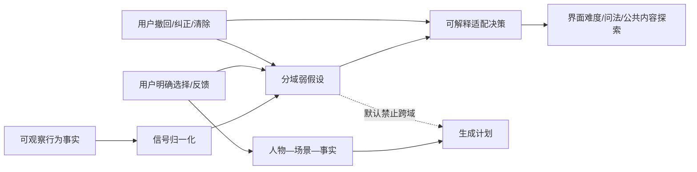

# 用户行为证据、弱假设与适配决策 · 后端基础规格

> 状态：产品已确认 v1.0 · 2026-09-02
> 上位登记：`DECISIONS.md G-30`。
> 适用范围：匿名账号与绑定账号在建档、私域问卷、生成反馈、Plaza 浏览中的行为事实采集，以及界面适配和公共推荐的受控使用。
> 本文只确定后端基础结构、边界与验收；不在本轮确定推荐模型、置信度数值和前端视觉稿。

## 0. 开工结论

回声的“里”由两套并行结构组成：

1. **内容理解**：`人物/主体—场景—事实`，用于组合可控的回忆卡、四格漫画、视频等内容；
2. **行为适配**：`行为事实—弱信号—可撤销假设—适配决策`，用于逐步理解用户更容易怎样操作、愿意看什么、愿意明确接受什么。

两套结构只通过有来源的决策关联，不把行为日志直接写进人物事实，也不把公共浏览偏好自动写进私域生成。



后端可以立即搭建事件接收、显式反馈、假设账本和决策流水；线上推荐在完成影子验证前仍不读取隐式信号。

## 1. 开发任务合同

| 项 | 本轮定档 |
|---|---|
| 目标 | 建立可追溯、可撤回、按用途隔离的用户理解底座，让后续界面与内容更贴近用户 |
| 事实源 | 本文、`DECISIONS G-30`、`PRODUCT-DISCUSSION-BASELINE §2.5`；冲突时以上位裁定为准 |
| 不变量 | 观察事实与推断分存；未知不等于否定；显式选择高于隐式信号；假设必须有范围、证据、期限和版本 |
| 明确不做 | 不推断年龄、智力、心理状态、悲伤阶段、依赖程度、生死状态；不以停留时长或刷屏深度最大化为目标 |
| 跨域边界 | `public_recommendation`、`private_generation`、`ui_adaptation` 三域默认不互通 |
| 失败策略 | 埋点失败不阻塞主操作；假设或决策服务失败回到通用体验；用途、授权或范围不明时拒绝使用，不静默放宽 |
| 完成标准 | 四类对象可存取、去重、审计、撤回；跨域用例被拒绝；影子模式不影响线上排序；QA 场景全部通过 |

## 2. 三层事实与一种决策

### 2.1 `BehaviorEvent`：只记录发生了什么

建议字段：

```text
eventId, accountId, anonymousState, sessionId, eventName, surface,
targetType, targetId, activeDurationMs, foregroundDurationMs, loadWaitMs,
attemptCount, backtrackCount, contextJson, occurredAt, receivedAt,
schemaVersion, purposeCode, idempotencyKey
```

- `eventName` 使用受控字典，不允许客户端任意造名称。
- `accountId` 从首次匿名注册起稳定存在；手机号绑定升级原账号，不复制事件历史。
- 计时使用**有效操作时长**：应用在前台且用户正在当前步骤操作。后台时间、网络等待、验证码等待、上传转码等待单列，不混入。
- 原始事件不得写“用户不喜欢”“用户年纪大”等结论；那不是事实。
- 素材内容、验证码、手机号、问卷自由文本不得塞进 `contextJson`。

P0 首批事件域：

| 场景 | 事件事实 | 允许回答的问题 |
|---|---|---|
| 私域问卷 | 题目展示、选择、改选、返回、跳过、完成 | 哪种问法更易完成；不得回答用户心理属性 |
| 素材建档 | 上传、识别确认、裁切重试、补充素材邀请响应 | 哪一步有操作阻力；不得据此判断能力或年龄 |
| 生成反馈 | 结果观看、选择“像不像/想不想继续/换个方式” | 当前结果是否被明确接受 |
| Plaza | 曝光、打开、有效观看、完播、复播、明确互动、减少此类 | 内容探索与公共题材弱偏好 |

### 2.2 `ExplicitFeedback`：记录用户明确表达

```text
feedbackId, accountId, scope, targetType, targetId, questionCode,
answerCode, answerVersion, sourceSurface, occurredAt, supersedesId
```

首批反馈维度必须拆开，不能用一个“喜不喜欢”替代全部判断：

- `likeness`：像不像它；
- `ease`：是否好选、是否看得懂；
- `continue_intent`：想不想沿这个方向继续；
- `change_request`：要不要换一种方式；
- `less_like_this`：公共内容明确减少此类。

用户改选时保留历史，用 `supersedesId` 指向被替代答案；当前视图只取最新有效答案。

### 2.3 `UserHypothesis`：有证据的、可失效的弱判断

```text
hypothesisId, accountId, scope, dimension, valueCode, confidenceBand,
evidenceEventIds, evidenceFeedbackIds, evidenceCount, algorithmVersion,
validFrom, validUntil, status, rejectedAt, clearedAt, updatedAt
```

`scope` 只允许：

- `ui_adaptation`：题目密度、提示颗粒度、是否分步、默认媒体表达方式；
- `public_recommendation`：Plaza 题材探索与减少重复；
- `private_generation`：仅用户在私域明确选择或明确接纳的内容锚点。

推断规则：

1. 单次点击、一次停留或一次改选不能形成稳定偏好；
2. 假设必须记录证据集合、算法版本、置信区间档位和有效期；
3. 显式纠正立即覆盖冲突的隐式假设；“没有操作”不得解释成“不喜欢”；
4. 假设只在原场景和原用途内生效，不创建“全局采信倾向”等人格标签；
5. 到期、证据不足、用户否定或清除后置为 `expired/rejected/cleared`，下游不得继续读取；
6. 禁止的敏感推断不建立字段、不建立枚举、不以别名实现。

### 2.4 `AdaptationDecision`：系统具体改了什么

```text
decisionId, accountId, scope, actionCode, parametersJson,
hypothesisIds, policyVersion, reasonCode, reversible, appliedAt,
expiresAt, revertedAt
```

每次适配必须能回答“基于哪些证据、按哪版规则、改变了什么、怎样恢复”。P0 允许的动作只有：

- 问卷单屏题量与辅助说明强弱；
- 是否优先点选、是否拆成更短步骤；
- 公共瀑布流题材的探索比例与重复抑制；
- 用户明确要求后更换漫画/静帧/视频等表现方式。

不得用适配决策制造连续使用压力、情绪刺激或依赖召回。

## 3. 域隔离与信号使用矩阵

| 信号 | UI 适配 | 公共推荐 | 私域生成 |
|---|---:|---:|---:|
| 问卷完成耗时/返回/重试 | 可形成短期操作假设 | 禁止 | 禁止作为人物事实 |
| 用户明确点选的宠物事实 | 可调整后续问法 | 禁止 | 可用，保留题目与答案来源 |
| “像不像/继续/换方式” | 可用 | 禁止 | 可用，且高于模型推断 |
| Plaza 单次点击 | 禁止单独决策 | 仅影子弱信号 | 禁止 |
| 有效观看+完播/复播组合 | 禁止推断人格 | 仅影子弱信号 | 禁止 |
| 点赞/关注/减少此类 | 可用于操作结果提示 | 可用显式信号 | 禁止自动进入 |
| 陌生人对作品的互动 | 禁止 | 用于公开归因与治理 | 禁止，沿用 `WP4` |

跨域复制证据或假设必须另有产品裁定、用户明确动作和安全审查；“技术上拿得到”不构成用途授权。

## 4. 与既有推荐禁令 `RK-I/X8` 的关系

旧规格把停留、刷屏深度、完播、复播完全挡在 P0 排序之外。`G-30` 对其作**范围化更新**，不把旧红线整体撤掉：

1. 允许为诊断和影子评估采集行为事实，允许生成 `public_recommendation` 域内的弱假设；
2. 当前生产 P0 排序继续不读点击、停留、完播、复播、刷屏深度，直至通过提升门槛；
3. 刷屏深度只用于批次/会话治理，不得成为兴趣或亲密度；停留、完播和复播不得作为直接分值；
4. 任何阶段都禁止优化总停留时长、总刷屏量、情绪浓度和用户脆弱性；
5. 显式“减少此类”可以立即作为负向公共偏好；短停留、未打开、退出均不得等价为负反馈。

隐式信号进入线上公共推荐前必须同时满足：样本量与稳定性门槛已预注册、离线/影子结果可复现、没有题材单一化与脆弱内容放大、用户可关闭个性化并清除偏好、PM/后端/QA/合规共同签字。具体数值待影子数据后单独定档。

## 5. 接口目标

### 5.1 批量事件

`POST /behavior-events/batch`

- 客户端每批携带稳定 `idempotencyKey`；服务端逐条返回 `accepted/duplicate/rejected`。
- 无效事件、未知 `eventName`、非法上下文不整批拖垮；返回逐条原因。
- 接收失败不得阻断上传、问卷、观看、评论等用户主操作。

### 5.2 明确反馈

`POST /me/explicit-feedback`

- 服务端校验账号、目标可见性、题目版本和答案字典；
- 对同一问题改选写新记录并关联旧记录，不覆盖历史；
- 需要手机号绑定的业务动作仍按账号权限规则处理，记录反馈本身不偷渡权限升级。

### 5.3 用户控制

- `GET /me/adaptation-profile`：返回面向用户可理解的当前题材偏好和界面适配，不暴露内部画像分数；
- `DELETE /me/adaptation-profile?scope=...`：清除指定域假设并撤销可逆适配；
- `PUT /me/recommendation-mode`：`personalized|non_personalized`；关闭后生产推荐不得读取个性化假设。

内部推断与决策接口不得直接暴露给客户端写入；客户端不能自报置信度或适配策略。

## 6. 存储、权限与生命周期

- 原始事件、明确反馈、假设和决策分表；不得用一个 JSON 画像覆盖来源链。
- 事件以 `(accountId, idempotencyKey)` 去重；匿名账号绑定手机后只变认证状态，不迁出或复制行为主体。
- 读取按“账号 + scope + purposeCode”三重校验；推荐服务拿不到私域问卷与素材内容。
- 假设必须有 `validUntil`；决策到期或假设失效后自动撤销。
- 用户删除账号、撤回相关用途或清除适配档案时，停止下游使用并形成可审计清理任务。
- 原始事件精确保存期、聚合保存期和匿名长期不活跃清理天数，需在数据生命周期专项按必要性定数；在定数前不得无限期默认保存。

## 7. 降级与异常

| 异常 | 必须行为 |
|---|---|
| 事件接收失败 | 本地有限重试；主操作成功照常返回；不得伪造成功事件 |
| 重复上报 | 返回 `duplicate`，不重复计数 |
| 计时数据异常 | 标记无效或拆分等待时间，不进入假设 |
| 假设服务不可用 | 使用通用界面和非个性化公共推荐 |
| scope/purpose 不匹配 | 拒绝读取并审计，不静默跨域 |
| 用户关闭个性化 | 清除线上缓存，后续排序不读个性化假设 |
| 用户纠正事实 | 明确答案立即生效，冲突假设失效；历史保留供审计但不得继续使用 |

## 8. 后端分阶段落地

### Phase 0：基础账本与影子采集

1. 建事件字典、四类存储对象、幂等接收和权限中间层；
2. 统一有效操作时长 SDK 契约；
3. 只生成影子假设和影子决策，不改变用户看到的排序；
4. 建数据质量、重复率、缺失率、跨域拒绝和敏感推断零命中看板。

### Phase 1：可逆 UI 适配

仅使用明确反馈和验证后的操作阻力信号，开放少量白名单动作；支持用户查看、清除和恢复默认。

### Phase 2：公共推荐受控接入

保留既有公平曝光、题材打散、无榜单和反马太约束；隐式弱信号逐项过提升门槛，不能以一个总“用户分”整体接入。私域生成仍不接公共浏览假设。

## 9. 后端验收场景

1. 匿名用户完成问卷后绑定手机，事件和反馈仍归同一 `accountId`，没有复制记录；
2. 页面停留含 20 秒网络等待时，假设只读取有效操作时长；
3. 用户一次打开宠物题材作品，不产生稳定宠物偏好；多次组合证据也只产生有期限的公共域弱假设；
4. 公共题材假设无法被私域生成服务读取；越权调用明确失败并留审计；
5. 用户点“减少此类”后，冲突的隐式正向假设立即失效；
6. 用户改选问卷答案，生成读取新答案，旧答案仅可审计；
7. 影子模式开启时，相同输入下线上排序与未接入行为层时一致；
8. 假设服务宕机时，建档、生成反馈和 Plaza 都可继续使用通用体验；
9. 清除 `ui_adaptation` 不误删 `public_recommendation`，两个域分别恢复；
10. 任何接口均无法写入年龄、心理状态、悲伤阶段、依赖程度或生死状态假设。

## 10. 尚待数值化，不阻塞基础搭建

- 原始事件、聚合和审计记录的具体保存期限；
- 每个弱假设的最小证据数、衰减周期和置信度分档；
- 隐式信号从影子模式提升到线上排序的样本量与效果门槛；
- 首批 `eventName/actionCode/dimension` 完整字典。

这些数值必须在事件质量可测后由产品、技术、QA 与合规共同定档；数据表和接口不得把任一临时数值写死成不可迁移结构。
