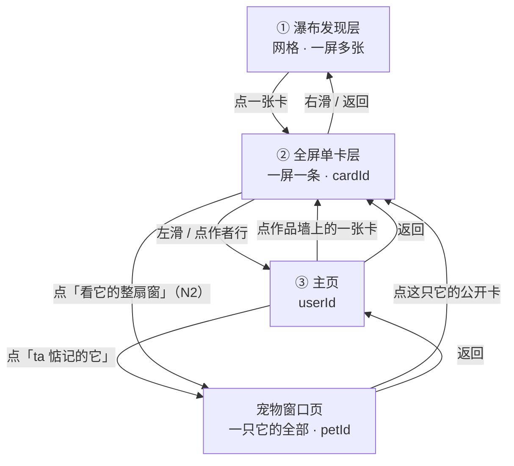
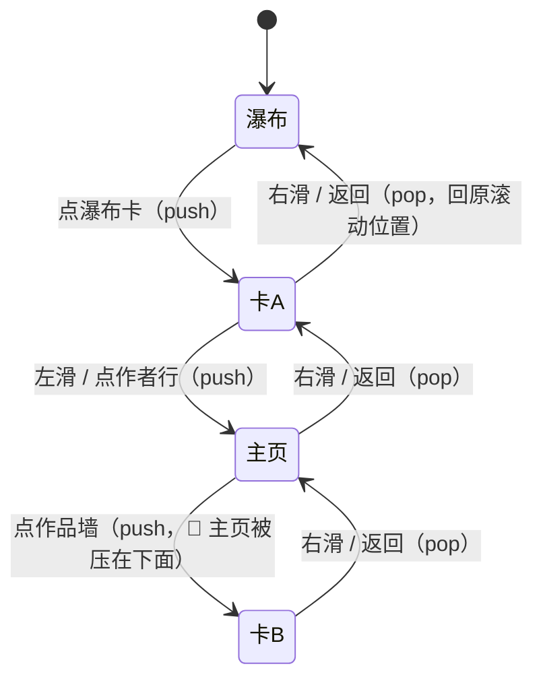
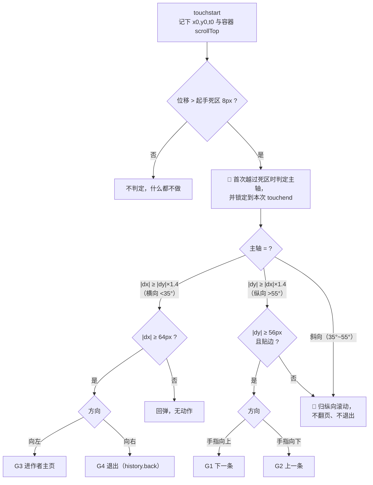

# SPEC · 交互流程规格（返回栈三层 + 第四个可达面 · 手势 · 返回栈 · 边界态）

| 项 | 内容 |
|---|---|
| 角色 | **交互流程规格 · 前端照此实现，不自由发挥**；**v0.2 · 2026-08-26** |
| v0.2 变更 | 🔄 🔴 **一处结论被证伪并更正**：拉黑是**文档缺口不是能力缺口**，按服务端已实现的语义重写（§6.7），并立**判定纪律 §0.4**（说「某能力不存在」必须回代码查证）。<br>🆕 **四条新裁定**：`N1` 不存在「两套主页」（一个人页 + 一个宠物页，🔴 左滑永远落人的主页，§9.5）· `N2` 「看它的整扇窗」入口**给**，目标页已存在（§1.4/§5.7）· `N3` 陌生人进宠物窗口页**同页裁剪**，🔴 **逐块标档 + fail-closed**（新增 §10）· `N4` 浏览器历史与续拉失败两个 bug **确认必修**（§13.1/§13.4）。<br>✅ **关闭 `Q-1` / `Q-4` / `Q-6` / `Q-10`**；🔄 **`Q-3` 改为「已确认要做」**，依赖 `SPEC-feed-surfaces.md`；🆕 新增 `Q-12`~`Q-14`。<br>📎 §11 矛盾登记 15 → 18 条。 |
| 缘起 | 用户反馈「**点瀑布卡直接进了别人的主页**」。🔴 **根因不是交互设计漏了一层，是下发的对象错了一级** —— 立本规格时 `GET /plaza` 下发的是宠物窗口（`petId`）而不是回忆卡，详情页展开的就是那个人**整只宠物的页**，看起来当然像主页。<br>🔄 🔴 **状态订正（2026-08-27，回代码核实）**：~~原文写「`GET /plaza` **现在**下发的是宠物窗口」~~ —— **服务端那一侧已经改了**（`EchoApi.PLAZA_FEED_KIND = KIND_CARD`，广场已下发回忆卡）。⚠️ 🔴 **但前端尚未跟上**：`echo-h5-proto/src/lib/ids.ts` 的 `petIdOfCard()` 仍是恒等转换，其注释仍写「今天是恒等转换——因为广场发的就是 petId」。**所以缘起描述的那个现象今天可能仍在，成因却已经不同了**（移交清单见 `API-CONTRACT §6.0.4`）。 |
| 范围 | **返回栈三层** / 手势表 / 返回栈 / 流的来源 / 边界态 / 主页信息块与排序。 |
| ⚠️ 🔴 **「层」这个词必须带限定词**（`DECISIONS XC4`，2026-08-26 补） | 🔴 **本规格里的「三层」恒指<u>返回栈要弹几种页</u>**：瀑布发现层 + 全屏单卡层 + 主页（**主页参与弹栈所以算在内**）。<br>🔴 **同时本规格自身定义了第四个可达面** —— **宠物窗口页**（`N2` 已拍板 · §10），🔴 **所以「一共有几个能到的面」的答案是<u>四</u>，而「返回栈有几层」的答案是<u>三</u>，两个数都对**。<br>⚠️ 🔴 **另有第三个量纲**：`SPEC-feed-surfaces` 的**「两层」= 信息流的两个面**（网格 + 全屏，🔴 **不含主页与窗口页**）。<br>🔴 **不要把三个数字统一成一个** —— **统一会毁掉其中两个口径的准确性**；⚠️ **裸写「三层」的地方读者无法判断作者算不算主页与窗口页，所以引用时一律带限定词。** |
| **不含** | 视觉细节、动效曲线与时长、文案定稿、接口字段与 DDL 定义。⚠️ 本规格**不改任何接口或字段**（同 `OM1` 纪律）。 |
| 关联 | `DECISIONS OM1`（窗与卡的层级模型）· `D21`（广场连续浏览）· `D20`（游客首屏与空态）· `D4`（不显精确数）· `PRD-RESONANCE-PUBLISHING E1`（粉丝数三约束）· `ACCEPTANCE TC-13` · `API-CONTRACT §6 / §16 / S-1` · `SPEC-feature-pages §2.1 §2.3 §2.4` |
| 现有素材 | **前端** `echo-h5-proto/src/App.tsx` · `components/PlazaScreen.tsx` · `DetailScreen.tsx` · `UserProfileScreen.tsx` · `MineScreen.tsx` · `ReelViewer.tsx` · `api/feedLogic.ts` · `lib/ids.ts`<br>**服务端**（v0.2 查证） `echo-server/.../governance/BlockService.java` · `BlockStore.java` · `FollowStore.java` · `EchoHttpBootstrap.java` · `EchoApi.java` |
| 🔗 相邻规格 | 🔴 **`SPEC-feed-surfaces.md`（另一条线在写，本规格不碰）** —— 「每层各带自己的流」的定义以它为准，`Q-3` 的改造依赖它。前端拿两份规格**一起改、只改一次** |
| 🔴 红线 | 本规格与现有代码/契约冲突之处**一律如实登记在 §11，两边都写**。**不据本规格改代码、不改契约、也不假装一致。** |

---

## 概述（🔴 读完这一节即拿到本规格全部结论，不需要往下读）

> 🔴 **怎么用**：本节每条一句话、能独立成立，括号里的编号是回正文的坐标。**只有当你要动某条规则、或要核实它与现有代码的差，才往下读对应的节。**
> 🔴 **本规格管「怎么操作」**：**返回栈三层**（+ 第四个可达面「宠物窗口页」）、手势、返回栈、流的来源、边界态、主页信息块。**不含**视觉细节、动效曲线、文案定稿、接口字段与 DDL。
> ⚠️ 🔴 **本规格所有「三层」一律读作「返回栈三层」**（`XC4`）—— **可达面共四个**，见上表「层这个词必须带限定词」那一行。
> 🔴 **本规格不改任何代码、不改任何接口或字段。** 与现有实现冲突之处一律并列登记、两边都写，**不据本规格改代码，也不假装一致**。
> ⚠️ 🔴 **有两项待裁定在卡点信箱里、影响实现范围**（四块窗口级内容归哪一页 · 明信片墙对陌生人的既有可见面要不要收回）。本规格对它们按 fail-closed 给了默认值，🔴 **默认值是安全姿态、不是产品意图，裁定前不要按它实现。**

### 一、根因：不是交互漏了一层，是下发的对象错了一级

- **现象**：在瀑布上点一张卡，落地的页面看起来像「那个人的主页」。
- 🔴 **根因**：广场端点下发的是**宠物窗口的键**而不是回忆卡的键，详情页拿着它展开的是**一整扇窗**（生命之书全时间线 + 明信片墙 + 面孔墙 + 回声）。**用户看到的不是「一条内容」，是「这个人和它的全部」——那确实更像主页，不是错觉。**
- 🔴 **本规格修不了这一条**（改端点下发物是破坏性契约变更，归另一条线）。**本规格所有条款按「全屏单卡层展开的是一张卡」写**。
- 🔄 🔴 **状态订正（2026-08-27，回代码核实）**：~~原文写「在端点改发卡之前实现会落到『一扇窗』上」~~ —— 🔴 **端点已经改了**（`EchoApi.PLAZA_FEED_KIND = KIND_CARD`），那个「之前」已经过去。⚠️ 🔴 **但前端还没跟上**：`lib/ids.ts` 的 `petIdOfCard()` 仍是恒等转换，**实现事实上仍落在「一扇窗」上，层级职责仍然错位** —— 这不是规格写错，是迁移期的既有状态。🔴 **不要据本条推断「后端还没改」**；后端已改，缺的是前端那一处换算（`API-CONTRACT §6.0.4`）。
- 🔴 **给前端的一句话**：迁移当天唯一需要改的是那个 id 换算函数。**不要在别处强转类型** —— 绕过去的那一处，就是迁移当天唯一一个**不报错、只静默 404** 的地方。

### 二、🔴 判定纪律（本条为一次真实误判而立，给所有后续规格用）

- **要判定「产品里没有某能力」，必须回代码里查证**（服务端 + 前端 + 装配处 + 测试），查过再下结论。
- **只读文档得出的结论只能写成「文档里没有」，🔴 不得写成「产品里没有」——这两句话不是一回事。**
- **两者不一致时记为「文档缺口」，能力照实存在**；🔴 **不要反过来按文档去裁剪实现。**
- 🔴 **代价不是「写错一句话」**：一旦认定某能力不存在，就会围绕一个不存在的缺失去写规则（写出「等这个能力有了再定」这类占位），而真实实现里的语义反而没人照着写。**漏写一条约束只是不完整，按错误前提写一整节是要推倒重来的。**

### 三、四个面与它们的层名（层名固定，只用这四个词）

| 层 | 一屏 | 用户在这层想干什么 | 主键 | 🔴 不承担什么 |
|---|---|---|---|---|
| **瀑布发现层** | 一屏多张 | 扫一眼，找感兴趣的 | — | 不承担「读完一条」；不出现精确数字与任何排名 |
| **全屏单卡层** | **一屏一条** | 静下来看一条 | 卡 id | 🔴 **不承担「这个人的全部」** |
| **主页** | 分块页 | 看看**这个人**是谁、ta 惦记着谁 | 用户 id | 不承担连续浏览广场流 |
| **宠物窗口页** | 分块页 | 看**一只它**的完整页 | 宠物 id | 🔴 **不挂上下翻**（它是容器不是流）|

- 🔴 **「主页」只有一个意思：人的主页。**「一个人的页」与「一只它的页」是两个不同的面，🔴 **不要把宠物窗口页也叫主页**（现有代码的顶栏标题正是这么写的）。
- 🔴 **不要再用的别称**：广场 / 发现页（→ 瀑布发现层）· 详情页 / 沉浸流（→ 全屏单卡层）· 个人页 / 作者页（→ 主页）· 窗口详情 / 纪念空间（→ 宠物窗口页）。
- **宠物窗口页必须存在**：窗是容器、卡是窗里发出来的一条，**容器需要一个能被看见的地方**。🔴 **这个页面今天已经存在**（就是「我的」那一页的亲友视角），**缺的只是入口 + 返回栈多管一层 + 陌生人视角的可见性裁剪 —— 是加一条到达路径，不是新做页面。**
- **全屏单卡层给「看它的整扇窗」直达入口**（卡是碎片，看到动人处想看全部是自然诉求）；🔴 **但它是一个需要点的明确入口、不是默认落点** —— 做成默认落点等于把上面那个根因换个位置重犯。
- **两个 id 是不相容的品牌类型**，换算只走那一个函数；**窗口对象的作者 id 可能缺省**，缺省时作者行退化为**不可点的纯文本**，🔴 **不许按昵称反查用户（昵称不唯一，会点错人）**。

### 四、手势

- 🔴 **方向口径（这一条一定有人实现反）**：**「向下浏览」= 手指向上抹 = 下一条**，与抖音快手小红书完全一致。心里默念：**内容像一条向下延伸的纸带，手指把纸带往上推，露出下面那一条。**🔴 **QA 验收就是：自屏幕中部向上滑一次必须出现下一条，反了即退回。**
- **全屏单卡层**：手指上抹 = 下一条 · 手指下抹 = 上一条 · **左滑 = 进这张卡作者的主页** · **右滑 = 退出回上一层** · 未达翻页阈值的纵向滚动 = 在卡内滚正文。
- **瀑布发现层**：点卡进全屏 · 滚到接近底部续拉 · **右滑不定义**（瀑布是栈底，没有上一层可回，交给系统）。
- **主页**：点作品墙的卡进全屏（主页被压在下面不被顶掉）· 右滑严格弹一层 · **主页不挂上下翻**（它不是一条流）。
- 🔴 **为什么取「左滑进主页、右滑退出」而不是反过来**：① **右滑退出与系统返回手势同向、不打架**，用户只需要一套肌肉记忆 ② 反过来做需要在 H5 里拦截浏览器的边缘右滑，**既不可靠（版本行为不一致）又代价高**，而收益只是把两个手势对调。
- 🔴 **每个手势都必须有等价的可点入口，这不是可选项** —— 桌面浏览器没有触摸，无障碍用户也要能走完全程（下一条 / 上一条 / 进主页 / 退出四个按钮现均已有）。

### 五、全屏单卡层的流从哪来

- 🔴 **一条铁律：顺序沿用「进入时看到的那份列表」。** 用户在瀑布上看到的是什么顺序，翻下去就是什么顺序；从主页进的，顺的是那个人的作品墙。
  ⚠️ 🔴 **这条铁律与 `SPEC-feed-surfaces.md` 的「全屏层接自己的流、两层不同配比」正面冲突；归属已定为那份规格，本文件这两处待回改。** 详情见「十、已登记的冲突」。
- **挂上下翻的入口**：瀑布点卡（续拉广场流，题材过滤一并带上）· 主页作品墙点卡（🔴 **游标必须为空、不续拉**）· 宠物窗口页点卡（🔴 **同样不续拉**，且流**只含通过可见性裁剪的卡**）。
- **不挂上下翻的入口**：搜索结果点卡 · 消息跳转 · 「我的它」点窗 —— 它们是**从别处带着一个具体目标进来的**。🔴 **理由必须写清，否则一定有人「顺手也挂上」**：给它挂上广场流，等于用户点开一条搜索结果、往上一抹就进了推荐流 —— **ta 没有要求逛，我们替 ta 决定了逛**，且返回栈的语义变得不可解释。
- 🔴 **绝不能带主页游标去续拉广场流**：主页游标是另一个端点的游标，拿去喂广场端点会**串成广场流** —— 用户从「ta 的窗」翻着翻着就翻到陌生人身上，而返回栈还以为自己在主页里。
- **判定口径就是「列表里多于一条，或游标还能续拉」才挂。**

### 六、返回栈：严格弹一层，永不跳层

- **浏览层是一个栈**，栈底恒为瀑布发现层；🔴 **一次退出只弹一层，永不跳层、永不清栈。**
- **一层至少带四个字段**：层类型 · 键 · **该层自己的流上下文** · **该层自己的滚动位置**。🔴 **流是「这一层」的属性、不是全局属性** —— 卡A 顺的是广场流、卡B 顺的是某人的作品墙，**全局只存一份流，弹回卡A 时它的流已经被卡B 覆盖了**。
- **压栈动作是一个闭集**（瀑布点卡 · 卡左滑进主页 · 主页点作品墙的卡 · 主页点「ta 惦记的它」· 卡点「看它的整扇窗」· 窗口页点公开卡 · 搜索与消息点条目）；**不在集合里的都不压栈**。
- 🔴 **上下翻到另一条不压栈**（同层内换内容，不是进新层）。**翻了 20 条再退出，一次就回瀑布，不是退 20 次。** 把上下翻做成压栈，是浏览器历史被污染的经典表现，也是 H5 沉浸流最常见的实现错误。
- **宠物窗口页就是普通一层**：从卡进来的退回**卡**、从主页进来的退回**主页**，🔴 **不许统一退回主页（那是跳层）**；同一只它可以在栈里出现多次，不做去重。
- 🔴 **可见性裁剪必须在「进流之前」做，不是在渲染时做** —— 拿全量卡序列去挂流，访客上下翻着翻着会**翻进一张本来不该看见的卡**。
- 🔴 **窗口页不要因为入口不同就做成两个组件** —— 那必然分叉，**而分叉方向是把不该露的露出去**。
- **每层保留自己的滚动位置，弹回时停在原处**（瀑布层已有先例：搜索页是浮层叠在广场之上、广场保持挂载）。
- **栈深度上限（建议 12 层）与达到上限时怎么办🟡 未定**，见「九、仍待定的」——🔴 **任何上限处理都会在某个边界上破坏「弹一层」的承诺，所以不擅自定。**

### 七、边界态（逐个写，不许含糊）

- 🔴 **边界不出话：到了边界，最好的反馈是「没有反馈」。**「已经是第一条了」「没有更多内容了」这类话把一次自然的手势变成一次被驳回的请求。
- **第一条继续往回翻 → 🔴 什么都不发生**（不回弹到瀑布、不出提示、不做橡皮筋抖动）。
- **末条且流已到底 → 温柔收尾块**（一句「先看到这里吧」+ 一个「回到广场」入口）；🔴 **不循环回第一条、不无限灌新内容、不空白、不「没有更多了」式冷话**。
- 🔴 **「真到底」与「续拉失败」必须分开判**：本地到末条且游标为空 = 温柔收尾；本地到末条但游标非空且上次续拉抛错 = **「网络有点慢，点一下再试试」+ 可重试**。🔴 **不分开会怎样：用户以为自己看完了，其实是网络断了 —— 我们用一句温柔的话盖住了一次故障。**
- ⚠️ **「无限下翻不加间隔」这句上位裁定说的是「不要人为设间隔、不要卡住」，🔴 不是「流永不结束」。** 本规格按「不加间隔 + 到底温柔收尾」执行。
- **加载中**：本地已有下一条就**立即切换、不等网络**；正在续拉时停在当前条 + 轻量提示，🔴 **手势不排队不累积（连抹三次不等于翻三条）**；进入某层时🔴 **返回入口必须已经可用，不能等加载完才给退路**；在途时退出立即弹层并🔴 **丢弃过期响应，不许回填到已经不在栈顶的层上**。
- **加载失败一律温柔兜底 + 可重试**，🔴 **不弹技术错误脸、不显示状态码**，且返回入口必须在 —— **不能把用户困在一个打不开的层里**。
- 🔴 **「卡已转私密」「被拉黑」「已下架/已软删」三种原因，一套呈现，前端不得分支。** 详情端点统一返回 404（不是 410），**对外不暴露「这里曾经有过东西」**；不得出现「作者已设为私密」「你已被对方拉黑」中的任何一句 —— **任何能让用户反推出「我被拉黑了」的差异（不同文案、不同图标、甚至不同的加载时长表现）都是违背的**。
- **在流中翻到一条已失效的卡时**（这是必然发生的，不是罕见路径）：🔴 **那一条照常成为当前层**、显示统一兜底态、上下翻仍可用；🔴 **不自动跳过** —— 自动跳过会让一次手势跨过**不确定数量**的内容、用户无法判断自己在哪，**比看到一个诚实的空位更糟**。
- **游客拦写不拦看**：**返回栈三层**浏览全部照常开放、一处都不拦（⚠️ 🔴 **第四个面「宠物窗口页」对陌生人不是不开放、而是<u>同页裁剪</u>**，归 `N3` · §10，不由本行管）；记得 / 留一束心意 / 关注 / 留一句话需先完成可验证绑定。🔴 **绑定引导只在用户点了那个写操作时出现、不在进入某一层时预先弹**，且🔴 **它是浮层、不进浏览栈、不影响弹栈计数**。
- **本入口未挂流时**：🔴 **不出现任何上下翻的痕迹** —— 不显示灰掉的按钮、不显示「没有下一条」。

### 八、拉黑（🔴 按服务端已实现的语义写）

- **存储单向，可见性判定按「任一方向」**：我拉黑你、或你拉黑我，**双方互不可见**；幂等，重复拉黑不产生第二行。
- 🔴 **拉黑自动解除双向关注，且不可逆**（解除拉黑后关注关系不恢复）；🔴 **绝不通知被拉黑方，解除拉黑同样不通知**。
- 🔴 **只管以后**：拉黑前已产生的献花与记得**保留在到达里，不回溯清理**。
- 🔴 **静默失效 —— 被拉黑方看到的必须与「成功」完全一致**：服务端对记得回显**请求的那个值**（不回真实状态）、对献花与留言返回成功形状但不落库。**前端必须以回执为准呈现，🔴 不得回读服务端状态去覆盖 UI。**
- 🔴 **一处已验证的泄露路径**：前端写成功后回读了一个**没有拉黑判定**的端点并用真实状态覆盖 UI，按钮会翻回未选中 —— **服务端刻意回显请求值来藏住拉黑，被前端一次回读暴露**。修法已在实现清单里。

### 九、手势与滚动的冲突判定

- **三条不变式**：① 🔴 **一次手势只做一件事**（主轴在越过死区那一刻锁定，直到手指离开都不再改；**不许「先横滑一点又转纵向，结果既翻页又退出」**）② 🔴 **页内的横滑组件优先**（事件优先给最内层的消费者）③ 🔴 **不做任何自动翻页**（没有定时器、没有自动播放、没有「停留 N 秒自动下一条」）。
- **阈值**：起手死区 8px · 轴锁比例 1.4 · 纵向翻页最小位移 56px · **横向最小位移 64px（🔴 刻意大于纵向 —— 横滑的后果更重，误触代价高于误翻一条）** · 速度兜底（≥0.6 px/ms 时位移阈值折半，否则「抹得快」反而不生效）· 贴边容差 24px · 左边缘让位区 24pt · 单次手势 >1000ms 且未达阈值不触发（**慢拖是「拖」不是「抹」**）。
- **保留「贴边才接管翻页」**：一张卡如果长到需要滚动，读到一半时上抹**大概率是想继续读**；为了少滚一下而把内容抢走，代价更大。⚠️ **但在现有实现下（详情页展开的是整扇窗、远长于一屏）这条规则的表现是「每翻一条都要先滚到底」——🔴 不是阈值调错，是那一层装错了内容。**

### 十、H5 与浏览器手势

- 🔴 **右滑退出 = 系统返回，是同一个动作的两种触发方式，不是两套机制。**
- 🔴 **单一出口原则（必守）**：**任何退出动作都只调 `history.back()`，一律不直接改栈状态；出栈只发生在 `popstate` 的处理里。** 否则浏览器历史与我们的栈会失配，表现为「点了返回，页面回去了，但再按系统返回又回来了」或「按一次系统返回，退了两层」——🔴 **这类 bug 在 H5 上极难复现极难定位，靠纪律避免、不靠事后调试。**
- **每压一层就 push 一条影子历史。**
- 🔴 **屏幕左边缘 24pt 以内起手的横滑让给系统，我们不接**（系统手势在这个区域一定会触发，同时识别就是同一个动作被处理两次 → 弹两层）；🔴 **不 `preventDefault` 边缘区域、不全局禁用 overscroll 或 touch-action**（一刀切会连带弄坏正常的页内滚动）。
- ⚠️ **但仍然要自己实现全屏右滑**：系统边缘手势只在最左边缘生效，而本规格要的是**全屏任意位置右滑**；🔴 **另一个硬理由是加到主屏幕的 standalone 形态下没有系统边缘返回，此时我们的右滑是唯一的退路。**
- **Android 的返回键与返回手势走同一条路径、不做特殊分支**；🔴 **栈空时不拦截** —— 不做「再按一次退出应用」那种拦截（H5 里做不可靠，而且它拦的是用户已经明确表达过两次的意图）。

### 十一、主页（人的主页）展示什么

- **主页要回答两件事：你是谁，以及你在惦记谁。** 第二件是 Echo 的主页与一般社交产品最不一样的地方 ——🔴 **也正是这次根因里被错当成落地页的那个东西的正确位置。**
- **五个信息块按序**：① 身份（头像 · 昵称 · 签名 · 官方标记）② 关系（「关注 ta」按钮，🔴 **自己的主页不出现** · 粉丝数 · 关注数）③ 🔴 **「ta 惦记的它」**（ta 公开的窗：封面 · 名字 · 性情签名 · **暖光的质性描述**；点一只进宠物窗口页；🔴 **不出羁绊温度**）④ 作品墙（ta 公开的卡，按可见性裁剪；点一张进全屏单卡层，带该墙顺序）⑤ 收尾。空态一律给温柔一句，🔴 **不留冷白**。
- 🔴 **为什么「ta 惦记的它」排在作品墙之前**：块 3 回答「这个人为什么在这里」，块 4 回答「ta 发过什么」——**前者是后者的上下文**；顺序反过来，访客要读完一墙的卡才拼出这个人是谁。
- **三条红线**：① **粉丝数公开且精确**（给真数字、不做「1k+」模糊化），🔴 **只在主页出现** —— 信息流卡片、搜索结果行、回声行一律不带 ② 🔴 **不做任何全站作者排行榜**（「个人页上有一个数字」与「把所有人拉出来排名次」是两件事，前者已放开、后者仍禁止）③ **免费的关系行为一律叫「关注」，「订阅」专属付费档位** —— 主页上出现「订阅 ta」即为写错方向。
- 🔴 **左滑永远落人的主页，没有分支、没有条件判断。** 作者是不是我的亲友**不影响落点** —— 亲友关系至多在页内体现为一个标识，不换页面。（代码里那个「另一套主页」其实是宠物窗口页，不是第二套主页。）
- **访客侧不显示羁绊温度**（温度属私密层，在**任何**对外视图都不出）。

### 十二、宠物窗口页的逐块可见性裁剪

- 🔴 **陌生人进宠物窗口页 = 同一个页面按可见性裁剪，不另做公开版页面。** 陌生人只看到**公开的卡与基本介绍**；**温度、回访近况、明信片墙属于私密层，不出**。
- 🔴 **兜底原则是 fail-closed**：一个区块只有被**显式**标为「公开」才允许对陌生人渲染；**新增区块默认不可见**，🔴 **漏标 = 不显示，而不是「漏标 = 显示」**；判不准的按不可见。
- 🔴 **为什么必须 fail-closed —— 出错代价完全不对称**：默认不可见时漏标 → 该露的没露 → 用户说「怎么看不到」→ **当天就能补上**；默认可见时漏标 → 不该露的露了 → **没人报错，直到有人发现自己的东西被陌生人看见了**。**这不是保守，是把不可逆的错误换成可逆的错误。**
- **三档视角**：公开（任何人，🔴 **含未登录游客**）· 仅亲友（含本人）· 仅本人。
- 🔴 **判定顺序有意义**：① 任一方向拉黑 → **整页不可达**（统一 404 兜底）→ ② 窗的可见性三档允许我看这扇窗吗 → 不允许则整页不可达 → ③ 我属于哪一档视角 → 逐块裁剪。⚠️ 🔴 **①②是「整页可不可达」、③才是「页内哪些块可见」，不要混成一个判断** —— 混起来一定会出现「窗不可见但某块还渲染了」这类漏。
- **陌生人视角剩下的是**：顶栏 + 封面/名字/性情签名 + **这只它的公开卡列表**（🔴 **这一块今天整个不存在，是需要新做的**）。⚠️ **如实说一句：这一屏会比亲友视角薄很多，这是裁定的直接结果、不是漏设计**；若公开卡也为空，陌生人看到的只有一张封面和一个名字，🔴 **需要一个温柔空态**。
- 🔴 **两条硬实现要求**：① **裁剪必须在服务端完成，不下发不该看的字段** —— 现在这一页靠**前端布尔**控制，而温度与全部明信片**已经完整下发到前端**了，前端只是「不渲染」；🔴 **对陌生人沿用这个模式 = 隐私事故：不渲染的东西仍在响应体里，抓一次包就看得见。**⚠️ 逐块表里的「✅ 已隐藏」说的是**没渲染，不等于没下发**。② **裁定只覆盖了陌生人一侧，亲友一侧沿用现状（温度与明信片墙对亲友仍可见）**；🔴 **若本意是连亲友也收掉，需要一句话 —— 本规格不作扩大解释。**
- 🔴 **fail-closed 当场抓出的一处既有小泄露**：「当前可见性：仅自己 / 挚友 / 公开」那一行**亲友也能看到**（缺少视角判断）—— 那是主人自己的配置状态，给访客看没有任何意义。**如果按「默认可见」写，这一处会一路带到陌生人视角。**
- **今天已在线上的一处可见面**：明信片墙对**任何广场访客**都渲染。🔴 **照裁定执行 = 收回一个已在线上的可见面，是行为变更不是漏实现，需确认是有意的。**

### 十三、🔴 已确认必修的四项（其余只登记）

| # | 事项 | 为什么必须修 |
|---|---|---|
| 1 | 🔴 **「严格弹一层」目前落不了地** | 从卡左滑进主页时，代码**先销毁了那张卡**再开主页，于是返回落到**瀑布**而不是那张卡。**这是本规格发现的最重一处矛盾。** |
| 2 | 🔴 **层不是栈，是固定优先级的浮层；流是全局单份** | 层与层的遮挡关系写死在代码顺序里、不由用户路径决定；**即使第 1 项修好，全局单份流也会让弹回卡A 时它的流已被卡B 覆盖**。🔴 **这是结构改动、不是加一行。** |
| 3 | 🔴 **浏览器历史完全未接** | 全项目没有历史 API 的使用，退出全靠直接改状态 → **系统返回与浏览器返回当前不参与浏览栈，按一次可能直接退出站点。** |
| 4 | 🔴 **续拉失败被当成「看到底了」** | 两个后果：① 用户抹了没反应、没有任何解释 ② **埋点把「续拉失败」记成「看到底了」，口径被污染、事后无法从数据里分辨**。🔴 **两件事分别修。** |

- **一处与工作量估计直接相关的如实登记**：🔴 **纵向翻页的手势与按钮都已存在，方向也已经是对的 —— 基本不用重做**；**两个横向手势（左滑 / 右滑）才是从零新增**。
- 🔴 **给 QA 的三条一票否决**：① 自屏幕中部向**上**抹一次必须出现**下一条** ② 走完「瀑布 → 卡A → 主页 → 卡B」后**连退三次**必须依次落在「主页 → 卡A → 瀑布」，中间任何一次跳层即退回 ③ 三种失效原因下界面呈现**必须完全一致、不可区分**。

### 十四、🔴 仍待定的（10 项，每条附「定它需要什么」）

| 待定项 | 现状 / 争点 | 定它需要什么 |
|---|---|---|
| **主页作品墙能否续拉** | 现状不续拉（翻到已加载的末尾即收尾）| 一句确认。**建议先不续拉**；要放开必须续拉主页自己的端点，🔴 **绝不复用那个写死了广场端点的函数**。属「体验够不够」而非「对不对」，不阻塞 |
| **栈改造的排期** | ✅ **已确认要做**，🔴 **但排在 `SPEC-feed-surfaces.md` 之后** | 依赖那份规格的**每层流归属定义**。🔴 **前端拿两份规格一起改、只改一次** |
| **「无限下翻」措辞是否就地对齐** | 上位裁定与验收用例都写「无限下翻」| 建议在原处加一句「到底给温柔收尾，不循环」，🔴 **原文不删** |
| **亲友近况查看器与全屏单卡层的关系** | 两者都是全屏但语义不同 | 建议**保持两套、各管各的**（一个是「露出更新」，一个是「看一条内容」），🔴 **合并会让两边都变形** |
| **栈深度上限及其处理方式** | 低端机内存 vs「弹一层」的承诺 | 制作人拍板。🔴 **不擅自定** —— 任何上限处理都会在某个边界上破坏承诺；也可以选择干脆不设上限 |
| **同一主页的自反压栈** | 从主页 X 点开 X 自己的卡、再左滑进主页，同一页会在栈里出现两次且可无限循环撑爆 | 建议采纳「左滑目标 == 下面一层 → 等价返回」，🔴 **只判相邻一层、不做全栈查找**（全栈查找会跳层，那正是被禁止的）。未确认前照常压栈 |
| **一个人有多只它时怎么排** | 排序即隐含「谁更重要」| 制作人拍板。建议按建档时间正序（最早惦记的在前）|
| **温度与明信片墙要不要连亲友一起收掉** | 这两块的档位是「仅亲友」还是「仅本人」| 一句话。裁定只覆盖了陌生人一侧，本规格不作扩大解释 |
| 🔴 **四块窗口级内容改造后归哪一页**（生命之书 · 暖光面孔墙 · 温柔的回声 · 献花）| 它们今天长在正要改成单卡层的那个组件上，**都是窗口级的、不属于某一张卡** | **已进卡点信箱**，三个候选方案与代价在那里。倾向「献花与回声跟卡、生命之书与暖光墙跟窗」，🔴 **但「记得」挪出单卡层会直接压低这条核心链路的转化，需要先看一眼这个代价**。🔴 **本规格给的 fail-closed 默认值大概率不是最终答案，裁定前不要按它实现** |
| 🔴 **明信片墙对陌生人的既有可见面要不要收回** | 它今天已经对任何广场访客可见 | **已进卡点信箱。** 倾向裁定全域生效，🔴 **但这是收回一个已在线上的可见面，属行为变更** |

### 十五、与其他文档的冲突（一行指针，不展开）

- 🔴 **本文件 §4.1 的铁律「绝不在全屏单卡层里另起一套推荐排序」与 `SPEC-feed-surfaces.md` 的「全屏层接自己的流、两层不同配比」正面冲突** —— **归属已定为那份规格**（本文件三处已写明「每层各带自己的流」的定义以它为准），🔴 **§4.1 与 §4.2「瀑布点卡」行待按它回改，本轮只登记**。
- **流的是卡还是窗 · 卡有没有详情端点 · 作品墙与搜索分区的措辞** —— 三条同属窗口/卡层级模型的不一致点清单，🔴 **本规格不改任何接口或字段**。
- **留言端点收卡 id、同前缀的献花与记得端点收窗 id** —— ⚠️ **已知不一致**，今天两者取值相同所以还没炸；不在本规格范围。
- **拉黑挡住了「人」、没挡住「内容」** —— 广场端点不做按访客的过滤、窗详情只过可见性与亲友判定、**均无拉黑判定**，🔴 **与「拉黑后完全断流」有差**；服务端补齐范围不在本规格。
- **拉黑是文档缺口不是能力缺口** —— 服务端早已实现并装配、有测试覆盖，但裁定层只有一句、契约里检索不到端点；🔴 **契约补登记不在本规格范围。**

---

## 0. 根因、以及这份规格能修什么

### 0.1 现象与根因

三句话：

1. **现象** —— 在瀑布上点一张卡，落地的页面看起来像「那个人的主页」。
2. 🔴 **根因** —— `GET /plaza` 下发的 `item.id` 是**宠物窗口的键**（`petId`），不是回忆卡的键；`DetailScreen` 拿着它调 `GET /windows/:id`，展开的是**一整扇窗**（生命之书全时间线 + 记忆明信片墙 + 暖光面孔墙 + 温柔的回声）。
3. **所以** —— 用户看到的不是「一条内容」，是「这个人和它的全部」。那确实更像主页，**不是错觉，是对象错了一级**。

```
现在（错的）                              应该（本规格）
────────────────────────                  ────────────────────────
瀑布（一屏多张）                          瀑布（一屏多张）
   │ 点一张，下发 petId                      │ 点一张，下发 cardId
   ▼                                        ▼
一整扇窗（= 那只它的全部）  ← 像主页        一张卡（= 这一条）
                                            │ 想看更多才继续走
                                            ├─→ 这扇窗（那只它的全部）
                                            └─→ 作者主页
```

### 0.2 能修什么、修不了什么

| | 内容 | 归属 |
|---|---|---|
| ✅ **本规格修** | **返回栈三层**结构（+ 第四个可达面）、每层的职责边界、手势口径、返回栈、流的来源、边界态、主页信息块 | 本文件 |
| 🔴 **本规格修不了** | ~~`GET /plaza` 下发窗口而非卡~~ 🔄 ✅ **服务端已于 2026-08-27 前改发回忆卡**（`EchoApi.PLAZA_FEED_KIND = KIND_CARD`）；⚠️ 🔴 **前端未跟上**（`lib/ids.ts` 的 `petIdOfCard()` 仍是恒等转换），仍是**破坏性契约变更**的收尾，本规格照旧不碰 | 另一条线（`OM1` 不一致点清单第 1、2 项）· 前端移交清单 `API-CONTRACT §6.0.4` |
| ⚠️ **本规格的前提** | 下面所有条款按「**全屏单卡层展开的是一张卡**」写。🔄 🔴 **2026-08-27 状态订正**：~~原文写「在 `/plaza` 改发卡之前，实现落到『一扇窗』上」~~ —— **服务端已经改发卡了**，所以那个「之前」已经过去；🔴 **但前端仍按恒等转换取值，实现事实上还落在「一扇窗」上**，§1 的层级职责在事实上仍然错位。**这不是本规格写错，是迁移期的既有状态**，见 §11 第 1 条 | 登记，不掩盖 |

> 🔴 **给前端的一句话**：迁移当天唯一需要改的是 `lib/ids.ts` 的 `petIdOfCard()`。**不要在别处 `as PetId`** —— 绕过去的那一处，就是迁移当天唯一一个不报错、只静默 404 的地方。

### 0.3 术语（层名固定，全文只用这四个词）

| 词 | 指什么 | 主键 | 别称（🔴 不要再用） |
|---|---|---|---|
| **瀑布发现层** | 共鸣厅本体，网格，一屏多张 | — | 广场、发现页、共鸣厅（同义，但层名统一叫「瀑布发现层」） |
| **全屏单卡层** | 一屏一条，看一条内容 | `cardId` | 「详情页」「沉浸流」（🔴 歧义：现有 `DetailScreen` 展开的是窗不是卡） |
| **主页** | 一个人想给访客看的东西 | `userId` | 「个人页」「作者页」 |
| **宠物窗口页** | 一只它的完整页 | `petId` | 「窗口详情」「窗口」「纪念空间」 |

> ⚠️ **v0.2 更名留痕**：v0.1 这一行叫「窗口详情」，容易被读成 `DetailScreen`（那个组件正要改成全屏单卡层）。改叫**宠物窗口页**，落点是 `MineScreen` 的亲友视角，见 §1.4。

### 0.4 🔴 判定纪律：说「某能力不存在」之前，必须回代码里查证

**本条是 v0.2 因一次真实误判而立的，写在这里给所有后续规格用。**

| | 规矩 |
|---|---|
| **要判定「产品里没有某能力」** | 🔴 **必须回代码里查证**（服务端 + 前端 + 装配处 + 测试），查过再下结论 |
| **只读文档得出的结论** | 只能写成「**文档里没有**」，🔴 **不得写成「产品里没有」** —— 这两句话不是一回事 |
| **两者不一致时** | 记为**文档缺口**，能力照实存在；🔴 **不要反过来按文档去裁剪实现** |

**这次踩的是哪一脚**：v0.1 因为在 `DECISIONS` 与 `API-CONTRACT` 里检索不到拉黑的端点与裁定，就下了「产品里目前没有这个能力（只有亲友侧的『不看』三档）」的结论。实际上服务端 `BlockService` / `BlockStore` 早已实现并在 `EchoHttpBootstrap` 装配，还有 `BlockSilentFailureTest` 覆盖。

🔴 **代价不是「写错一句话」**：一旦认定某能力不存在，接下来就会**围绕一个不存在的缺失去写规则**——写出「等这个能力有了再定」这类占位，而真实实现里那套语义（静默失效、双向不可见、连带解关注）反而没人照着写。**错的方向是最贵的那个方向**：漏写一条约束只是不完整，按错误前提写一整节是要推倒重来的。

---

## 1. 返回栈三层结构（🔴 **可达面共四个**，第四个见 §1.4 / §10）

> ⚠️ 🔴 **本节的「三层」数的是<u>返回栈要弹几种页</u>**（`XC4`）—— **不是「一共有几个能到的面」**（那个答案是四，含宠物窗口页），**也不是 `SPEC-feed-surfaces` 的「两层」**（那个数的是信息流的两个面，不含主页与窗口页）。🔴 **三个数字都对，不要统一。**

### 1.1 返回栈三层定义（已拍板）

| 层 | 一屏的密度 | 用户在这层想干什么 | 承载物 | 🔴 不承担什么 |
|---|---|---|---|---|
| **① 瀑布发现层** | 一屏多张 | **扫一眼，找感兴趣的** | 卡的封面 + 一句近况 + 作者 + 暖光质性描述 | 不承担「读完一条」；不出现精确数字与任何排名 |
| **② 全屏单卡层** | **一屏一条** | **静下来看一条** | 这一张卡的内容本身 | 🔴 **不承担「这个人的全部」**——那是主页/窗口详情的事 |
| **③ 主页** | 分块页 | 看看**这个人**是谁、ta 惦记着谁 | 账号资料 + ta 惦记的它 + 作品墙 | 不承担连续浏览广场流（见 §4） |

### 1.2 层级与流转



> 🔴 **`主页` 只有一个意思：人的主页。** 「一个人的页」与「一只它的页」是两个不同的面，🔴 **不要把宠物窗口页也叫主页**（现有代码的顶栏标题正是这么写的，见 §11 #10）。

### 1.3 每层的进入与退出（唯一口径）

| 层 | 进入方式 | 退出落回 |
|---|---|---|
| 瀑布发现层 | 底部导航「广场」；从上层逐层弹回 | 底部导航切走 |
| 全屏单卡层 | 瀑布点卡 · 主页作品墙点卡 · 搜索结果点卡 · 消息 `routeTo:window` | **严格弹一层**回到进入它的那一层（§5） |
| 主页 | 全屏单卡层左滑 / 点作者行 · 搜索用户结果 | **严格弹一层**（🔴 从卡A进来的，退回卡A，不是退回瀑布） |
| **宠物窗口页** | 主页的「ta 惦记的它」· **全屏单卡层的「看它的整扇窗」**（N2）· 「我的」的亲友行 | **严格弹一层**（从卡来的回卡，从主页来的回主页） |

### 1.4 第四个面：宠物窗口页（N2 已拍板）

**已拍板的裁定给了三层**，但第四个面必须存在——`OM1` 下窗是容器、卡是窗里发出来的一条，**容器需要一个能被看见的地方**。

| 项 | 结论 |
|---|---|
| **它是什么** | 一只它的完整页。🔴 **不是「主页」**，主页是人的（§1.2 注） |
| **它在哪** | 🔴 **这个页面已经存在** = `MineScreen` 的**亲友视角**（`isFriendView`）：温度主卡 / 回访近况 / 光谱入口 / 明信片墙，以只读方式呈现。今天只能从「我的」主页的亲友行进去 |
| 🔴 **N2 裁定** | **全屏单卡层给「看它的整扇窗」直达入口。** 理由：**卡是碎片，看到动人处想看全部是自然诉求** |
| **这是什么工作量** | 🔴 **加一条到达路径，不是新做页面。** 页面在、渲染在，缺的是入口 + 返回栈多管一层（§5.7）+ 陌生人视角的可见性裁剪（§10） |
| **入口分寸** | 🔴 **是一个需要点的明确入口，不是默认落点。** 做成默认落点或过于显眼，等于把 §0.1 的根因换个位置重犯 |

> ✅ **v0.1 的 `Q-1` 由本条关闭**（v0.1 建议「给」，裁定同向）。
> ⚠️ **一处 N2 未覆盖的**：`DetailScreen` 现在渲染的窗口级内容（生命之书 / 暖光面孔墙 / 温柔的回声 / 献花）在它改成单卡层之后**归哪一页没有裁定**。已进卡点信箱，本规格按 fail-closed 处理，见 §10.4。

---

## 2. 层级 ↔ 数据对象（这一节写错就全错）

| 层 | 主键 | 现状取自 | 现状调用的端点 | `/plaza` 改发卡之后 |
|---|---|---|---|---|
| 瀑布发现层 | `CardId[]` | `GET /plaza` 的 `items[].id` | — | 不变（含义从 petId 变 cardId） |
| 全屏单卡层 | `CardId` | 瀑布/主页/搜索下发的 `id` | 🔴 现在过 `petIdOfCard()` 调 `GET /windows/:id` | 应调**卡详情端点**（⚠️ 契约里**目前没有**，`OM1` 不一致点第 2 项） |
| 主页（**人**的） | `userId` | `Window.ownerId`（⚠️ 现契约的窗口对象里**没有这个字段**） | `GET /users/:id` + `GET /users/:id/windows` | 不变 |
| 宠物窗口页（**它**的） | `PetId` | `petIdOfCard(cardId)` | `GET /windows/:id`（⚠️ 现 `MineScreen` 走的是 `GET /pet/me`，见 §10.4） | 应由卡自带的所属窗字段取，**不再由 cardId 换算** |

**两条硬约束**：

1. 🔴 **`PetId` 与 `CardId` 是两个不相容的品牌类型**（`lib/ids.ts`），换算只走 `petIdOfCard()`。谁在别处 `as PetId`，谁就是迁移当天那个静默 404。
2. ⚠️ **`Window.ownerId` 可能缺省**。缺省时作者行退化为**不可点的纯文本**，🔴 **不许按昵称反查用户**——昵称不唯一，会点错人。此时 §3 的「左滑进主页」同样不可用（见 §6）。

---

## 3. 手势表

### 3.1 🔴 方向口径：「向下浏览」指的是浏览方向，不是手指方向

**这一条单独立节，因为它一定有人实现反。**

| 说法 | 手指实际动作 | 结果 | 与谁一致 |
|---|---|---|---|
| **向下浏览**（= 往后看） | 🔴 **手指向上抹** | **下一条** | 抖音 / 快手 / 小红书，完全一致 |
| **向上浏览**（= 往回看） | 🔴 **手指向下抹** | **上一条** | 同上 |

心里默念一句就不会错：**内容像一条向下延伸的纸带，手指把纸带往上推，露出下面那一条。**

🔴 **验收口径（给 QA）**：手指自屏幕中部向**上**滑一次，必须出现**下一条**。若出现上一条，即为实现反了，退回。

> ⚠️ 现有代码 `DetailScreen.handleTouchEnd` 已经是这个方向（`dy < 0` → `feed.onNext()`），**这一处不用改**。

### 3.2 手势总表

> 「结果」列写的是**动作**，「边界情况」列写的是**该手势在什么条件下不生效、以及不生效时呈现什么**。逐条对应 §6 的边界态。

| # | 所在层 | 手势 | 结果 | 边界情况 |
|---|---|---|---|---|
| G1 | **全屏单卡层** | 手指**上**抹（向下浏览） | **下一条** | 已是最后一条且流已到底 → **温柔收尾态**，不弹提示、不循环回第一条（§6-E2）；正在续拉 → 停在当前条 + 轻量加载态（§6-E3）；本入口未挂流（`isFeedNavigable=false`）→ **手势不生效，不给任何反馈** |
| G2 | **全屏单卡层** | 手指**下**抹（向上浏览） | **上一条** | 已是第一条 → **不生效、不回弹到瀑布、不出「没有上一条」的话**（§6-E1）；本入口未挂流 → 同 G1 |
| G3 | **全屏单卡层** | **左滑** | 进入**这张卡作者的主页** | `ownerId` 缺省 → **手势不生效**（不许按昵称反查，§2）；作者主页不可访问（404）→ 落主页的兜底态，**不停留在半开状态**（§6-E7） |
| G4 | **全屏单卡层** | **右滑** | **退出，回瀑布**（严格弹一层，§5） | 与系统返回**复用同一个动作**（§7）；屏幕**左边缘 24pt 内起手**的横滑**让给系统**，我们不接（§7.3） |
| G5 | 全屏单卡层 | 纵向**滚动**（未达翻页阈值） | 在当前卡内滚动正文 | 与 G1/G2 的判定见 §8；🔴 **一次手势只做一件事** |
| G6 | 瀑布发现层 | 点一张卡 | 进入**全屏单卡层**，并带上流上下文（§4） | 卡已不可见（软删/转私密/下架）→ 落 §6-E6 的统一兜底 |
| G7 | 瀑布发现层 | 纵向滚动到接近底部 | 续拉下一页 | 触底且无更多 → 温柔收尾提示；续拉失败 → **静默保留已看到的内容**，不弹技术错误 |
| G8 | 瀑布发现层 | 右滑 | 🔴 **不定义。** 交给系统/浏览器 | 瀑布是栈底，没有「上一层」可回 |
| G9 | 主页 | 点作品墙上的一张卡 | 进入全屏单卡层，**主页被压在下面**（不被顶掉，§5） | 带的是**这个人作品墙的顺序**，🔴 **绝不带主页游标去续拉广场流**（§4） |
| G10 | 主页 | 右滑 / 返回 | **严格弹一层**（从卡A来的回卡A，从搜索来的回搜索） | 见 §5.4 的现状登记 |
| G11 | 主页 | 纵向滚动 | 滚动主页 | 主页**不挂上下翻**——它不是一条流 |

### 3.3 为什么取抖音口径（理由照写，不再重开）

用户最初说的是反向（右滑进主页、左滑退出）。**不采用**，两条理由：

1. 🔴 **右滑退出与系统返回手势同向，不打架。** iOS 的边缘右滑返回、Android 的右滑返回都是「右滑 = 回去」，我们把退出也放在右滑，用户只需要一套肌肉记忆。
2. 🔴 **反过来做需要在 H5 里拦截浏览器的边缘右滑，有真机兼容风险。** 拦截 iOS Safari 的边缘返回既不可靠（不同版本行为不一致）又代价高（要 `preventDefault` 整片区域的 touch），而收益只是把两个手势对调。

### 3.4 每个手势都要有等价的可点入口（🔴 不是可选项）

手势不能是唯一的路：桌面浏览器没有触摸，无障碍用户也要能走完全程。

| 手势 | 等价可点入口 | 现状 |
|---|---|---|
| G1 下一条 | 卡底部「看看下一扇窗」按钮 | ✅ 已有（`DetailScreen` 的 `feed-next`） |
| G2 上一条 | 顶部「上一扇」按钮 | ✅ 已有（`feed-prev`） |
| G3 进主页 | **作者行**（头像 + 昵称，可点） | ✅ 已有（`detail-author`） |
| G4 退出 | 左上角返回箭头 | ✅ 已有（`back-btn`） |

---

## 4. 全屏单卡层的流从哪来（入口矩阵）

### 4.1 一条铁律

🔴 **顺序沿用「进入时看到的那份列表」，绝不在全屏单卡层里另起一套推荐排序。** 用户在瀑布上看到的是什么顺序，翻下去就是什么顺序；从主页进的，顺的是那个人的作品墙。

### 4.2 入口矩阵（照这张表实现，一行都不要合并）

| 入口 | `ids` 取自 | `nextCursor` | 续拉端点 | 上下翻 | 说明 |
|---|---|---|---|---|---|
| **瀑布点卡** | 当前屏上那份列表（**含题材过滤后的结果**） | 瀑布的游标 | `GET /plaza` | ✅ 挂 | `category` 一并带上，续拉的页也只保留该题材，跟进入时看到的一致 |
| **主页作品墙点卡** | 这个人**已加载**的作品墙顺序 | 🔴 **必须 `null`** | 🔴 **不续拉** | ✅ 挂（翻到已加载的末尾即温柔收尾） | 🔴 **不能带主页的游标去续拉广场流** —— 主页游标是 `GET /users/:id/windows` 的游标，拿去喂 `GET /plaza` 会**串成广场流**：用户从「ta 的窗」翻着翻着就翻到陌生人身上，且返回栈还以为自己在主页里 |
| **宠物窗口页点卡**（N2/N3 新增） | 这只它**已加载的公开卡**顺序 | 🔴 **必须 `null`** | 🔴 **不续拉** | ✅ 挂 | 顺的是**这一只它**的卡。🔴 **不能续成广场流**，理由同上一行；且这一层的流**只含通过可见性裁剪的卡**（§10） |
| **搜索结果点卡** | — | — | — | ❌ 不挂 | 单条上下文 |
| **消息 `routeTo:window`** | — | — | — | ❌ 不挂 | 单条上下文 |
| **「我的它」点窗** | — | — | — | ❌ 不挂 | 单条上下文 |

### 4.3 哪些入口不挂上下翻，以及为什么

判定口径就是现有的 `isFeedNavigable(state)`：**列表里多于一条，或者游标还能续拉**，才挂。

🔴 **不挂的理由要写清，否则一定有人「顺手也挂上」**：搜索 / 消息 / 我的它是**从别处带着一个具体目标进来的**。给它挂上广场流，等于用户点开一条搜索结果、往上一抹，就进了广场的推荐流——**ta 没有要求逛，我们替 ta 决定了逛**。这与安静基调相反，也让返回栈的语义变得不可解释（退出该回搜索页还是回广场？）。

### 4.4 主页作品墙要不要能续拉（🟡 待确认）

现状是**不续拉**（`nextCursor: null`），翻到已加载的末尾就是温柔收尾。

- **代价**：一个作品很多的人，用户在主页往下滚加载了 40 条，点第 3 条进去只能翻到第 40 条——这是合理的；但如果 ta 只滚了首屏 12 条就点进去，就只能翻 12 条。
- **要放开的话**，正确做法是**带上 `GET /users/:id/windows` 的游标并续拉这个端点**，🔴 **绝不是复用 `loadMoreFeed()`**（那个函数写死了 `api.plaza()`）。
- 🔴 **未拍板前，维持不续拉。** 这一条属「体验够不够」而非「对不对」，不阻塞本轮。

---

## 5. 返回栈：严格弹一层，不跳层

### 5.1 模型

浏览层是一个**栈**。每次进入一个新的层就**压入一层**，每次退出就**弹出一层**，🔴 **一次退出只弹一层，永不跳层、永不清栈**。

**栈底恒为瀑布发现层**（或底部导航的其他一签）。栈空 = 回到底部导航所在的主界面。

一层的描述至少包含：

| 字段 | 含义 | 为什么必须在层里而不是全局 |
|---|---|---|
| `kind` | `card` / `profile` / `window` | — |
| `key` | `cardId` / `userId` / `petId` | 同一种层可以在栈里出现多次（不同的人、不同的卡） |
| `feed` | 该层的流上下文（`ids` + `nextCursor` + `category`） | 🔴 **流是「这一层」的属性，不是全局属性。** 卡A 顺的是广场流、卡B 顺的是某人的作品墙——**全局只存一份流，弹回卡A 时它的流已经被卡B 覆盖了** |
| `scrollTop` | 该层的滚动位置 | 弹回来要停在原处，不能回到顶部 |

### 5.2 裁定的那条路径，逐层画出来

栈是 `瀑布 → 全屏卡A → 主页 → 卡B（从主页点的）`，退出时逐层弹：**卡B → 主页 → 卡A → 瀑布**。

```
用户动作                          栈（左=底，右=顶）              屏幕上显示
──────────────────────────────────────────────────────────────────────────
进广场                            [瀑布]                          瀑布
点瀑布上的卡A                     [瀑布, 卡A]                     卡A
在卡A 左滑（进作者主页）           [瀑布, 卡A, 主页]               主页
在主页点作品墙上的卡B              [瀑布, 卡A, 主页, 卡B]          卡B   ← 主页被压在下面，不是被顶掉
────────────────── 开始退 ────────────────────────────────────────────────
退一次（右滑/返回）               [瀑布, 卡A, 主页]               主页   ← 回到这个人的主页
退一次                            [瀑布, 卡A]                     卡A    ← 🔴 回到卡A，不是回瀑布
退一次                            [瀑布]                          瀑布   ← 停在原来的滚动位置
```



### 5.3 允许的压栈动作（全集，不在表里的都不压栈）

| 从 | 动作 | 压入 | 备注 |
|---|---|---|---|
| 瀑布 | 点卡 | `card` | 带广场流 |
| 卡 | 左滑 / 点作者行 | `profile` | 见 §5.6 的同页去重 |
| 主页 | 点作品墙的卡 | `card` | 带该人作品墙顺序、`nextCursor=null` |
| 主页 | 点「ta 惦记的它」 | `window` | 见 §9 |
| **卡** | **点「看它的整扇窗」** | **`window`** | 🔴 **N2 新增。** 见 §5.7 |
| **宠物窗口页** | 点这只它的公开卡 | `card` | 带该窗公开卡顺序、`nextCursor=null` |
| 卡 | **上/下翻到另一条** | 🔴 **不压栈** | **同层内换内容**，不是进新层。翻了 20 条再退出，**一次就回瀑布**，不是退 20 次 |
| 搜索结果 / 消息 | 点条目 | `card` 或 `profile` | 单条上下文，不挂流 |

🔴 **「翻页不压栈」这一条必须写死**：把上下翻做成压栈，用户翻十几条后想退出要按十几次返回——那是浏览器历史记录被污染的经典表现，也是 H5 沉浸流最常见的实现错误。

### 5.4 🔴 现状登记：现有实现是「优先级浮层」，不是栈

**如实登记两边，本轮不改代码。**

- **规格这边**（本节 §5.1–5.3）：要一个真正的栈，层的顺序由用户走过的路径决定。
- **代码这边**（`App.tsx` `renderOverlay()`）：是一串**固定优先级的 `if`**——`spectrum > reel > friend > openWindowId > profileUserId`。层与层的遮挡关系是**写死在代码顺序里的**，不由用户路径决定。

**由此产生的两个具体后果：**

| # | 现象 | 代码位置 | 与裁定的关系 |
|---|---|---|---|
| 1 | 🔴 **「主页排在窗口详情之后」这条注释只覆盖了一个方向。** 固定优先级让「卡盖在主页上」永远成立（✅ 支撑 `主页 → 卡B`），但**反方向（卡A → 主页，需要主页盖在卡上）在这个模型里表达不出来** | `App.tsx` `renderOverlay()` 的 `if` 顺序 | 裁定要求两个方向都成立 |
| 2 | 🔴 **`handleOpenUser()` 为了绕过后果 1，先 `closeWindow()` 再开主页 —— 卡A 被销毁了。** 于是从卡A 左滑进主页、再返回，落到的是**瀑布**，不是卡A | `App.tsx` `handleOpenUser()` | 🔴 **与「严格弹一层」直接冲突。这是本规格发现的最重的一处矛盾** |

**结论**：`App.tsx` 现有那条注释（「他人主页排在窗口详情之后：从主页点进一扇窗时详情盖在上面，返回仍回到这个人的主页」）**本身没写错，且与裁定一致**——用户提示里说「不用改」也是对的。⚠️ **但它不足以实现整条裁定**：它只保证了 `主页 → 卡B` 这一段，`卡A → 主页` 那一段现在是**靠销毁卡A 实现的**。

🔴 **要满足裁定，需要把「优先级浮层」换成「栈」。这是一次结构改动，不是加一行。** 本规格只登记，不动代码；改造范围与排期另议（见 §12 `Q-3`）。

### 5.5 栈深度与滚动位置

| 项 | 规定 | 状态 |
|---|---|---|
| 每层保留自己的滚动位置，弹回时**停在原处** | 必须 | 🔴 瀑布层已有先例：搜索页是**浮层叠在广场之上、广场保持挂载**，所以返回不丢滚动位置。栈的每一层照此办 |
| 栈深度上限 | **建议 12 层** | 🟡 建议值，待确认 |
| 达到上限时 | 🔴 **不许丢栈顶、不许丢中间层**（那会让「弹一层」变成撒谎）。建议**不再压入新层**，并把该次动作降级为「替换当前层」，同时**明确告知这是降级**——或者干脆不设上限 | 🟡 待确认，见 §12 `Q-8` |

> ⚠️ **为什么要提上限**：每一层都是挂载着的组件（含图片与已加载的流），栈无限深在低端机上是内存问题。但**上限的处理方式会破坏「弹一层」的承诺**，所以这里不擅自定，交上去。

### 5.6 🆕 同一主页的自反压栈（本规格新增的一条规则，需确认）

**问题**：从主页 X 点开作品墙上的卡B，卡B 的作者**就是 X**。此时在卡B 上左滑「进作者主页」，会得到 `[瀑布, 卡A, 主页X, 卡B, 主页X]` —— **同一个页面在栈里出现两次，且用户可以无限重复这个循环把栈撑爆。**

**规则**：🔴 **当左滑的目标主页，与「压在当前卡下面那一层」是同一个 `userId` 时，左滑等价于返回（弹一层），不压入新层。**

- **理由**：用户此时的意图就是「回到刚才那个人的主页」，而那一页**就在下面一层**。压新层不但撑栈，还会让返回路径出现 `主页X → 卡B → 主页X` 这种自己套自己的形状。
- ⚠️ **只判相邻的那一层，不做全栈查找**——全栈查找会跳层（比如栈里更深处有主页X 就一路弹回去），🔴 **那正是「不跳层」所禁止的**。
- 🟡 **这条是本规格新提出的，不在已拍板范围内**，列入 §12 待确认。不确认之前，前端按「照常压栈」实现，并**允许栈里出现重复的主页**。

### 5.7 宠物窗口页的入栈与出栈（N2 新增的一层）

**这一层和别的层没有例外规则，就是普通一层。** 单独写出来是因为它有三条容易做错的地方。

| 项 | 规定 |
|---|---|
| **压栈** | 从**卡**点「看它的整扇窗」→ 压 `window` 一层；从**主页**点「ta 惦记的它」→ 同样压 `window` 一层 |
| **出栈** | 🔴 **严格弹一层，弹回进入它的那一层** —— 从卡A 进来的退回**卡A**，从主页进来的退回**主页**。🔴 **不许统一退回主页**（那是跳层） |
| **`key`** | `petId`。同一只它可以在栈里出现多次（路径不同），不做去重 |
| **它自己的流** | 🔴 **窗口页不挂上下翻。** 它不是一条流，是一个容器页。挂上下翻会让「翻到下一只宠物」变成可能，而那毫无意义 |

**三条容易做错的地方：**

1. 🔴 **`卡 → 窗口页 → 点该窗的一张卡 → 再点「看它的整扇窗」** 会得到 `[…, 卡A, 窗口页X, 卡B, 窗口页X]`。这与 §5.6 的自反压栈是**同一类问题**，处置也一样：🟡 建议「目标 `petId` == 下面一层的 `petId` 时，等价返回」，未确认前照常压栈。
2. 🔴 **窗口页上点的卡，流只含裁剪后的卡**（§10）。拿全量卡序列去挂流，会让访客上下翻着翻着**翻进一张本来不该看见的卡**——🔴 **可见性裁剪必须在「进流之前」做，不是在渲染时做**。
3. ⚠️ **「我的」的亲友行进入的也是这一层**，但那条路径在底部导航的一签之内。它和本节两条新路径**共用同一个层类型**，🔴 **不要因为入口不同就做成两个组件**——那必然分叉，而分叉方向是把不该露的露出去。

---

## 6. 边界态（逐个写，不许含糊）

### 6.0 总表

| # | 状态 | 触发条件 | 呈现 | 手势 | 依据 |
|---|---|---|---|---|---|
| **E1** | **第一条向上浏览** | `index == 0` 时手指下抹 | 🔴 **什么都不发生。** 不回弹到瀑布、不出「已经是第一条」的话、不做橡皮筋抖动 | G2 不生效，G1/G3/G4 正常 | 本规格 |
| **E2** | **末条 · 温柔收尾** | 已是最后一条且 `nextCursor == null` | **温柔收尾块**：一句「先看到这里吧」+ 一个「回到广场」入口。🔴 **不循环回第一条、不无限灌新内容、不空白、不「没有更多了」式冷话** | G1 不生效；收尾块里的「回到广场」= 一次 pop | `D21` · `TC-13` · 现有 `feed-end` |
| **E3** | **加载中** | 进入某层时详情在途 / 正在续拉下一页 | 进入态：一句轻文案 + 🔴 **返回入口必须已经可用**（不能等加载完才给退路）。续拉态：卡底部一句轻量提示 | 见 §6.3 | 现有 `detail-loading` / `feed-foot` |
| **E4** | **加载失败** | 详情请求失败 / 续拉失败 | 🔴 **温柔兜底 + 可重试**，不弹技术错误脸、不显示状态码 | 见 §6.4 | `SPEC-feature-pages A.3` 同口径 |
| **E5** | **未登录（游客）** | `me.isGuest == true` | 🔴 **返回栈三层浏览全部照常开放**，一处都不拦（⚠️ **第四个面走 `N3` 同页裁剪**） | 全部手势正常 | `S1′` · `D10` · `D20` |
| **E6** | **卡已转私密** | 作者把可见性改为 `private`/`friends` | 详情端点 `404` → 统一「内容不存在」兜底 | 见 §6.5 | `API-CONTRACT S-1` |
| **E7** | **被拉黑** | 任一方向存在拉黑（`BlockStore.eitherDirection`） | 🔴 **与 E6/E8 完全同一套呈现，不可区分**；互动一律「**成功但不生效**」 | 见 §6.5 · §6.7 | `S8` · 🔴 **服务端已实现**：`BlockService` / `BlockStore` |
| **E8** | **卡已下架 / 已软删** | 审核下架、作者删除 | 同 E6 | 见 §6.5 | `API-CONTRACT S-1` |
| **E9** | **本入口未挂流** | `isFeedNavigable(feed) == false` | 🔴 **不出现任何上下翻的痕迹**——不显示灰掉的按钮、不显示「没有下一条」 | G1/G2 **整体不存在** | `feedLogic.isFeedNavigable` |
| **E10** | **作者不可点** | `Window.ownerId` 缺省 | 作者行退化为**不可点的纯文本** | G3 不生效 | §2 硬约束 2 |

### 6.1 E1/E2 的共同纪律：边界不出话

🔴 **到了边界，最好的反馈是「没有反馈」。** 「已经是第一条了」「没有更多内容了」这类话把一次自然的手势变成一次被驳回的请求。E1 直接静默；E2 给的是**一个完整的、被设计过的收尾块**，不是一句错误提示。

⚠️ **口径提示（`D21` 的措辞需要一次对齐，见 §12 `Q-5`）**：`D21` 原文写「**无限下翻不加间隔**（流畅优先）」，`TC-13` 写「无限下翻不卡在单条」。这两句说的是**不要人为设间隔、不要卡住**，🔴 **不是「流永不结束」**。流真到底时给温柔收尾（E2）与它不冲突，但「无限」这个词并排读容易被实现成**循环播放或无限灌注**。本规格按「**不加间隔 + 到底温柔收尾**」执行。

### 6.2 E2 的判定必须与「续拉失败」分开

🔴 **这是本规格发现的一个具体隐患，登记在此并在 §11 立条。**

「真的到底了」和「想再拉一页但失败了」是**两件事**，界面上必须可区分：

| 情形 | 判定 | 呈现 |
|---|---|---|
| 真到底 | 本地已到末条 **且** `nextCursor == null` | E2 温柔收尾块 |
| 续拉失败 | 本地已到末条 **且** `nextCursor != null` **且** 上一次续拉抛错 | 🔴 **一句「网络有点慢，点一下再试试」+ 可重试**，**不得呈现为温柔收尾** |

**不分开会怎样**：用户以为自己看完了，其实是网络断了——**我们用一句温柔的话盖住了一次故障**。

### 6.3 E3 加载中的手势规则

| 情形 | 行为 |
|---|---|
| 本地已有下一条 | 🔴 **立即切换，不等网络。** 详情在新层里自己加载（E3 进入态） |
| 本地到头、正在续拉 | 停在当前条 + 轻量提示；🔴 **手势不排队、不累积**——连抹三次不等于翻三条 |
| 详情在途时右滑退出 | 允许，立即 pop；在途请求丢弃（🔴 **丢弃过期响应**，不许回填到已经不在栈顶的层上） |

### 6.4 E4 加载失败的分层处理

| 失败位置 | 呈现 | 退路 |
|---|---|---|
| 进入某层时详情失败 | 该层内的温柔兜底 + 「再试试」 | 🔴 **返回入口必须在**，不能把用户困在一个打不开的层里 |
| 续拉下一页失败 | 见 §6.2，**不静默** | 停在当前条 |
| 主页资料失败 | 主页兜底态（现有 `up-empty`） | 返回入口在 |
| 作品墙续拉失败 | 静默保留已看到的，不弹错 | — |

### 6.5 E6/E7/E8：三种原因，🔴 一套呈现，前端不得分支

契约已定（`API-CONTRACT` 软删语义表）：

> 详情端点统一返回 **`404`**（不是 `410`）——**对外不暴露「这里曾经有过东西」**，前端按普通「内容不存在」兜底文案处理，**不需要第二套文案**。

**因此**：

1. 🔴 **前端不得根据原因分支呈现。** 不出现「作者已设为私密」「该内容已被下架」「你已被对方拉黑」中的任何一句。
2. 🔴 **`E7` 尤其不许露。** `S8` 已定「拉黑后完全断流且**对方无感知**」——任何能让用户反推出「我被拉黑了」的差异（不同文案、不同图标、甚至不同的加载时长表现）都是违背这一条。详细规则见 §6.7。
3. **列表层面**：这些内容**根本不出现在任何 `items[]` 里**（含 owner 自己的列表），所以正常路径下用户碰不到；碰到的都是**列表已加载、内容随后失效**的时间窗（契约给的一致性上限是 ≤5 秒）。

**在流中翻到一条已失效的卡时**（这是必然会发生的，不是罕见路径）：

- 🔴 **那一条照常成为当前层**，页面显示统一兜底态；上下翻手势**仍然可用**，用户再抹一次就到下一条。
- 🔴 **不自动跳过。** 自动跳过会让一次手势跨过**不确定数量**的内容，用户无法判断自己在哪——比看到一个诚实的空位更糟。
- 该 id **不从流里剔除**（保持索引稳定）；🟡 「翻回来会再撞一次」是已知的小代价，留待后续优化，不在本轮。

### 6.6 E5 未登录：拦写不拦看

`S1′`：**纯游客只读，一切写操作都需要可验证的身份绑定**。落到本规格：

| 动作 | 游客 |
|---|---|
| 瀑布浏览 / 点卡 / 上下翻 / 左滑进主页 / 右滑退出 | ✅ **全部开放，一处都不拦** |
| 记得 / 留一束心意 / 关注 ta / 留一句话 | ❌ 需先完成可验证绑定 |

🔴 **绑定引导不许打断浏览**：只在用户**点了那个写操作**的时候出现，**不在进入某一层时预先弹**。

🔴 **绑定引导不进浏览栈**：它是一个浮层，取消后回到原来那一层、原来那个位置，**不占一层、不影响 §5 的弹栈计数**。

### 6.7 E7 被拉黑：按**服务端已实现的语义**写（v0.2 重写）

> 🔴 **v0.1 更正**：v0.1 曾断言「产品里目前没有拉黑这个能力」，**该结论已被证伪**——`BlockService` / `BlockStore` 已实现、已在 `EchoHttpBootstrap` 装配（`FollowStore` 挂为 `FollowUnlinker`）、有 `BlockSilentFailureTest` 覆盖。**这是文档缺口，不是能力缺口**（登记见 §11 #16）。判定纪律见 §0.4。

#### 6.7.1 已有的语义（照实登记，不是本规格新定）

| 口径 | 内容 |
|---|---|
| **存储** | **单向**：`accountId` 拉黑 `peerId`（`t_block`）。幂等，重复拉黑不产生第二行 |
| **可见性判定** | 🔴 **按「任一方向」**：`eitherDirection(a,b)` —— 我拉黑你、或你拉黑我，**双方互不可见** |
| **互动判定** | `canInteract(内容主人, 发起人)` —— 内容主人拉黑了我，我就不能对 ta 的内容产生新互动 |
| **连带动作** | 🔴 **拉黑自动解除双向关注**，**不可逆**（解除拉黑后关注关系不恢复） |
| **时间边界** | 🔴 **只管以后**：拉黑前已产生的献花与记得**保留在到达里**，不回溯清理 |
| **通知** | 🔴 **绝不通知被拉黑方**。解除拉黑同样不通知 |

#### 6.7.2 🔴 静默失效：被拉黑方看到的必须与「成功」完全一致

**服务端已经这么做了**，前端必须配合，否则前端会把它抵消掉：

| 动作 | 服务端行为 | 🔴 前端必须怎么配合 |
|---|---|---|
| **记得 / 取消记得** | 回显**请求的那个值**（不回真实状态） | 🔴 **以回执为准呈现，不得回读服务端状态去覆盖 UI**。详见 §6.7.4 |
| **留一束心意** | 返回成功形状（`ok` + 额度 + 羁绊话术），不落库、不累计 | 照常显示成功反馈与花瓣动效 |
| **留一句话** | 同上（该开关 P0 默认关闭） | 照常显示已留下 |

🔴 **为什么不能报错**（服务端注释已写明，抄录在此以免前端另做一套）：返回「你被拉黑了」等于**把一次拉黑变成一次冲突升级**——被拉黑方立刻知道是谁，接下来会换号、会去别处找对方；而返回一个含糊的「操作失败」更糟，它既没藏住拉黑，又让人以为系统坏了、反复重试。

⚠️ **这是丧亲场景下的产品判断。** 一般社交产品里「你已被对方拉黑」的提示是可接受的，**这里不是**。

#### 6.7.3 各浏览面的目标口径 vs 现状（🔴 分面登记，不给笼统结论）

**目标口径**：任一方向拉黑 → 双方在**所有浏览面**互不可见（= `S8`「完全断流」）。

| 浏览面 | 端点 | 目标 | 现状（2026-08-26 读码） | 判断 |
|---|---|---|---|---|
| **人的主页** | `GET /users/:id` | 不可见 | ✅ **任一方向拉黑即 `404`**，与不可见的窗同一种回法 | 🟢 已对 |
| **作品墙** | `GET /users/:id/windows` | 不可见 | ✅ 同上 `404` | 🟢 已对 |
| **关注** | `POST /users/:id/follow` | 不生效 | ✅ 有拉黑判定，静默不建立 | 🟢 已对 |
| **瀑布发现层** | `GET /plaza` | 不出现在列表里 | 🔴 **不做任何按访客的过滤**——只过 `visibility == public`，**完全没有拉黑判定** | 🔴 **未对** |
| **宠物窗口页 / 窗详情** | `GET /windows/:id` | 不可见 | 🔴 只过 `canView()`（可见性三档 + 亲友），**不含拉黑判定** | 🔴 **未对** |
| **暖光面孔墙** | `GET /windows/:id/remember` | 不可见 | 🔴 无拉黑判定，返回真实状态 | 🔴 **未对**，且是 §6.7.4 那条泄露的成因 |

🔴 **所以本规格不能写「被拉黑 → 一律 404」这种笼统话。** 今天的事实是：**拉黑挡住了「人」，没挡住「内容」**——被拉黑方仍能在瀑布上看到对方的公开窗、并点进详情。前端**照本表逐面实现兜底**，不要假设服务端已经全挡住了。

#### 6.7.4 🔴 前端会把静默失效抵消掉的那条路径（必须避开）

**这是一条已验证的泄露路径，不是理论风险：**

```
用户点「我记得它」
   ↓
POST /windows/:id/remember      → 服务端静默丢弃，但回显 {remembered: true}   ✅ 服务端做对了
   ↓
前端忽略回执，转而回读
GET  /windows/:id/remember      → 该端点无拉黑判定，返回真实状态 meRemembered=false
   ↓
🔴 按钮翻回「我记得它」（未选中态）
   ↓
🔴 用户看到自己的操作被吐回去 —— 服务端刻意藏住的东西，被前端一次回读暴露了
```

**规则**：

1. 🔴 **写操作成功后，以回执为准更新 UI，不得立即回读同一状态去覆盖它。**
2. 🔴 **这条不只对拉黑成立。** 「写后立刻回读并覆盖」在任何静默降级场景下都会把降级暴露出来，是一个通用反模式。
3. ⚠️ **弱信号也要知道**：献花的静默分支里额度**不递减**（服务端不消耗额度），所以连续献花时「今天还剩 N 朵」不变。这是**服务端的选择**，前端不要试图自己减一个假数去圆它——那会在解除拉黑后与真实额度对不上。

---

## 7. H5 手势与浏览器手势的关系

### 7.1 结论：复用同一个动作，只有一条出栈路径

🔴 **右滑退出 = 系统返回，是同一个动作的两种触发方式，不是两套机制。**

具体做法：

```
                       ┌─ 我们的全屏右滑（G4）─┐
用户想退出 ────────────┼─ 左上角返回按钮 ──────┼──→ history.back()
                       ├─ iOS 边缘右滑 ────────┤          │
                       └─ Android 返回键/手势 ─┘          ▼
                                                      popstate 事件
                                                          │
                                                          ▼
                                                   🔴 唯一的出栈处：pop 一层
```

🔴 **单一出口原则（必守）**：**任何退出动作都只调 `history.back()`，一律不直接改栈状态。** 出栈只发生在 `popstate` 的处理里。

**为什么必须这样**：如果返回按钮直接 pop 状态、而系统返回走 `popstate` 也 pop 一次，两条路径会让**浏览器历史与我们的栈失配**——表现为「点了返回，页面回去了，但再按系统返回又回来了」，或者反过来「按一次系统返回，退了两层」。这类 bug 在 H5 上极难复现、极难定位，🔴 **靠纪律避免，不靠事后调试**。

### 7.2 影子历史：每压一层，push 一条

| 时机 | 动作 |
|---|---|
| App 首次进入 | 🔴 **先 `pushState` 一条哨兵**，否则用户在栈底再按一次返回会**直接退出站点**，而 ta 只是想回上一屏 |
| 压入一层（§5.3） | `pushState` 一条，`state` 里带该层的 `kind` + `key` |
| 收到 `popstate` | pop 一层，并按 `state` 校验「弹出的确实是栈顶那一层」；不一致时🔴 **以浏览器历史为准**并记一条埋点（说明两边失配了） |
| 🔴 去重 | 建议 **300ms 内的重复 pop 只算一次**，防止「右滑 + 系统手势」在同一次动作里被识别两次而弹两层 |

### 7.3 iOS Safari 边缘手势：让给系统，不拦

| 处理 | 规定 |
|---|---|
| 🔴 **屏幕左边缘 24pt 以内起手的横滑** | **我们不接**，交给系统的边缘返回。理由：系统手势在这个区域一定会触发，我们若同时识别，就是同一个动作被处理两次 → 弹两层 |
| 🔴 **不 `preventDefault` 边缘区域** | 拦截 iOS 边缘返回既不可靠（版本间行为不一致）也无收益，见 §3.3 理由 2 |
| 🔴 **不全局禁用 `overscroll` / `touch-action`** | 只在需要的容器上设，别一刀切——一刀切会连带弄坏正常的页内滚动 |
| ⚠️ **仍然要自己实现全屏右滑** | 系统边缘手势**只在最左边缘生效**，而本规格的 G4 是**全屏任意位置右滑**（抖音口径）。只靠系统的话，用户在屏幕中间右滑不会退出，与 §3.2 不符。<br>🔴 **另一个硬理由**：加到主屏幕的 standalone 形态下**没有系统边缘返回**，此时我们的右滑是**唯一的退路** |

### 7.4 Android

系统返回键与系统返回手势都产生 `popstate`，走 §7.1 同一条路径，不做任何特殊分支。

🔴 **栈空时不拦截**：栈已经空了还按返回，就让它正常退出/回上一个页面。**不做「再按一次退出应用」那种拦截**——H5 里做不可靠，而且它拦的是用户已经明确表达过两次的意图。

---

## 8. 手势与滚动的冲突判定

### 8.1 判定流程（照此实现）



### 8.2 阈值建议值

| 参数 | 建议值 | 现有代码 | 依据 |
|---|---|---|---|
| 起手死区 | **8px** | 无（现在只在 `touchend` 判） | 低于此不判主轴，避免手指微抖就锁轴 |
| 轴锁比例 | **1.4** | ✅ `SWIPE_AXIS_RATIO = 1.4` | 沿用现值。1.4 对应 ~35°/55° 两条分界线，中间的斜向区归滚动 |
| 纵向翻页最小位移 | **56px** | ✅ `SWIPE_MIN_Y = 56` | 沿用现值 |
| 横向最小位移 | **64px** | 🔴 无（横滑尚未实现） | 🔴 **刻意大于纵向的 56px**：横滑的后果更重（换层、换人），误触代价高于误翻一条 |
| 速度兜底 | **≥ 0.6 px/ms 时位移阈值折半** | 无 | 快速轻扫（fling）位移天然小，只看位移会让「抹得快」反而不生效 |
| 贴边容差 | **24px** | ✅ `EDGE_TOLERANCE = 24` | 沿用现值 |
| 左边缘让位区 | **24pt** | 无 | §7.3 |
| 超时不判 | **单次手势 > 1000ms 且未达阈值 → 不触发** | 无 | 慢拖是「拖」不是「抹」，不该被识别成翻页 |

### 8.3 三条不变式

1. 🔴 **一次手势只做一件事。** 主轴在越过死区那一刻锁定，直到 `touchend` 都不再改。**不许**出现「先横滑一点又转纵向，结果既翻页又退出」。
2. 🔴 **页内的横滑组件优先。** 若手势起点落在一个自己消费横滑的组件里（如定妆的扇形候选左右切换），横滑归**该组件**，层不接管。事件优先给最内层的消费者。
3. 🔴 **不做任何自动翻页。** 没有定时器、没有自动播放、没有「停留 N 秒自动下一条」。翻页一律由用户手势或点击触发（`D21` 安静基调）。

### 8.4 🔴 贴边容差与「一屏一条」的冲突（必须登记）

「贴边才接管翻页」这条规则**是为长滚动页设计的**：内容比一屏长，得先让用户读完，读到底了再把上抹解释成「下一条」。

**但 §1 的全屏单卡层是「一屏一条」**：

| 卡的长度 | 贴边条件 | 结果 |
|---|---|---|
| 一屏放得下（无滚动） | 天然满足（`scrollTop == 0` 且已在底部） | ✅ 上抹立即翻页，符合预期 |
| 比一屏长（需要滚动） | 必须先滚到底 | ⚠️ 上抹**先滚动、不翻页**；要翻页得先读到底 |

🔴 **本规格采纳「保留贴边判定」**，理由是：一张卡如果长到需要滚动，那么在读到一半时上抹**大概率是想继续读**，而不是想换一条。为了少滚一下而把内容抢走，代价更大。

⚠️ **但这条规则在现有实现下的表现是另一回事**：现有 `DetailScreen` 展开的是**一整扇窗**（生命之书 + 明信片墙 + 暖光墙 + 回声 + 献花区），**几乎必然远长于一屏**，于是「翻下一条」实际上要求用户**每一条都滚到底**。这是 §0.1 根因在手势层面的又一个表现——**不是阈值调错了，是那一层装错了内容**。登记于 §11。

---

## 9. 主页展示什么（🔴 人的主页）

> 🔴 **本节只定「有哪些信息块、按什么顺序」，不写任何视觉细节。**
> 🔴 **本节说的「主页」一律指人的主页**（`UserProfileScreen`）。一只它的页叫**宠物窗口页**，见 §1.4 与 §10。

### 9.1 主页要回答的问题

**主页 = 那个人想给访客看的东西，包括他惦记的 ta。**

一个访客站在别人的主页上，想知道的是两件事：**你是谁**，以及**你在惦记谁**。第二件是 Echo 的主页和一般社交产品的主页最不一样的地方——🔴 **也正是这次根因里被错当成落地页的那个东西的正确位置。**

### 9.2 信息块与排序

| 序 | 信息块 | 内容 | 缺省/空态 | 现状 |
|---|---|---|---|---|
| **1** | **身份** | 头像 · 昵称 · 一句签名（`persona`）· 官方标记（`accountType == 'ops'` 时） | 昵称必有；签名可空，空则不占位 | ✅ 已有 |
| **2** | **关系** | 「关注 ta」按钮（🔴 **自己的主页不出现**）· 粉丝数 · 关注数 | — | ✅ 已有 |
| **3** | 🔴 **「ta 惦记的它」** | ta 公开的**窗**（可能多只）：定妆封面 · 名字 · 一句性情签名 · 暖光的质性描述。点一只 → **宠物窗口页**（§1.4）。🔴 **不出羁绊温度**（N3，见 §10.2） | ta 没有公开的窗 → 温柔空态一句，🔴 **不留冷白**（`D20`） | 🔴 **缺，现在整块没有** |
| **4** | **作品墙** | ta 公开的**卡**，按可见性裁剪。点一张 → 全屏单卡层（带该墙顺序，§4） | 空 → 温柔空态 | ✅ 已有（标题「ta 打开过的窗」，⚠️ 措辞按 `OM1` 应指卡，见 §11） |
| **5** | **收尾** | 作品墙到底时一句温柔提示 | — | ✅ 已有 |

**为什么「ta 惦记的它」排在作品墙之前**：块 3 回答「这个人为什么在这里」，块 4 回答「ta 发过什么」。**前者是后者的上下文**——先知道 ta 在惦记谁，再看那些卡，每一张卡才有归属；顺序反过来，访客要读完一墙的卡才拼出这个人是谁。

### 9.3 三条红线（沿用既有裁定，本规格不新增）

| # | 红线 | 依据 |
|---|---|---|
| 1 | **粉丝数公开且精确**（给真数字，不做「1k+」模糊化），🔴 **只在主页出现**——信息流卡片、搜索结果行、回声行一律不带 | `PRD-RESONANCE-PUBLISHING E1` |
| 2 | 🔴 **不做任何全站作者排行榜。** 「个人页上有一个数字」与「把所有人拉出来排名次」是两件事，前者已放开，后者仍禁止 | `E1` · `DECISIONS D14` |
| 3 | **术语纪律**：免费的关系行为一律叫「**关注**」，字段与埋点走 `follow_*`。🔴 **「订阅」与 `sub_*` 专属付费档位**，主页上出现「订阅 ta」即为写错方向 | `PRD-RESONANCE-PUBLISHING §4.1` |

⚠️ **块 3 的暖光呈现照 `D4` 走质性描述**（「一直被记得」这类），🔴 **不给精确的记得数**。

### 9.4 块 3 的两点

| # | 问题 | 结论 |
|---|---|---|
| 1 | **访客侧要不要显示羁绊温度** | ✅ **N3 已答：不显示。** 温度属私密层，在**任何**对外视图都不出（§10.2）。v0.1 的 `Q-10` 由此关闭 |
| 2 | 🟡 **一个人有多只它时怎么排** | 未定。排序即隐含「谁更重要」。建议按建档时间正序（最早惦记的在前），但这是产品判断，需拍板（`Q-11`） |

### 9.5 🔴 N1 更正：不存在「该落哪一个主页」的分支

v0.1 曾把「代码里有两套主页」列为待裁定（`Q-4`），**该说法不成立**：

| 页面 | 是什么 | 内容 |
|---|---|---|
| `UserProfileScreen`（`profileUserId`） | ✅ **人**的主页 | 作品墙 · 关注/粉丝数 · ta 惦记着谁 |
| `MineScreen` 亲友视角（`friendId` / `isFriendView`） | 🔴 **不是主页，是那只宠物的窗口页** | 温度主卡 · 回访近况 · 光谱入口 · 明信片墙（只读） |

**因此**：🔴 **左滑（G3）永远落人的主页 `UserProfileScreen`，没有分支、没有条件判断。** 作者是不是我的亲友**不影响落点**——亲友关系至多在页内体现为一个标识，不换页面。

✅ **`Q-4` 由本条关闭。**

---

## 10. 宠物窗口页 · 逐块可见性裁剪（N3）

> 🔴 **N3 裁定**：陌生人进宠物窗口页 = **同一个页面按可见性裁剪**，**不另做公开版页面**。
> 陌生人只看到**公开的卡与基本介绍**；**温度、回访近况、明信片墙属于私密层，不出**。

### 10.1 🔴 兜底原则：未被显式标为公开的区块，一律按不可见处理（fail-closed）

| | 规矩 |
|---|---|
| **默认值** | 🔴 **不可见。** 一个区块只有在 §10.3 的表里被**显式**标为「公开」，才允许对陌生人渲染 |
| **新增区块** | 🔴 **默认不可见**，直到有人在表里给它标一档。**漏标 = 不显示**，而不是「漏标 = 显示」 |
| **判不准的** | 按不可见 |

🔴 **为什么必须是 fail-closed**：这个页面**今天是按亲友身份渲染的**，现在要给陌生人开口子。**漏标一块就是一次隐私事故**，而这类事故通常**要等到用户投诉才被发现**——不像功能 bug 会在自测时露出来。

🔴 **默认可见与默认不可见，出错代价完全不对称**：
- 默认不可见时漏标 → 该露的没露 → 用户说「怎么看不到」→ **当天就能补上**；
- 默认可见时漏标 → 不该露的露了 → **没人报错，直到有人发现自己的东西被陌生人看见了**。

**这不是保守，是把不可逆的错误换成可逆的错误。**

### 10.2 三档视角与判定顺序

| 档 | 谁 |
|---|---|
| **公开** | 任何人，🔴 **含未登录游客** |
| **仅亲友** | 与该窗主人建立了亲友关系的账号（**含本人**） |
| **仅本人** | 该窗的主人 |

🔴 **判定顺序（先后有意义）**：

```
① 任一方向拉黑？ ──是──→ 🔴 整页不可达（按 §6.7.3 的目标口径，走统一 404 兜底）
        │否
        ▼
② 窗的可见性三档（private / friends / public）允许我看这扇窗吗？
        │否──→ 整页不可达（同上，统一 404）
        │是
        ▼
③ 我属于哪一档视角？ ──→ 按 §10.3 逐块裁剪
```

⚠️ **①②是「整页可不可达」，③才是「页内哪些块可见」。** 🔴 **不要把它们混成一个判断**——混起来的写法一定会出现「窗不可见但某块还渲染了」这类漏。

### 10.3 逐块可见性表（🔴 逐块标档，不写「敏感内容不显示」这种话）

> 覆盖 `MineScreen` 现有的**每一个**区块。「现状」列写的是今天亲友视角下的实际行为。

| # | 区块 | 组件里的位置 | 🔴 档 | 现状（亲友视角） | 备注 |
|---|---|---|---|---|---|
| B1 | **顶栏**（返回 + 标题） | `friend-topbar` | **公开** | ✅ 已有 | 🔴 **标题措辞要改**：现写「{名字} 的主页」，而这是宠物窗口页不是主页（§11 #10） |
| B2 | **封面**（含 AI 角标） | `hero-cover` / `AiGeneratedBadge` | **公开** | ✅ 已有 | 属「基本介绍」 |
| B3 | **名字** | `hero-name` | **公开** | ✅ 已有 | 属「基本介绍」 |
| B4 | **性情签名** | `hero-sign` | **公开** | ✅ 已有 | 属「基本介绍」 |
| B5 | 🔴 **羁绊温度**（数字 + 六颗心 + 进度条） | `hero-temp` / `HeartRow` | **仅亲友** | ✅ 亲友可见 | 🔴 **陌生人不出**（N3 明确）。⚠️ 见 §10.5 第 1 条：N3 只裁定了陌生人一侧 |
| B6 | **「打开一扇窗 · 分享」按钮** | `open-window-btn` | **仅本人** | ✅ 已隐藏（`!isFriendView`） | — |
| B7 | 🔴 **可见性行**（「🔒 当前：仅自己可见 / 挚友可见 / 公开」） | `visibility` | **仅本人** | 🔴 **亲友也能看到**（这一行**没有** `isFriendView` 判断） | 🔴 **fail-closed 抓出来的一处**：这是主人自己的配置状态，给访客看没有任何意义，且泄露了主人的设置。见 §10.6 |
| B8 | **主卡整体可点**（进自己的窗） | `pet-hero` 的 `onClick` | **仅本人** | ✅ 亲友视角已置 `undefined` | — |
| B9 | **回访按钮**（「看看它今天的样子」） | `visit-btn` | **仅本人** | ✅ 已隐藏 | N3 的「回访近况」私密层 |
| B10 | **AI 诚实标识 + 「换一批」** | `AiImagineNote` / `echo-reroll` | **仅本人** | ✅ 已隐藏 | 同上 |
| B11 | 🔴 **回访近况列表**（AI 生成的近况，≤3 条） | `echo-list` | **仅本人** | ✅ 已隐藏 | N3 明确私密层 |
| B12 | **换一批额度提示** | `echo-reroll-hint` | **仅本人** | ✅ 已隐藏 | 同上 |
| B13 | **光谱入口**（「走进我的光谱」） | `spectrum-entry` | **仅本人** | ✅ 已隐藏 | 光谱是「照见自己」的，本就只属于本人 |
| B14 | **亲友行** | `relationRow` | **仅本人** | ✅ 只在「我的」注入 | 🔴 露出去等于露出主人的社交关系图 |
| B15 | 🔴 **明信片墙**（含未解锁的虚线空位与解锁提示） | `wall-head` / `postcards` | **仅亲友** | ✅ 亲友可见（只读、`disabled`） | 🔴 **陌生人不出**（N3 明确）。⚠️ **与 `DetailScreen` 现有行为冲突**，见 §10.6 |
| B16 | **测试用「删除宠物」** | `mine-reset-test` | **仅本人** + 仅 DEV | ✅ 已隐藏 | — |
| B17 | **轻提示**（toast） | `mine-toast` | 无可见性含义 | — | 只承载当次操作的反馈 |
| **B18** | 🔴 **这只它的公开卡列表** | 🔴 **不存在** | **公开** | 🔴 **缺，整块没有** | **N3 的「公开的卡」落点。** 点一张 → 全屏单卡层（流上下文见 §4.2）。🔴 **裁剪要在进流之前做**（§5.7 第 2 条） |

**照这张表，陌生人视角剩下的是**：B1 顶栏 + B2/B3/B4 基本介绍 + **B18 公开卡列表**。

⚠️ **如实说一句**：这一屏会比亲友视角**薄很多**。这是 N3 裁定的直接结果、不是漏设计；但如果 B18 也为空（这只它还没有公开的卡），陌生人看到的就只有一张封面和一个名字，🔴 **需要一个温柔空态**（`D20`：不留冷白），已进实现清单。

### 10.4 🟡 归属待定的窗口级区块（fail-closed 默认不可见）

🔴 **这几块今天长在 `DetailScreen` 上，而 `DetailScreen` 正要改成全屏单卡层**（§0.1/§1.4）。它们**都是窗口级的、不属于某一张卡**，改造后归哪一页**没有裁定**。

| 区块 | 现在在哪 | 本规格按 fail-closed 定的默认 |
|---|---|---|
| 生命之书（`lifeBook`） | `DetailScreen` | 🟡 **未定 → 按不可见** |
| 暖光面孔墙（`rememberWall`，含「我记得它」） | `DetailScreen` | 🟡 **未定 → 按不可见** |
| 温柔的回声（`echoes`） | `DetailScreen` | 🟡 **未定 → 按不可见** |
| 献花（「留一束心意」+ 额度） | `DetailScreen` | 🟡 **未定 → 按不可见** |

🔴 **这四行的默认值大概率不是最终答案**，尤其「暖光面孔墙」——把「我记得它」挪出单卡层会直接压低这条核心链路的转化。**已进卡点信箱**（`agent-supervision/blocked/spec-interaction.md`），三个候选方案与各自代价写在那里。

🔴 **在裁定之前，前端不要按这四行实现**：默认不可见只是**规格的安全姿态**，不是产品意图。

### 10.5 实现要求（🔴 两条都是硬要求）

1. 🔴 **裁剪必须在服务端完成，不下发不该看的字段。**
   现在这一页的亲友视角是**前端布尔** `isFriendView` 控制的，而数据（`RelationUser.pet`，整个 `MyPet`，**含 `temperature` 与全部 `postcards`**）**已经完整下发到前端**了，前端只是「不渲染」。
   🔴 **对陌生人沿用这个模式 = 隐私事故**：不渲染的东西仍在响应体里，**抓一次包就看得见**。B5 / B11 / B15 这类块，**服务端就不该把字段发出来**。
   ⚠️ **这也是 §10.3 里「现状 ✅ 已隐藏」要小心读的原因**：那些 ✅ 说的是**没渲染**，不等于**没下发**。

2. ⚠️ **N3 只裁定了陌生人一侧，亲友一侧本规格沿用现状。**
   B5（温度）与 B15（明信片墙）标的是「仅亲友」= **陌生人不可见、亲友照旧可见**。🔴 **如果本意是连亲友也收掉（即「仅本人」），需要一句话**——本规格不替这个决定做扩大解释（`Q-12`）。

### 10.6 与现有代码的差（两处，如实登记）

| # | 事项 | 规格这边 | 代码这边 | 判断 |
|---|---|---|---|---|
| 1 | 🔴 **明信片墙对陌生人** | B15：陌生人不出（N3） | 🔴 **`DetailScreen` 现在对任何广场访客都渲染「🌿 记忆明信片」**（含未解锁的虚线空位与解锁提示），注释写「广场态只读」 | 🔴 **陌生人今天已经能看到明信片墙。** 照 N3 执行 = **收回一个已在线上的可见面**，是行为变更不是漏实现。⚠️ **需确认是有意的**（已进卡点信箱） |
| 2 | **可见性行** | B7：仅本人 | 那一行没有 `isFriendView` 判断，亲友视角照样渲染 | ⚠️ **既有小泄露**（主人的配置状态）。🔴 **由 fail-closed 抓出来的一处** —— 如果按「默认可见」写，这一处会一路带到陌生人视角 |

---

## 11. 🔴 规格 ↔ 现有代码/契约 的矛盾登记

> 🔴 **两边都如实登记，不单方面改代码，也不假装一致。** 本轮**只登记**，处置与排期另议。
> ⚠️ 「代码这边」一列是 2026-08-26 读 `echo-h5-proto` 与 `API-CONTRACT` 的结果。

| # | 事项 | 规格这边 | 代码 / 契约这边 | 判断 | 本轮处置 |
|---|---|---|---|---|---|
| **1** | **流的是卡还是窗** | 全屏单卡层展开**一张卡**（§1/§2） | `GET /plaza` 标题即「公开**窗口**」，item = `Window`；前端 `Window.id` 类型已标 `CardId`，🔴 **但取值今天是 `petId`** | 🔴 **两边各自自洽，合起来对不上。** 这是本次现象的根因 | 已在 `OM1` 不一致点清单第 1 项；本规格补前端侧一条，**不改** |
| **2** | **卡有没有详情** | 全屏单卡层需要一个**卡维度**的详情 | 契约只有 `GET /windows/:id`（窗详情），**卡没有详情端点** | 规格要的东西**端点还不存在** | `OM1` 清单第 2 项，**不改** |
| **3** | 🔴 **严格弹一层** | `卡A → 主页 → 返回 → 卡A`（§5.2） | `App.tsx handleOpenUser()` **先 `closeWindow()`** 再开主页 → **卡A 被销毁**，返回落到瀑布 | 🔴 **直接冲突。本规格发现的最重一处** | ✅ **已确认要做（`Q-3`）**，排在 `SPEC-feed-surfaces.md` 之后 |
| **4** | **层是栈** | 每层带自己的 `feed` / `scrollTop`（§5.1） | `renderOverlay()` 是**固定优先级的 `if`**；流是**全局单份**（`feed` / `feedRef`） | 🔴 **模型不同，不是漏实现。** 全局单份流意味着即使 #3 修好，弹回卡A 时它的流也已被卡B 覆盖 | ✅ 同 #3；🔴 **「每层各带自己的流」的定义以 `SPEC-feed-surfaces.md` 为准** |
| **5** | **上下翻的现状** | — | 🔴 **手势与按钮都已存在**：`handleTouchStart/End` 三重门槛（轴锁 1.4 / 贴边 24px / 位移 56px）+ `feed-prev` / `feed-next` 按钮；**方向也已经是对的**（`dy < 0` → 下一条） | ⚠️ **与「现在是按钮不是手势」的印象不符** —— 如实登记，因为它直接影响工作量估计：纵向翻页**基本不用重做** | 登记，`§3.1` 已注明该处不用改 |
| **6** | **左滑 / 右滑** | G3 / G4（§3.2） | 🔴 **两个横向手势都不存在**。只有作者行按钮（`detail-author`）与返回箭头（`back-btn`） | 新增，非改造 | 待实现 |
| **7** | **浏览器历史** | 单一出口 + 影子历史（§7） | 🔴 **完全未接**：全项目无 `pushState` / `popstate`；退出全靠 `onBack` 直接改 state | 🔴 系统返回/浏览器返回**当前不参与浏览栈**，按一次可能直接退出站点 | ✅ **已确认必修（N4）**，与 #3/#4 同一次 |
| **8** | **续拉失败 ≠ 到底** | 必须可区分（§6.2） | `loadMoreFeed()` 失败时 `catch` 返回原状态、`nextCursor` **未变** → `hasNext` 仍为 `true` → 界面仍显示「上滑，看看下一扇窗」，但**手势静默无反应**；且 `goNextWindow()` 此时**照样打 `window_feed_end` 埋点** | 🔴 **两个后果**：① 用户抹了没反应、没有任何解释；② 埋点把「续拉失败」记成「看到底了」，**口径被污染、事后无法从数据里分辨** | ✅ **已确认必修（N4）**，🔴 **两件事分别修** |
| **9** | **贴边判定 vs 一屏一条** | 保留贴边（§8.4） | 现有详情页展开的是**整扇窗**，远长于一屏 | ⚠️ 结果是「每翻一条都要先滚到底」。🔴 **不是阈值调错，是那一层装错了内容**（= #1） | 随 #1 一并消解 |
| **10** | 🔄 **~~主页有几套~~ → 措辞与顶栏标题**（v0.2 按 N1 更正） | 主页 = **人**的页；一只它的页叫**宠物窗口页**（§1.4/§9.5） | `MineScreen` 亲友视角的顶栏标题写的是「**{friendName} 的主页**」 | 🔄 🔴 **v0.1 的「代码里有两套主页」不成立**——那是一个人页 + 一个宠物页，`Q-4` 已关闭。**剩下的是措辞问题**：宠物窗口页把自己叫「主页」，正是这个混淆的来源 | 只登记措辞；🔴 **落点是那一处标题** |
| **11** | **「ta 惦记的它」块** | 主页信息块 3（§9.2） | 通用他人主页**没有这一块** | 缺，非冲突 | 待实现 |
| **12** | **作品墙的措辞** | 墙上是**卡** | 标题写「ta 打开过的**窗**」 | 与 `OM1` 同类（清单第 6 项是搜索分区名） | 只登记，随 #1 |
| **13** | **`D21` 的「无限」** | 到底给温柔收尾（§6.1） | `D21`「**无限下翻不加间隔**」· `TC-13`「无限下翻不卡在单条」 | ⚠️ **不冲突但并排读易被实现成循环/无限灌注** | 措辞对齐，`Q-5` |
| **14** | **`ReelViewer` 的归属** | 全屏单卡层（§1） | `ReelViewer` 是**亲友近况查看器**：点击下一条 + 「进入 ta 的主页」CTA，无上下翻、无左右滑 | ⚠️ **与全屏单卡层是两个东西**，相邻但不同。🔴 **不要因为「都是全屏」就合并** | 只登记，`Q-7` |
| **15** | **留言端点的键** | 全屏单卡层主键 = `cardId`（§2） | `/cards/:id/messages` 收 `cardId`，同前缀的 `flower`/`remember` 收 `petId` | ⚠️ **已知不一致**（`DetailScreen` 注释已写「本轮不动、等裁定」）。今天两者取值相同所以还没炸 | 指针，不在本规格范围 |
| **16** | 🔴 **拉黑：文档缺口，不是能力缺口**（v0.2 更正） | 按已实现语义写（§6.7） | **服务端已实现**：`BlockService` / `BlockStore` / 装配在 `EchoHttpBootstrap`（`FollowStore` 挂 `FollowUnlinker`）/ `BlockSilentFailureTest`。🔴 **但 `DECISIONS` 只有 `S8` 一句、`API-CONTRACT` 里检索不到拉黑端点** | 🔴 **文档落后于实现。** v0.1 据文档误判为「产品里没有这个能力」 | 已按实现重写 §6.7；纪律立在 §0.4。⚠️ **契约补登记不在本规格范围**，见回执 |
| **17** | 🔴 **前端回读把静默失效抵消掉** | 写后以回执为准，不回读覆盖（§6.7.4） | `DetailScreen.toggleRemember()` 写成功后**回读 `GET /windows/:id/remember`** 并 `setWall(fresh)`；该端点无拉黑判定、返回真实状态 → 按钮翻回未选中 | 🔴 **已验证的泄露路径。** 服务端刻意回显请求值来藏住拉黑，被前端一次回读暴露 | 只登记；修法已写进实现清单 |
| **18** | **拉黑挡住了「人」，没挡住「内容」** | 任一方向拉黑 → 所有浏览面互不可见 | `plaza()` **不做任何按访客的过滤**；`windowDetail()` 只过 `canView()`（可见性 + 亲友），**均无拉黑判定** | 🔴 **与 `S8`「完全断流」有差。** 被拉黑方仍能在瀑布看到对方公开窗并点进详情 | 分面登记在 §6.7.3；服务端补齐范围不在本规格 |

---

## 12. 待裁定清单（🔴 需要一句话才能往下做的）

| # | 问题 | 阻塞什么 | 建议 |
|---|---|---|---|
| ~~Q-1~~ | ~~全屏单卡层要不要给「看它的整扇窗」的直达入口~~ | — | ✅ **已拍板（N2）：给。** 且目标页已存在（`MineScreen` 亲友视角），是**加到达路径不是新做页面**。见 §1.4 |
| **Q-2** | 主页作品墙要不要能续拉（§4.4） | 体验完整度，不阻塞正确性 | 建议**先不续拉**；要放开必须续拉 `GET /users/:id/windows`，🔴 **绝不复用写死 `api.plaza()` 的那个函数** |
| **Q-3** | 🔄 **已确认要做，等排期**（v0.2） | 🔴 **「严格弹一层」这条裁定目前落不了地**（§11 #3/#4/#7） | ✅ **已确认要做**，🔴 **但排在另一份规格之后**：`docs/SPEC-feed-surfaces.md`（两层信息流的数据源与配比）正在写，🔴 **「每层各带自己的流」正是那份文档要定的事**。前端拿两份规格**一起改、只改一次**。<br>🔴 **依赖**：`SPEC-feed-surfaces.md` 的**每层流归属定义**。⚠️ **那是另一条线的文件，本规格不碰它** |
| ~~Q-4~~ | ~~作者恰好是亲友时，左滑落到哪一个主页~~ | — | ✅ **已关闭（N1）：问题不成立。** 那是一个人页 + 一个宠物页，🔴 **左滑永远落人的主页，无分支**。见 §9.5 |
| **Q-5** | `D21`/`TC-13` 的「无限下翻」措辞是否就地对齐（§6.1） | 别人照原文实现成循环 | 建议在 `D21` 就地加一句「到底给温柔收尾，不循环」，🔴 **原文不删** |
| ~~Q-6~~ | ~~续拉失败的呈现~~ | — | ✅ **已拍板（N4）：必修。** 手势要有反馈、埋点要能区分「真到底」与「拉不动」，🔴 **两件事分别修**。见 §13.4 |
| **Q-7** | `ReelViewer` 与全屏单卡层的关系（§11 #14） | 是否有第二套全屏浏览语言 | 建议**保持两套、各管各的**：reel 是「露出更新」，单卡层是「看一条内容」，合并会让两边都变形 |
| **Q-8** | 栈深度上限及其处理方式（§5.5） | 低端机内存 | 🔴 **不擅自定**：任何上限处理都会在某个边界上破坏「弹一层」的承诺 |
| **Q-9** | 同一主页的自反压栈规则（§5.6） | 栈会被用户循环撑爆 | 建议采纳「左滑目标 == 下面一层 → 等价返回」，🔴 **只判相邻一层，不做全栈查找** |
| ~~Q-10~~ | ~~访客侧是否呈现羁绊温度~~ | — | ✅ **已拍板（N3）：不呈现。** 温度属私密层，任何对外视图都不出。见 §10.2 |
| **Q-11** | 一个人有多只它时的排序（§9.4） | 主页块 3 的顺序 | 建议按建档时间正序 |
| 🆕 **Q-12** | **温度（B5）与明信片墙（B15）要不要连亲友一起收掉**（§10.5 第 2 条） | 这两块的档位是「仅亲友」还是「仅本人」 | N3 只裁定了陌生人一侧；本规格**不作扩大解释**，亲友侧沿用现状（可见） |
| 🆕 **Q-13** | 🔴 **四块窗口级内容改造后归哪一页**（§10.4） | 全屏单卡层与宠物窗口页的边界 | 🔴 **已进卡点信箱**，三方案与代价在那里。**倾向 B**（献花/回声跟卡，生命之书/暖光墙跟窗），但「记得」挪出单卡层的转化代价要你先看一眼 |
| 🆕 **Q-14** | **明信片墙对陌生人的既有可见面要不要收回**（§10.6 #1） | 是否为行为变更 | 🔴 **已进卡点信箱。** 倾向 N3 全域生效，但这是收回一个已在线上的可见面 |

---

## 13. 前端实现清单（照此逐条过，缺项 = 未做透）

### 13.1 结构

- [ ] 浏览层改为**栈**：每层带 `kind` / `key` / `feed` / `scrollTop`（§5.1）
- [ ] 压栈动作**只限 §5.3 那张表**；🔴 **上下翻不压栈**
- [ ] 🔴 **【N4 必修】接影子历史**：进入时 `pushState` 哨兵；压栈即 `pushState`；🔴 **出栈只在 `popstate` 里发生**（§7.1/§7.2）
  - **为什么是必修**：全项目无 `pushState`/`popstate`，🔴 **H5 里按系统返回可能直接退出站点**——用户只是想回上一屏，结果离开了产品
- [ ] 所有退出入口（右滑 / 返回按钮 / 系统返回）**统一调 `history.back()`**
- [ ] 每层保留并恢复滚动位置

### 13.2 手势

- [ ] G1/G2：🔴 **手指向上抹 = 下一条**（§3.1）
- [ ] G3 左滑进作者主页；`ownerId` 缺省时不生效
- [ ] G4 右滑退出；🔴 **左边缘 24pt 内起手不接**（§7.3）
- [ ] 起手死区 8px → **首次越过时锁主轴**，直到 `touchend`（§8.1）
- [ ] 阈值按 §8.2；🔴 **横向 64px > 纵向 56px**
- [ ] 速度兜底：≥0.6 px/ms 时阈值折半
- [ ] 页内横滑组件优先，层不接管（§8.3）
- [ ] 🔴 **无任何自动翻页 / 自动播放**
- [ ] 每个手势都有等价可点入口（§3.4）

### 13.3 流

- [ ] 入口矩阵按 §4.2；🔴 **主页进来 `nextCursor` 必须为 `null`**
- [ ] `isFeedNavigable == false` 时**上下翻整体不存在**（不显示灰按钮）
- [ ] 题材上下文随流带下去，续拉的页只保留该题材

### 13.4 边界态

- [ ] E1 第一条向上浏览：🔴 **静默，不出话**
- [ ] E2 温柔收尾：不循环、不空白、不冷话
- [ ] 🔴 **【N4 必修】续拉失败与真到底彻底分开**（§6.2），🔴 **两件事分别修，不要只修一件**：
  - [ ] **手势要有反馈** —— 现在 `nextCursor` 未变、界面仍提示可以继续，但抹一下**什么都不发生**。失败要给「网络有点慢，点一下再试试」+ 可重试，🔴 **不得呈现为温柔收尾**
  - [ ] **埋点要能区分** —— 🔴 `goNextWindow()` 现在**照样打 `window_feed_end`**，把一次网络故障记成「用户看完了」。这会**污染指标且事后无法从数据里分辨**。失败**不打** `window_feed_end`，另给一个失败事件
- [ ] 🔴 **静默失效不许被前端抵消**（§6.7.4）：写操作成功后**以回执为准更新 UI**，🔴 **不得立即回读同一状态去覆盖**（`toggleRemember` 现在就是这么泄露的）
- [ ] E3 加载中：返回入口先可用；手势不排队不累积
- [ ] E4 失败：温柔兜底 + 可重试；过期响应丢弃
- [ ] E5 游客：拦写不拦看；绑定引导**不占栈的一层**
- [ ] 🔴 **E6/E7/E8 一套呈现，前端不按原因分支**；流中翻到失效卡时**不自动跳过**
- [ ] E9/E10 按 §6.0

### 13.5 宠物窗口页（N2/N3）

- [ ] 全屏单卡层加「看它的整扇窗」入口；🔴 **明确入口、不是默认落点**（§1.4）
- [ ] 该层按普通一层入栈出栈，🔴 **严格弹回进入它的那一层**（§5.7）
- [ ] 🔴 **窗口页不挂上下翻**
- [ ] 逐块按 §10.3 的档位裁剪；🔴 **未标为公开的一律不可见（fail-closed）**
- [ ] 🔴 **裁剪在服务端做，不该看的字段不下发**（§10.5 第 1 条）
- [ ] 新增 B18「这只它的公开卡列表」；点一张进单卡层，🔴 **裁剪在进流之前做**
- [ ] B18 为空时给温柔空态（陌生人视角可能只剩封面 + 名字，不留冷白）
- [ ] 顶栏标题改掉「主页」这个词（§11 #10）
- [ ] 🔴 **§10.4 那四块窗口级内容先不实现**，等 `Q-13`

### 13.6 主页

- [ ] 信息块与排序按 §9.2；「ta 惦记的它」排在作品墙**之前**
- [ ] 🔴 粉丝数只在主页出现、精确、不做模糊化；**无任何全站作者榜**
- [ ] 🔴 术语走「关注」/`follow_*`，不出现「订阅」/`sub_*`
- [ ] 块 3 的暖光走质性描述，🔴 **不给精确记得数**

### 13.7 验收要点（给 QA 的三条一票否决）

1. 🔴 手指自屏幕中部向**上**抹一次 → 必须出现**下一条**。反了即退回。
2. 🔴 走完 `瀑布 → 卡A → 主页 → 卡B`，然后**连退三次**，必须依次落在 **主页 → 卡A → 瀑布**。中间任何一次跳层即退回。
3. 🔴 在「卡已失效」的三种原因（转私密 / 被拉黑 / 已下架）下，界面呈现**必须完全一致、不可区分**。

---

> **本规格状态**：**v0.2**。§12 现有 **10 项待裁定**（`Q-1`/`Q-4`/`Q-6`/`Q-10` 已关闭）。
>
> 🔴 **其中两项在卡点信箱里、影响实现范围**：`Q-13`（四块窗口级内容归哪一页）与 `Q-14`（明信片墙对陌生人的既有可见面要不要收回）。本规格对这两项按 **fail-closed** 给了默认值，🔴 **默认值是安全姿态、不是产品意图，裁定前不要按它实现**。
>
> ✅ **`Q-3` 已确认要做**，排期依赖 `SPEC-feed-surfaces.md`；其余可边做边定。

