# 私域单宠窗口 · 沉浸式问卷链与数据架构

> 状态：产品已确认 v1.0 · 2026-09-01
> 范围：识别为宠物后的单主体建档、问卷采集、生成锚点与窗口创建。
> 上位登记：`DECISIONS.md G-29`。匿名访问与手机号绑定见 `PRODUCT-DECISION-ANONYMOUS-ACCESS.md`。
> 问卷操作事实、明确反馈、弱假设和界面适配的分层规则见 `SPEC-behavior-evidence-and-adaptation.md`；不得把操作日志直接写成人物事实。

## 0. 产品结论

P0 只为**一只明确可辨识的宠物**建立一扇窗口。用户先上传素材，系统识别并由用户选择唯一宠物；
随后通过 3—4 道回忆式点选题，从“第一次见到它”进入共同生活，形成第一次生成锚点。

问卷不是宠物档案表，也不是心理测评。它同时采集：

1. 宠物外观、行为、场景和生活习惯；
2. 用户主动表达的记忆重点、关系视角和希望先看到的内容；
3. 每条事实的来源、置信度和用途，供后续生成可追溯使用。

系统不得由照片、对象年龄或用户情绪推测死亡，不主动询问“是否已经离开”。

## 1. 用户体验主链

```mermaid
flowchart LR
  A["上传照片/视频"] --> B["识别宠物主体"]
  B --> C["用户选择唯一宠物"]
  C --> D["多宠素材裁切与辨识度复检"]
  D --> E["称呼"]
  E --> F["从第一次见到它开始"]
  F --> G["4 道回忆式点选"]
  G --> H["自然语言资料确认"]
  H --> I["手机号登录"]
  I --> J["生成候选与细化"]
  J --> K["确认：就是它"]
  K --> L["正式创建单宠窗口"]
```



三个时刻必须分开：问卷完成只是形成生成资料；生成成功只是得到候选；用户确认“就是它”后才创建正式窗口。

## 2. 单主体硬规则

- 一窗一宠，不支持多宠共同建档、群像窗口或组合主体。
- 多宠照片允许用户点选一只并裁切；其他宠物不得进入主体生成上下文。
- 裁切后必须复检主体完整度、有效像素、遮挡、模糊、曝光、其他宠物混入和跨素材身份一致性。
- 无法保证可辨识度时要求补充单宠素材，不允许强行进入生成。
- 第二份照片或视频必须确认属于同一宠物；不确定时由用户确认，明显不一致时拒绝加入。
- 人宠同框时宠物可作为唯一主体；P0 默认不把真人生成进背景，真人授权另开能力。

## 3. 首次素材门槛

| 类型 | 最低 | 推荐 | 上限 | 用途 |
|---|---:|---:|---:|---|
| 主体照片 | 1 张通过辨识度检查 | 2 张不同角度 | 2 张 | 外观、花色、脸部、体型 |
| 动作视频 | 0 | 1 份 | 2 份 | 步态、姿态、动作节奏 |

视频不是创建窗口的门槛。系统只能在发现具体缺口时邀请补充，例如缺全身、侧面或清晰动作；
不得为了填满槽位要求用户一次上传全部素材。

## 4. 首次问卷链 v1

称呼是问卷前的短输入，不计入四道核心题。支持文字、语音转文字或暂用“它”。

### Q1 · 第一次见到它，是在哪里？

单选：`home / adoption / family_friend / outdoors / clinic_rescue / online / unclear`。

用户选择“记不清”时，不追问，后续文案切换为“从你最熟悉的它开始”。

### Q2 · 那时候，什么最让你记住它？

多选 1—3 项：小小一只、有点怕人、很安静、一直看着我、很快靠过来、到处探索、
有点疲惫、精神很好、和现在差不多、记不清具体样子。

这是初见印象，不写成宠物永久性格。

### Q3 · 后来，它慢慢有了哪些习惯？

多选最多 3 项：跟着我、等我回来、靠过来蹭、固定位置睡觉、看窗外、听到声音跑过来、
喜欢一起玩、自己安静待着、惦记吃的、到处探索、有一个特别的小动作。

只有选择“特别的小动作”时，展开可选短输入或语音；不阻断流程。

### Q4 · 如果先留下一幅画面，你想从哪一刻开始？

单选或最多 2 项：门口等候、熟悉位置睡觉、一起出门、在身边吃东西、看着用户做事、
被轻轻抚摸、突然跑来、普通但反复出现的日常。

该题直接形成第一次生成的叙事重点。

### 问卷呈现

- 一屏一题，以图片卡片和短选项为主；不显示调查表或强进度条。
- 选项可按识别物种调整措辞，但问题 ID 与语义维度保持稳定。
- 模型可调整候选排序，不得替用户默认勾选。
- 每题用一句轻承接，不扩写不存在的事实。
- 确认页用自然语言总结，用户可以逐句返回修改。

## 5. 用户主体意识与思想特征的产品边界

本项目可采集的是用户**主动表达的关系视角和内容偏好**，不是系统暗中推断的心理画像。

允许形成的用户侧事实：

- 用户最先想起的场景；
- 用户认为重要的行为和习惯；
- 用户希望第一次看到的内容方向；
- 用户明确选择“像 / 不像 / 不适合”的反馈；
- 用户自愿留下的原话。

禁止直接形成的标签：悲伤程度、心理疾病、依赖程度、死亡推测、人格判断、消费脆弱性。

每条用户侧事实必须保留 `source=user_explicit` 和原始题目/答案，不得把模型摘要冒充用户原话。
模型可以生成派生摘要供生成使用，但必须标记 `source=model_derived`，可由原始答案重建并允许废弃。

## 6. 目标数据架构

### 6.1 `t_onboarding_session` · 可恢复建档会话

| 字段 | 说明 |
|---|---|
| `onboardingId/accountId` | 会话与匿名/绑定账号归属 |
| `flowVersion/questionnaireVersion` | 流程和题库版本 |
| `state` | `collecting/ready_to_bind/ready_to_generate/generating/candidate_ready/refining/ready_to_confirm/confirmed/abandoned` |
| `selectedSubjectId` | 本次唯一宠物主体 |
| `currentStep` | 前端恢复位置 |
| `memoryUseConsent/consentVersion` | 当前场景/素材使用授权及版本；确认建窗必须校验 |
| `createdAt/updatedAt` | 创建与最近更新 |

当前实现把 onboarding 放在进程内 Map，目标态必须持久化，否则服务重启、登录跳转或多实例会丢进度。

### 6.2 `t_onboarding_subject` · 素材中的主体候选

保存 `subjectId/onboardingId/modelType/species/confidence/boundingBox/userSelected/identityClusterId`。
模型识别、用户选择和最终安全判定分字段保存，不互相覆盖。

### 6.3 `t_onboarding_asset` · 素材与裁切结果

保存原素材引用、媒体类型、所选主体、裁切区域、质量检查结果、同宠一致性结果、用户确认状态和用途。
只有通过辨识度与一致性检查的素材可进入生成上下文。

### 6.4 `t_onboarding_answer` · 原始问卷事实

| 字段 | 说明 |
|---|---|
| `answerId/onboardingId/questionId` | 稳定定位一次回答 |
| `questionnaireVersion` | 保留回答时题义 |
| `optionIds` | 用户点选的稳定选项 ID |
| `freeText` | 可选原话，不与模型摘要混存 |
| `source` | 固定为 `user_explicit` |
| `answeredAt/replacedAt` | 支持修改与历史追溯 |

问卷选项必须存稳定 ID，不能只存中文文案；文案变化不得改变历史答案含义。

### 6.5 `t_pet_profile_fact` · 可持续扩展事实层

将建档与后续微问题统一沉淀为事实：

```text
factId / petSubjectId / dimension / value
sourceType / sourceRefId / confidence
validFrom / supersededAt / visibility / allowedUses
```

建议维度：`appearance/behavior/routine/place/relationship/timeline/sensory/user_meaning/generation_preference`。
同一事实可被新回答替代，但不物理覆盖历史来源。

### 6.6 `t_generation_anchor` · 单次生成锚点

冻结每次生成实际使用的主体版本、素材、事实、问卷答案、提示模板版本和安全判定。
后续用户认为“不像”时，技术才能追溯是素材、事实、模板还是模型造成。

## 7. 接口目标

现有一次性 `/pet/onboarding/start` 必须拆成以下可恢复步骤：

- `POST /pet/onboarding`：创建匿名建档会话；
- `POST /pet/onboarding/:id/assets`：加入素材；
- `POST /pet/onboarding/:id/subject/select`：选择唯一宠物；
- `PUT /pet/onboarding/:id/answers/:questionId`：用 `answerCodes[]` 幂等保存/修改单选或多选答案；题目允许时可带非必填短输入及来源；
- `GET /pet/onboarding/:id`：恢复当前步骤和已答内容；
- `POST /pet/onboarding/:id/generate`：要求手机号已绑定，冻结生成锚点并开始生成；
- `POST /pet/onboarding/:id/refine`：基于已选候选细化；
- `POST /pet/onboarding/:id/confirm`：确认最终候选并原子创建窗口。

### 7.1 冻结状态机与恢复

主状态固定为：

```text
collecting → ready_to_bind → ready_to_generate → generating
→ candidate_ready ↔ refining → ready_to_confirm → confirmed
```

- 任一未完成状态可被用户主动放弃为 `abandoned`；服务端不得用超时静默确认或建窗。
- 上传、主体选择、裁切和问卷均属于 `collecting`，完成生成前资料后进入 `ready_to_bind`。
- 手机号绑定成功后进入 `ready_to_generate`；生成失败记录 `lastOperation=generate_failed` 并回到 `ready_to_generate`。
- 细化失败记录 `lastOperation=refine_failed` 并回到 `candidate_ready`；确认采用版本 CAS 和原子建窗，失败仍可恢复到 `ready_to_confirm`。
- `GET` 响应必须返回 `status/currentStep/sessionVersion/lastOperation/allowedActions`，前端只按服务端能力展示。

旧接口按无外部已发布客户端处理：新客户端切换后直接停止新增调用并退役。若发布盘点发现活跃旧端，兼容 30 天、最长 60 天；到期统一返回 `410 endpoint_retired`，不得无限双写。

## 8. 当前实现差额与开发顺序

当前实现已有 detect/start/refine/confirm、`rawDesc`、`traits` 和主体类型四字段，但存在以下差额：

1. onboarding 是进程内短生命周期 Map，不满足匿名试填长期保存和登录流程恢复；
2. `rawDesc + traits` 无法表达版本化问题、选项、来源和修改历史；
3. 没有主体选择、裁切、辨识度及跨素材同宠一致性的持久证据；
4. `start` 当前直接要求绑定并立即生成，缺少绑定前问卷采集阶段；
5. 没有冻结某次生成实际使用事实的生成锚点；
6. 用户意义事实与模型派生摘要没有来源隔离。

开发顺序建议：先建会话/主体/素材/答案/事实/锚点数据层 → 再改接口 → 再接前端沉浸问卷 →
最后接生成与确认窗口。不要先把四道题硬塞进 `rawDesc`，否则后续无法追溯和扩展。

## 9. 验收主场景

- 多宠照片只能选择一只，裁切辨识度不足时不能生成；
- 两份素材明显不是同一宠物时不能混入同一窗口；
- 匿名用户答完问卷、完成手机绑定后原步骤和答案不丢；
- 服务重启后建档进度可恢复；
- 修改答案后使用最新有效答案生成，同时保留替代历史；
- 生成任务能列出实际使用的素材与事实来源；
- 问卷及生成文案不主动推测对象死亡；
- 确认“就是它”前不创建正式窗口，确认时只产生一扇窗口。
