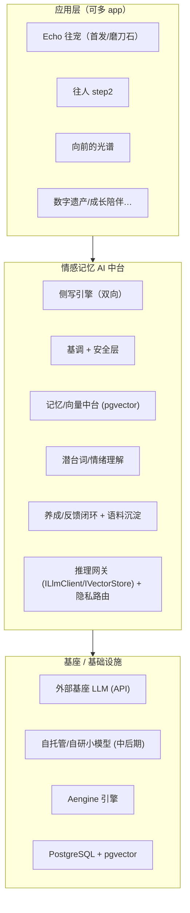

# 情感记忆 AI 中台 v1 架构 + 自研模型分阶段路线

| 项 | 值 |
|---|---|
| 文档版本 | **v0.2.1（2026-08-25 术语更名：侧写引擎两侧的「往者 / 生者」→「被牵挂的 ta / 用户自己」，见下行）**<br>v0.2（补：训练四层澄清 / RAG-vs-重训-vs-自托管升级 / 本地养模型全流程与成本） |
| 归属 | 后端 / ML 平台 · 技术地基 |
| 关联 | `PRD.md`、`PRD-echo-pet.md`、`PRD-echo-social.md`（§0.6/§2.11/§2.12/§2.13/§2.14）、`TECH-P1.md` |
| 一句话 | **做"情感记忆 AI 中台"（可复用、可孵化多 app 的护城河）；Echo(往宠) 是首发应用兼磨刀石——每块能力由 Echo 真实需要牵引、验证、边做边泛化，严禁过早平台化。** |
| **2026-08-25 术语更名** | 依 `COPY-GUIDE.md` §2.6 `R15`：侧写引擎向后跑的那一侧原称「**往者**」，改为「**被牵挂的 ta**」（§3 能力表、§6 场景表）。引擎向后取的是**已发生的素材**，与对象在世与否无关，旧词把异地、失联、久病分离、走散这类同样需要这台引擎的对象排除在定义之外。**对侧的「生者」一并改为「用户自己」**（§6、§7）——留着这个对照词，"往者"的死亡含义会靠对比重新渗回来。两侧统一以**时间方向**称呼：**向后 · 被牵挂的 ta** / **向前 · 用户自己**。术语定义见 `PRD-echo-social.md` §2.13 |

---

## 0. 核心原则（贯穿全文）

1. **不从零训基座**：基座语言能力已商品化，自己训不必要、烧不起、打不过。差异化在**基座之上的自研层**。
2. **Echo 牵引（forcing function）**：中台每块能力都由 Echo 的真实场景拉动，先在 Echo 跑通再泛化。**不做没有应用验证的"漂亮引擎"**（=钱坑）。
3. **抽象先行、可迁移**：一切外部模型经 `ILlmClient` / `IVectorStore` 等接口消费，将来无缝替换为自有模型不改上层。
4. **隐私优先**：丧亲/逝者/私密记忆是极敏感数据，敏感链路尽早规划自托管。
5. **红线内建**：温柔苦甜、不焦虑/不惩罚、不评判/不可归因/不攀比、有根不捏造——中台需在**能力层面**支持这些约束。

---

## 1. 现状盘点（基于真实代码）

**已就位：**
- **LLM 抽象** `com.echo.infra.llm.ILlmClient`：`enrich(rawPrefs)`（原始偏好→结构化偏好）+ `complete(prompt)`（通用补全，默认兜底 `"{}"`）。实现 `MockLlmClient`（外部服务一律 mock）。真实 HTTP 供应商实现待选型。
- **向量抽象** `com.echo.infra.vector.IVectorStore`：`encode`（占位=确定性哈希，待真实嵌入模型替换）/`upsert`/`get`/`topN(query,k,threshold)`（余弦距离，共鸣检索）；`DIM=768`（对齐 `t_self_vector.embedding vector(768)`）。实现 `InMemoryVectorStore`（默认/单测）↔ `PgVectorStore`（pgvector, BE-4）。
- **持久化 "B'"**：`PgRepository` + `CachedPgRepository`（复用 Aengine 缓存）+ PostgreSQL/pgvector。各模块 repo：`account`/`avatar`/`echo`/`space(MindSpace)`/`mind(SelfVector, MindProfile)`/`social(Friendship, Stall)`/`resonance(ResonanceRecord)`。
- **引擎底座** Aengine（JDK 26；network/Netty、scheduler、cache、template、event、class table）。
- **验证闭环** `com.echo.harness`：体验 bot（含 §7 LLM 定性层，用 `complete`）。

**空白（本中台要补）：**
- 真实嵌入模型（现为哈希占位）；真实 LLM 供应商接入；
- **侧写引擎**（人格提炼→一致口吻叙事，时间双向）；
- **基调 + 安全层**（语气 register + 红线可靠性）；
- **潜台词/情绪理解**（§2.11 暗面涌现）；
- **养成/反馈闭环**（反向精炼人格、沉淀语料）；
- **隐私/自托管推理** 路径。

---

## 2. 分层架构与中台边界



**边界铁律**：
- **应用层**只表达"要什么情感能力"（生成一封它的信 / 涌现一片暗面 / 找共鸣），**不关心**背后是哪个模型；
- **中台**通过 `ILlmClient`/`IVectorStore`/（新增）`IPortraitEngine`/`IToneGuard` 暴露能力，隐藏 build-vs-buy 与隐私路由；
- **基座**可替换：API ↔ 自托管，上层无感。

---

## 3. 中台可复用能力

| 能力 | 职责 | Echo 首个用例 | 可孵化 |
|---|---|---|---|
| **侧写引擎（双向）** | 从素材提炼人格 → 以其口吻做人格一致叙事；时间双向（**被牵挂的 ta**"继续存在"/**用户自己**"正在成为"） | 定时生成宠物"近况/来信" | 往人、向前的光谱、数字遗产 |
| **基调 + 安全层** | 苦甜克制的语气 register + 红线可靠性（守门+改写） | 所有对外文案的语气与安全 | 一切情感向产品的品牌底色 |
| **记忆/向量中台** | 每实体记忆、嵌入、共鸣/相似匹配（pgvector） | 一扇窗共鸣匹配、留一束光→光色 | 任何"理解一个人/物并共鸣" |
| **潜台词/情绪理解** | 隐含情绪抽取（跨阈值、多信号、氛围化、不可归因） | §2.11 暗面涌现 | 心理、陪伴、社群健康 |
| **养成/反馈闭环** | 反馈反向精炼人格；沉淀"经同意的情感语料" | 基调随用户反馈调优 | **最深护城河**：竞品复制不了的语料 |
| **推理网关 + 隐私路由** | 统一调用、控频超时、按敏感度路由到 API/自托管 | 敏感记忆走私有路径 | 所有敏感数据产品的信任基石 |

---

## 4. 概念澄清 + build-vs-buy（分场景，不是"打不过"）

### 4.1 "训练"是四件事，成本差 ~1000 倍（别揉成一句话）

| 层级 | 干什么 | 成本量级（2026 粗估·数量级） | 我们 |
|---|---|---|---|
| **① 预训练 from scratch** | 从零用数万亿 token 造基座 | 7B≈$10万–100万+；前沿≈$1亿+；上千张卡 | **绝不做**（这才是唯一"打不过"的场景） |
| **② 增量预训练** | 拿开源权重，继续灌领域大语料 | 数万–数十万美元 + 数周 + GPU 集群 | **一般不做**（易灾难性遗忘、性价比低） |
| **③ 微调 SFT/LoRA/DPO** | 用"输入→输出/偏好"样本教**风格·行为·口吻** | LoRA 微调 7–14B：一次几十–几百美元，单张 H100/4090 | **这就是我们**（自研落点） |
| **④ RAG 检索增强** | 推理时把知识**查出来塞给模型**，不训练 | 仅存储/向量库成本 | **已在做**（pgvector） |

> 用户直觉的"拿开源模型 → 喂料训练 → 自采数据二次加工再投喂"= 第 ③ 层，真实、便宜、可做；但"喂料"教的是**风格/行为**，不是**知识新鲜度**（后者永远走 ④）。

### 4.2 三种"更新"，只有一种依赖别人（破除"必须一直 call API"的误区）

| 要更新什么 | 靠什么 | 是否依赖外部 API |
|---|---|---|
| **知识新鲜度**（今天的事/用户新素材） | **RAG 检索**，不重训 | ❌ 不依赖 |
| **底层基座变强**（模型越来越聪明） | **下载新一代开源权重（免费）+ 重跑我们的 LoRA/语料** | ❌ 不依赖（搭开源生态免费便车升级） |
| **图省事直接租旗舰模型** | 调外部 API | ✅ 仅"阶段一故意选择租"时 |

**结论：一旦自托管开源权重，我们就不锁死在任何人的 API 上。** 升级 = 免费下载 Qwen/Llama/DeepSeek/Mistral 新版重训，几百美元、一两天；新鲜度 = RAG。API 依赖只存在于我们**主动选择租**的阶段。

### 4.3 逐组件 build-vs-buy（关键：按能力分，不是一刀切）

| 组件 | 现在 | 中期 | 长期 | 判断依据 |
|---|---|---|---|---|
| 基座 LLM（通用叙事/对话） | **Buy**（外部 API，经 `ILlmClient`） | Buy + 自托管开源权重 | 敏感路径全自托管 | 通用能力随预训练算力涨，那笔钱(①)我们不花→**租/买划算** |
| 嵌入模型 | **占位/Buy**（现哈希，接 API 嵌入） | **微调领域嵌入**（开源底座） | 自有嵌入 | 情感域相似度需领域适配；成本/延迟/隐私→**自研能赢** |
| 基调 + 安全层 | Prompt + 规则 + 轻分类器 | **微调 LoRA/adapter** | 自有专属基调模型 | 基座没按我们口味调过；窄、专、致命→**自研能赢，是护城河** |
| 潜台词/情绪分类 | 小分类器/规则 | **微调小模型** | 自有 | 窄任务，便宜低延迟可拥有→**自研能赢** |
| 侧写引擎 | RAG + prompt 编排（外部基座） | RAG + 微调基调层 | 自有基调/人格模型 | 差异化在编排+基调，不在基座 |
| 向量库 | **pgvector（自有）** | pgvector | pgvector/专用 | 已自持，数据主权在手 |

### 4.4 修正版结论（诚实版，替代"打不过所以不做"）

- **通用叙事底座能力**：自训 7B 确实打不过旗舰——不是我们笨，是不会花预训练那笔钱。这块**借力**（且随开源免费升级、不锁死 API）。
- **我们的窄能力**（基调 register / 红线安全 / 情绪潜台词 / 领域嵌入）：**自训不但不输，反而更好**——更贴口味、更便宜、更低延迟、数据不出域、完全自有。**这才是护城河，该自研。**
- **一句话**：**基座借力 + 周边窄模型自研 + 新鲜度走 RAG 不走重训。**

---

## 5. 本地养模型：全流程、真实成本与分阶段路线

### 5.1 六步流程

```
① 选底座   Qwen/Llama/DeepSeek/Mistral —— 按 中文能力/许可证/尺寸/base还是instruct 挑
② 备料     搜集 → 清洗 → 去重 → 标成"指令对/偏好对"     ← 80%工作量，真正的护城河
③ 训练     LoRA/QLoRA 做 SFT(教风格) → 可选 DPO(教偏好/口吻)   ← 算力很小
④ 评测     建"苦甜克制语气 + 红线安全"评测集              ← 情感产品最难、最不能省
⑤ 部署     量化 → vLLM/TGI/llama.cpp → 挂 GPU              ← 真正的经常性成本在这
⑥ 迭代     收集(经同意的)用户反馈语料 → 精炼 → 重训         ← 复利飞轮，别人抄不走
```

**两个反直觉重点：**
- **贵的不是训练，是"⑤ 推理托管"**：训练一次几百美元；把 7–14B 模型 7×24 挂线上，单张 H100 云租≈$1500–3000/月（或自购硬件前置资本）——这才是养模型的长期账单。
- **难的不是训练，是"② 备料 + ④ 评测"**：垃圾进垃圾出；没有评测集就是蒙眼开车，尤其"温柔苦甜、不越界"这种主观又致命的目标。

### 5.2 成本量级速查（数量级，随选型/流量浮动）

| 动作 | 一次性 | 经常性 |
|---|---|---|
| LoRA/QLoRA 微调 7–14B | 几十–几百美元/次 | — |
| 训练小分类器（嵌入/情绪/安全） | 数百美元或更低 | — |
| 自托管推理（7–14B 线上） | 硬件前置或 0（云） | ~$1.5k–3k/月/卡 起 |
| 外部 API（阶段一） | 0 | 随调用量线性增长 |
| 从零预训练 | $10万–$1亿+ | — （**不做**） |

### 5.3 分阶段路线（触发条件驱动，不按时间表硬推）

- **阶段一 · 现在（PMF 前）**：外部基座 API + RAG(pgvector) + 人格状态 + 轻量安全层。**保留全部抽象接口**，数据隔离设计先做好。目标=验证产品，**不分心造模型**。
  - **触发进入阶段二**：PMF 信号 + API 经常性成本显著 + 语料积累到可训练规模 + 敏感数据合规压力 + 团队具备 MLOps。
- **阶段二 · 中期（规模化）**：开源权重上微调 **嵌入 / 基调安全 / 潜台词** 三个小模型（LoRA/adapter）；**敏感链路自托管推理**（此后升级=免费下载新开源权重重训，脱离 API 依赖）。
- **阶段三 · 长期（护城河）**：用**经同意的自有共情语料**，在当时最好的开源底座上养 **专属基调/人格模型**——底座搭开源便车免费升级，**语料是别人抄不走的差异化**。

---

## 6. Echo 如何消费中台（关键场景 → 能力）

| Echo 场景 | 调用中台能力 |
|---|---|
| 定时生成宠物"近况/来自它的信" | 侧写引擎（向后 · 被牵挂的 ta）+ 基调安全层 + 记忆中台（取素材 RAG） |
| §2.11 我的光谱"暗面涌现" | 潜台词/情绪理解 → 记忆中台跨阈值归集 → 氛围化冷色区 |
| 一扇窗"共鸣匹配"/相似缘分 | 记忆/向量中台 `topN` |
| §2.12 留一束光"多维→光色" | 潜台词理解（观察者体验）→ 光色映射（应用层渲染） |
| §2.13 向前的光谱 | 侧写引擎（向前 · 用户自己，有根投射）+ 养成闭环 |
| §2.14 统一互动/回信 | 基调安全层（语气与红线）+ 记忆中台 |

---

## 7. 多 app 可扩展性

同一中台可孵化：**往人**（同侧写引擎另一出口）、**向前的光谱**（向前 · 用户自己）、**数字遗产 / 生前留言**、**成长陪伴 / 自省日记**、**关系类**。复用点集中在：侧写引擎 + 基调安全层 + 记忆向量中台。**新 app = 组合中台能力 + 自己的场景与 UI**。

---

## 8. 红线与合规（能力层内建）

- **隐私**：敏感数据（丧亲/逝者/私密记忆）默认不出域；推理网关按敏感度路由；数据最小化、可删除、可撤回。
- **温柔不焦虑**：基调层强制苦甜克制；**不惩罚**（温度 60% 地板、活跃度只正向不衰减）——中台生成层不得产出制造焦虑/内疚的内容。
- **不评判/不可归因/不攀比**：潜台词与暗面**仅自我内在阴影、跨阈值、不可归因**；对人不做社会评价评分。
- **有根不捏造**：向前投射必须取材真实、框成"可能/邀请"而非"预言/事实"。
- **安全守门**：所有对外生成经安全层过滤（去攻击、去点名中伤、去越界）。

---

## 9. 代价评估（清醒）

- **人才**：ML/MLOps（微调、评测、推理部署）；
- **infra**：自托管推理 GPU、向量库扩容、经常性 API 成本；
- **时间**：阶段二/三是规模化投入，非 PMF 前重点。
- **省钱纪律**：**Echo 牵引 + 边做边泛化**——只建 Echo 已验证需要的能力，避免过早平台化。

---

## 10. 留给产品经理拍板的开放问题

1. **自托管时机**：敏感链路要多早自托管？（隐私优先 vs 成本/速度）——建议 PMF 后启动，但阶段一即做好数据隔离设计。
2. **外部基座选型边界**：PMF 前是否接受把（脱敏后的）生成请求发第三方 API？脱敏到什么程度？
3. **语料使用同意**：养成闭环沉淀的情感语料，用户同意口径与匿名化标准如何定？（关乎长期护城河合法性）
4. **预算与团队**：中期微调阶段的 ML 人力/GPU 预算区间？
5. **嵌入维度/模型**：沿用 768 维还是随选型调整？（涉及 schema 迁移）
6. **评测标准**：基调"苦甜克制"与红线可靠性如何量化验收？（需一套情感/安全评测集）
7. **多 app 节奏**：中台泛化到第二个 app（往人 vs 向前的光谱）的时机与触发条件。
