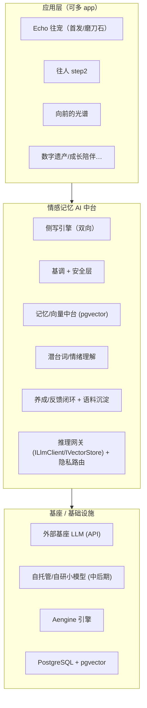

# 情感记忆 AI 中台 v1 架构 + 自研模型分阶段路线

| 项 | 值 |
|---|---|
| 文档版本 | **v0.3（2026-08-30 补：概述节 / §1 回代码重核并按「已实现·有契约无实现·完全不存在」三分 / §1.4 AI 视频作品缺口清单 / §2.5「情感记忆」层定义 / §10 七条开放问题收口）**<br>v0.2.1（2026-08-25 术语更名：侧写引擎两侧的「往者 / 生者」→「被牵挂的 ta / 用户自己」，见下行）<br>v0.2（补：训练四层澄清 / RAG-vs-重训-vs-自托管升级 / 本地养模型全流程与成本） |
| 归属 | 后端 / ML 平台 · 技术地基 |
| 关联 | `PRD.md`、`PRD-echo-pet.md`、`PRD-echo-social.md`（§0.6/§2.11/§2.12/§2.13/§2.14）、`TECH-P1.md` |
| 一句话 | **做"情感记忆 AI 中台"（可复用、可孵化多 app 的护城河）；Echo(往宠) 是首发应用兼磨刀石——每块能力由 Echo 真实需要牵引、验证、边做边泛化，严禁过早平台化。** |
| **2026-08-25 术语更名** | 依 `COPY-GUIDE.md` §2.6 `R15`：侧写引擎向后跑的那一侧原称「**往者**」，改为「**被牵挂的 ta**」（§3 能力表、§6 场景表）。引擎向后取的是**已发生的素材**，与对象在世与否无关，旧词把异地、失联、久病分离、走散这类同样需要这台引擎的对象排除在定义之外。**对侧的「生者」一并改为「用户自己」**（§6、§7）——留着这个对照词，"往者"的死亡含义会靠对比重新渗回来。两侧统一以**时间方向**称呼：**向后 · 被牵挂的 ta** / **向前 · 用户自己**。术语定义见 `PRD-echo-social.md` §2.13 |

---

## 概述

> 本节是**结论的集合**，读完就等于拿到这份文档的全部结论，不需要往下读。论证、依据、算例在正文对应节里。
> 与 `AI-CAPABILITIES.md` 的分工：**本文档管「建不建、怎么分层、什么时候自研」（战略与架构）；那份管「接哪家、哪个 key、什么优先级」（落地清单）。同一件事只在一处写全文，另一处留指针。**

### 概述-A 本轮（v0.3）新增与改口的结论

**A1 · §1 现状盘点整节改口，旧版三处说法已被代码推翻**（详见 §1）。旧文写于真实供应商接入之前，以下三条不再成立：

| 旧结论（v0.2） | 现状（2026-08-30 回代码核实） |
|---|---|
| 「真实 HTTP 供应商实现待选型」 | **已推翻。** `ApiLlmClient` 已落地，走 OpenAI 兼容 Chat Completions，内置豆包/DeepSeek/Qwen/OpenAI/local 五个默认端点，切供应商只改 env |
| 「向量 `encode` 占位=确定性哈希，待真实嵌入模型替换」 | **已推翻一半。** 新增 `com.echo.infra.embedding` 整包（`IEmbeddingClient` / `ApiEmbeddingClient` / `EmbeddingConfig`），编码已可插拔；**默认仍回落 `MockEmbeddingClient`（确定性伪向量）**，所以线上向量今天没有语义 |
| 「基调 + 安全层」列在空白清单里 | **已推翻一半。** 输出侧五关 `OutputSafetyGate` 已实现并接线到近况/回信/发布/留言四条路径；外部内容安全 `ContentSafetyGate` 已实现且**失败方向为拒绝**。缺的是**前置闸 `GenerationEntryGate`——有类、有测试、零生产调用点** |

**A2 · AI 能力按「已实现 / 有契约无实现 / 完全不存在」三分，A–K 十一项的实际分布是 4 / 2 / 5**（详见 §1.3）。

- **已实现**（接口 + 真实实现 + 已接线，配 env 即生效）：**A** 肖像识别、**F** 近况/回信生成、**J** 共鸣向量检索、**K** 内容安全护栏。
- **有契约无实现**（有接口/有表/有列，但没有真实实现或没有调用点）：**G** 叙事基调（只有 prompt 注入这一层是真跑的，反馈回流只到语料采集，没有回到生成）、**H** 我的光谱（`spectrumNodes`/`spectrumShadows` 是**进程内 Map，无表、无模型**，重启即失）。
- **完全不存在**（连接口都没有）：**B** 定妆形象生成、**C** 动态/视频生成、**D** 素材特征分析（服务端）、**E** 语音识别（服务端）、**I** 向前的光谱。

**A3 · 🔴「AI 十一项能力」里凡涉及图像/音视频生成的，生成侧确实不存在，这个描述准确。** 核实到的证据比类注释更硬：`GeneratedMediaPublisher`（AI 生成媒体落盘的唯一入口）**在全仓只有测试引用，零生产调用点**；定妆候选 `EchoApi.generateCandidates()` 产出的是渐变色名 + emoji + 一句签名，没有任何图像字节。**AI 只产出文本，且只有近况与回信两种。**

**A4 · 要让 AI 产出可发布的视频作品，缺九样东西，其中六样是工程前置、不是选型问题**（清单见 §1.4）。最要紧的三条：

- **异步任务模型不存在**——现有 `ILlmClient.complete` 是 20 秒超时的同步调用，视频生成是分钟级；没有任务表、没有 `taskId`、没有轮询或回调端点，`t_work.status` 枚举里也没有「生成中」这一态。
- **显式标识 `t_work.aiGenerated` 今天由客户端自报**（`Json.getBool(b,"aiGenerated",false)`），服务端不校验。生成侧接进来之前这不算问题，接进来之后它就是「监管要的显式标识可以被调用方关掉」。
- **前置闸未接线**——`GenerationEntryGate.TaskKind` 里 `ANIMATION` / `AWAKEN_VIDEO` 已被定义为「拟真类，必须在任务创建之前拦」，而它没有任何生产调用点。视频生成上线**必须**同时接它，否则这一关的语义（等生成完再拦就来不及了）就落空了。

**A5 · 「情感记忆」这一层今天在代码里不存在，本轮把它定义死了**（详见 §2.5）。存在的是一堆各自为战的业务表，没有任何一层把它们归集成「关于这个对象的、可被生成侧检索的记忆」。定义与四条判据：

- **情感记忆 = 关于某一个被牵挂的对象的、经其守护者授权的、可被生成侧检索的素材派生表示。** 三个限定词都是判据，缺一条就不属于本层。
- **聚合根是对象（`petId`，将来泛化为 `subjectId`），不是用户。** 用户自己的 `t_mind_profile` / `t_self_vector` **不属于**情感记忆层——它是「向前 · 用户自己」那一侧的输入。两者合并会让 `topN` 把「我像谁」和「它像谁」混进同一个向量空间。
- **分三类存，不合并**：原始素材（**不进本层**，本层只引用）／记忆条目（本层本体，🔴 待建 `t_memory_entry`，今天不存在）／对象画像（🔴 待建，今天的近似物 `t_pet.traits` 是用户手选的词，不是提炼出来的）。
- **判「是不是记忆」的那条线是「生成侧检索得到吗」。** 今天 `t_pet.lifeBook` 存着但生成侧读不到，所以它是素材，不是记忆。

**A6 · 情感记忆与 `t_memory_card`（回忆卡）方向相反，🔴 不许合并成一张表。** 回忆卡是**出口**（把已有的东西拿出去给人看，有可见性、有审核态、有发布态）；情感记忆是**入口**（把素材收进来给模型读，没有可见性，因为它从不直接面向用户）。同一条内容可以两边都有，但两条生命周期必须独立：**作者把回忆卡删了或设为私密，不等于这条记忆要从模型输入里拿掉；反过来撤回训练授权要从记忆层拿掉，但不影响回忆卡还在用户自己那儿。** 做成一张表，这两件事就永远只能一起发生。

**A7 · 🔴 今天的「近况生成」不是侧写引擎，中间没有任何检索。** `EchoApi.generateEchoText()` 的 prompt = 基调约束 + `petContext()` 拼进去的四个字段（名字、种类、性情词、签名）+ 一句指令。**同一只宠物，第一天和第一百天拿到的上下文完全一样**——所以「近况」在结构上不可能变化，看起来的变化只来自采样温度。把 `petContext()` 换成 `recall(subjectId, k, 场景)` 是「有根的近况」的唯一路径，也是 §0 原则 5「有根不捏造」在能力层的落点。

**A8 · 近况是回访触发，不是定时生成。** §6 场景表原写「定时生成宠物近况/来信」，代码里是主人回访时生成当天那条（一天一条），回信则**无任何节流**。§6 已按事实改口。

**A9 · 窗不是记忆层的消费者。** `GET /windows/:petId` 读的是 `t_pet` 加最近一条 `t_pet_echo`。记忆层改造只影响近况**怎么生成**，不影响窗**怎么读**——这两件事可以分开排期。

### 概述-B §10 开放问题的收口结果（七条，四条给出结论、三条待定）

| # | 问题 | 收口 |
|---|---|---|
| 1 | 自托管时机 | **有结论。** 阶段一不自托管；🔴 但**按敏感度分流的路由要在接入第二个 provider 之前建**——今天是全进程单例一个 client，再接一家就会长出「一个 client 打天下」的形状，那时候再拆是改所有调用点 |
| 2 | 外部基座脱敏边界 | **有结论（工程侧）+ 待定（产品侧）。** 事实：当前出域内容 = 基调约束 + 宠物名 + 种类 + 性情词 + 签名（回信时另加主人原话），**没有任何脱敏**，其中宠物名与主人原话是用户自由文本。工程侧结论：出域字段必须收敛成显式白名单，`petContext()` 一个方法就是那个落点，是小改动。产品侧待定：白名单里放不放主人原话 |
| 3 | 语料同意口径 | **合法性口径不由本文档定**（以 `SPEC-trust-and-compliance §CM-G0` 为准）。本文档定**工程前置**：语料表落 PG 之前必须先修三处硬伤，否则第一批落库样本就是不合规的——见 B3 |
| 4 | 预算与团队 | **待定。** 定它需要一份真实的月度 API 账单，而今天账单是 0（默认装配走 mock）。前置条件：先跑满一个月真实流量拿到调用量基线 |
| 5 | 嵌入维度 | **有结论：维持 768，不改。** 依据：`IVectorStore.DIM` / `t_self_vector.embedding vector(768)` / `IEmbeddingClient.DEFAULT_DIM` 三处已一致，且百炼 text-embedding-v3 支持 `dimensions` 参数指定输出维度 → 换供应商不必动 schema。🔴 附带一个坑：`ECHO_EMBED_DIM` 可以配成非 768，而 pgvector 列宽写死 768 且 `PgVectorStore` 不做维度校验，配错要到写库那一刻才炸 |
| 6 | 评测标准 | **一半有结论。** 安全可靠性**已可量化**（`SafetyMetrics` 有输出拦截率、按关拦截数、内容告警数、入口拒绝数、用户文本拦截率五个口径，且 `EchoFallbackCopyTest` 逐条把兜底池过一遍闸）。基调「苦甜克制」**待定**——`com.echo.harness` 的 `LlmBotReviewer` 只是定性评审器，跑的是蒙特卡洛模拟人群，**没有固定评测集**。定它需要 100–300 条人工标注的好/坏对照样本 |
| 7 | 多 app 节奏 | **待定，且不由产品意愿决定。** 中台里今天真能复用的只有 K（安全）与 J（向量）两块；侧写引擎不存在，而它才是第二个 app 的必要条件。所以触发条件是「侧写引擎已在 Echo 跑通」，不是「什么时候想做第二个 app」 |

**B3 · 语料回流的三处硬伤（🔴 落 PG 之前必修，这是本轮回代码新查出来的）：**

1. `TrainSample.inputRefs` 存的是**原始素材 resourceId**，与 `AI-CAPABILITIES §7` v0.2「入参只收 `derivedRef`，类型上拒绝原图」正面冲突——那条要求的本意就是让"原图进训练"变成编译不过的事，而现在的字段类型让它编译得过。
2. **缺 `materialRef` / `consentRef` 双外键**（`SPEC G0-10 ①` 明确「没有这两列的派生物表一律不合格，CR 直接打回」）。
3. **`IConsentGate` 全仓不存在。** `SPEC G0-10 ②③` 要求识别/定妆/近况/检索/训练五个校验点走同一个入口，实际只有训练一处有门控（`EchoApi.recordTrainSample` 自己判 `trainConsent`），生成侧与检索侧没有任何授权校验。

---

## 0. 核心原则（贯穿全文）

1. **不从零训基座**：基座语言能力已商品化，自己训不必要、烧不起、打不过。差异化在**基座之上的自研层**。
2. **Echo 牵引（forcing function）**：中台每块能力都由 Echo 的真实场景拉动，先在 Echo 跑通再泛化。**不做没有应用验证的"漂亮引擎"**（=钱坑）。
3. **抽象先行、可迁移**：一切外部模型经 `ILlmClient` / `IVectorStore` 等接口消费，将来无缝替换为自有模型不改上层。
4. **隐私优先**：丧亲/逝者/私密记忆是极敏感数据，敏感链路尽早规划自托管。
5. **红线内建**：温柔苦甜、不焦虑/不惩罚、不评判/不可归因/不攀比、有根不捏造——中台需在**能力层面**支持这些约束。

---

## 1. 现状盘点（基于真实代码）

> **本节 2026-08-30 整节回代码重核。** 代码位置在 8-28 拆过仓：现在是 `echo/echo-server/src/main/java/com/echo/`（包根 `com.echo` 未变）。
> 🔴 **重核方式是读代码，不是读文档。** 下面每条「已实现／未实现」都指得出类名与调用点；指不出调用点的一律记为「有契约无实现」，哪怕类写得很完整。

### 1.1 v0.2 旧文的三处说法已被代码推翻

**保留旧文并标注推翻，不删**（本项目硬规矩）：

- ~~「实现 `MockLlmClient`（外部服务一律 mock）。真实 HTTP 供应商实现待选型。」~~
  > **⚠️ 2026-08-30 推翻。** 原因：`com.echo.infra.llm.ApiLlmClient` 已落地——走 OpenAI 兼容的 Chat Completions，用 JDK 自带 `HttpClient` + 现有 Gson，不引第三方依赖；`LlmConfig` 内置豆包/DeepSeek/Qwen/OpenAI/local(Ollama) 五套默认端点，切供应商只改 `ECHO_LLM_PROVIDER` 等环境变量，业务代码零改动。「待选型」这句话写于接入之前，照抄它会让人以为还得先做选型才能动工。
- ~~「`encode`（占位=确定性哈希，待真实嵌入模型替换）」~~
  > **⚠️ 2026-08-30 推翻一半。** 原因：新增了 `com.echo.infra.embedding` 整包（`IEmbeddingClient` / `ApiEmbeddingClient` / `MockEmbeddingClient` / `EmbeddingConfig` / `EmbeddingClientFactory`），`InMemoryVectorStore` 与 `PgVectorStore` 的 `encode` 都已改为委托可插拔的 `IEmbeddingClient`。**仍成立的那一半**：默认装配回落 `MockEmbeddingClient`（确定性伪向量），所以不配 `ECHO_EMBED_API_KEY` 时线上向量依旧没有语义。`IVectorStore` 接口上那段哈希实现还在，但只作为 default 方法兜底。
- ~~空白清单里的「基调 + 安全层（语气 register + 红线可靠性）」~~
  > **⚠️ 2026-08-30 推翻一半。** 见 §1.2「安全层」条：输出侧五关已实现且已接线，外部内容安全网关已实现且失败方向为拒绝。**仍空白的那一半**是前置闸与自研模型层。

### 1.2 已就位（逐条核到类与调用点）

- **LLM 抽象** `com.echo.infra.llm.ILlmClient`：`enrich(rawPrefs)` + `complete(prompt)`（默认兜底 `"{}"`）。三个实现：`MockLlmClient`、`ApiLlmClient`（真实 HTTP）、以及由 `LlmClientFactory` 按 `LlmConfig.isMock()` 选路。降级方向是**向下兜底不抛异常**：连接/超时/非 2xx/解析失败一律委托 fallback，不让坏网络把接口打成 500。
  > 🔴 **一个容易踩的接线细节**：真实供应商**只在 HTTP 域生效**。`EchoHttpBootstrap.start()` 里做了 `LlmClientFactory.create(LlmConfig.fromEnv(), llm)` 覆盖，而 `EchoServer` 主入口向 protobuf 网关侧传的是硬编码的 `new MockLlmClient()`。**后果：意识档案补全 `MindProfileService.enrich()` 恒走 mock，配了 key 也不会生效。** 这不是配置问题，是装配问题。
- **嵌入抽象** `com.echo.infra.embedding.IEmbeddingClient`：`embed(text)` + `dimension()`，`DEFAULT_DIM=768`。`ApiEmbeddingClient` 走 OpenAI 兼容 `/embeddings`，支持 `dimensions` 参数。配置项 `ECHO_EMBED_PROVIDER / BASE_URL / API_KEY / MODEL / DIM`，默认 mock。
- **视觉抽象** `com.echo.infra.vision.IVisionClient`：`detect(resourceId)` + `detectWithSource()`（🔴 带来源标记，默认保守标 `FALLBACK`——看不出来源时宁可说"这是兜底"，也不让前端把中性默认当识别结果展示）。`ApiVisionClient` 走百炼 qwen-vl 的多模态 Chat Completions，配 `ResolvingVisionClient`（先把 resourceId 解析成可送模型的图）与 `ImageCompressor`（按 `ECHO_VISION_MAX_EDGE` 缩放）。默认 `StubVisionClient`。
- **向量抽象** `com.echo.infra.vector.IVectorStore`：`encode`（现委托 `IEmbeddingClient`）/`upsert`/`get`/`topN(query,k,threshold)`（余弦距离）；`DIM=768`（对齐 `t_self_vector.embedding vector(768)`）。实现 `InMemoryVectorStore` ↔ `PgVectorStore`。消费方 `ResonanceService`（protobuf 网关 1401/1402）。
- **安全层**（这一块比 v0.2 想象的完整得多）：
  - `com.echo.http.safety.OutputSafetyGate`——输出侧五关（合规词表 / 产品红线 / 注入逃逸 / 丧失断言 / 在世对象拟真）。🔴 **命中即整条不投递，不做词面替换后放行**。已接线到四条路径：近况生成、回信生成、`POST /works` 发布、留一句话。
  - `com.echo.infra.safety.ContentSafetyGate`——第一关的外部内容安全 API 收口。🔴 **失败方向一律「未通过」**（超时/限流/鉴权失败/格式异常/熔断中全部 failed-closed），且就绪判据是「最近一次真实调用成功」而不是「配置齐了」。未配置时返回 `skipped()` 而非拒绝——此时 `isOperational()=false`，`S13` 开关打不开，公开层根本没有用户自由文本。
  - `com.echo.http.CopyGuardFilter`——**注意它不是安全闸**，定位是给我们自己写的静态文案做兜底改写。
  - `SafetyMetrics`——五个可量化口径（输出拦截率、按关拦截数、内容告警数、入口拒绝数、用户文本拦截率）。这是 §10 Q6 能收口一半的依据。
- **语料回流** `com.echo.infra.corpus`：`ITrainingCorpus` / `TrainSample` / `InMemoryTrainingCorpus`；埋点在 `EchoApi.recordTrainSample()`（建档确认）与 `recordFeedbackSample()`（回声反馈），受 `trainConsent` 门控，`accountId` 经 SHA-256 去标识。表结构 `t_train_sample` 已在 `schema.sql`。🔴 **三处硬伤见概述 B3，落 PG 前必修。**
- **持久化 "B'"**：`PgRepository` + `CachedPgRepository` + PostgreSQL/pgvector。模块 repo：`account`/`avatar`/`echo`/`space`/`mind`/`social`/`resonance`。
  > ⚠️ 旧文没写但重要：**HTTP 域另有一套并存的存储**（`com.echo.http.store.EchoStore`，双实现 `InMemoryEchoStore` / `PgEchoStore`），与 `com.echo.module.*` 的 Aengine repo 是两套东西。往宠档案、近况、明信片、记录、光谱都在这一套里。
- **引擎底座** Aengine（`maven.compiler.release=26`；network/Netty、scheduler、cache、template、event、class table）。
- **验证闭环** `com.echo.harness`（在 `src/test/java` 下）：体验 bot 含 LLM 定性层 `LlmBotReviewer`，用 `complete`，解析失败退回温和兜底评审。

### 1.3 AI 能力清单三分类（A–K，对齐 `AI-CAPABILITIES.md` §1 的编号）

**分类判据**（写死，免得下一轮各按各的理解填）：

| 类别 | 判据 |
|---|---|
| **已实现** | 接口 + 真实实现 + **已接线到线上路径**。默认回落 mock 不影响归类——配 env 就生效的算已实现 |
| **有契约无实现** | 接口/数据结构/DB 列已在，但**没有真实实现，或有实现但零生产调用点** |
| **完全不存在** | 连接口都没有。要做得从定接口开始 |

| # | 能力 | 归类 | 代码事实 |
|---|---|---|---|
| **A** | 肖像种类识别 | **已实现** | `IVisionClient` + `ApiVisionClient`（qwen-vl）+ `StubVisionClient` 兜底，调用点 `EchoApi` 建档第 1 步 |
| **B** | 定妆推荐形象生成 | 🔴 **完全不存在** | `EchoApi.generateCandidates()` 产出的是**渐变色名 + emoji + 一句签名**，没有任何图像字节。`IImageGenClient` 未建 |
| **C** | 动态预览 / 视频生成 | 🔴 **完全不存在** | `IVideoGenClient` 未建。`AI-CAPABILITIES §2`「待建接口」里列了，代码里没有 |
| **D** | 素材特征分析（→性情词） | 🔴 **完全不存在**（服务端） | 视觉侧只做种类 detect，没有打标签的路径。前端随机取词 |
| **E** | 语音识别 | 🔴 **完全不存在**（服务端） | `ISttClient` 未建。前端走浏览器 Web Speech API |
| **F** | 回声 / 近况生成 | **已实现** | `EchoApi.generateEchoText()` / `generateReply()` → `ILlmClient.complete` → 过 `OutputSafetyGate` → 不过重生成一次 → 仍不过回落兜底池 |
| **G** | 叙事基调 / 性格拓扑 | **有契约无实现** | 基调这一半是真跑的：`copyGuardSystemPrompt()` 把红线约束注入 prompt。**性格拓扑与反馈投喂这一半没有**——`TrainSample` 只把反馈**采集**下来，没有任何路径把它回流到生成 |
| **H** | 我的光谱（内在光暗） | **有契约无实现** | `spectrumNodes` / `spectrumShadows` 是 `ConcurrentHashMap`，🔴 **进程内、无表、重启即失**（`PgEchoStore` 类注释自己写明「无独立表」）。无 LLM、无 embedding 参与 |
| **I** | 向前的光谱 / 明日回声 | 🔴 **完全不存在** | 概念，无代码 |
| **J** | 共鸣匹配 / 向量检索 | **已实现** | `IVectorStore.topN` + `ResonanceService`。⚠️ 默认嵌入是 mock 伪向量，所以**检索链路通了但结果没有语义**——这是配置状态，不是实现缺失 |
| **K** | 文案 / 内容安全护栏 | **已实现** | `OutputSafetyGate` 五关 + `ContentSafetyGate` + `CopyGuardFilter`，已接线四条路径 |

**另有三样不在 A–K 编号里、但同属「有契约无实现」，排期时容易漏掉：**

1. **`GenerationEntryGate`（生成前置闸）**——`SPEC-security §4.1` 要求拟真类生成在**任务创建之前**拦，类写完了、`TaskKind` 五种拟真任务都定义了、测试也有，🔴 **全仓零生产调用点**。
2. **`GeneratedMediaPublisher`（AIGC 隐式标识落盘唯一入口）**——同样零生产调用点，只有测试引用。它现在存在的意义是「等第一条生成管线上线时，让『生成了却没标识』在结构上做不到」。
3. **`IConsentGate`（素材使用授权统一门控）**——`SPEC G0-10 ②③` 点名要求的五个校验点共用入口，🔴 **全仓不存在**。今天只有训练一处自己判 `trainConsent`。

### 1.4 🔴 要让 AI 产出可发布的视频作品，缺哪些东西

**背景**：作品域（`SPEC-works.md`）的发布口从第一天就同时收图片与视频，`t_work` 有 `mediaType='video'`、`posterKey`、`durationMs`，库约束 `t_work_ck_video_poster` 也已就位。**收得下，但没人产得出**——生成侧一件都没有。

清单如下。🔴 **前六条是工程前置，不是选型问题**——选定供应商也解决不了它们：

| # | 缺什么 | 为什么它是前置 |
|---|---|---|
| 1 | **`IVideoGenClient` 接口**（以及多数图生视频路线要先有的 `IImageGenClient`） | 缺的是两级：主流图生视频要先有一张定妆图，而 B 也不存在 |
| 2 | 🔴 **异步任务模型** | 现有 `ILlmClient.complete` 是 20 秒超时的**同步阻塞**调用，视频生成是分钟级。没有任务表、没有 `taskId`、没有轮询或回调端点，`t_work.status` 枚举（`draft/pending/public/rejected/takendown/appealing/deleted`）里**也没有「生成中」这一态** |
| 3 | 🔴 **把 `GeneratedMediaPublisher` 真正接进落盘路径** | 它已经强制「先打隐式标识、往返自检、读回不一致就拒绝落盘」。真接生成时必须从这里落，**不要给生成侧留一条直接调 `IStorage.put` 的近路** |
| 4 | 🔴 **`t_work.aiGenerated` 的服务端真源** | 该列今天由客户端自报（`Json.getBool(b,"aiGenerated",false)`），服务端不校验。生成侧接进来之后，这就是「监管要的 S-8 显式标识可以被调用方关掉」。判据应当是「这个 mediaKey 是不是我们生成的」，由服务端答 |
| 5 | 🔴 **把 `GenerationEntryGate` 接到创建口** | `TaskKind.ANIMATION` / `AWAKEN_VIDEO` 已定义为拟真类，语义就是**等生成完再拦就来不及了**（产物已落盘、钱已花掉）。它现在零调用点，视频生成上线必须同时接它 |
| 6 | **视频首帧谁来抽** | 库约束强制 `posterKey` 非空，客户端目前没有抽帧实现（`SPEC-works` 概述已记）。AI 生成路径下客户端根本不在场，**只能服务端抽** |
| 7 | **`originType` 对 AI 作品的口径** | 该列只有 `user \| official`，是运营口径不是 AI 口径（`SPEC-works` 概述已记，此处只留指针，不重复展开） |
| 8 | 🔴 **素材出域的授权基础** | 图生视频要把用户上传的宠物照片送给第三方。这是**原始素材出域**，而 `IConsentGate` 不存在（§1.3 末）。今天没有任何一条路径能回答「这张照片有没有被授权拿去做视频生成」 |
| 9 | **成本口径** | 视频生成单条成本比文本高两到三个数量级，且失败重试也要计费。定它需要先有 §10 Q4 的调用量基线 |

**上传口的容量不是瓶颈但要确认走哪条路**：`POST /upload` 上限 25MB、作品视频时长上限 5 分钟。AI 生成的视频若由服务端直接经 `GeneratedMediaPublisher` → `IStorage` 落盘，不受 25MB 限制；若设计成「生成后回传走上传口」则受限。**这两条路要先选一条**，因为第 3 条（隐式标识）只在前一条路上才成立。

### 1.5 仍然空白（本中台要补）

- **侧写引擎**（人格提炼 → 一致口吻叙事，时间双向）—— 🔴 完全空白。**今天的近况生成不是它**，见 §2.5 与概述 A7。
- **情感记忆层** —— 🔴 完全空白，定义见 §2.5。这是侧写引擎的前置：没有可检索的记忆，"提炼人格"没有输入。
- **潜台词 / 情绪理解**（§2.11 暗面涌现）—— 完全空白（H 那套进程内 Map 不是它）。
- **养成 / 反馈闭环的回流侧** —— 采集侧已有（`ITrainingCorpus`），🔴 **回流侧没有**：没有任何路径把反馈变回生成时的输入。
- **隐私 / 自托管推理路由** —— 契约已具备（`LlmConfig` 的 `provider=local` 指向 Ollama/vLLM 的 OpenAI 兼容端点），🔴 **但按敏感度分流的路由不存在**：全进程单例一个 client。见 §10 Q1。
- **自研窄模型**（领域嵌入 / 基调 / 潜台词 / 安全分类）—— 全部空白，按 §5.3 阶段二启动。

---

## 2. 分层架构与中台边界



**边界铁律**：
- **应用层**只表达"要什么情感能力"（生成一封它的信 / 涌现一片暗面 / 找共鸣），**不关心**背后是哪个模型；
- **中台**通过 `ILlmClient`/`IVectorStore`/（新增）`IPortraitEngine`/`IToneGuard` 暴露能力，隐藏 build-vs-buy 与隐私路由；
- **基座**可替换：API ↔ 自托管，上层无感。

---

## 2.5 「情感记忆」是什么（本文档名字里的那一层）

> **2026-08-30 新增。** 这份文档叫「情感记忆 AI 中台」，但此前全文没有一处说过情感记忆是什么——是一张表、一个服务，还是一组 embedding。本节把它定死。
> 🔴 **本节的定义是回代码看过现有实现之后下的，不是从旧文的只言片语里推演的。** 结论之一恰恰是：**这一层今天在代码里不存在**。

### 2.5.1 先说现状：这一层今天不存在

回代码能找到的「与某个对象有关的东西」散落在这些地方，**没有任何一层把它们归集起来**：

| 落点 | 存了什么 | 生成侧读得到吗 |
|---|---|---|
| `t_pet` | 名字、种类、签名、性情词、`memoryCaption`、`lifeBook`、封面 | **只读到四个字段**（见下） |
| `t_pet_echo` | AI 生成的近况正文、语气、主人回信 | 读得到最近一条（窗展示用），**不作为生成输入** |
| `t_postcard` / `t_record` | 明信片、随手记 | ❌ 读不到 |
| `t_memory_card` | 回忆卡（`sourceType = record\|book_page\|postcard\|echo`） | ❌ 读不到 |
| `t_mind_profile` + `t_self_vector` | **用户自己**的意识档案与 768 维向量 | 只喂 `ResonanceService` 做共鸣，与对象无关 |
| `t_train_sample` | 训练语料 | ❌ 只写不读（回流侧不存在，§1.5） |
| `spectrumNodes` / `spectrumShadows` | 光谱明暗 | ❌ 进程内 Map，无表 |

🔴 **生成侧实际读到的全部内容，是 `EchoApi.petContext()` 拼的四个字段：名字、种类、性情词、签名。** 加上 `copyGuardSystemPrompt()` 的基调约束和一句指令，就是近况生成的整个 prompt。**中间没有任何检索。**

这件事的后果比"功能没做"更重：**同一只宠物，第一天和第一百天拿到的上下文完全一样**，所以「近况」在结构上不可能随陪伴变化，看起来的变化只来自采样温度。用户往里放的照片、写的字、攒的明信片，一个字都没有进到生成里去。**「有根不捏造」（§0 原则 5）今天在能力层没有落点，因为压根没有根。**

### 2.5.2 定义

> **情感记忆 = 关于某一个被牵挂的对象的、经其守护者授权的、可被生成侧检索的素材派生表示。**

三个限定词都是**判据**，缺一条就不属于这一层：

1. **「关于某一个被牵挂的对象」** —— 聚合根是**对象**（今天是 `petId`，泛化后是 `subjectId`），不是账号。
   🔴 **用户自己的 `t_mind_profile` / `t_self_vector` 不属于情感记忆层。** 它是「向前 · 用户自己」那一侧的输入，两者不许合并——合并之后 `topN` 会把「我像谁」和「它像谁」混进同一个向量空间，而这两个问题的答案没有可比性。
2. **「经其守护者授权」** —— 入层必须过 `IConsentGate.assertUsable(materialRef, capability)`。该门控今天不存在（§1.3 末），**它是这一层的工程前置，不是配套优化**。
3. **「可被生成侧检索」** —— 🔴 **这条是分界线**：检索不到的不算记忆，只算素材。今天 `t_pet.lifeBook` 存着但生成侧读不到，所以它是素材；将来它被拆成条目、带上嵌入、能被 `recall` 取回，才成为记忆。

**它是什么形态**：**一个服务 + 两张表**，不是纯 embedding，也不是某张现有表加几列。

- **服务**：`IMemoryStore`（暂名），对生成侧只暴露两个动作——`ingest(素材 → 记忆条目)` 与 `recall(subjectId, k, 场景) → List<记忆条目>`。生成侧**只认这个接口**，不许直接查任何业务表。理由与 `IConsentGate` 一样：每个生成点自己拼上下文，授权校验就必然会漏，而漏了看不出来。
- **两张表**：见 2.5.3 的「记忆条目」与「对象画像」。

### 2.5.3 存什么：三类分开存，不合并

| 类 | 内容 | 落点 | 状态 |
|---|---|---|---|
| **原始素材** | 照片、音视频、用户写的原文 | 私有对象存储 + 各业务表 | 已有。🔴 **不进本层**，本层只持有引用 |
| **记忆条目**（本层本体） | 一条可被检索的片段：`{subjectId, sourceType, sourceRef, text, occurredAt, materialRef, consentRef, embedding, deletedAt}` | 待建 `t_memory_entry` | 🔴 **不存在** |
| **对象画像** | 从记忆条目提炼出的稳定人格描述（口吻、性情、关系）+ `sourceEntryIds` + 版本号 | 待建 `t_subject_portrait` | 🔴 **不存在**。今天的近似物 `t_pet.traits` 是**用户手选的词**，不是提炼出来的 |

三条设计约束，都是为了不重蹈已经踩过的坑：

- 🔴 **原始素材不进本层，是类型层面的不进，不是约定层面的。** 参照 `AI-CAPABILITIES §7` 对 `ITrainingCorpus` 的要求：入参不收 `resourceId`、不收字节流，让"原图进记忆层"成为**编译不过**的事。**这条在语料侧已经写进规格但代码没做到**（`TrainSample.inputRefs` 存的就是原始 resourceId，见概述 B3），记忆层不要再犯同一个错。
- 🔴 **`materialRef` / `consentRef` 是两列强制外键**（`SPEC G0-10 ①`），不是可选字段。没有这两列就没法 join 回溯"这条记忆凭什么能用"，而那正是每次 `recall` 都要复查的东西。
- 🔴 **画像必须记 `sourceEntryIds` 与版本号。** 理由见 2.5.5 的生命周期：画像是记忆条目的派生物，条目被撤回或软删之后**画像只能重算，不能打补丁**——补丁改不掉已经融进那段描述里的那句话。

### 2.5.4 与 `t_memory_card`（回忆卡）、`t_work`（作品）的关系

🔴 **和回忆卡方向相反，不许合并成一张表。** 这两个东西字段像、内容可能重合，但它们回答的是相反的问题：

| | `t_memory_card` 回忆卡 | 情感记忆 |
|---|---|---|
| 方向 | **出口**：把已有的东西拿出去给人看 | **入口**：把素材收进来给模型读 |
| 面向谁 | 人（作者自己、亲友、陌生人） | 只有生成侧 |
| 有可见性吗 | 有（`private/friends/public`）+ 审核态 + 发布态 | **没有**，因为它从不直接面向用户 |
| 谁让它存在 | 私域产物，用户什么都不做也会长出来 | 素材入层时派生出来 |

**交集是同一条内容可以两边都有**：一条随手记既可以是记忆条目（模型读得到），也可以被发成回忆卡（人看得到）。但 🔴 **两条链路的生命周期必须独立**：

- 作者把回忆卡删了、或设为私密 → **不等于**这条记忆要从模型输入里拿掉。他改的是"给谁看"，不是"它是否发生过"。
- 用户撤回训练/使用授权 → 要从记忆层拿掉 → **但不影响**那张回忆卡还在他自己那儿。

做成一张表，上面这两件事就永远只能一起发生，而它们本来就该分开。

**与 `t_work`（作品）**：更远一层——作品是回忆卡的公开态投影（`t_work.sourceCardId` 外键）。**情感记忆与作品之间今天没有直接关系。** 唯一会产生关系的情形是将来 AI 直接生成作品，那时作品是记忆层的**输出**而不是输入，方向仍然不冲突。

### 2.5.5 与窗、与近况生成的关系

**近况生成（`F`）—— 这是记忆层唯一的现役消费方，也是唯一必须改的调用点：**

```
今天： prompt = 基调约束 + petContext(pet){名字/种类/性情词/签名} + 一句指令
目标： prompt = 基调约束 + recall(subjectId, k, "近况") 取回的 k 条记忆 + 一句指令
```

`petContext()` 就是那个替换点，改造范围小得出乎意料——**难的从来不是改这一行，是让 `recall` 有东西可取**（即 2.5.3 的两张表与 `IConsentGate`）。

🔴 **触发时机也要一并改口**：近况**不是定时生成的**，是主人回访时生成当天那条（一天一条）；回信则是每次调用都生成，**无任何节流**。旧 §6 写的「定时生成」与代码不符，已在 §6 改口。接入检索之后每条近况都要多花一次向量查询，回信那条没有节流的路径要先补上，否则成本随点击线性涨。

**窗（`GET /windows/:petId`）—— 不是记忆层的消费者。** 它读的是 `t_pet` 加最近一条 `t_pet_echo` 的正文（没有近况时回落一句兜底文案）。也就是说**窗只是近况的展示面**。这条结论的用处是排期：**记忆层改造不需要动窗**，两件事可以分开做。

**共鸣检索（`J`）—— 用的是另一个向量空间，不要复用。** `ResonanceService` 查的是 `t_self_vector`（用户自己的意识档案向量），与记忆条目的 embedding 是两套东西。共用一张向量表会让「找和我像的人」和「找这只宠物的相关记忆」互相污染。

### 2.5.6 生命周期：四个时刻

1. **入层** —— 素材提交时拆解出派生物 → 过 `IConsentGate` → 写记忆条目 + 算嵌入。
   🔴 入层是**派生**不是搬运：原图不进（`SPEC G0-3` / `DECISIONS CM-D4`）。
2. **被检索** —— 生成前 `recall`。🔴 **每次检索都要复查授权四条件**（`granted=true` / `revokedAt IS NULL` / 源素材 `deletedAt IS NULL` / capability 与本次用途匹配）。不能只在入层查一次——授权可能在入层之后被撤回，而记忆条目已经躺在库里了。
3. **撤回授权** —— 从记忆层剔除该素材及其**全部派生物**（含画像里由它贡献的部分，见下）；
   🔴 **已生成的近况不回滚、已训练进权重的部分不回滚**（`SPEC G0-4` / `DECISIONS CM-D6`，PIPL 第 15 条明确撤回前的处理有效）。这两件事要分开说，混在一句里极易被读成要回滚权重。
4. **软删** —— 置 `deletedAt`，行留底，不物理删（`G0-1`）。
   🔴 **记忆层的每一条读路径都要带 `deletedAt IS NULL`**，漏一处就是「用户删了、模型还在读」，而这个失效在页面上完全看不出来。

**画像的生命周期单独说**：画像是记忆条目的派生物，所以第 3、4 步之后 🔴 **画像必须整体重算，不能增量打补丁**——一句话一旦融进人格描述里，就不再指得出它是哪条记忆贡献的，补丁删不掉它。这就是 2.5.3 要求画像带 `sourceEntryIds` 与版本号的原因：重算是**按剩下的条目重跑一遍**，产出新版本，旧版本按软删留底。

### 2.5.7 这一层在架构图上的位置

§2 图里的 `MEM["记忆/向量中台 (pgvector)"]` 就是它，但那个标签把两件事揉在了一起。准确的拆法是：

- **情感记忆层**（`IMemoryStore` + `t_memory_entry` + `t_subject_portrait`）—— 🔴 **不存在，本轮定义完待建**；
- **向量基础设施**（`IVectorStore` + `IEmbeddingClient` + pgvector）—— **已存在**，是前者的依赖，不是前者本身。

把这两个分开的实际用处：**向量设施已经就绪不代表记忆层就绪**。今天 `IVectorStore.topN` 能跑，但没有任何一条与对象有关的记忆被写进去过。

---

## 3. 中台可复用能力

| 能力 | 职责 | Echo 首个用例 | 可孵化 |
|---|---|---|---|
| **侧写引擎（双向）** | 从素材提炼人格 → 以其口吻做人格一致叙事；时间双向（**被牵挂的 ta**"继续存在"/**用户自己**"正在成为"） | 定时生成宠物"近况/来信" | 往人、向前的光谱、数字遗产 |
| **基调 + 安全层** | 苦甜克制的语气 register + 红线可靠性（守门+改写） | 所有对外文案的语气与安全 | 一切情感向产品的品牌底色 |
| **记忆/向量中台** | 每实体记忆、嵌入、共鸣/相似匹配（pgvector） | 一扇窗共鸣匹配、留一束光→光色 | 任何"理解一个人/物并共鸣" |
| **潜台词/情绪理解** | 隐含情绪抽取（跨阈值、多信号、氛围化、不可归因） | §2.11 暗面涌现 | 心理、陪伴、社群健康 |
| **养成/反馈闭环** | 反馈反向精炼人格；沉淀"经同意的情感语料" | 基调随用户反馈调优 | **最深护城河**：竞品复制不了的语料 |
| **推理网关 + 隐私路由** | 统一调用、控频超时、按敏感度路由到 API/自托管 | 敏感记忆走私有路径 | 所有敏感数据产品的信任基石 |

---

## 4. 概念澄清 + build-vs-buy（分场景，不是"打不过"）

### 4.1 "训练"是四件事，成本差 ~1000 倍（别揉成一句话）

| 层级 | 干什么 | 成本量级（2026 粗估·数量级） | 我们 |
|---|---|---|---|
| **① 预训练 from scratch** | 从零用数万亿 token 造基座 | 7B≈$10万–100万+；前沿≈$1亿+；上千张卡 | **绝不做**（这才是唯一"打不过"的场景） |
| **② 增量预训练** | 拿开源权重，继续灌领域大语料 | 数万–数十万美元 + 数周 + GPU 集群 | **一般不做**（易灾难性遗忘、性价比低） |
| **③ 微调 SFT/LoRA/DPO** | 用"输入→输出/偏好"样本教**风格·行为·口吻** | LoRA 微调 7–14B：一次几十–几百美元，单张 H100/4090 | **这就是我们**（自研落点） |
| **④ RAG 检索增强** | 推理时把知识**查出来塞给模型**，不训练 | 仅存储/向量库成本 | **已在做**（pgvector） |

> 用户直觉的"拿开源模型 → 喂料训练 → 自采数据二次加工再投喂"= 第 ③ 层，真实、便宜、可做；但"喂料"教的是**风格/行为**，不是**知识新鲜度**（后者永远走 ④）。

### 4.2 三种"更新"，只有一种依赖别人（破除"必须一直 call API"的误区）

| 要更新什么 | 靠什么 | 是否依赖外部 API |
|---|---|---|
| **知识新鲜度**（今天的事/用户新素材） | **RAG 检索**，不重训 | ❌ 不依赖 |
| **底层基座变强**（模型越来越聪明） | **下载新一代开源权重（免费）+ 重跑我们的 LoRA/语料** | ❌ 不依赖（搭开源生态免费便车升级） |
| **图省事直接租旗舰模型** | 调外部 API | ✅ 仅"阶段一故意选择租"时 |

**结论：一旦自托管开源权重，我们就不锁死在任何人的 API 上。** 升级 = 免费下载 Qwen/Llama/DeepSeek/Mistral 新版重训，几百美元、一两天；新鲜度 = RAG。API 依赖只存在于我们**主动选择租**的阶段。

### 4.3 逐组件 build-vs-buy（关键：按能力分，不是一刀切）

| 组件 | 现在 | 中期 | 长期 | 判断依据 |
|---|---|---|---|---|
| 基座 LLM（通用叙事/对话） | **Buy**（外部 API，经 `ILlmClient`） | Buy + 自托管开源权重 | 敏感路径全自托管 | 通用能力随预训练算力涨，那笔钱(①)我们不花→**租/买划算** |
| 嵌入模型 | **占位/Buy**（现哈希，接 API 嵌入） | **微调领域嵌入**（开源底座） | 自有嵌入 | 情感域相似度需领域适配；成本/延迟/隐私→**自研能赢** |
| 基调 + 安全层 | Prompt + 规则 + 轻分类器 | **微调 LoRA/adapter** | 自有专属基调模型 | 基座没按我们口味调过；窄、专、致命→**自研能赢，是护城河** |
| 潜台词/情绪分类 | 小分类器/规则 | **微调小模型** | 自有 | 窄任务，便宜低延迟可拥有→**自研能赢** |
| 侧写引擎 | RAG + prompt 编排（外部基座） | RAG + 微调基调层 | 自有基调/人格模型 | 差异化在编排+基调，不在基座 |
| 向量库 | **pgvector（自有）** | pgvector | pgvector/专用 | 已自持，数据主权在手 |

### 4.4 修正版结论（诚实版，替代"打不过所以不做"）

- **通用叙事底座能力**：自训 7B 确实打不过旗舰——不是我们笨，是不会花预训练那笔钱。这块**借力**（且随开源免费升级、不锁死 API）。
- **我们的窄能力**（基调 register / 红线安全 / 情绪潜台词 / 领域嵌入）：**自训不但不输，反而更好**——更贴口味、更便宜、更低延迟、数据不出域、完全自有。**这才是护城河，该自研。**
- **一句话**：**基座借力 + 周边窄模型自研 + 新鲜度走 RAG 不走重训。**

---

## 5. 本地养模型：全流程、真实成本与分阶段路线

### 5.1 六步流程

```
① 选底座   Qwen/Llama/DeepSeek/Mistral —— 按 中文能力/许可证/尺寸/base还是instruct 挑
② 备料     搜集 → 清洗 → 去重 → 标成"指令对/偏好对"     ← 80%工作量，真正的护城河
③ 训练     LoRA/QLoRA 做 SFT(教风格) → 可选 DPO(教偏好/口吻)   ← 算力很小
④ 评测     建"苦甜克制语气 + 红线安全"评测集              ← 情感产品最难、最不能省
⑤ 部署     量化 → vLLM/TGI/llama.cpp → 挂 GPU              ← 真正的经常性成本在这
⑥ 迭代     收集(经同意的)用户反馈语料 → 精炼 → 重训         ← 复利飞轮，别人抄不走
```

**两个反直觉重点：**
- **贵的不是训练，是"⑤ 推理托管"**：训练一次几百美元；把 7–14B 模型 7×24 挂线上，单张 H100 云租≈$1500–3000/月（或自购硬件前置资本）——这才是养模型的长期账单。
- **难的不是训练，是"② 备料 + ④ 评测"**：垃圾进垃圾出；没有评测集就是蒙眼开车，尤其"温柔苦甜、不越界"这种主观又致命的目标。

### 5.2 成本量级速查（数量级，随选型/流量浮动）

| 动作 | 一次性 | 经常性 |
|---|---|---|
| LoRA/QLoRA 微调 7–14B | 几十–几百美元/次 | — |
| 训练小分类器（嵌入/情绪/安全） | 数百美元或更低 | — |
| 自托管推理（7–14B 线上） | 硬件前置或 0（云） | ~$1.5k–3k/月/卡 起 |
| 外部 API（阶段一） | 0 | 随调用量线性增长 |
| 从零预训练 | $10万–$1亿+ | — （**不做**） |

### 5.3 分阶段路线（触发条件驱动，不按时间表硬推）

- **阶段一 · 现在（PMF 前）**：外部基座 API + RAG(pgvector) + 人格状态 + 轻量安全层。**保留全部抽象接口**，数据隔离设计先做好。目标=验证产品，**不分心造模型**。
  - **触发进入阶段二**：PMF 信号 + API 经常性成本显著 + 语料积累到可训练规模 + 敏感数据合规压力 + 团队具备 MLOps。
- **阶段二 · 中期（规模化）**：开源权重上微调 **嵌入 / 基调安全 / 潜台词** 三个小模型（LoRA/adapter）；**敏感链路自托管推理**（此后升级=免费下载新开源权重重训，脱离 API 依赖）。
- **阶段三 · 长期（护城河）**：用**经同意的自有共情语料**，在当时最好的开源底座上养 **专属基调/人格模型**——底座搭开源便车免费升级，**语料是别人抄不走的差异化**。

---

## 6. Echo 如何消费中台（关键场景 → 能力）

| Echo 场景 | 调用中台能力 |
|---|---|
| 定时生成宠物"近况/来自它的信" | 侧写引擎（向后 · 被牵挂的 ta）+ 基调安全层 + 记忆中台（取素材 RAG） |
| §2.11 我的光谱"暗面涌现" | 潜台词/情绪理解 → 记忆中台跨阈值归集 → 氛围化冷色区 |
| 一扇窗"共鸣匹配"/相似缘分 | 记忆/向量中台 `topN` |
| §2.12 留一束光"多维→光色" | 潜台词理解（观察者体验）→ 光色映射（应用层渲染） |
| §2.13 向前的光谱 | 侧写引擎（向前 · 用户自己，有根投射）+ 养成闭环 |
| §2.14 统一互动/回信 | 基调安全层（语气与红线）+ 记忆中台 |

---

## 7. 多 app 可扩展性

同一中台可孵化：**往人**（同侧写引擎另一出口）、**向前的光谱**（向前 · 用户自己）、**数字遗产 / 生前留言**、**成长陪伴 / 自省日记**、**关系类**。复用点集中在：侧写引擎 + 基调安全层 + 记忆向量中台。**新 app = 组合中台能力 + 自己的场景与 UI**。

---

## 8. 红线与合规（能力层内建）

- **隐私**：敏感数据（丧亲/逝者/私密记忆）默认不出域；推理网关按敏感度路由；数据最小化、可删除、可撤回。
- **温柔不焦虑**：基调层强制苦甜克制；**不惩罚**（温度 60% 地板、活跃度只正向不衰减）——中台生成层不得产出制造焦虑/内疚的内容。
- **不评判/不可归因/不攀比**：潜台词与暗面**仅自我内在阴影、跨阈值、不可归因**；对人不做社会评价评分。
- **有根不捏造**：向前投射必须取材真实、框成"可能/邀请"而非"预言/事实"。
- **安全守门**：所有对外生成经安全层过滤（去攻击、去点名中伤、去越界）。

---

## 9. 代价评估（清醒）

- **人才**：ML/MLOps（微调、评测、推理部署）；
- **infra**：自托管推理 GPU、向量库扩容、经常性 API 成本；
- **时间**：阶段二/三是规模化投入，非 PMF 前重点。
- **省钱纪律**：**Echo 牵引 + 边做边泛化**——只建 Echo 已验证需要的能力，避免过早平台化。

---

## 10. 留给产品经理拍板的开放问题

1. **自托管时机**：敏感链路要多早自托管？（隐私优先 vs 成本/速度）——建议 PMF 后启动，但阶段一即做好数据隔离设计。
2. **外部基座选型边界**：PMF 前是否接受把（脱敏后的）生成请求发第三方 API？脱敏到什么程度？
3. **语料使用同意**：养成闭环沉淀的情感语料，用户同意口径与匿名化标准如何定？（关乎长期护城河合法性）
4. **预算与团队**：中期微调阶段的 ML 人力/GPU 预算区间？
5. **嵌入维度/模型**：沿用 768 维还是随选型调整？（涉及 schema 迁移）
6. **评测标准**：基调"苦甜克制"与红线可靠性如何量化验收？（需一套情感/安全评测集）
7. **多 app 节奏**：中台泛化到第二个 app（往人 vs 向前的光谱）的时机与触发条件。
