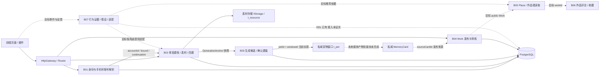
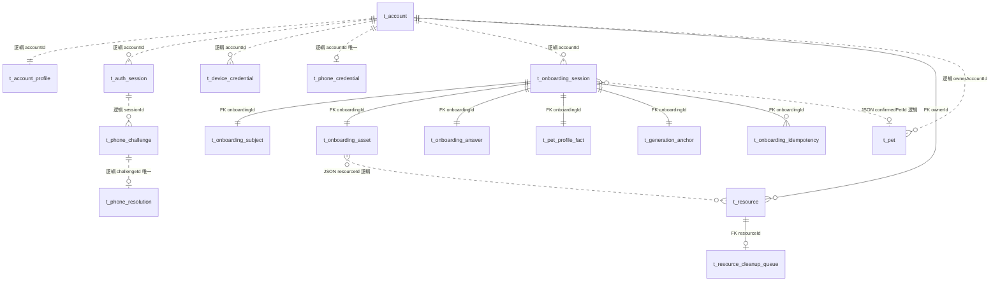
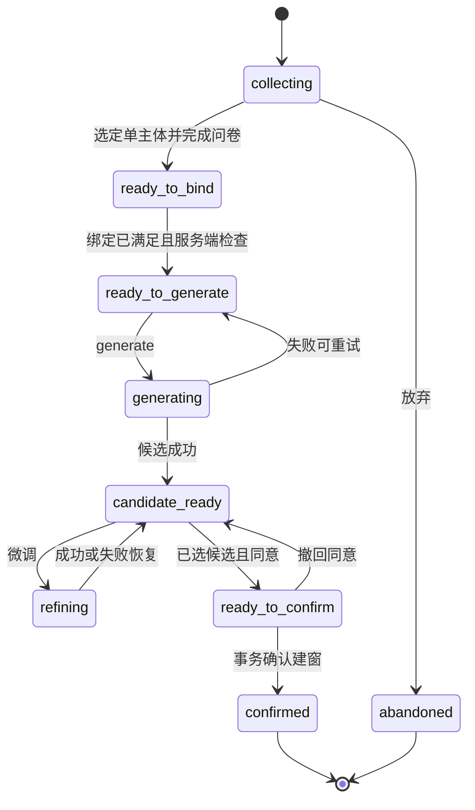
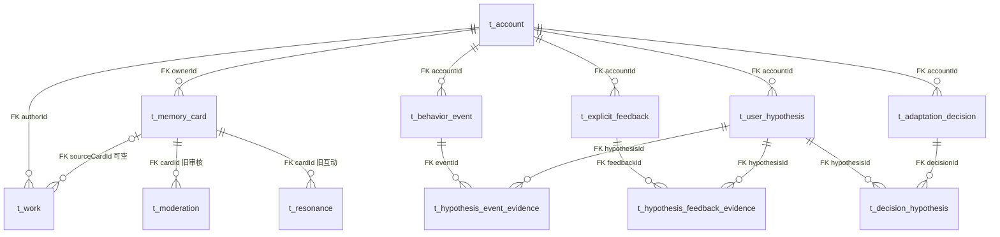

# 后端架构拓扑与数据承载（代码核实版）

对应阅读：[前端操作拓扑](FRONTEND-TOPOLOGY.md) · [统一进展与缺失](../CURRENT-DELIVERY-STATUS.md)。结构梳理已经完成，流程和异常验收状态以统一清单为准。

核实基线：后端 `backend/private-onboarding-integration`，提交 `dc3d196`；2026-09-08。本文是结构与缺口说明，不是整版验收签收。统一节点 B01–B07 与前端拓扑逐项对应。代码路径均相对后端仓库根目录。

## 1. 系统边界和总拓扑

实线表示代码中已有调用/存储边界，不自动代表验收通过；虚线表示已定义方向或未连通能力。当前 `/plaza` 实际读取 MemoryCard，尚未按上图目标切换为 Work。

| 节点 | 后端负责的权威结果 | 当前代码事实 | 完成边界 / 缺失 |
|---|---|---|---|
| B01 身份 | accountId、是否绑定、凭据撤销、账号切换、续接决议 | PostgreSQL 身份服务、开发固定码、幂等及频控已实现 | 已有专项和绑定联调证据；建档续接需整链验收；真实短信后置 |
| B02 建档 | 素材归属、单对象选择、质量门控、答案、事实、会话版本 | 持久会话、5 张 JSON 投影、上传读权限、四题保存 | 真实素材质量与跨素材主体效果待验收；投影不是逐对象独立关系表 |
| B03 生成建窗 | 生成状态、候选、确认结果、唯一建窗 | LLM 文案 + 固定视觉候选；事务写 pet 与会话 | 不是图片、四格或视频生成完成；无进程重启补偿，任务中断可卡在生成态 |
| B04 作品审核 | Work 生命周期、审核复用、投稿名额、允许操作 | `POST /works` 写 pending；读取与软删已有 | 未形成 Work 审核闭环、凭证复用及单通道交付 |
| B05 Plaza | 可见性、排序分页、匿名批次、作者作品墙 | `/works` 与作者作品列表已有；`/plaza` 仍 Card | Work 唯一公开链未贯通，2 小时约 30 条新规则需独立验收 |
| B06 互动收藏 | 两层评论、热/新排序、删除计数、治理、私有收藏 | 老 Card 共鸣、留言、关注表及实现存在 | 不能复称为 Work 评论/收藏完成；未找到新 Work 评论/收藏域实现 |
| B07 行为 | 原始事实、显式反馈、推断、动作按用途隔离 | 四类对象及证据/偏好/清除表 DDL 已有 | 未找到完整行为 API/服务接入；DDL 不代表采集、计算、清除作业已运行 |

## 2. 身份与建档 ER 图

图中实线标记 `FK` 的边才是数据库物理外键；虚线 `逻辑` 由应用维护。`JSON` 子对象没有独立行外键。

关系中的基数表达允许的数据形态：数据库没有给 `t_pet.ownerAccountId` 加唯一约束；本建档确认适配器通过锁账号并复用该账号最早 pet，实现当前每账号一个宠物窗口的行为。不是“数据库一账号只能一宠”的事实。

### B01 表结构与秘密承载

| 表 | 主键 / 唯一键 | 内容 | 关联性质 |
|---|---|---|---|
| `t_account` | PK id；UK openId | 核心账号 status/createTime | 各域账号根 |
| `t_account_profile` | PK accountId；UK deviceId | guest、昵称头像、hasPet、默认私域、trainConsent | accountId 逻辑对应 account.id；guest 是现有绑定状态投影 |
| `t_auth_session` | PK sessionId；UK tokenHash | accountId、kind、status、deviceCredentialId、createdAt、revokedAt | account/device 均逻辑关系；没有 expiresAt |
| `t_device_credential` | PK credentialId；UK credentialHash | accountId、status、revocationReason、时间 | 逻辑账号关系；没有自然到期字段 |
| `t_phone_credential` | PK phoneHash；UK accountId | phoneCipher、账号、创建时间 | 手机摘要唯一，账号唯一；手机号密文保存 |
| `t_phone_challenge` | PK challengeId | phone/code 摘要、密文手机号、source account/session、purpose、continuation、尝试数及验证码有效期 | challenge 的期限不等于登录凭据期限 |
| `t_phone_resolution` | PK resolutionId；UK tokenHash/challengeId | bind_current / switch_existing、source/target account、续接资源、status/expiresAt/usedAt | 一次确认决议；不是长期登录凭据 |
| `t_auth_idempotency` | 复合 PK operation/actorScope/idempotencyKey | requestHash、responseCipher、replayUntil、结果 session/device IDs | 限时响应重放；不让已签发 token 自然失效 |
| `t_auth_rate_event` | PK eventId | dimension、subjectHash、createdAt | 手机/设备/IP 频率证据 |
| `t_auth_audit` | PK auditId | eventType、accountId/sessionId、subjectHash、detail | 身份操作审计，与画像推断分开 |

账号一旦绑定，设备凭据不得再登录该绑定账号；已有手机号切换不迁移源匿名资料。以上由 `auth/PgAuthService.java` 权威执行。阿里云为后置接入方向，开发固定 `9999` 的启用由 `EchoHttpBootstrap.runtimeSmsProvider()` 控制；不能视为生产短信已接通。

### B02 内容承载与扩展边界

| 表 / 聚合位置 | 物理行形态 | 保存内容 / 下游用途 |
|---|---|---|
| `t_onboarding_session` | PK onboardingId；accountId/status/currentStep/sessionVersion/时间独立列，payload 为 text JSON | 完整 `OnboardingAggregate`，是仓库恢复读取来源；含选中主体/候选、同意、生成任务、最终 pet/window ID |
| `t_onboarding_subject` | 一会话一行，PK/FK onboardingId；payload 数组 | subjectId、assetId、modelType/species/confidence、boundingBox、userSelected、identityClusterId |
| `t_onboarding_asset` | 一会话一行；payload 数组 | assetId/resourceId、image/video、slotIndex、selectedSubjectId、crop、qualityState/reason、identityState |
| `t_onboarding_answer` | 一会话一行；payload `{current,history}` | questionId、answerVersion、answerCodes、可选 freeText/source、supersedesId、回答与替换时间 |
| `t_pet_profile_fact` | 一会话一行；payload 数组 | dimension/value、sourceType/sourceRefId、confidence、visibility、allowedUses、有效起点/替代时间 |
| `t_generation_anchor` | 一会话一行；payload 数组 | sessionVersion，主体/素材/答案/事实快照，promptTemplateVersion、safetyDecision、创建时间 |
| `t_onboarding_idempotency` | 复合 PK onboardingId/idempotencyKey | requestHash、responseJson、createdAt；与会话更新同事务 |
| `t_resource` | PK resourceId，FK ownerId → account.id | storageKey/contentType/bytes/revokedAt；只记录文件索引归属，不存图片视频字节 |
| IStorage | 文件存储 | 原始媒体字节；经已鉴权的建档素材 content 接口读取 |

五张投影与主会话同事务覆盖更新。它们便于领域分区但目前并非每素材/事实/锚点一行，不能直接用 assetId/factId/anchorId 作数据库 FK，也不能把 JSON 内字段视为可直接索引的独立列。将来需要跨会话检索或逐事实更新时，应另开小单元设计迁移，不在此次拓扑中假定已完成。

### B02 → B03 状态与接口对齐

所有下列路由使用 `/api/v1` 前缀；表中省略前缀。前端以 snapshot 的 status/currentStep/sessionVersion/allowedActions 为依据。

| 用户动作 / 同名节点 | 权威接口 | 写入 / 返回 |
|---|---|---|
| B01 匿名进入 | POST `/auth/device/session` | 匿名账号/设备凭据/登录会话 |
| B02 创建、刷新恢复 | POST `/pet/onboarding`；GET `/pet/onboarding/:id` | 会话 ID 与完整 DTO；创建同账号同幂等键复用 |
| B02 上传 | POST `/pet/onboarding/:id/assets` multipart | resource + asset + subjects；最多 2 图片、2 视频；会话版本与幂等检查 |
| B02 素材展示 | GET `/pet/onboarding/:id/assets/:assetId/content` | 校验账号所有权后读取资源字节 |
| B02 选单主体 / 裁切 | POST `/pet/onboarding/:id/subject/select` | 选中主体、裁切、质量结果、进入 questionnaire |
| B02 称呼 / 四题 | PATCH `.../:id/profile`；PUT `.../:id/answers/:questionId` | 答案历史、事实；满足条件进入 ready_to_bind |
| B01 生成前绑定 | POST `/auth/phone/challenges` → POST `.../:challengeId/verify` → POST `/auth/phone/resolutions/:resolutionToken/confirm` | 续接意图 private_onboarding_generation；新号续用原 account；旧号切换后原进度不属于新 account |
| B03 生成 | POST `/pet/onboarding/:id/generate` | 服务端检查已绑定，生成 anchor、job，状态 generating |
| B03 查看 / 微调 | GET `.../:id`；POST `.../:id/refine` | 候选或 refining；生成失败回可重试状态 |
| B03 选候选 / 同意 | POST `.../:id/candidates/:candidateId/select`；PUT `.../:id/consent` | selectedCandidateId、同意版本；达到 ready_to_confirm |
| B03 确认 | POST `.../:id/confirm` | 同事务 t_pet + hasPet + confirmed，会话返回 petId/windowId |
| B02/B03 放弃 | DELETE `/pet/onboarding/:id` | abandoned；不是立即物理清除所有素材 |

放弃也适用于代码允许的其他未完成状态，上图仅画一条以保持清晰。生成 job 当前存于聚合 JSON 并交给进程内 Executor；有持久状态不等于有持久任务队列、重启补偿或媒体渲染引擎。

## 3. 公开内容与行为关系（已有结构，未完成新闭环）

`t_work.sourceCardId` 对未软删 Work 有局部唯一索引：一张来源卡同时最多一个未删除作品；自上传允许 NULL。`mediaKey/posterKey` 是资源索引的逻辑关系而非 SQL FK。Work 保存 title/body/topicIds、mediaType/width/height/durationMs、aiGenerated、originType、status、visibility、发布审核时间和软删信息。正文属于 Work；Card 保持私域来源身份。现在存在 `pending` 不证明 Work 审核迁移已执行，旧 `t_moderation.cardId` 不能自动审核 Work。

行为四类主键分别是 eventId/feedbackId/hypothesisId/decisionId。`contextJson` 承载事件上下文，`parametersJson` 承载动作参数，证据连接表负责可追溯关系。`scope/purposeCode` 区分 ui_adaptation/public_recommendation/private_generation；另有 `t_adaptation_preference` 和 `t_adaptation_profile_clear` 记录偏好与清除批次。尚需证明采集入口、算法执行、线上消费和保存/清除作业，不能仅凭建表宣称“画像系统完成”。

## 4. 技术缺失登记及下一最小单元

| 编号 | 可核实缺失 / 限制 | 下一项完成证据 |
|---|---|---|
| BE-G01 | B01 与 B02 单域通过不等于建档整链通过 | 新号上传→四题→绑定续接→开发候选→确认窗口及中途重新打开恢复已走通；旧号切换与异常组合仍待验 |
| BE-G02 | B03 只生成文案/主题候选，未生成宠物媒体 | 明确独立媒体产物单元，输出资源 ID / 类型 / 生成状态 / 渲染展示；当前不扩大建档验收口径 |
| BE-G03 | anchor 存四类快照，但 LLM 适配器仅消费 answerSnapshot 与 adjustment | 后续 Prompt 单元把授权主体/素材/事实如何消费、留痕和返回写成契约 |
| BE-G04 | generation/refine 使用进程内 Executor | 缺少启动补偿实现，任务中断可永久停在 generating/refining；需补偿实现及重启验收，不能靠登录 token 到期处理 |
| BE-G05 | petId = windowId；当前复用账号首 pet | 在未来多窗口单元明确身份分离；本轮不得将一窗一宠误写为独立 Window 表已存在 |
| BE-G06 | Work 提交后 pending，但新审核/名额/重提未形成验收 | 仅开展 B04 作品状态与投稿单通道单元 |
| BE-G07 | `/plaza` 仍 MemoryCard；Work 评论收藏域缺失 | B05 切公开读取对象，之后单独 B06；不得拿旧 Card 共鸣测试抵扣 |
| BE-G08 | B07 有 DDL、无完整执行证据 | 先实现一批事件接收 + 幂等 + 用途字段，再接反馈/推断/动作 |

上述是实现差距，不新增产品决定。完成态应分别记录“结构梳理完成”“本单元联调验收完成”“整版未完成”，按实际构建和测试证据更新。

## 5. 代码证据索引

- `echo-server/src/main/resources/sql/schema.sql`：所有 PK、FK、唯一索引及 JSON 载体；账号 162–299，作品 1342 起，行为 1470 起，建档 1658 起。
- `echo-server/src/main/java/com/echo/http/auth/PgAuthService.java`、`AuthApi.java`：身份操作、续接、凭据与四个身份写接口。
- `echo-server/src/main/java/com/echo/http/EchoHttpBootstrap.java`：持久实现装配、LLM/视觉适配器、身份续接校验与开发短信选择。
- `echo-server/src/main/java/com/echo/http/onboarding/OnboardingAggregate.java`：所有 JSON 子对象实际字段。
- `echo-server/src/main/java/com/echo/http/onboarding/PgOnboardingRepository.java`：主 payload 读取、行锁/CAS、投影和幂等同事务。
- `echo-server/src/main/java/com/echo/http/onboarding/OnboardingApi.java`、`OnboardingViews.java`：路由、状态、allowedActions、DTO、单主体和素材限制。
- `echo-server/src/main/java/com/echo/http/HttpGateway.java`：建档 multipart 上传、鉴权素材读取、孤立资源清理登记。
- `echo-server/src/main/java/com/echo/http/onboarding/ExecutorOnboardingGenerationPort.java`：当前生成能力边界。
- `echo-server/src/main/java/com/echo/http/onboarding/EchoOnboardingWindowPort.java`：建窗实际写表及 pet/window 复用关系。
- `echo-server/src/main/java/com/echo/http/WorksApi.java`、`work/WorkStore.java`：作品已有写入、读取、软删；没有完成新审核链的证据。
- `echo-server/src/main/java/com/echo/http/EchoApi.java`：`/plaza` 当前 Card 读取链。

本次仅只读核实与编写架构文档，没有重跑代码测试；测试签收以交付账本绑定的精确构建和主执行验收记录为准。
