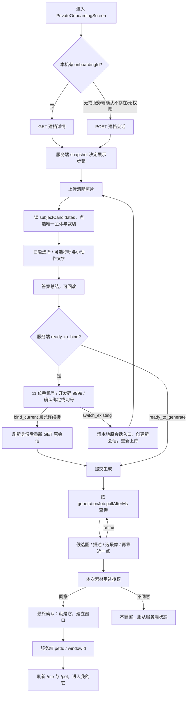

# 前端架构拓扑与用户操作流（2026-09-08 核查）

对应阅读：[后端数据拓扑](BACKEND-TOPOLOGY.md) · [统一进展与缺失](../CURRENT-DELIVERY-STATUS.md)。结构梳理已经完成，流程和异常验收状态以统一清单为准。

基线：前端 `frontend/private-onboarding-integration`，提交 `e9cac7a`。本页属于代码事实核查，不把组件存在、Mock 演示或接口类型当作完整验收。与后端拓扑以 B01—B07 对应；B02/B03 是同一私域交付单元内部的采集与生成阶段，不应因此另扩系统。

## 1. 整体脉络

```mermaid
flowchart TD
  Boot[App 启动 / bootstrap] --> B01[B01 身份：设备会话 / 手机号弹窗]
  B01 --> Me[/me：accountId / isGuest / hasPet]
  Me -->|已有宠物| Mine[我的它 MineScreen]
  Me -->|无宠物| B05[B05 PlazaScreen：当前旧 Card/Window 广场]
  B05 -->|试一试 / 建档| B02[B02 PrivateOnboardingScreen：上传 / 单宠裁切 / 四题]
  B02 -->|生成前绑定| B01
  B02 --> B03[B03 候选生成 / 选择 / 授权 / 确认建窗]
  B03 -->|petId，刷新 /me 与 /pet| Mine
  Mine --> B04[B04 PublishScreen / WorksFeedScreen：上传发布与作品墙]
  B04 -. 目标：同一 Work .-> B05
  B05 -. 目标：作品详情 .-> B06[B06 两层评论 / 收藏：尚缺完整页面]
  B06 -. 需绑定时原地回流 .-> B01
  B02 -. 目标：有版本行为契约 .-> B07[B07 Phase 0 行为采集：目前轻量 track]
  B05 -.-> B07
```

实线是已有代码入口/调用；虚线是已定目标、尚未完整实现。当前 `/plaza` 使用 `Paged<Window>`，`/works` 使用 `Paged<Work>`，仍是两条公开读取链。目标应以 Work 对接 Plaza；私人回忆卡继续保留私域职责。

## 2. 当前私域最小闭环



状态源：`snapshot.status/currentStep/allowedActions/sessionVersion/lastOperation/generationJob`。本机只保留当前会话入口与输入草稿。`ready_to_bind` 与 `ready_to_generate` 由服务端区分。身份结果的 `returnToAllowed/nextAction` 决定续接还是重建，前端不以手机号是否看似新号自行推测。

## 3. 页面—操作—内容—权威映射

所有路径以下默认 `/api/v1` 前缀；建档路径根为 `/pet/onboarding/{id}`。

| 节点/页面 | 用户看到什么、能做什么 | 请求和返回 | 权威与现状 |
|---|---|---|---|
| B01 启动 | 加载后进入广场或我的它 | device-session，再 `/me` | 服务端账号身份、绑定状态、hasPet；前端缓存不决定授权 |
| B01 手机弹窗 | 手机输入、验证码、绑定/切号确认、计时/错误 | challenge → verify → resolution confirm；返回账号、凭据处置、continuation结果 | 已有真实 HTTP 适配；开发固定9999与正式短信区分。确认失败保留界面；resolution过期未见专门重启入口 |
| B02 上传 | 首张清晰照片提示、上传反馈 | POST `/assets`，FormData；再 GET 详情 | 服务端 assetId/resourceId、素材校验；前端 object URL 仅即时预览 |
| B02 单宠裁切 | 素材、识别到的宠物、唯一点选、四滑块裁切 | POST `/subject/select`，subjectId/crop/expectedSessionVersion | 服务端判定唯一主体及可辨识度；前端只收集裁切比例 |
| B02 四题 | 初见地点、初见特征、生活习惯、首幅场景；可改答案 | PUT `/answers/q1..q4`；PATCH `/profile` | answerCodes/answerVersion，服务端持久化并推进状态；问卷文案/选项目前在前端常量 |
| B02 总结/绑定 | 四题摘要、回改、绑定提示 | 登录 continuation=private_onboarding_generation；成功再 GET | 身份刷新必须早于原会话 GET；切旧号不迁移原匿名内容 |
| B03 生成 | 提交、生成中、可暂离 | POST `/generate`；轮询 GET | jobId/status/pollAfterMs/lastOperation由后端给；失败数据保留 |
| B03 候选 | imageUrl或渐变占位、signature、选中/细化 | POST `/candidates/{candidateId}/select`、`/refine` | 候选是否真实模型生成，需后端运行配置和实际图片另证；渐变能显示不等于内容生成成功 |
| B03 授权/确认 | 本次用途授权、选中图、建立窗口 | PUT `/consent`；POST `/confirm`，candidateId/consentVersion/expectedSessionVersion | 后端版本校验、幂等建窗；响应含petId/windowId；App当前忽略回传petId而刷新当前pet |
| B04 发布页 | 素材、标题正文、可见性、提交成功 | `/upload` → POST `/works` | 已有基础上传发布；没有完整投稿名额、审核凭证、驳回重提/撤回操作消费 |
| B04 作品墙 | 自己作品封面、AI标识、状态标签、翻页 | GET `/users/{id}/works` | 游标来自后端；WorkCard为无onClick按钮，尚未进入完整作品详情 |
| B05 广场 | 当前旧卡流，打开旧窗口详情 | GET `/plaza` → `Window`；DetailScreen | 与Work还未统一，不能把旧DetailScreen当作品详情交付 |
| B06 评论收藏 | 目标：热门/最新一级3条，每条2回复，绑定后展开 | 当前未见完整Work评论/收藏客户端契约与页面 | 两层治理、计数分页、收藏权限均待本单元实现；旧留言/记住不是替代 |
| B07 行为 | 无需打扰用户的事件记录；主动反馈需另有页面 | `track` console + 可选 `VITE_TRACK_ENDPOINT` beacon | 当前并非Phase 0完整事件/反馈/假设/动作闭环；新PrivateOnboardingScreen未调用track |

## 4. 已发现的差额与验收缺口

| 编号 | 缺失/风险 | 责任与完成条件 |
|---|---|---|
| FE-01 | 已补 GET 失败后的“重新查询进度”按钮，只重新 GET、不重 POST；尚待断网恢复交互复验 | 前端：恢复查询可继续；QA断网→恢复后到候选；不得重新POST生成 |
| FE-02 | 选宠后问卷/总结无补传入口 | 2026-09-09 `ON1`：这是正确状态，不是缺口。补素材后置到后续流程，且必须过主体一致 |
| FE-03 | 选宠应收图片 | 2026-09-09 `ON2`：限制图片格式，视频不识别；不要再做视频首传专用失败页 |
| FE-04 | 候选/细化按钮多只检查busy，没有全面使用allowedActions | 前端：逐操作消费能力，仍以后端拒绝为最后权威；候选失效、权限变化可恢复 |
| FE-05 | 通用request每次调用新建幂等键；写成功但refreshAfter GET失败后用户重试不保证同键 | 前端/后端：验证响应丢失/读失败只恢复状态、不重复业务；后端version/唯一约束存在不等于前端恢复已验收 |
| FE-06 | 刷新恢复只存一个onboardingId；普通离开后回App启动不会自动进入建档 | 现有行为为再次点击建档后恢复；若产品要启动直接恢复须另定，不应隐含承诺 |
| FE-07 | Work列表无详情点击处理，Plaza旧链并存，WorkStatus缺uploading/submitting、无提交能力字段 | B04/B05/B06各单元分别补，不阻塞B02/B03私域验收 |
| FE-08 | 新号绑定→续建窗以及重新打开恢复第四题已验证；已有号切换→重传、生成中断网恢复仍待验 | 组合验收固定前后端提交/运行开关/素材/账号并保存真实请求响应与页面证据后才关闭 |

## 5. 代码检索入口

以下均相对 `echo-h5-proto/src/`：

- `App.tsx`：bootstrap分流、建档入口、onboardingDone、作品墙/发布浮层。
- `components/PrivateOnboardingScreen.tsx`：真实用户步骤、输入草稿、轮询和绑定续接。
- `lib/onboardingFlow.ts`：四题、视图派生、allowedActions查询。
- `api/onboardingContract.ts`：DTO、multipart、版本字段、写后GET、幂等键策略。
- `components/PhoneLoginCoordinator.tsx`、`api/authContract.ts`：统一手机号入口与身份结果。
- `api/client.ts`、`api/onboarding.ts`：VITE_API_BASE非空真接口，空值为本地Mock。
- `components/PublishScreen.tsx`、`components/WorksFeedScreen.tsx`、`api/http.ts`、`types.ts`：作品上传/列表与当前缺口。
- `api/track.ts`：轻量行为采集，不能等同Phase 0行为底座。

验收口径：本拓扑完成的是当前结构核查和缺口定位；不新增产品规则、不声称任何未真实联调的链路已通过。
