# 暖光 · 主人自己那一页的落点（`H-4` / `H-2` / `H-3`）

> 2026-08-27 · 前端视觉线

## 概述

读完这一节就等于拿到了这份文档的全部结论。

🔄 **2026-08-27 第三次更新。** 本轮新增三件事：面孔墙阈值已定并落地（§八）、`MeScreen` 那张卡按层级拆成两层（§十）、找到了**第四处**且它是前三处的根（§十一）。下面每一条都能在跑的应用里看到。

**落点。** `MineScreen`（那只它的页，紧贴 hero、回访之前）+ `MeScreen`（「被记得的回响」那一格）。
**不取 `UserProfileScreen`**：暖光是「这只被记着」，是窗的属性不是人的属性，挂到人的主页上就必须跨窗汇总，
而「这个人被记得的程度」跟那页已有的粉丝数并排，合起来就是一张作者名片上的两个指标。

**`H-2`（作者该不该看到）—— 该。** 我推翻了自己上一轮的建议，理由不是拍了板，是**上一轮漏查了 `MeScreen`**：
它当时已经给主人一个精确的「N 人记得它」，所以「对作者不出暖光」拔不掉任何根。
真正该分开的是：**「有人记得它」该给**（核心安慰），**「有多少人记得它」不该给**（那是分数）。

**`H-5`（已执行）。** `MeScreen`「N 人记得它」那一格已换成暖光。

**「被记得的回响」已按层级口径整张重做（已落地，§十）。** 裁定是**「记得」对应到对象身上、「看见」放在卡上面**，
且这是**数据层面**的口径。所以那三个数不是「要不要换」，**是它们根本不属于同一层**。现在这张卡有两层：
对象层给暖光 + 「也有人给它带过花」（🔴 **朵数去掉**）；卡层把「N 次被看见」换成
**「还有 N 张，还没有人看过」**——从「被看了多少次」换成「还有几张没被看过」，
后者有上限、越小越好、**多发卡只会让它变大**，刷不出好看的结果。

**`H-3` 文案定稿 —— 一套，读的人是谁都成立。**

| 档 | 定稿 | 作废 |
| --- | --- | --- |
| low | **这扇窗为它留着** | ~~静静被记得着~~ / ~~你一直记得它~~ |
| mid | **它常常被想起** | ~~一直被记得~~ / ~~有人和你一起记得它~~ |
| high | **它一直被记着** | ~~被很多人记挂着~~ |

上一版「主人一套 + 别人一套」**已被否掉**：这才刚起步，不能在文案层先分叉。
⚠️ **这是能上线的一套，不是终稿**，最终归口 `COPY-GUIDE`，由文档线在整体文案重写时统一定。

**形态。** 档位 = **外面裹了几层晕（0 / 1 / 2）**，不是同一个图形调透明度。
🔴 中心那一盏三档完全相同——低档不是「暗掉的高档」。有意不出面孔：**脸可以数，光不可以。**

🔄 **2026-08-27 收口，产品裁定四条：** ① 面孔墙**阈值取 5**，维持不动；② 朵花那行**留**（已拍板）；
③ 卡层点阵**未选，按本线推荐留着，但标为「暂定，未经裁定」**——代码里已标，不要当成已拍板的东西引用；
④ 🔴 **`C-10` 与 `C-8` 一并冻结**，理由是它俩同属网线侧、分开处理没意义（阈值只挡住眼睛，网线不收口等于没挡）。
三条契约项已落进 **`docs/API-CONTRACT.md` §18**，自查判准已落进 **`docs/visual/CHECKLIST-number-leak.md`**。

**`H-8` 面孔墙 —— 阈值取 5，已落地。** 裁定是「超过一定数量就不出可数的一排，少量照常出」。
🔴 **5 是出图定的**：取样图（§八）显示分界在 **5 与 6 之间**——≤5 一眼把握、读到的是「几个人」；
从 6 起要挨个点数，而**「点数」这个动作本身就是把它当分数在读**。外部依据是 subitizing 上限 4–5。
超过阈值时只留光晕，caption 原本那句「记得它的人，聚成了一片暖光」正好承接。
🔴 **代价，如实登记、不是「已解决」**：低于阈值时主人**仍然能数出精确人数**。产品知情接受，理由是小数目不构成可追的分数——但这是**接受**，不是**消除**。

**🔴 第四处（`C-10`），而且它是前三处的根。** `warmthLevel` 是**连续 double**，服务端算式
`min(1, faces / 20)` 就写在仓库里（`EchoApi.warmthLevel()`），`faces = round(warmthLevel × 20)` 一步反解。
🔴 **而且它不是只给主人的——每个访客都拿得到**，广场一次请求返回一页窗，
每个都带 `warmthLevel`，**任何客户端都能就地排出一份全站名次**。详见 §十一。

**待定项。** ① ✅ 朵花已裁定：**留**；② ⚠️ 卡层点阵**暂定留着，未经裁定**，定它需要产品在两版图之间选一版；
③ ❄️ `C-8` / `C-9` / `C-10` **已冻结**，条目全文见 `API-CONTRACT §18`，
**解冻前不要开工**；④ 档位分界点（0.55 / 0.8）仍未拍板，🔴 定它是 `C-10` 解冻后
「出参改发档位枚举」这条路的前置——**不知道有几档就没法定出参形状**。

---

## 一、「主页」是哪一个页

工程里有三个页都被叫过「主页」，先摊开：

| 页 | 顶栏写的 | 是谁的页 | 谁能看 | 页上已有的「量」 |
| --- | --- | --- | --- | --- |
| `MineScreen` | 「我的它」/ 亲友视角下「{name} 的主页」 | **那只宠物的** | 主人 + 亲友 | 羁绊温度（数字 + 六心 + 进度条） |
| `UserProfileScreen` | 「{nickname} 的主页」 | **一个人的** | 所有人（含陌生人） | 粉丝数 / 关注数（`E1` 明确公开且精确） |
| `MeScreen` | 「我」，代码注释自称「个人主页」 | 自己的账号页 | 只有本人 | 🔴 **N 人记得它 / N 次被看见 / N 朵花** |

产品负责人的原话是「广场应该是在**用户自己的**主页那边的」。「用户自己的」这四个字先排掉了
`UserProfileScreen` 的陌生人读法——陌生人看到的那一页叫「ta 的主页」，不叫「自己的」。

剩下 `MineScreen` 与 `MeScreen`，取 `MineScreen`。三条依据：

1. **性质对得上。** 暖光讲的是「**这只**被记着」。`MineScreen` 就是这只它的页，主卡是它的封面、
   它的名字、它的签名。而 `MeScreen` 是账号页，讲的是「我」。
2. **`UserProfileScreen` 会逼出一个作者分。** 那一页的墙上是**一个人的很多扇窗**。要在这一页出一个暖光，
   就得把这些窗的「被记得」汇总成一个数——而「这个人被记得的程度」和旁边那个粉丝数并排，
   合起来读就是一张作者名片上的两个指标。`D14`（不做全站作者排行榜）没被推翻，
   这是往那个方向走的第一步，不该迈。
3. **光需要一个能放下的位置。** `MeScreen` 是设置页的形态（一格一格的卡片 + 开关），
   往里塞一团会呼吸的光会很怪；`MineScreen` 本来就是一页情绪。

## 二、`H-2`：作者到底该不该看到——我推翻自己上一轮的建议

上一轮我建议「暖光对作者不出，摘掉 owner 那一格能拔掉攀比的根」。**这个建议是错的，
错在事实没查全**：

```
MeScreen.tsx:98-119   「🤍 被记得的回响」
  只有你能看到的一点温柔，不对外、不排名。
  {insights.rememberFacesCount} 人记得它
  {insights.seenCount}          次被看见
  {insights.flowersReceived}    朵花的心意
```

🔴 **主人今天已经能看到一个精确的「N 人记得它」，而且是三个数并排、像一个仪表盘。**
在这个前提下「不给主人看暖光」拔不掉任何根——它只是让主人少看一团模糊的光，
那个可以每天回来盯着涨落的精确数字原封不动。

所以真正该拆开的是被合在一起的两件事：

- **「有人记得它」该不该给主人？——该。** 不给，等于所有的「记得」都白发生了，
  这个产品的核心安慰就没了着落。
- **「有多少人记得它」该不该给主人？——不该。** 那不是安慰，那是一个分数，
  而且是唯一一个主人有动机去优化的分数。

**暖光正是前者的形态**：它把「有人记得」说出来，同时把「有多少」拿掉。所以答案是**该出**，
条件是它必须保持定性、不可累积、看不出涨落。

### 🔴 附带的前置条件（本轮不擅自改，登记待拍）

如果暖光进了 `MineScreen`，而 `MeScreen` 那三个精确数字原样留着，**暖光立刻变成废话**——
主人手上有精确数，没人会去看模糊的光；更糟的是，产品同时在说两套话。

**建议：用暖光取代 `MeScreen` 的「N 人记得它」那一格。** 这样一来：

- 主人仍然知道有人记得它；
- 不再有一个精确数字可以盯；
- 🔴 `D5`「不排名、不比数量」在主人侧**第一次真正成立**——今天它只在陌生人侧成立。

「N 次被看见」「N 朵花的心意」另算，它们不是同一件事，我没有结论。

## 三、三档长什么样

同一份 `STRANGER_PET`、同一个位置，三版只差档位这一项。

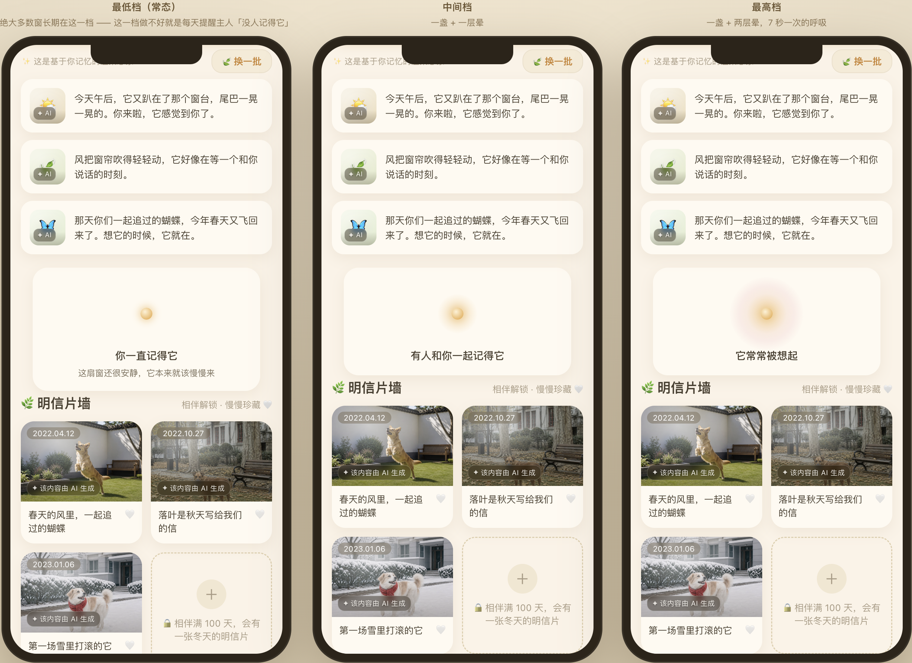

近看那一块：

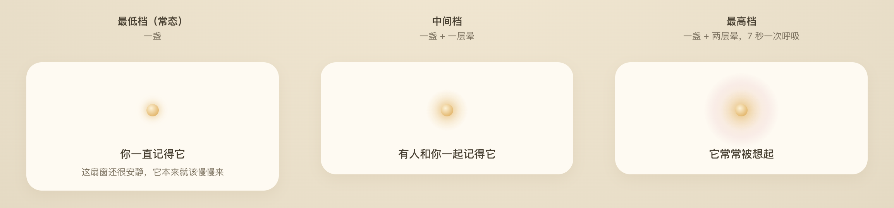

**形态规则：档位 = 有几层晕，不是同一个图形调透明度。**

| 档 | 光 |
| --- | --- |
| low | 一盏 |
| mid | 一盏 + 一层晕 |
| high | 一盏 + 两层晕，7 秒一次的呼吸（幅度 ±6%，要「活着」不要「在闪」） |

两条理由：① 透明度在 390px 宽的屏上分不出来（第一轮的连续/三档对比图已经证过）；
② 🔴 圈层只有 0/1/2 三种取值，**看不出「离下一档还差多少」**，也就没有一个可以每天回来追的目标。

🔴 **有意不出面孔。** 窗口详情页的暖光是「光晕 + 面孔墙」，主人这一页只有光。
理由不是省版面：**脸是可以数的，光不可以。** 给主人一排头像，等于把刚拿掉的那个数字换个形式发回去。

## 四、最低档：为什么它不会读成「没人记得它」

🔴 **绝大多数窗长期都在最低档，那才是常态。** 这一档做不好，就是每天提醒主人「没人记得它」，
在这个产品里是实伤害。

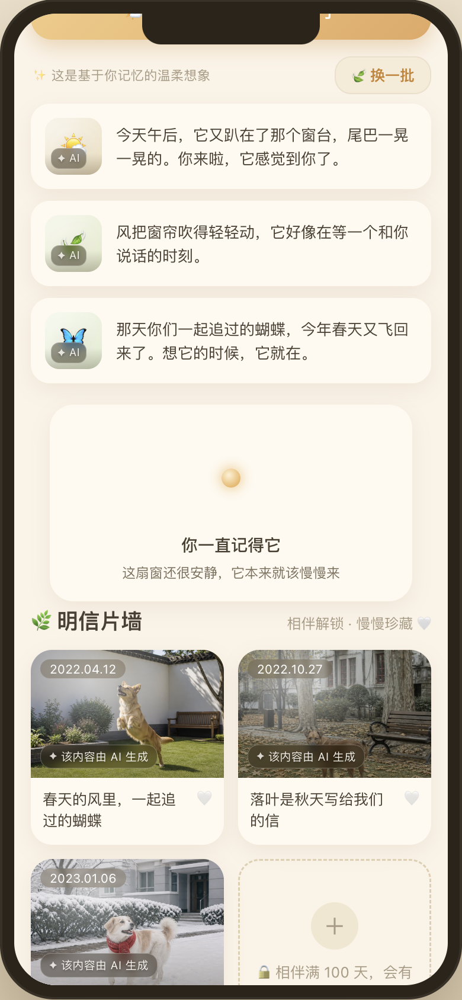

处理方式**不是把「少」说得好听**——那是粉饰，用户读得出来。是四件事：

1. **换主语。** 最低档说的是「**你**一直记得它」。这句**永远为真**：主人本人就在记得，
   这是这个产品成立的前提本身，不是安慰话。主人读到的是「我记得它」，不是「没人记得它」。
2. **那一盏灯和最高档一模一样。** 中心的核心光点三档完全相同，
   低档不是「暗掉的高档」，它是完整的一盏。少的是外面裹着的东西，不是它自己。
3. **占同样的位置、同样的高度。** 三档的光区都是 88px，块的位置一致。
   低档不塌陷、不缩水，页面上没有一个「空出来的坑」。
4. **补一句把安静定性成常态：**「这扇窗还很安静，它本来就该慢慢来」。
   🔴 只有最低档给这一句——它防的是主人把安静读成「我做错了什么」。

## 五、`H-3`：三档文案

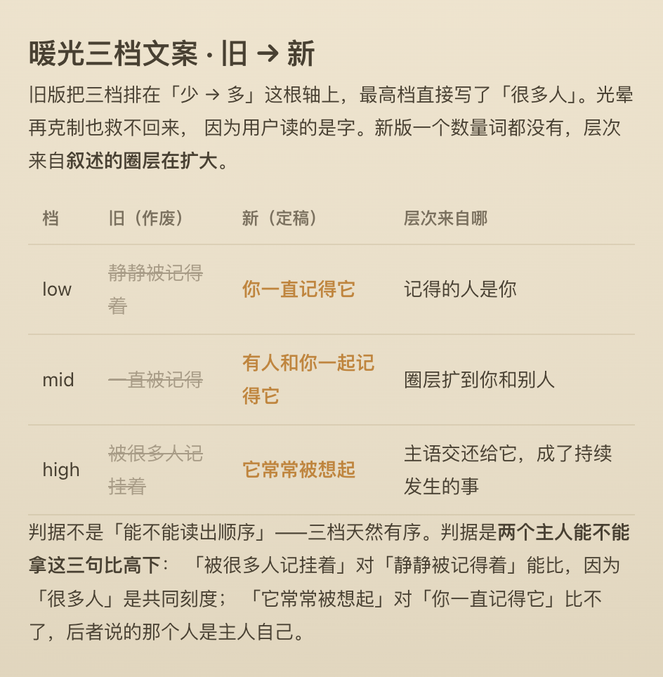

旧的 high 档「被很多人记挂着」**本身就是一句数量陈述**，它把三档排成了「少 → 多」这根轴，
正是 `D5` 要防的。光晕再克制也救不回来，因为用户读的是字。

**层次不来自同一根刻度上的高低，来自叙述的圈层在扩大**：低档说那个必然存在的人 →
中档说圈层扩到了别人 → 高档把主语交还给「它」。

🔴 **判据不是「能不能读出顺序」**——三档天然有序，任何三句都能排出先后。
**判据是：两个主人能不能拿这三句比高下。**

- 「被很多人记挂着」对「静静被记得着」——**能比**，因为「很多人」是一把共同刻度。
- 「它常常被想起」对「你一直记得它」——**比不了**，它们讲的甚至不是同一件事：
  后面那句里的那个人是主人自己。

**两套文案（主人 / 别人）不是麻烦，正是它挡住攀比的地方**：两个人看同一扇窗看到的字不一样，
就没有一个共同刻度可以拿来比。别人那一套的低档必须写「主人一直记得它」而不是「你一直记得它」——
读它的人还没开始记得。

定义在 `src/dev/design/designData.ts` 的 `TIER_LABEL_OWNER` / `TIER_LABEL_VISITOR` / `TIER_SUB_OWNER`，
🔴 **只此一份**，陌生人窗口页的 hero 也读这一份。

## 五之二、`H-3` 定稿的一套，以及我是怎么验证「读的人是谁都成立」的

产品否掉了两套（主人一套 / 别人一套），要求出**一套**，约束仍是那条判据：
**两个主人不能拿这三句比高下。**

上一版那两套都不能直接拿来当这一套：「你一直记得它」别人读不通，「主人一直记得它」主人自己读会怪。
重找的思路是产品给的方向——**把主语从人身上挪开**：

| 档 | 定稿 | 主语 | 说的是什么 |
| --- | --- | --- | --- |
| low | **这扇窗为它留着** | 这扇窗 | **这个地方在替它留位置** |
| mid | **它常常被想起** | 它 | 被记得，反复发生 |
| high | **它一直被记着** | 它 | 被记得，不间断 |

层次的来源变了：**低档说的是这扇窗的状态，中高档说的才是「被记得」在时间上的形状。**
所以低档**不含任何关于「有多少人」的信息**——它讲的是平台的承诺，那件事永远为真。
「它一直被记着」对「这扇窗为它留着」比不了，因为后者压根不是在说有几个人惦记它。

### 我怎么验证的（两层，不是靠读着顺口）

**第一层：机械守卫，写成了单元测试**（`src/lib/warmth.test.ts`）。

- 🔴 **禁视角词**（你 / 您 / 我 / 主人 / ta / 他 / 她 / 自己）。
  这一条正是「读的人是谁都成立」的可判定形式：**一句话里没有视角词，
  它就不可能只对某一类读者成立。** 上一版两套之所以是两套，就是因为低档写了「你」和「主人」。
- 🔴 **禁数量陈述**（阿拉伯数字、汉字数词 + 量词、很多 / 不少 / 多少 / 几个 / 最多 / 更多 …）。
- 🔴 **守卫自己要能报警**：测试里拿**真的被枪毙过的那几句**去撞它——「被很多人记挂着」
  「你一直记得它」「主人一直记得它」必须全部命中。
  **一条永远不会红的红线测试没有价值，而且看不出来它没价值。**
- ⚠️ 写这条测试时被自己的文案绊了一下：「它**一**直被记着」里的「一」撞上了汉字数词。
  所以规则改成了**数词后面跟着量词才算数量**——这条边界不是设计出来的，是被测试逼出来的。

为什么用测试而不是注释：**上一版的 high 档「被很多人记挂着」在库里活了很久，
期间 `warmth.ts` 的注释一直写着「不得出现人数」。注释拦不住下一个人。**

**第二层：在三种真实身份的版面上各渲染一遍。** 一套文案的前提是它在每一种读者面前都成立，
所以三档必须在三个身份的页面上都看过：

| 身份 | 页 | 图 |
| --- | --- | --- |
| 主人看那只它 | `MineScreen` | §六 |
| 主人看自己账号 | `MeScreen` | §六 |
| **陌生人看别人的窗** | 窗口页 hero | 下图 |

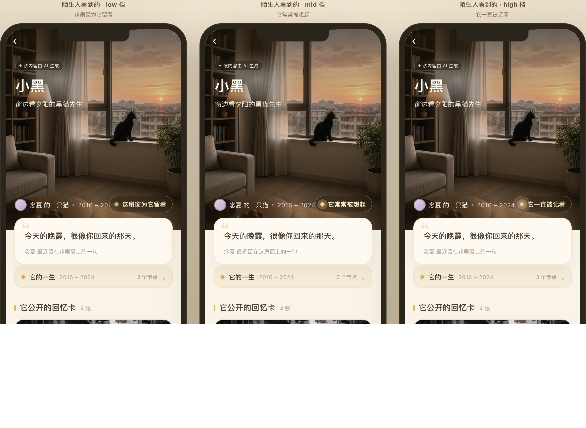

`warmth-visitor-three-tiers-VERIFY.png`

🔴 **这张图是「一套」这个前提的证据，不是装饰。** 最难的是低档：
「这扇窗为它留着」如果在陌生人页读不通，一套就不成立，得回去重写。
图上它读得通——陌生人读到的是「这个地方在替这只它留着」，跟主人读到的是同一件事。

⚠️ **两层都不能证明它「好」，只能证明它「不违规、且到处读得通」。**
好不好是产品判断，图交出来就是为了让人判这个。

## 六、落地后的实拍：`MineScreen` / `MeScreen` 各三档

🔄 **§三～§五 的图是设计稿，下面这批是真应用实拍。** 同一份数据、同一个位置，
只把 mock 的 `warmthByWindow['w-mine']` 换了三个值（0.30 / 0.65 / 0.95）。

### `MineScreen`（那只它的页）

| 档 | 图 |
| --- | --- |
| low | `warmth-mine-low.png` |
| mid | `warmth-mine-mid.png` |
| high | `warmth-mine-high.png` |

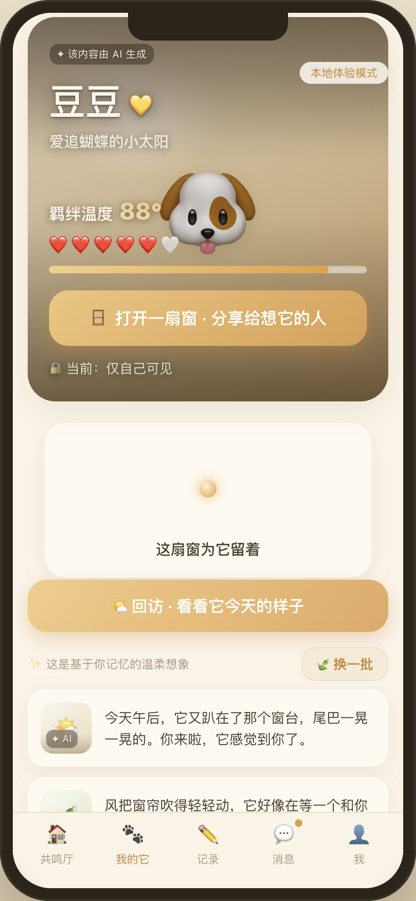

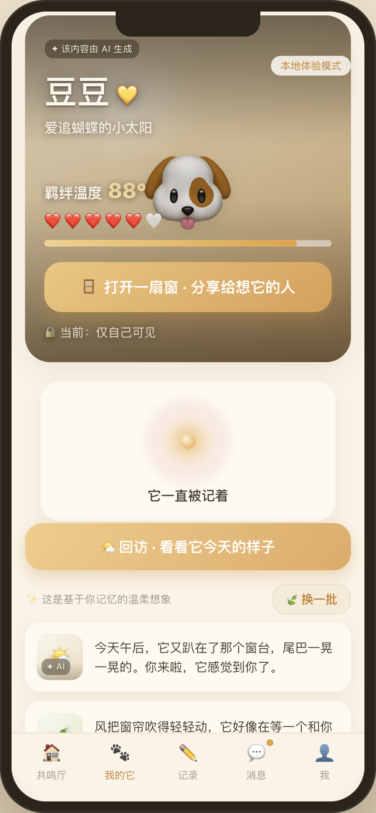

**位置定在紧贴 hero、回访之前（`H-6`）**，两条理由：

1. hero 讲的是「羁绊温度」——**我**给它的；暖光讲的是**别人**也记得它。这两件事挨着才成对。
   🔴 顺带把一条界线画在了同一屏上：**分母是自己的量可以给精确数（温度 88°），
   分母是别人的量只给光。**
2. 放到回访/回声之后，暖光会被夹在 AI 生成的近况中间。
   🔴 暖光是**真实发生过的事**，不该跟「温柔想象」混在一起被一起读。

⚠️ **亲友视角不出。** 这一页在亲友视角下渲染的是 `friend.pet`（示例数据、没有真实窗口 id），
出暖光只会把「我的」暖光画到别人的页上。

### `MeScreen`（「我」页 · 被记得的回响）

| 档 | 图 |
| --- | --- |
| low | `warmth-me-low.png` |
| mid | `warmth-me-mid.png` |
| high | `warmth-me-high.png` |

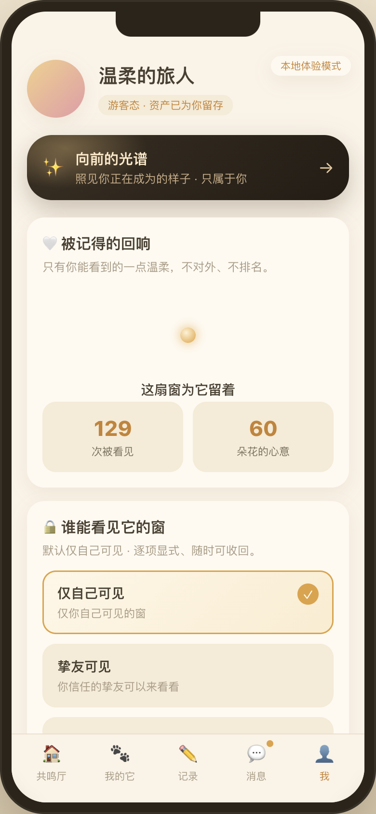

🔴 **这张图自己说明了 `H-7`。** 暖光刚说完「不给数」，紧接着下面两格就是两个 22px 的琥珀色大数字。
一格换掉之后，剩下那两格反而更扎眼了——这不是我改坏了，是原本就存在、只是被第一格盖住了。

## 七、`H-7`：「N 次被看见」「N 朵花的心意」——我的判断

产品本轮明确不动这两格，但要求登记。**我的判据是「这个数的分母是谁」：**

| 数 | 分母 | 性质 | 判断 |
| --- | --- | --- | --- |
| 羁绊温度 88° | **我自己**（只由主人陪伴驱动，外部献花不改） | 自我记录 | ✅ **该留，且该给精确数**。它衡量的是我陪了它多少，不是别人给了我多少 |
| ~~N 人记得它~~ | 别人 | 分数 | 🔄 已换成暖光 |
| **N 次被看见** | 别人 | 🔴 **分数，且是这三个里最像流量的一个** | 建议换掉 |
| **N 朵花的心意** | 别人 | 分数，但性质不同 | 建议留，理由见下 |
| 粉丝数 / 关注数 | 别人 | 分数 | 不重开：`E1` 已裁定公开且精确，且只在 `UserProfileScreen` 一处 |

**「N 次被看见」建议换掉。** 它是这几个里**最容易被优化的**：多发几张卡、把窗从私密改成公开，
它就涨。🔴 而且它衡量的根本不是「被记得」，是**曝光**——曝光是内容平台的指标，
不是一个替人存放思念的地方的指标。它留在「被记得的回响」这一格里，等于告诉主人
「让更多人看见」是这个产品想要你做的事。**这是我更担心的一条，比第一格更担心**，
因为「记得」至少还是我们想要的东西，「被看见」连方向都是错的。

**「N 朵花的心意」建议留。** 它跟前两个有一个实质差别：**献花是一次有成本的、指名道姓的动作**，
不是路过。所以它的数不是流量，更接近「有多少人特地为它做了一件事」。
⚠️ 但**我对这条没有把握**，它仍然是一个可以盯着涨的数；
如果产品觉得该一起换，我不反对——换成「有人为它献过花」这类不带数的说法即可。

🔴 **一条元判断：这三个数被放在同一张卡里，本身就是问题的一部分。**
它们排成一行、字号一致、颜色一致，读起来就是一个仪表盘。
即便三个数各自都合理，**把它们并排**这件事仍然在暗示「这些是你的成绩」。

## 八、`H-8`：撞见的第三处——面孔墙

> 🔄 **2026-08-27 已裁定并落地：阈值 5。** 裁定与取样过程见 §八之二；本节保留发现经过。

产品问「改生产代码时有没有撞见和 `MeScreen` 同类的第三处」。有，而且它两轮都躲过了检查。

```359:376:echo-client/echo-h5-proto/src/components/DetailScreen.tsx
          {/* —— 记得：暖光浓度 + 面孔墙（不显数字、不排名） —— */}
                <div className="warm-faces">
                  {wall.faces.map((f, i) => (
                    <span className={`warm-face ...`} />
                  ))}
                </div>
```

**主人打开自己的窗，就能看见一排真头像，一张一张数得清。**

🔴 **而且数脸等于反解暖光浓度。** mock 的实现是：

```266:275:echo-client/echo-h5-proto/src/api/mock.ts
function facesFor(windowId: string, warmth: number, ...): Face[] {
  const count = Math.min(11, Math.max(2, Math.round(warmth * 11)))
```

脸数是 `warmthLevel` 的一个确定函数。契约 §6 特意去掉了精确的 `rememberCount` 改用 `warmthLevel`，
**红线在契约层守住了，在渲染层漏了回来。**

**为什么两轮都没认出来：**

1. **形态不同。** 我们一直在找「一个数字」，而它是「一排可以数的对象」。
2. 🔴 **那行注释白纸黑字写着「不显数字、不排名」** ——它说的是真话（确实没有数字），
   但它描述的是**实现**，不是**后果**。注释成了它的护身符：看到那句就会以为这一处已经检查过了。
3. **它是我自己上一轮用来做正面对比的东西。** 我写「脸可以数，光不可以」来论证主页不该出面孔，
   却没回头看一眼**已经出着面孔的那一页**。

**我的判断：** 不是「删掉面孔墙」——面孔墙对**陌生人**是这个产品最好的一块，它让「有人也记得」
变得具体。问题只在**主人看自己的窗**这一种情形。可选的处置有两条：
① 主人看自己的窗时，面孔墙退成纯光晕（跟主页一致）；
② 服务端对 owner 请求把 `faces` 截到一个固定条数（比如恒定 5 张）并打乱，让它数不出信息。
🔴 **我倾向 ①**，因为 ② 是在数据上撒谎，而这个产品的诚实红线（AI 标识那一套）不该在这里破例。

**本轮没有改它**，因为它不在这轮的裁定范围内，而且它牵涉 `W2`「暖光对作者出不出」的可见性判定。
已登记 `H-8`。

## 九、怎么复现 / 怎么撤

暖光已经在生产代码里，**没有专门的比稿板了**（`home-warmth*` 四块已删——设计落地之后板子就该删，
交付物是图）。要重出三档图，直接跑真应用并改 mock：

```js
// 浏览器控制台，跑起应用之后
const d = JSON.parse(localStorage.getItem('echo.mock.db'))
d.warmthByWindow['w-mine'] = 0.30   // 0.30 low / 0.65 mid / 0.95 high
localStorage.setItem('echo.mock.db', JSON.stringify(d))
location.reload()
```

一套文案在陌生人侧的核对板仍在：`?design=visitor-tiers`。

**代码落点：** `src/components/WarmthGlow.tsx`（组件）、`src/lib/warmth.ts`（档位 + 文案，只此一份）、
`src/lib/warmth.test.ts`（两条红线的机械守卫）、`src/styles/app.css` 的 `.wglow-*`。

### 🔴 出图前必读：Vite HMR 会拿旧模块，且不报错

**症状：源码已经改对了，页面却还是老样子。** 没有报错，控制台干净，overlay 不出。

🔴 **出图是拿来拍板的，HMR 拿旧模块意味着一张用来做决策的图可能根本不对应当前代码。**
本轮它出现了两次：一次让「chip 已删」的页面上仍然显示着 chip（源码搜过是干净的），
一次让已删的比稿板链接仍留在索引页上。第一次如果信了浏览器，就会去「修」一处根本没问题的代码。

- **识别：** 用 `rg` 在源码里搜你改的那个字符串/类名。**源码干净但页面上还在 = HMR 拿了旧模块。**
  反过来源码里还搜得到，那才是真没改干净。🔴 **先搜源码，再信页面。**
- **处理：** 重启 dev server 重出。**别在浏览器里反复刷新**——整页刷新一样会拿到旧模块
  （`S-3`，本工作区的文件监听问题，不是代码问题）。

```
lsof -ti:5173 | xargs -r kill -9 && rm -rf node_modules/.vite && npm run dev
```

🔴 **凡是要交出去当依据的图，都在重启后的那一次里截。** 同一条也写在 `src/dev/VisualCompare.tsx` 文件头。

---

## 八之二、`H-8` 阈值：取样图与判断（2026-08-27）

**裁定原文：面孔数超过一定数量就忽略，少量可以展示。** 不取「主人侧一律退成纯光晕」——
产品的判断是**人少的时候，几张脸本身就是安慰**：「有三个人记得它」和「一团光」给人的东西不一样，
前者是具体的人。**变成分数是规模造成的，不是头像造成的。**

阈值不靠推理，靠图。两组取样，**同一位置、同一份数据、光晕锁定 0.55，只有脸数不同**：

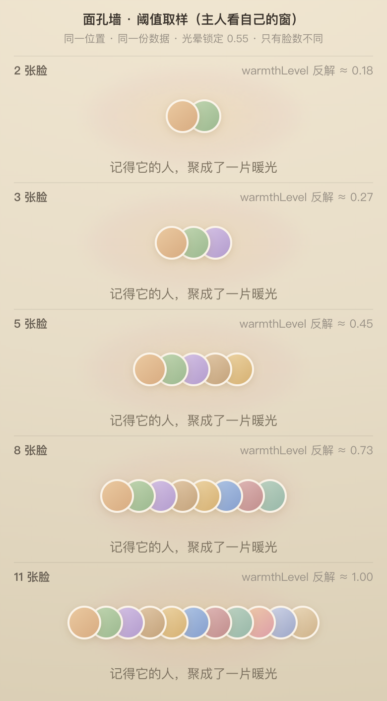

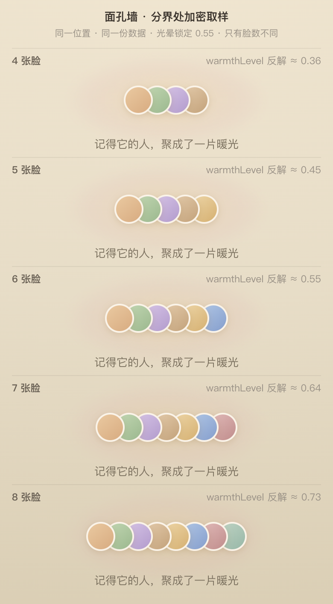

### 我从哪一张开始觉得它变成了分数

**第 6 张。** 前五张（2/3/4/5）读到的都是「几个人」——整排能一眼把握，不需要点数。
从 6 张起有两件事同时发生：头像开始互相挤压，**整排的宽度成了主要视觉信号**；
而要说出到底几张，就得挨个点过去。🔴 **「点数」这个动作本身就是把它当分数在读。**
8 张已经是一条链，11 张只剩长度——那时候脸是谁已经不重要了。

**所以阈值取 5**（≤5 出脸，≥6 只留光晕）。5 而不是 6，是因为 5 有外部依据：
人一眼能把握的数量上限（subitizing）通常是 4–5，超过就转成逐个计数。
6 只有「看着还行」。产品若要更宽松，改 `DetailScreen.tsx` 里 `FACE_WALL_MAX` 这一个常量即可。

### 落地后两态实拍

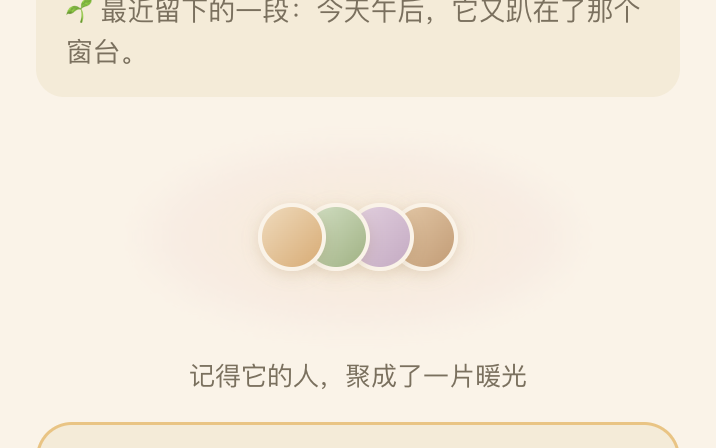

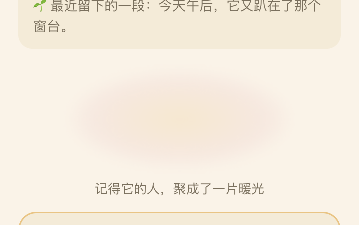

超过阈值的那一版不需要新文案：caption 原本就是「记得它的人，聚成了一片暖光」——
**那句话本来就是为「一片光」写的**，之前反而是被下面那排脸给拆穿了。

### 🔴 一条代价，如实登记，不要写成「已解决」

**低于阈值时，主人仍然能数出精确人数。** 四张脸就是四个人，一眼可数。
产品是**知情接受**的，理由是小数目不构成可追的分数——这条理由我认同，
但它是**接受**，不是**消除**。这一处仍然在给主人一个准确的、分母是别人的量，只是量小。

### 🔴 `C-8` 在阈值方案下更要紧

`rememberWall` 出参仍然带 `faces`。**渲染层不给 ≠ 数据没发。**
现在超过阈值时前端根本不画那排头像了，于是问题变得具体：
**超过阈值时那批头像还传不传？** 传的话，任何人打开控制台就能数出 `faces.length` ——
阈值只挡住了眼睛，没挡住数据。这条得在契约里说死，归服务端线。

---

## 十、`MeScreen`「被记得的回响」：按层级拆成两层（2026-08-27，已落地）

### 裁定

> **「记得」对应到对象身上，「看见」放在卡上面。** 且这是**数据层面**的口径，不是展示口径。

所以原来那三个数不是「要不要换」的问题，**是它们根本不属于同一层**：
「记得」是这只宠物被记得，「看见」是某一张卡被看了。
把它们并排在一张卡里、同字号同颜色，**本身就是把两个层级的东西伪装成同一排指标**——
我上一轮那条元判断（「并排这件事在暗示这些是你的成绩」）只说对了一半，
另一半是**它们连量纲都不是一个**。

### 改前 / 改后

同一位置、同一份数据（`warmthLevel = 0.65`，中档）：

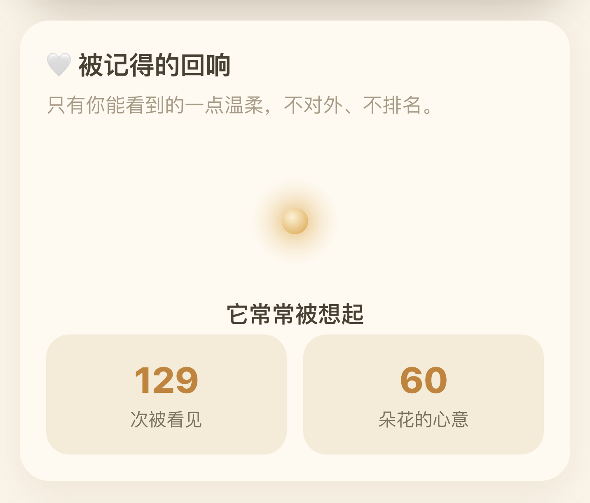

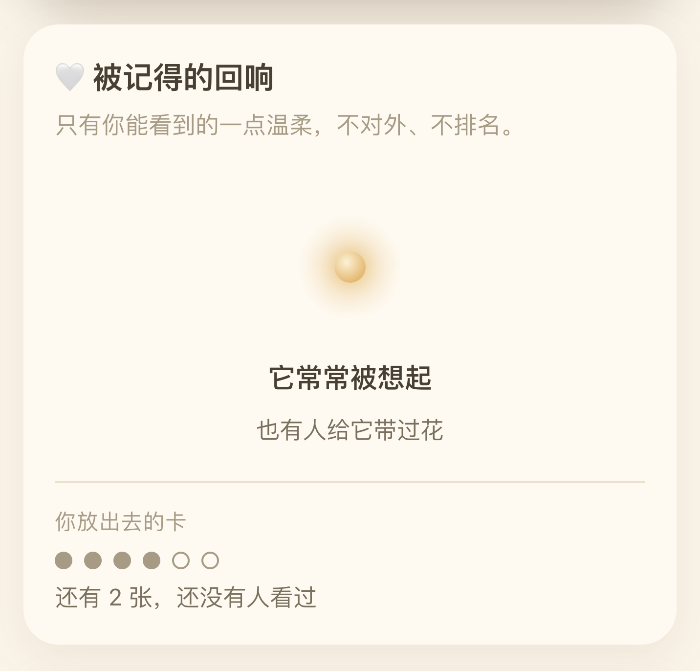

**两层在视觉上必须能被一眼分开**，所以居中/左对齐、暖色/灰、大/小 **三项一起变**。
只改其中一项（比如只把字号调小）在 390px 宽的屏上分不出层级，读者仍会读成并列的两项。

### 对象层放什么

暖光 + `WARMTH_PHRASE` + 「也有人给它带过花」。**都不给数。**

🔴 **「N 朵花」的数值去掉了。** 累计朵数无上限、只增不减，和「N 人记得它」是同一类分数。
**送过花这件事保留**（那是别人为它做过的一件具体的事，不是路过），**送了多少朵不给**。

### 卡层放什么

🔴 **「N 次被看见」不是被删掉，是换了量**：从「被看了多少次」换成 **「还有 N 张，还没有人看过」**。

理由是产品已采纳的那条：**它衡量的是曝光，而曝光是内容平台的指标，不是一个替人存放思念的地方的指标。**
具体到这个数——旧的那个**多发卡就涨**，主人有动机去刷；新的这个：

- 有上限（自己的卡数），**越小越好，有终点**；
- 🔴 **多发一张卡只会让它变大** —— 优化方向从「多发」反转成「发得值得」；
- 它指向的动作是「要不要让那两张更容易被看到」，不是「我的分数是多少」。

⚠️ **这需要新出参。** `insights` 现在只有三个跨卡累计的标量，拿不出 per-card 状态，
`cardCount / unseenCardCount` 是 mock 先给的，登记为 `C-9`。
🔴 顺带说清一件事：**按层级口径，`insights.seenCount` 这个跨卡累计字段本身就不该存在**——
它把卡那一层的量汇总到了对象那一层。前端把三个数并排显示，只是把出参的形状照抄了一遍；**根在数据，不在版面。**

### 两处待判（图已出）

**① 「N 朵花」有 / 无：**

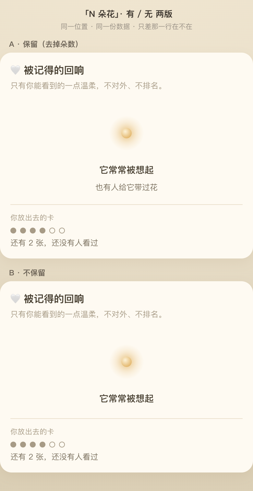

我的判断：**留 A（保留、去朵数）**。留着的那句是别人为它做过的事，撤掉之后对象层只剩暖光一句，
低档窗会显得更空——而低档才是常态。~~⚠️ 但这条我仍然没有十足把握，图给到这里，产品判。~~
✅ **2026-08-27 已裁定：留。** 这一行是拍过板的。

**② 卡层的点阵留 / 不留** —— ⚠️ 🔴 **产品未选，现状是「暂定，未经裁定」**，
按本线推荐留着，代码里已标。**不要把它当成已拍板的结论去引用或加固。**

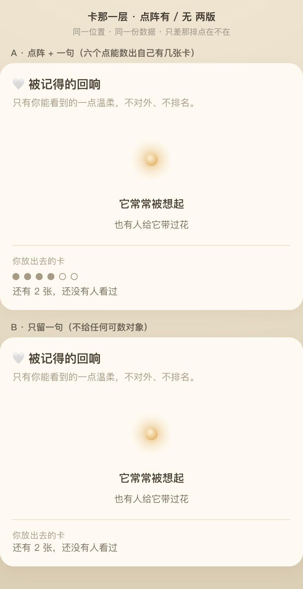

我的判断：**留 A（点阵 + 一句）**。点确实可数——但数出来的是**自己有几张卡**，
分母是自己、本来就知道，它不是别人给的量。而点阵让「哪几张还空着」变成一个**具体的、可指的东西**，
比一句话更像待办、更不像成绩。B 案更安全，代价是那句话孤零零地挂在那儿，很容易被跳过。

---

## 十一、第四处（`C-10`）：`warmthLevel` 本身

产品问「有没有第四处——前三处的共性是『不是数字、但能反解出数字』」。有，
🔴 **而且它不在屏幕上，它在网线上，它是前三处的根。**

```2394:2397:echo/echo-server/src/main/java/com/echo/http/EchoApi.java
    private double warmthLevel(int faces) {
        // 记得人数 → 暖光浓度（0..1），饱和函数，绝不对外暴露精确数字
        return Math.min(1.0, faces / 20.0);
    }
```

- `warmthLevel` 是**连续 double**，不是三档。前端渲染成三档，**数据不是三档**。
- 算式就写在仓库里。`faces = round(warmthLevel × 20)`，**一步反解，精确到人**（`faces ≤ 20` 时严格可逆）。
- 🔴 **它不是只给主人的。** `GET /windows/:windowId`（游客可看）、`GET /users/:id/windows`、
  `GET /windows/:id/remember` 都带这个字段——**每个能看到这扇窗的人都拿得到**。

⚠️ **2026-08-27 订正：下面这条我上一轮说重了，落档时回查服务端才发现。**

~~广场一次请求返回一页窗，每个都带 `warmthLevel`，任何客户端都能就地排出一份名次。~~
**广场自 `OM1` 起发的是卡，卡的字段表明确不含互动量**（`API-CONTRACT §6.0.2`：「暖意走窗级 `warmthLevel`」），
所以**没有任何一个端点一次交出一页 `warmthLevel`**。我上一轮是**照着前端 mock 判的契约**——
`api/mock.ts` 的 `plaza()` 仍是旧形状、逐窗附 `warmthLevel`。🔴 **照 mock 判契约会判错，这次就错了一回。**

订正后的说法**更准，但不更轻**：卡带 `petId`，翻广场收 N 个 `petId` 再逐个打 `GET /windows/:petId`，
**照样排得出名次，只是从 1 次请求变成 N+1 次**。`D14` 在服务端仍然没有被兜住，只是**成本被抬高了**。
🔴 **而且抬高成本这件事是 `OM1` 顺带做到的，不是为这条红线做的** —— 没有任何一处在守它，
下一次接口改动可能就把它还回来，且不会有人察觉。**「靠一次无关重构偶然挡住」比「根本没挡」更容易失守**，因为它看起来是安全的。

**而那行注释写着「绝不对外暴露精确数字」。** 它说的是真话——出参里确实没有整数字段。
但它**描述的是实现，不是后果**，所以看见它的人（包括我，前两轮）会以为这一处已经检查过了。
🔴 **这正是本轮刚立的那条通则的又一个实例**，详见 `docs/COPY-GUARD-CROSSWALK.md` §3。

### 我还查了、但**不是**第四处的

如实记下来，免得下一个人重查：

| 查了什么 | 结论 |
| --- | --- |
| 卡的高度 `span: 'short' / 'tall'` | 是作者数据，**不由暖光派生**。不漏。 |
| 广场排序 | mock 走固定 `catalog` 顺序，服务端没找到排序逻辑。**今天不漏，但契约没说死** —— 🔴 一旦线上按暖光排序，**位置就是名次**，而且前端看不出来。建议契约明确「广场顺序不得由暖光/互动量派生」。 |
| 献花花瓣 | 是点击时的一次性动画，数量与 `flowersReceived` 无关。不漏。 |
| 消息未读 / 亲友头像的「环」 | 都是布尔，不承载量。不漏。 |
| `HeartRow` 六颗心 | **同一个手法**（量 → 可数的重复对象），但分母是自己的温度，且旁边就印着精确度数。危害小 —— ⚠️ 但它说明**「把量渲染成可数对象」是这个工程的房屋风格，不是一次意外**。 |
| 明信片墙的解锁条件 | 「相伴满 100 天」「温度到 90°」是**显式给出的追赶目标**，分母是自己。不属于本类，但属于「可追的量」这个大类，另案。 |

### 🔴 一条能复用的判准 —— 已单独落档

判准、排除清单、以及「这是房屋风格不是意外」那条观察，
**已经搬到 `docs/visual/CHECKLIST-number-leak.md`**，本节不再重复。

搬走的理由：它是本轮最可复用的产出，埋在这份五百多行的专题文档里等于埋没；
而它该被读到的时机是**做任何涉及「别人给的量」的界面或出参之前**，不是「读暖光设计稿的时候」。
