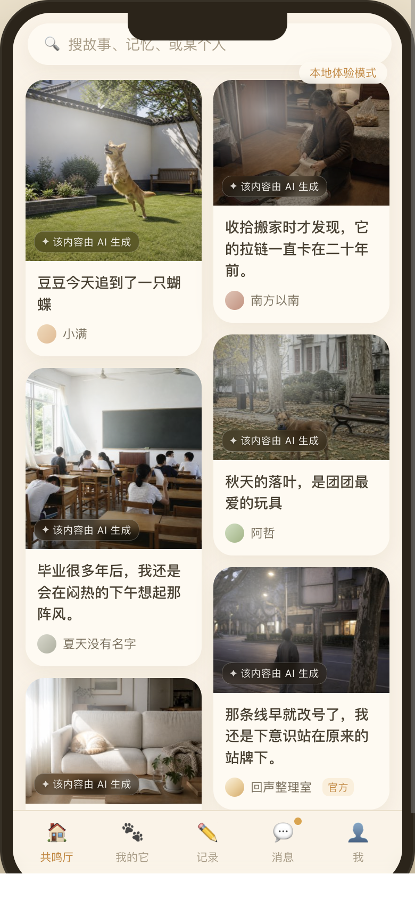
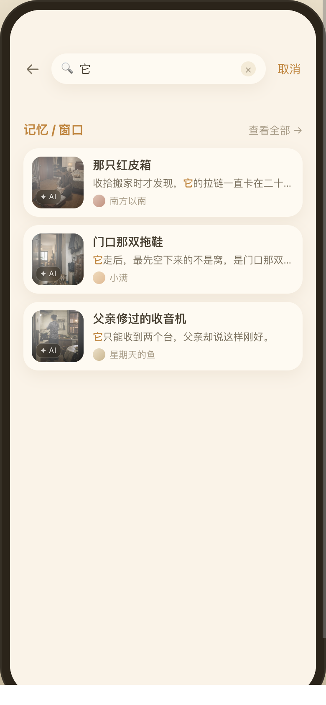
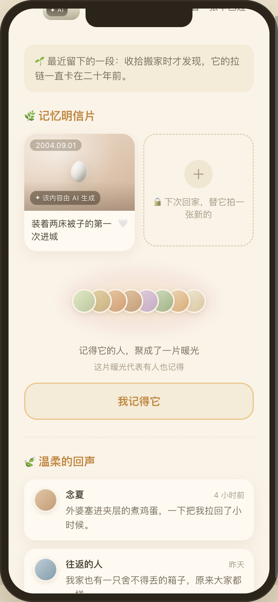

# 第二轮 · 设计稿说明

> 上一轮是「两个候选拍出来让人选」，本轮是「拿出一版看得上眼的」。
> 上一轮的图（`warmth-*.png` / `stranger-postcard-*.png`）与说明（`README.md`）**全部保留**，它们是本轮的决策依据。
>
> 🔴 **本文件里的每一张图都是真实 React 组件 + 真实 CSS 渲染的截图**，没有一张是画的、拼的或 AI 生成的界面稿。
> 素材图片本身是 AI 生成的实拍风格图，**AI 角标一律保留**。
>
> 出图入口：`src/dev/design/`，dev-only，`?design=<key>`。撤除方式见文末。

---

## 〇、一眼看完：交了什么、推荐哪版

| # | 图 | 内容 | 推荐 |
|---|---|---|---|
| 1 | `redesign-stranger-v1-vs-v2.png` | 陌生人窗口页两版并排 | — |
| 2 | `redesign-stranger-v2-1-hero.png`<br>`redesign-stranger-v2-2-public-cards.png`<br>`redesign-stranger-v2-3-postcards-actions.png` | **v2「章节 + 横滑」**，三屏走完 | ✅ **推荐** |
| 3 | `redesign-stranger-v1-1-hero.png`<br>`redesign-stranger-v1-2-lifebook.png` | v1「一条线读下来」，全纵向 | 备选 |
| 4 | `redesign-stranger-v2-cards-empty-state.png` | `B18` 一张公开卡都没有时 | ✅ 随 v2 |
| 5 | `redesign-warmth-tiers-form-and-copy.png` | 暖光三档的**形态 + 文案**，新旧对照 | 🔴 2026-08-26 作废，见 §四 |
| 6 | `redesign-warmth-plaza-current-vs-recommended.png` | 广场：现状 vs 推荐版 | 🔴 2026-08-26 作废，见 §四 |
| 7 | `redesign-warmth-plaza-current-vs-planA-vs-planB.png` | 三版并排 | 🔴 同上 |
| 8 | `redesign-warmth-plaza-planB-high-only-glow.png` | **乙案「只让高档发光」**，单版全屏 | 🔴 同上 |
| 9 | `redesign-warmth-plaza-planA-mark-only.png` | 甲案「只留标记」，单版全屏 | 🔴 同上 |
| 5–9 的替代 | `warmth-removed-plaza.png`<br>`warmth-removed-search.png`<br>`warmth-kept-window-detail.png` | **暖光只留窗口页**，改后真实组件的三张实拍 | ✅ **已执行** |
| 10 | `redesign-author-card-visibility-list.png`<br>`redesign-author-card-visibility-nonpublic-dimmed.png` | 作者逐张选公开范围 | ✅ 推荐 |
| 11 | `redesign-author-card-visibility-sheet.png` | 三档选择器 | ✅ 推荐三档 |
| 12 | `redesign-author-card-visibility-capped-by-window.png` | 🔴 卡不得宽于窗 | ✅ 必须有 |
| 13 | `fix-minescreen-hero-contrast-before-after.png` | `MineScreen` 主卡对比度修复 前/后 | ✅ **已改进代码** |

绝对路径统一是 `<文件名>`。

---

## 一、陌生人视角的窗口页 · 重做

### 1.1 起点换了

原来那一屏之所以是「封面 + 名字 + 签名 + 三分之二空白」，是因为它是**减法的产物**：拿主人自己的页面，把私密层一层层裁掉，剩下什么算什么。

本轮从「**该给什么**」出发。陌生人多半是从广场某张卡点「看它的整扇窗」进来的，带着对某一条具体回忆的兴趣，所以这一屏要回答两句话：

- **这是谁** —— 封面 hero + 名字签名 + 一句引言 + 「它的一生」
- **它还有什么** —— 「它公开的回忆卡」（`B18`）+ 「它收到的明信片」

### 1.2 v2 的信息层次（推荐）

| 顺序 | 块 | 回答 | 形态 | 为什么这么排 |
|---|---|---|---|---|
| 1 | 封面 hero（420px） | 这是谁 | 全宽实拍 + **上下两条压暗带** | 只压一头必然有一头读不出来，见 §五 |
| 2 | 作者行 + 年份区间 | 谁在记着它 | 压在 hero 底部 | 「念夏 的一只猫 · 2016 – 2024」一行给完身份与跨度 |
| 3 | 暖光标记 | 它被记着 | hero 右下角一枚 pill | 🔴 **全屏只出现这一次**，见 §四 |
| 4 | 引言卡 | 它此刻是什么样 | 上浮 26px 压住 hero | 把 `recent` 从「埋在中间的一行」提成进门第一句 |
| 5 | 它的一生 | 这是谁 | **横滑**三片，抽象封面 | 里程碑是背景信息，不该跟主内容抢纵深；且里程碑常常根本没照片 |
| 6 | **它公开的回忆卡** | 它还有什么 | **纵向大卡**，默认 3 张 | 这是这一屏真正的内容来源，单列大卡最接近「翻相册」 |
| 7 | 它收到的明信片 | 它被怎样对待 | 横滑小卡 | 已解锁位（`A` 案已定），量小、图为主，横滑最省纵深 |
| 8 | 动作条 | 我能做什么 | 「我记得它」+「留一束心意」 | `W5`/`W8`，陌生人可见 |
| 9 | 作者出口 | 还能去哪 | 一行弱链接 | 让这一屏有下一步，而不是死路 |

**为什么引入横滑**：这一屏有三类内容（里程碑 / 回忆卡 / 明信片），如果全部纵向堆叠，读者分不出主次，滑到底要 4 屏以上。横滑把两类**辅助内容**压成各一行的高度，纵向纵深留给唯一的主内容（回忆卡）。这是「分主次」，不是「为了花哨」。

### 1.3 v1 是什么、为什么不推荐

v1「一条线读下来」：全纵向、无横滑、卡片用紧凑行版。**改动面最小、最接近现有风格**，也确实不空了。

不推荐的原因：三类内容用同一种纵向节奏排下来，主内容（回忆卡）和辅助内容（生命之书、明信片）在版面上是平权的，读者读到第三屏还分不出「这扇窗最想让我看的是哪一块」。v1 解决了「空」，没解决「没有层次」。

**如果工期紧**，v1 可以先上：它与 v2 共用同一套数据契约与同一批组件，之后换排布不用改接口。

### 1.4 🔴 可见性红线：一格没动

| 块 | 编号 | 陌生人 | 本设计 |
|---|---|---|---|
| 羁绊温度 | `W13` | ❌ | 不出 |
| 回访近况列表 | `W15` | ❌ | 不出 |
| 暖光面孔墙（头像） | `W3` | ❌ | 不出 |
| 明信片**未解锁**位 + `unlockHint` | `W12` | ❌ | 不出 |
| 可见性设置行 | `W14` | ❌ | 不出 |
| 收花数 / 看过数 | `W9`/`W10` | ❌ | 不出 |
| 生命之书 | `W1` | ✅ 三档全可见 | 出（「它的一生」） |
| 暖光**浓度** | `W2` | ✅ 三档全可见 | 出（一处） |
| 我记得没 / 我记得它 / 献花 | `W4`/`W5`/`W8` | ✅ | 出 |
| 明信片**已解锁**位 | `W11` | ⚠️ 现为「仅本人+亲友」 | 出，**需契约放开**，见 §六 |
| 公开卡列表 | `B18` | — | 出，**整块需新增**，见 §六 |

判据来自 `echo-server` 正在建的 `com.echo.http.visibility.VisibilityMatrix`（白名单，fail-closed），上游是 `RESEARCH-window-content-ownership §4.1` 与 `SPEC-interaction-flow §10`。

> 🔴 **设计是在这张表**里做好看的，不是靠放开它。上表里唯一需要契约动的两处（`W11` 陌生人格、`B18` 整块），前者在 `VisibilityMatrix` 源码注释里就写着「要放开只改这一行」，后者本来就不存在。

---

## 二、`B18`「这只它的公开卡列表」· 设计细则

图：`redesign-stranger-v2-2-public-cards.png` · 空态 `redesign-stranger-v2-cards-empty-state.png`

### 2.1 卡片形态：封面 + 标题 + 两行摘要 + 日期

| 元素 | 取值 | 取舍理由 |
|---|---|---|
| 封面 | 全宽 172px | 图是这个产品的主语言；小图会让这一列退化成列表 |
| 主题 chip | 左上角，**只出第一个** | `t_memory_card.topicIds` 是 0–3 个数组，全出会把标题挤没 |
| 标题 | ≤30 字，最多两行 | 与 `t_memory_card.title` 的长度约束一致 |
| 摘要 | `body` 前两行，**硬截断** | 两行是「够判断要不要点」与「不剧透」的平衡点 |
| 日期 | 内容时间，弱化 | 排在最后、最小号：这是纪念内容，日期是线索不是标签 |
| ❌ 互动数 | **不出** | 窗级的「被记着」已经在 hero 出过一次；落到每张卡上就变成逐条比数量（`D5`） |

### 2.2 排序

默认 = **作者置顶的在前 + 其余按发布时间倒序**。

不用「按内容时间正序」的理由：这一列不是编年史（编年史是「它的一生」那一块的活），它回答的是「这扇窗最近拿出来给人看的是什么」。

> ⚠️ 图上那六张的顺序是**手排**的，为了让折叠阈值看得见，不是排序规则的示例。

### 2.3 折叠：默认 3 张，其余收进「还有 N 张 · 看全部」

3 张的理由：hero 之后正好是完整的一屏多一点。再多就变成「无限往下刷」，而这一屏的目的是**让人看完，然后决定要不要记得它** —— 底部的动作条必须在可达范围内。

### 2.4 空态：不画假框架

一张公开卡都没有时，出一句实话 + 把出口指向唯一还成立的动作。
**不出**「敬请期待」「主人还没有发布内容」这类占位式文案，也**不画**灰色卡片骨架 —— 那是在暗示「这里本该有东西，是它缺了」。

文案（待产品复核）：

> 它还没有公开的回忆卡
> 主人把这些留在了更里面一层。你看到的这扇窗，就是它此刻愿意让世界记住的样子。

### 2.5 封面缺失时

回落到既有的 `CoverPlaceholder` 渐变 + emoji 占位（「它的一生」那三片就是这个形态），不留白框。

---

## 三、作者可以选择哪些卡对陌生人开放

### 3.1 🔴 核实结论：**既不是全新功能，也不是「只缺入口」——缺的是端点那一层**

分三层说，三层的状态各不相同：

| 层 | 窗级可见性（`t_pet.visibility`） | **卡级**可见性（`t_memory_card.visibility`） |
|---|---|---|
| 数据 | ✅ 有列，默认 `private` | ✅ **有列**，`CHECK IN ('private','friends','public')`，默认 `private`（`schema.sql` L412/419） |
| 流水 | — | ✅ `t_card_visibility_log.changedRole` 的 `CHECK` 白名单**含 `author`**（L800/805） |
| 端点 | ✅ `PATCH /pet/me` 收 `visibility`（`API-CONTRACT` §「入参 `{signature?, visibility?}`」，`EchoApi.petMePatch` 已实现） | ❌ **没有任何卡级端点**，`EchoApi` 里 `/cards/*` 一条路由都没有 |
| 前端 | ✅ **已经有入口**：`MeScreen` 的三档选择器 → `api.petPatch({visibility})` | ❌ 前端连「卡」这个类型都没有（`types.ts` 里只有整扇窗的 `Window`） |

所以准确的说法是：

- **窗级**：端到端做完了，入口就在「我的」页，产品负责人说的能力在这一级**已经存在**。
- **卡级**：`schema` 早就假设作者可自改可见性（`changedRole` 白名单里有 `author` 就是证据），**但服务层与前端都还没有**。这不是「有能力没入口」，是**只有数据模型，没有能力**。

> ⚠️ 另有一条要一并知道：`PRODUCT-MINDMAP §OM1` 登记「排序规格整套按卡写，而 `t_memory_card` 在运行实现里没被接进去，实现落在 `t_pet` 上」。也就是说卡级可见性要落地，**前置是「卡」这个实体先真正跑起来**，不只是加两个接口。

### 3.2 入口设计

图：`redesign-author-card-visibility-list.png`（列表）· `..-nonpublic-dimmed.png`（非公开的卡）· `..-sheet.png`（选择器）

三个决定：

1. **入口就是卡封面右上角那枚 chip**（🌏 公开 / 👥 亲友 / 🔒 私密），不另开一个「隐私设置」页。
   理由：可见性是**这张卡的属性**，放在卡上改，改完立刻能看见结果；抽进设置页就变成一张需要来回对照的名单。
2. **非公开的卡整张压低存在感**（降透明度 + 蒙一层米色），不是只换个角标。
   这样「哪几张对外」在滑动中一眼可数，不用逐张读 chip。
3. **顶部一条说明带**，用「这扇窗现在长什么样」的口吻，不用「设置」的口吻：
   > 陌生人点进这扇窗，看到的就是标着 🌏 公开 的这几张。**看看别人眼里的样子 ›**

   末尾那个链接直接跳到 §一 的陌生人视角预览 —— 这是整个功能里最有说服力的一步：**让作者自己看一眼**，比任何解释文案都管用。

### 3.3 几档？——**建议三档（公开 / 亲友 / 私密）**

理由，按重要性排：

1. **窗已经是三档了。** 卡若只有两档，就会出现「窗是亲友可见、卡是公开」这种**表达不出来**的组合，用户改窗的时候会发现卡的设置对不上。
2. **亲友层是这个产品的主场。** 回忆本来就是先给亲近的人看的；把「只给家里人看」压进「不公开」，等于把最常用的那一档删掉。
3. **成本几乎为零。** `t_memory_card.visibility` 的 `CHECK` 已经是三值，两档反而要额外写一条「`friends` 不许用」的约束。

🔴 **必须配一条硬约束：卡的可见性不得宽于窗的可见性，实际生效值取两者的交集。**

否则「私密的窗 + 公开的卡」就是一条绕过窗可见性的路径 —— 而用户在把窗设成私密的时候，认为自己已经关严了。

UI 上的处理（图 `..-capped-by-window.png`）：超出窗可见性的档位**变灰但仍然显示**，并写明原因「这扇窗现在是「亲友可见」，卡不能比窗更开放」。
不藏起来的理由：藏了用户会以为功能没了，然后去别处找。

---

## 四、暖光的视觉语言 · 重做

> ### 🔴 本节的广场部分已于 **2026-08-26 被推翻并已执行**
>
> 产品裁定：**暖光只留窗口页**。原话是「广场应该是在用户自己的主页那边的，不是在瀑布流上」。
> 也就是说 §4.2 / §4.3 / §4.4 里那套「档位 = 有几层晕」「乙案只让高档发光」的方案**没有落点了** ——
> 它们解决的是「广场上怎么发光才不吵」，而广场上现在根本不发光。
>
> **已执行的处置（代码已改，不是提案）：**
>
> | 位置 | 处置 | 现状 |
> |---|---|---|
> | 广场瀑布卡（封面覆盖层 + 圆点 + 文案） | 🔴 整个去掉 |  |
> | 搜索结果行（圆点 + 文案） | 🔴 整个去掉 |  |
> | 窗口详情面孔墙光晕 | 保留，一格未动 |  |
> | 陌生人窗口页 hero | 保留（仍只在 `src/dev/` 的设计稿里，未上生产） | 见 §1.2 |
>
> **仍然成立的部分：** §4.5「暖光对作者本人出不出」🔴 **仍然挂起**，`W2` 的可见性判定一格未动。
> §4.4 里「high 档文案『被很多人记挂着』本身是一句数量陈述、违反 `D5`」这条也仍然成立，
> 已随 `warmthPhrase()` 一起搬进 `src/lib/warmth.ts` 并在那里登记。
>
> **下面 §4.1–§4.4 的原文保留**，作为「为什么当时走了那条路、又为什么被推翻」的记录。

### 4.1 🔴 核实：暖光今天出现在**三处**，建议保留**两处**

| # | 位置 | 现在长什么样 | 建议 |
|---|---|---|---|
| 1 | **广场瀑布卡** `PlazaScreen.tsx:117-149` | ① 封面整张叠 `.w-warmth-glow`，`opacity = .25 + w*.6`<br>② 作者行一个调透明度的圆点 `.w-warmth-dot`<br>③ 文案 `warmthPhrase(w)` | **保留，但只留 ②③ + high 档才给封面加光**，见 4.3 |
| 2 | **搜索结果行** `SearchScreen.tsx:91-97` | 圆点 + 文案（🔴 `warmthPhrase` 在这里是**第二份逐字重复的实现**，改一处会漏另一处） | 🔴 **建议整个去掉。** 搜索是「我知道我要找什么」的场景，暖光既不帮助判断哪条是我要的，也不该在这里制造对比。去掉之后 `warmthPhrase` 也顺带只剩一份 |
| 3 | **窗口详情的面孔墙** `.warm-wall` / `.warm-halo`（`--warmth` 驱动的 radial + 6s 呼吸） | 光晕 + 头像行 | **保留光，收掉脸**（面孔 `W3` 对陌生人本来就不出）。这是唯一一处暖光有足够画面去表达的地方 |
| 4 | 新增：陌生人窗口页 hero 右下角 | — | **新增一处**，全屏只此一次，见 §1.2 |

> **「满屏都在发光等于没有重点」的正面回答**：现状是广场每一张卡都亮。改后，广场上只有 high 档会亮，其余两档只有作者行一枚 6px 的标记 —— 亮重新变回一个信息。

### 4.2 表现设计：档位 = **有几层晕**，不是透明度

图：`redesign-warmth-tiers-form-and-copy.png`

现状的问题是同一个图形调 `opacity`：在 390px 宽的卡上，人眼分不出 0.52 和 0.64，第一轮的连续/三档对比图已经证明了这一点。

改后：

| 档 | 形态 | 说明 |
|---|---|---|
| `low` | 一个 6px 光点 | 没有晕 |
| `mid` | 光点 + **一层**晕 | |
| `high` | 光点 + **两层**晕 + 7 秒一次的呼吸 | 呼吸周期刻意放到 7 秒：扫视时只留下「这张在发光」，停下来才看得出它在动 |

🔴 **三档之所以不构成排行榜，靠的是「圈层只有 0/1/2 三种」**：它看不出「离下一档还差多少」，因此没有可追的目标。任何带刻度、带进度、带第四档的形态都会立刻变成分数条。

### 4.3 广场上的两版

| | 甲案「只留标记」 | 乙案「只让高档发光」 ✅ **推荐** |
|---|---|---|
| 封面 | 什么都不叠 | 只有 `high` 档，底部打一道自下而上的暖光 + 卡片带一点外溢的暖 |
| 作者行 | 标记 + 文案 | 同左 |
| 好处 | 封面最干净 | 封面同样干净，且**一屏之内有了主次** |
| 代价 | 一屏之内没有任何视觉重点，全靠读文字 | high 档在瀑布流里确实更显眼 |

**推荐乙案**，理由：产品负责人的原话是「表现设计 + 展示在哪里 + 三档效果」三件一起。甲案解决了前两件，第三件只落在文字上；乙案让三档在**扫视层面**也成立，而且代价是可控的 —— 亮的是少数。

🔴 **两版都先把封面覆盖层拿掉**：那一层同时输了两场 —— 淡到看不出档位差，又足够脏到把实拍封面压灰。对比图 `redesign-warmth-plaza-current-vs-recommended.png` 里，左边所有封面都发灰发糊，右边是原图。它是整套里唯一一处「既没表达信息、又损害了画面」的元素。

### 4.4 文案与光晕一起改

🔴 **这是本节最重要的一条**：标签比光晕显眼得多，用户真正读到的是它。

现状三句：`静静被记得着` / `一直被记得` / **`被很多人记挂着`**。

问题不在语气，在**最后一句本身就是一句数量陈述**。它没给数字，但给了数量级，于是三档被排成了「少 → 多」这一根轴 —— 正是 `D5`「不排名、不比数量」要防的东西。光晕再怎么克制也救不回来，因为用户读的是字。

建议改为**时间与状态轴**：

| 档 | 旧 | 新 |
|---|---|---|
| `low` | 静静被记得着 | **有人记得它** |
| `mid` | 一直被记得 | **常常被想起** |
| `high` | 被很多人记挂着 | **一直被记着** |

三句都在说「它被惦记着」，没有一句在说「有多少人」。

### 4.5 🔴 一条附带建议：暖光对**作者本人**不出

`VisibilityMatrix` 现在把 `WARMTH_LEVEL`(`W2`) 判成三档全可见，**包括 OWNER**。

建议收成 `FRIEND + STRANGER`。理由：攀比需要**看得见自己的分数**。访客看到「这只它被记着」构不成攀比（那不是他的窗）；只有作者天天看见自己那扇窗的档位，才会产生「我要冲到下一档」的动机。把 owner 那一格摘掉，等于在不损失任何功能的前提下，把攀比的根拔掉。

⚠️ 这条是**建议，不是已定论**，且需要产品拍板 —— 它会让作者失去「我这扇窗现在什么档」的自我感知。另注：owner 今天已能在「我的 · Insights」看到更精确的记得数，那条私域路径本轮没动。

---

## 五、`MineScreen` 主卡对比度 · 已改代码

图：`fix-minescreen-hero-contrast-before-after.png`（左前右后，只差这一处）

### 改了什么

`src/styles/app.css`：

1. 新增 `.pet-hero::after` —— **顶部**压暗带（190px，`rgba(38,27,12,.58)` → 透明）。
2. `.hero-name` / `.hero-sign` 改浅色 + 深色投影，与 `DetailScreen` 的 `.detail-name` / `.detail-sign` 完全一致。
3. `.hero-top` 加 `z-index: 1`，保证名字浮在压暗带之上。

### ⚠️ 与「照 `.detail-hero::after` 底部压暗带做」的一处偏离

`DetailScreen` 的名字在封面**底部**，所以它的压暗带在底部。`MineScreen` 的名字在**顶部** —— 照搬一条底部压暗带，压不到名字，bug 原样还在。
所以做法是**同一个技术、方向相反**：顶部压暗带。

### 顺手修的一处（原任务没点名）

出「修复后」那张图时才看清：温度行 `羁绊温度 88°` 与可见性行 `🔒 当前：公开` **也是深色字压在封面上**，是同一个 bug 的下半截，只是位置在下。已一并改：`.hero-overlay` 底部由 `.28` 加深到 `.62`，`.temp-label` / `.temp-num` / `.visibility` 改浅色 + 投影。

这三个类名经核实**只在 `MineScreen` 的 hero 里出现**，改动不外溢。

---

## 六、🔴 需后端配合的契约变更清单（只列，不实现）

> 本轮**一个字节都没有动 `echo-server/`**。以下是把上面的设计落地所需要的契约变更，交给后端两条线自行排期。

| # | 变更 | 落点 | 为什么需要 | 阻塞谁 |
|---|---|---|---|---|
| **C-1** | `VisibilityMatrix`：`POSTCARD_UNLOCKED`(`W11`) 的允许集合加上 `ViewerRole.STRANGER` | `echo-server` `VisibilityMatrix.java` L60 | 产品已定 A 案「已解锁位对陌生人可见」，而该行现为 `OWNER+FRIEND`。源码注释已写「要放开只改这一行」 | §1.2 第 7 块 |
| **C-2** | 🔴 **新增 `B18` 公开卡列表**：窗口页出参增加 `cards[]`，item = `{ id, title, excerpt, coverKey, topicIds[], date }`，服务端按 viewer 身份过滤 `visibility` | `API-CONTRACT` 窗口页出参（§「`Window` 字段 + `lifeBook[]` + …」一节）+ 新 `WindowBlock.PUBLIC_CARDS` 配表 | 整块不存在。这是陌生人页真正的内容来源，没有它 §一 只剩壳 | 整个 §一、§二 |
| **C-3** | `excerpt` 由谁截断要写死 | 同 C-2 | 前端截 = 全文仍然下发给了不该看的人（抓包可见）；🔴 **必须服务端截** | C-2 |
| **C-4** | 🔴 **新增卡级可见性端点**：`PATCH /cards/:id/visibility`，入参 `{ visibility }`，同事务写 `t_card_visibility_log`（`changedRole='author'`） | `API-CONTRACT` 新增；流水口径沿用既有 `MOD1 ③`「状态变更必落双流水且同事务」 | 数据层与流水白名单都已就位，缺的是这一层 | §三 |
| **C-5** | 🔴 **服务端强制「卡不得宽于窗」**：`PATCH /cards/:id/visibility` 与 `PATCH /pet/me` **两个方向都要判**；窗收窄时，比窗更宽的卡要一并收窄并各留一行流水 | 同 C-4 | 只在前端灰掉不算约束；且**窗收窄这个方向最容易被漏掉** —— 用户把窗从 public 改成 friends，如果卡不跟着收，公开的卡还在广场上 | §3.3 |
| **C-6** | `WARMTH_LEVEL`(`W2`) 是否对 OWNER 收掉 | `VisibilityMatrix.java` L47 | §4.5 的建议，**需产品先拍板**，不拍板不要动 | §4.5 |
| **C-7** | ⚠️ 已知但不在本轮范围：`warmthLevel` 今天是可还原精确人数的浮点（`faces/20`），下发档位而非浮点这件事 `VisibilityMatrix` 源码注释里已登记为「卡点信箱第三条」 | — | 与 §4.2「档位 = 有几层晕」天然配套：前端只需要 `low/mid/high` | — |

---

## 七、本轮改了哪些文件

**生产代码（会上线）**

- `src/styles/app.css` —— 只有 §五 那一处对比度修复。

**dev-only（`import.meta.env.DEV` gate，生产构建整棵树被摇掉）**

- `src/dev/design/designData.ts` —— 设计稿数据
- `src/dev/design/WarmthMark.tsx` —— 暖光标记与三档图例
- `src/dev/design/WarmthPlaza.tsx` —— 广场三版
- `src/dev/design/StrangerWindow.tsx` —— 陌生人窗口页 v1/v2
- `src/dev/design/AuthorCardVisibility.tsx` —— 作者可见性
- `src/dev/design/DesignBoard.tsx` —— 出图脚手架（`?design=<key>`）
- `src/dev/design/design.css`
- `src/dev/VisualCompare.tsx` —— 多一行：`?design=` 转给 `DesignBoard`
- `src/main.tsx` —— gate 从 `has('visual')` 扩成 `has('visual') || has('design')`

**没碰**：`echo-server/`、`Echo/docs/` 的裁定层文档、`SPEC-*`。

---

## 八、推荐版怎么上生产

v2 与暖光乙案是**可以直接搬**的，不需要重写：

1. `design.css` 里 `.wm-*` / `.dz-cover-warm` / `.sw-*` 三段整段搬进 `src/styles/app.css`。
2. `WarmthMark.tsx` 搬进 `src/components/`，`PlazaScreen` 与（如保留的话）`SearchScreen` 改用它；顺手删掉 `SearchScreen` 里那份重复的 `warmthPhrase`。
3. `StrangerWindow.tsx` 的 v2 搬成 `src/components/WindowScreen.tsx`，数据换成 C-2 下发的 `cards[]`。
4. `AuthorCardVisibility.tsx` 等 C-4 端点到位再接。

在 C-2 到位之前，`B18` 那一块会走空态分支 —— 页面不会崩，只是薄一块。

## 九、撤除这批临时设施

```
rm -rf src/dev/                     # 连第一轮的对比页一起删
# src/main.tsx 删掉 devVisual / VisualCompare 那 3 行，直接渲染 <App />
```

`src/styles/app.css` 的对比度修复是**正式改动，不要撤**。
